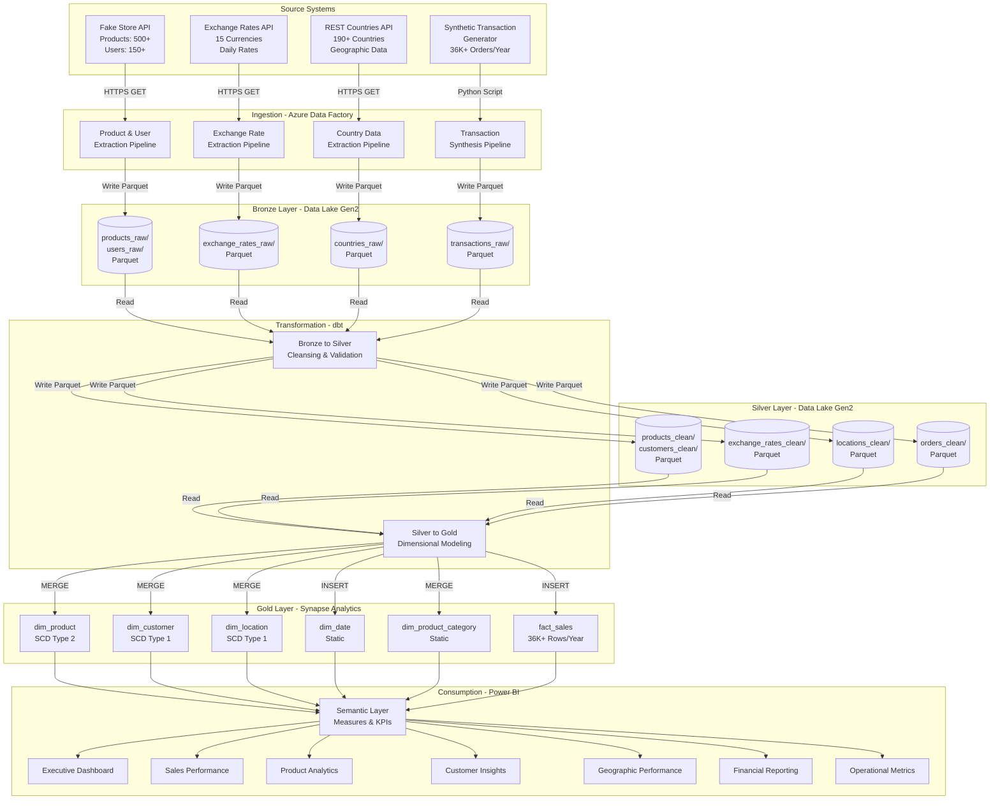

# Data Flows Architecture

## Overview

This document details the end-to-end data flows through the PALO IT e-Commerce data platform, from source API ingestion through transformation layers to business consumption. The platform implements a medallion architecture pattern with progressive data refinement across Bronze, Silver, and Gold layers.

**Key Characteristics**:
- **Batch-oriented**: Daily refresh cycle at 2:00 AM with 2-hour SLA
- **Idempotent**: All transformations produce consistent results when re-run
- **Layered**: Separation of raw data preservation, cleansing, and business modeling
- **Automated**: Fully orchestrated pipelines with minimal manual intervention

---

## End-to-End Data Flow Overview



---

## Data Ingestion Patterns

### 1. API-Based Batch Ingestion

**Pattern**: REST API polling with full snapshot extraction

**Applicable Sources**: Fake Store API (products, users), REST Countries API

**Process Flow**:
1. **Schedule Trigger**: Azure Data Factory timer trigger at 2:00 AM daily
2. **API Request**: HTTP GET request with retry logic (3 attempts, exponential backoff)
3. **Response Validation**: Check HTTP 200 status, validate JSON structure
4. **Data Landing**: Write raw JSON response to Bronze layer as Parquet
5. **Metadata Logging**: Capture ingestion timestamp, record count, API response time
6. **Error Handling**: On failure, alert data engineer, store error in quarantine table

**Configuration**:
```json
{
  "source": "Fake Store API",
  "endpoint": "https://fakestoreapi.com/products",
  "method": "GET",
  "timeout_seconds": 60,
  "retry_attempts": 3,
  "retry_delay_seconds": [5, 15, 45],
  "output_format": "parquet",
  "compression": "snappy",
  "partition_by": "ingestion_date"
}
```

**Data Volume**:
- Products: ~500 records, ~500KB per day
- Users: ~150 records, ~100KB per day
- Countries: ~250 records, ~200KB per day

**Risks Addressed**: R-001 (rate limits), R-004 (schema changes), R-018 (firewall restrictions)

---

### 2. Exchange Rate Ingestion

**Pattern**: Daily snapshot with historical backfill support

**Applicable Sources**: Exchange Rates API

**Process Flow**:
1. **Date Range Calculation**: Determine missing dates in Bronze layer (incremental logic)
2. **API Request Loop**: For each missing date, request exchange rates for 15 currencies
3. **Rate Validation**: Ensure all currency rates present; flag missing rates for interpolation
4. **Data Landing**: Write daily rates to Bronze layer partitioned by effective_date
5. **Quality Check**: Validate rate reasonableness (e.g., USD to EUR between 0.7-1.2)

**Configuration**:
```json
{
  "source": "Exchange Rates API",
  "base_url": "https://api.exchangeratesapi.io/v1",
  "api_key_vault_secret": "exchangeratesapi-key",
  "base_currency": "USD",
  "target_currencies": ["EUR", "GBP", "JPY", "AUD", "CAD", "CHF", "CNY", "INR", "MXN", "BRL", "ZAR", "NZD", "SGD", "HKD", "SEK"],
  "backfill_days": 365,
  "output_partition": "effective_date"
}
```

**Data Volume**:
- Daily: 15 currency rates, ~2KB per day
- Historical backfill (12 months): 15 currencies × 365 days = 5,475 rates, ~750KB

**Special Handling**:
- **Missing Rate Interpolation**: If rate unavailable for specific date, use nearest available rate
- **Weekend/Holiday Handling**: Use previous business day rate for non-trading days
- **Rate Change Alerting**: Alert if rate changes >20% day-over-day (potential data error)

**Risks Addressed**: R-002 (API limits), R-007 (rate unavailability), R-022 (format inconsistencies)

---

### 3. Synthetic Transaction Generation

**Pattern**: Deterministic random data generation with business rules

**Applicable Sources**: Python Faker-based transaction generator

**Process Flow**:
1. **Seed Initialization**: Use fixed random seed for reproducibility
2. **Date Range Generation**: Generate orders for past 12 months with seasonal patterns
3. **Customer Assignment**: Randomly assign customers with weighted distribution (80% regular, 15% VIP, 5% new)
4. **Product Selection**: Select products with category-aware logic (electronics 40%, jewelry 25%, etc.)
5. **Quantity & Pricing**: Apply business rules (quantity 1-5, discounts for VIP, multi-currency)
6. **Location Assignment**: Assign customer locations based on country population weights
7. **Data Writing**: Write generated transactions to Bronze layer as Parquet

**Business Rules**:
- **Seasonality**: 30% higher order volume in Q4 (holiday season)
- **Customer Behavior**:
  - New customers: 1-2 orders, low AOV ($50-$100)
  - Regular customers: 3-10 orders, medium AOV ($100-$200)
  - VIP customers: 11+ orders, high AOV ($200-$500)
- **Product Mix**: Reflects realistic e-commerce distribution
- **Geographic Distribution**: Weighted by country population (US 30%, EU 40%, Asia 20%, Other 10%)

**Configuration**:
```python
{
  "random_seed": 42,
  "start_date": "2024-01-01",
  "end_date": "2024-12-31",
  "target_order_count": 12000,
  "customer_distribution": {"new": 0.05, "regular": 0.80, "vip": 0.15},
  "seasonal_multiplier": {"Q1": 0.9, "Q2": 0.95, "Q3": 1.0, "Q4": 1.3},
  "output_partition": "order_date"
}
```

**Data Volume**:
- Orders: ~12,000 per year (~33 per day)
- Order lines: ~36,000 per year (3 products per order average)
- Total size: ~50MB per year

**Risks Addressed**: R-003 (data realism), R-025 (PII compliance - synthetic data only)

---

## Data Transformation Pipeline

### Bronze to Silver Transformation (Cleansing Layer)

**Purpose**: Apply data quality rules, standardize formats, remove duplicates, handle nulls

#### Product Cleansing

**Input**: `bronze.products_raw` (JSON extracted from API)

**Transformations**:
1. **Schema Enforcement**: Cast data types (id → INT, price → DECIMAL(10,2), rating → DECIMAL(3,2))
2. **Null Handling**: Reject records with null product_id or product_name
3. **Deduplication**: Keep latest record by ingestion_timestamp if duplicates found
4. **Price Validation**: Ensure price > 0 and < $10,000 (flag outliers for review)
5. **Rating Validation**: Ensure rating between 0.0 and 5.0, rating_count ≥ 0
6. **Text Normalization**: Trim whitespace, standardize case for category names

**Output**: `silver.products_clean`

**dbt Test Examples**:
```yaml
models:
  - name: products_clean
    tests:
      - dbt_utils.unique_combination_of_columns:
          combination_of_columns: [product_id, valid_from]
    columns:
      - name: product_id
        tests:
          - not_null
          - unique
      - name: price
        tests:
          - dbt_utils.accepted_range:
              min_value: 0.01
              max_value: 10000.00
      - name: rating
        tests:
          - dbt_utils.accepted_range:
              min_value: 0.0
              max_value: 5.0
              inclusive: true
```

**Data Quality Metrics**:
- **Completeness**: 100% required fields populated
- **Uniqueness**: 0 duplicate product_id records
- **Validity**: 100% prices and ratings within acceptable ranges

---

#### Customer Cleansing

**Input**: `bronze.users_raw`

**Transformations**:
1. **Email Validation**: Validate email format using regex; flag invalid emails
2. **Name Normalization**: Title case for first/last names; remove special characters
3. **Address Parsing**: Split address into street, city, zipcode components
4. **Phone Standardization**: Format phone numbers consistently (E.164 format if possible)
5. **Deduplication**: Merge duplicate customers based on email address
6. **PII Handling**: Ensure synthetic data only (no real customer data)

**Output**: `silver.customers_clean`

**dbt Test Examples**:
```yaml
models:
  - name: customers_clean
    columns:
      - name: customer_id
        tests:
          - not_null
          - unique
      - name: email
        tests:
          - not_null
          - dbt_utils.unique_where:
              where: "email IS NOT NULL"
      - name: segment
        tests:
          - accepted_values:
              values: ['new', 'regular', 'vip']
```

---

#### Exchange Rate Cleansing

**Input**: `bronze.exchange_rates_raw`

**Transformations**:
1. **Rate Validation**: Ensure all rates are positive numbers
2. **Missing Rate Interpolation**: Fill gaps using nearest available rate (forward-fill logic)
3. **Anomaly Detection**: Flag rate changes >20% day-over-day for manual review
4. **Date Alignment**: Ensure rates available for all business dates (Mon-Fri)
5. **Currency Standardization**: Ensure currency codes follow ISO 4217 standard

**Output**: `silver.exchange_rates_clean`

**Special Logic**:
```sql
-- Forward-fill missing exchange rates
WITH rate_gaps AS (
  SELECT 
    effective_date,
    currency_code,
    COALESCE(
      exchange_rate_usd,
      LAG(exchange_rate_usd) IGNORE NULLS OVER (
        PARTITION BY currency_code 
        ORDER BY effective_date
      )
    ) AS exchange_rate_usd
  FROM bronze.exchange_rates_raw
)
SELECT * FROM rate_gaps WHERE exchange_rate_usd IS NOT NULL;
```

---

#### Location Cleansing

**Input**: `bronze.countries_raw`

**Transformations**:
1. **Completeness Check**: Ensure country_code, country_name, region populated
2. **Data Enrichment**: Add region hierarchy (region, sub_region) for geographic analysis
3. **Currency Mapping**: Validate currency_code against exchange rate dimension
4. **Population Handling**: Impute missing population with regional median
5. **Standardization**: Consistent country name format (remove special characters)

**Output**: `silver.locations_clean`

---

#### Transaction Cleansing

**Input**: `bronze.transactions_raw`

**Transformations**:
1. **Referential Integrity**: Validate product_id, customer_id exist in respective dimensions
2. **Quantity Validation**: Ensure quantity > 0 and < 100 (flag bulk orders)
3. **Price Consistency**: Compare unit_price with dim_product; alert if >10% variance
4. **Date Validation**: Ensure order_date is valid date and not in future
5. **Currency Conversion**: Apply exchange rates based on order_date and customer location
6. **Deduplication**: Remove duplicate order lines (same order_id, product_id)

**Output**: `silver.orders_clean`

---

### Silver to Gold Transformation (Dimensional Modeling)

**Purpose**: Build star schema dimensional model optimized for analytics consumption

#### Dimension Table: dim_product (SCD Type 2)

**Input**: `silver.products_clean`

**Transformation Logic**:
1. **New Product Detection**: Identify products not in dim_product
2. **Price Change Detection**: Identify products with price changes since last load
3. **SCD Type 2 Update**:
   - Expire old record: Set valid_to = CURRENT_DATE - 1, is_current = FALSE
   - Insert new record: Set valid_from = CURRENT_DATE, valid_to = '9999-12-31', is_current = TRUE
4. **Surrogate Key Generation**: Assign product_key (auto-increment integer)

**Output Schema**:
```sql
CREATE TABLE gold.dim_product (
    product_key INT IDENTITY(1,1) PRIMARY KEY,
    product_id INT NOT NULL,
    product_name VARCHAR(255) NOT NULL,
    category VARCHAR(100) NOT NULL,
    description TEXT,
    base_price DECIMAL(10,2) NOT NULL,
    rating DECIMAL(3,2),
    rating_count INT,
    valid_from DATE NOT NULL,
    valid_to DATE NOT NULL,
    is_current BOOLEAN NOT NULL,
    created_at TIMESTAMP DEFAULT CURRENT_TIMESTAMP,
    updated_at TIMESTAMP DEFAULT CURRENT_TIMESTAMP
);
```

**dbt Incremental Strategy**:
```yaml
{{ config(
    materialized='incremental',
    unique_key='product_key',
    on_schema_change='fail'
) }}
```

---

#### Dimension Table: dim_customer (SCD Type 1)

**Input**: `silver.customers_clean`

**Transformation Logic**:
1. **Customer Segmentation**: Calculate segment based on purchase history
   - New: 1-2 orders lifetime
   - Regular: 3-10 orders lifetime
   - VIP: 11+ orders lifetime
2. **Lifetime Value Calculation**: Sum of all historical purchases
3. **SCD Type 1 Update**: Overwrite existing customer record with latest attributes

**Output Schema**:
```sql
CREATE TABLE gold.dim_customer (
    customer_key INT IDENTITY(1,1) PRIMARY KEY,
    customer_id INT NOT NULL UNIQUE,
    first_name VARCHAR(100),
    last_name VARCHAR(100),
    email VARCHAR(255),
    phone VARCHAR(50),
    address_street VARCHAR(255),
    address_city VARCHAR(100),
    address_zipcode VARCHAR(20),
    segment VARCHAR(20) NOT NULL CHECK (segment IN ('new', 'regular', 'vip')),
    lifetime_value_usd DECIMAL(12,2) DEFAULT 0.00,
    total_orders INT DEFAULT 0,
    first_order_date DATE,
    last_order_date DATE,
    created_at TIMESTAMP DEFAULT CURRENT_TIMESTAMP,
    updated_at TIMESTAMP DEFAULT CURRENT_TIMESTAMP
);
```

---

#### Dimension Table: dim_location (SCD Type 1)

**Input**: `silver.locations_clean`

**Transformation Logic**:
1. **Hierarchy Construction**: Build country → region → sub_region hierarchy
2. **Currency Linkage**: Ensure currency_code exists in exchange_rates dimension
3. **Population Enrichment**: Add population density calculations
4. **Full Refresh**: Replace entire dimension daily (small dataset)

**Output Schema**:
```sql
CREATE TABLE gold.dim_location (
    location_key INT IDENTITY(1,1) PRIMARY KEY,
    country_code CHAR(3) NOT NULL UNIQUE,
    country_name VARCHAR(255) NOT NULL,
    region VARCHAR(100),
    sub_region VARCHAR(100),
    capital VARCHAR(255),
    currency_code CHAR(3),
    population BIGINT,
    area_sq_km DECIMAL(15,2),
    population_density DECIMAL(10,2),
    created_at TIMESTAMP DEFAULT CURRENT_TIMESTAMP,
    updated_at TIMESTAMP DEFAULT CURRENT_TIMESTAMP
);
```

---

#### Dimension Table: dim_date (Static Pre-Generated)

**Generation Logic**: Pre-populate 10 years of dates (2020-2030)

**Output Schema**:
```sql
CREATE TABLE gold.dim_date (
    date_key INT PRIMARY KEY,  -- Format: YYYYMMDD (e.g., 20240115)
    full_date DATE NOT NULL UNIQUE,
    year INT NOT NULL,
    quarter INT NOT NULL,
    month INT NOT NULL,
    month_name VARCHAR(20),
    week_of_year INT,
    day_of_month INT,
    day_of_week INT,
    day_name VARCHAR(20),
    is_weekend BOOLEAN,
    is_holiday BOOLEAN,
    fiscal_year INT,
    fiscal_quarter INT,
    created_at TIMESTAMP DEFAULT CURRENT_TIMESTAMP
);
```

**Date Attributes**:
- **Calendar Hierarchy**: Year → Quarter → Month → Week → Day
- **Fiscal Calendar**: Supports non-calendar fiscal year (configurable)
- **Holiday Flags**: Major US/international holidays pre-flagged
- **Business Day Logic**: Exclude weekends and holidays for calculations

---

#### Dimension Table: dim_product_category (Static)

**Input**: Hardcoded category list from business requirements

**Output Schema**:
```sql
CREATE TABLE gold.dim_product_category (
    category_key INT IDENTITY(1,1) PRIMARY KEY,
    category_name VARCHAR(100) NOT NULL UNIQUE,
    category_description TEXT,
    display_order INT,
    created_at TIMESTAMP DEFAULT CURRENT_TIMESTAMP
);

-- Initial categories
INSERT INTO gold.dim_product_category (category_name, display_order) VALUES
('Electronics', 1),
('Jewelery', 2),
('Men''s Clothing', 3),
('Women''s Clothing', 4);
```

---

#### Fact Table: fact_sales

**Input**: `silver.orders_clean` + dimension tables

**Transformation Logic**:
1. **Surrogate Key Lookup**: Join to dimensions to retrieve surrogate keys
   - product_key from dim_product (using product_id and order_date for SCD Type 2)
   - customer_key from dim_customer (using customer_id)
   - location_key from dim_location (using customer country_code)
   - order_date_key from dim_date (using order_date)
2. **Currency Conversion**: Apply exchange rate based on order_date and customer currency
3. **Measure Calculation**:
   - total_amount_local = quantity × unit_price_local
   - total_amount_usd = total_amount_local × exchange_rate_usd
4. **Grain Validation**: Ensure one row per product per order (no duplicates)

**Output Schema**:
```sql
CREATE TABLE gold.fact_sales (
    sales_key BIGINT IDENTITY(1,1) PRIMARY KEY,
    order_id INT NOT NULL,
    order_line_number INT NOT NULL,
    product_key INT NOT NULL FOREIGN KEY REFERENCES dim_product(product_key),
    customer_key INT NOT NULL FOREIGN KEY REFERENCES dim_customer(customer_key),
    location_key INT NOT NULL FOREIGN KEY REFERENCES dim_location(location_key),
    order_date_key INT NOT NULL FOREIGN KEY REFERENCES dim_date(date_key),
    
    -- Measures
    quantity INT NOT NULL,
    unit_price_local DECIMAL(10,2) NOT NULL,
    unit_price_usd DECIMAL(10,2) NOT NULL,
    total_amount_local DECIMAL(12,2) NOT NULL,
    total_amount_usd DECIMAL(12,2) NOT NULL,
    exchange_rate_usd DECIMAL(10,6) NOT NULL,
    currency_code CHAR(3) NOT NULL,
    
    -- Metadata
    created_at TIMESTAMP DEFAULT CURRENT_TIMESTAMP,
    
    -- Grain constraint
    UNIQUE (order_id, order_line_number)
);

-- Performance indexes
CREATE COLUMNSTORE INDEX idx_fact_sales_cs ON gold.fact_sales;
CREATE INDEX idx_fact_sales_date ON gold.fact_sales(order_date_key);
CREATE INDEX idx_fact_sales_customer ON gold.fact_sales(customer_key);
CREATE INDEX idx_fact_sales_product ON gold.fact_sales(product_key);
```

**Partitioning Strategy**:
- Partition by order_date_key (monthly partitions)
- Enables efficient query pruning for date-range queries
- Supports incremental loading (process only current month)

---

## Data Storage Strategy

### Storage Tier Architecture

| Layer | Storage | Tier | Format | Partition | Retention | Lifecycle Policy |
|-------|---------|------|--------|-----------|-----------|------------------|
| **Bronze** | Data Lake Gen2 | Cool | Parquet (Snappy) | ingestion_date | 2 years | Move to Archive after 1 year |
| **Silver** | Data Lake Gen2 | Hot → Cool | Parquet (Snappy) | business_date | 1 year | Move to Cool after 90 days |
| **Gold** | Synapse Analytics | N/A | Columnstore | order_date_key | 3 years | Archive old partitions yearly |
| **Semantic** | Power BI Premium | N/A | In-Memory | N/A | N/A | Incremental refresh (13 months) |

### File Organization Patterns

**Bronze Layer**:
```
/bronze/
├── products_raw/
│   ├── ingestion_date=2024-01-15/
│   │   └── products_20240115_020005.parquet
│   ├── ingestion_date=2024-01-16/
│   │   └── products_20240116_020003.parquet
├── users_raw/
│   ├── ingestion_date=2024-01-15/
│   │   └── users_20240115_020010.parquet
├── exchange_rates_raw/
│   ├── effective_date=2024-01-15/
│   │   └── rates_20240115_020015.parquet
├── countries_raw/
│   └── countries_20240101_000000.parquet  # Static, loaded once
└── transactions_raw/
    ├── order_date=2024-01-15/
    │   └── transactions_20240115_020020.parquet
```

**Silver Layer**:
```
/silver/
├── products_clean/
│   ├── business_date=2024-01-15/
│   │   └── products_clean_20240115.parquet
├── customers_clean/
│   ├── business_date=2024-01-15/
│   │   └── customers_clean_20240115.parquet
├── exchange_rates_clean/
│   ├── effective_date=2024-01-15/
│   │   └── rates_clean_20240115.parquet
├── locations_clean/
│   └── locations_clean_20240101.parquet  # Static
└── orders_clean/
    ├── order_date=2024-01-15/
    │   └── orders_clean_20240115.parquet
```

### Compression & Performance

**Parquet Configuration**:
```json
{
  "compression": "snappy",
  "row_group_size": 128MB,
  "page_size": 1MB,
  "dictionary_encoding": true,
  "column_types": {
    "id_columns": "INT32",
    "amount_columns": "DECIMAL(12,2)",
    "date_columns": "DATE",
    "text_columns": "UTF8"
  }
}
```

**Performance Characteristics**:
- Compression ratio: 3-5x (JSON → Parquet Snappy)
- Read performance: 10-20x faster than JSON for columnar queries
- Storage cost: $300/month for 500GB (Hot tier), $50/month (Cool tier)

---

## Data Access Patterns

### Pattern 1: Executive Dashboard (High Frequency)

**Access Pattern**: Daily morning dashboard refresh, 50+ concurrent users

**Query Characteristics**:
- Pre-aggregated metrics (revenue, orders, customers)
- Date range: Current month + last 12 months
- Dimensions: Time, product category, geography
- Response time SLA: <3 seconds

**Optimization Strategy**:
- Power BI aggregations for common metrics
- Synapse result set caching
- Columnstore indexes on fact_sales
- Date partition elimination (query only relevant months)

**Sample Query**:
```sql
-- Monthly revenue by region (optimized with aggregation)
SELECT 
    d.year,
    d.month_name,
    l.region,
    SUM(f.total_amount_usd) AS revenue_usd,
    COUNT(DISTINCT f.order_id) AS order_count
FROM gold.fact_sales f
JOIN gold.dim_date d ON f.order_date_key = d.date_key
JOIN gold.dim_location l ON f.location_key = l.location_key
WHERE d.full_date >= DATEADD(month, -12, GETDATE())
GROUP BY d.year, d.month_name, l.region;
```

---

### Pattern 2: Product Performance Analysis (Medium Frequency)

**Access Pattern**: Weekly product review meetings, 10-15 users

**Query Characteristics**:
- Product-level detail (not aggregated)
- Date range: Quarter-to-date, year-over-year comparisons
- Dimensions: Product, category, geography
- Response time SLA: <10 seconds

**Optimization Strategy**:
- Materialized views for common product metrics
- SCD Type 2 join optimized (is_current = TRUE filter)
- Category-based filtering pushed to query plan

**Sample Query**:
```sql
-- Top 20 products by revenue (current quarter)
SELECT TOP 20
    p.product_name,
    pc.category_name,
    SUM(f.quantity) AS units_sold,
    SUM(f.total_amount_usd) AS revenue_usd,
    AVG(p.rating) AS avg_rating
FROM gold.fact_sales f
JOIN gold.dim_product p ON f.product_key = p.product_key
JOIN gold.dim_product_category pc ON p.category = pc.category_name
JOIN gold.dim_date d ON f.order_date_key = d.date_key
WHERE d.year = YEAR(GETDATE())
  AND d.quarter = DATEPART(quarter, GETDATE())
  AND p.is_current = TRUE
GROUP BY p.product_name, pc.category_name
ORDER BY revenue_usd DESC;
```

---

### Pattern 3: Customer Segmentation (Low Frequency)

**Access Pattern**: Monthly customer analysis, 5-10 users

**Query Characteristics**:
- Customer-level detail with aggregated purchase history
- Date range: All-time (3 years)
- Dimensions: Customer segment, geography, product category
- Response time SLA: <30 seconds (acceptable for ad-hoc analysis)

**Optimization Strategy**:
- Pre-calculated customer metrics in dim_customer (lifetime_value, total_orders)
- Incremental refresh of customer aggregates daily

**Sample Query**:
```sql
-- Customer segmentation analysis
SELECT 
    c.segment,
    l.region,
    COUNT(DISTINCT c.customer_id) AS customer_count,
    AVG(c.lifetime_value_usd) AS avg_lifetime_value,
    AVG(c.total_orders) AS avg_orders
FROM gold.dim_customer c
LEFT JOIN gold.fact_sales f ON c.customer_key = f.customer_key
LEFT JOIN gold.dim_location l ON f.location_key = l.location_key
GROUP BY c.segment, l.region
ORDER BY customer_count DESC;
```

---

### Pattern 4: Financial Reporting (Low Frequency, High Accuracy)

**Access Pattern**: Monthly financial close, 2-3 users, strict accuracy requirements

**Query Characteristics**:
- Exact revenue calculations with currency conversion audit trail
- Date range: Specific month for financial close
- Dimensions: Time, geography, currency
- Response time SLA: <60 seconds (accuracy prioritized over speed)

**Optimization Strategy**:
- Dual-currency storage (local + USD) eliminates runtime conversion
- Exchange rate audit trail preserved for reconciliation
- Monthly snapshots for immutable historical reporting

**Sample Query**:
```sql
-- Monthly revenue by currency with conversion audit
SELECT 
    d.year,
    d.month_name,
    l.country_name,
    f.currency_code,
    SUM(f.total_amount_local) AS revenue_local,
    SUM(f.total_amount_usd) AS revenue_usd,
    AVG(f.exchange_rate_usd) AS avg_exchange_rate
FROM gold.fact_sales f
JOIN gold.dim_date d ON f.order_date_key = d.date_key
JOIN gold.dim_location l ON f.location_key = l.location_key
WHERE d.year = 2024 AND d.month = 12  -- December 2024 close
GROUP BY d.year, d.month_name, l.country_name, f.currency_code
ORDER BY revenue_usd DESC;
```

---

## Pipeline Orchestration

### Master Pipeline Schedule

**Daily Execution Schedule**:

| Time | Pipeline | Duration | Dependencies |
|------|----------|----------|--------------|
| 02:00 AM | API Extraction (Products, Users, Countries) | 5 min | None |
| 02:05 AM | Exchange Rate Extraction | 3 min | None |
| 02:08 AM | Transaction Synthesis | 10 min | Products, Users loaded |
| 02:20 AM | Bronze → Silver Transformation (dbt) | 15 min | All Bronze data landed |
| 02:35 AM | Silver → Gold Transformation (dbt) | 30 min | All Silver data validated |
| 03:05 AM | Data Quality Tests (dbt) | 10 min | Gold tables loaded |
| 03:15 AM | Power BI Refresh Trigger | 40 min | Gold tables validated |
| 03:55 AM | Pipeline Success Notification | 1 min | All steps complete |
| **05:00 AM** | **Data Available to Users** | - | - |

**Orchestration Logic**:
```yaml
# Azure Data Factory Master Pipeline
pipeline:
  name: daily_data_refresh
  schedule:
    trigger: "0 2 * * *"  # Daily at 2:00 AM
    timezone: "America/New_York"
  
  activities:
    - name: extract_api_data
      type: parallel_foreach
      items: ["products", "users", "countries", "exchange_rates"]
      max_concurrency: 4
      on_failure: alert_and_continue
    
    - name: synthesize_transactions
      type: execute_pipeline
      depends_on: extract_api_data
      on_failure: alert_and_stop
    
    - name: bronze_to_silver
      type: dbt_run
      models: "tag:silver"
      depends_on: synthesize_transactions
      on_failure: alert_and_stop
    
    - name: silver_to_gold
      type: dbt_run
      models: "tag:gold"
      depends_on: bronze_to_silver
      on_failure: alert_and_stop
    
    - name: data_quality_tests
      type: dbt_test
      depends_on: silver_to_gold
      on_failure: alert_and_rollback
    
    - name: refresh_power_bi
      type: power_bi_refresh
      dataset: "ecommerce_semantic_model"
      depends_on: data_quality_tests
      on_failure: alert_and_retry
    
    - name: send_success_notification
      type: send_email
      depends_on: refresh_power_bi
```

### Error Handling & Recovery

**Retry Logic**:
- API extraction failures: 3 retries with exponential backoff (5s, 15s, 45s)
- dbt transformation failures: 1 retry after 5-minute delay
- Power BI refresh failures: 2 retries with 10-minute delay

**Rollback Strategy**:
- Gold layer updates wrapped in transactions (ROLLBACK on test failures)
- Silver layer preserved for reprocessing if Gold update fails
- Bronze layer immutable (never deleted)

**Alert Configuration**:
- Critical failures (Gold update): Email + Slack to data engineering team
- Warning-level failures (single API retry): Log only
- SLA breach (data not ready by 5:00 AM): Escalate to project manager

---

## Data Quality Monitoring

### Quality Metrics Dashboard

**Key Metrics Tracked**:
- **Completeness**: % of required fields populated
- **Accuracy**: % of records passing validation rules
- **Timeliness**: Data freshness (hours since last update)
- **Consistency**: % of cross-table referential integrity checks passed
- **Uniqueness**: % of primary key uniqueness maintained

**Monitoring Frequency**:
- Real-time: Pipeline execution status
- Hourly: Data freshness checks
- Daily: Comprehensive quality report after pipeline completion
- Weekly: Trend analysis and anomaly detection

### Automated Quality Tests (dbt)

**Test Categories**:
1. **Schema Tests**: Validate data types, not null constraints
2. **Relationship Tests**: Ensure foreign keys resolve (referential integrity)
3. **Business Rule Tests**: Custom logic (e.g., revenue > 0, rating 0-5)
4. **Freshness Tests**: Ensure data updated within SLA window

**Example dbt Tests**:
```yaml
# models/gold/fact_sales.yml
models:
  - name: fact_sales
    description: "Sales fact table at order line grain"
    
    tests:
      - dbt_utils.unique_combination_of_columns:
          combination_of_columns: [order_id, order_line_number]
      - dbt_utils.recency:
          datepart: day
          field: created_at
          interval: 1  # Data must be <1 day old
    
    columns:
      - name: product_key
        tests:
          - not_null
          - relationships:
              to: ref('dim_product')
              field: product_key
      
      - name: total_amount_usd
        tests:
          - not_null
          - dbt_utils.accepted_range:
              min_value: 0.01
              max_value: 100000.00
      
      - name: quantity
        tests:
          - not_null
          - dbt_utils.accepted_range:
              min_value: 1
              max_value: 100
              inclusive: true
```

---

## Related Documents

- [Architecture Overview](./overview.md)
- [Security & Governance](./security-governance.md)
- [Component Specifications](../../infra/docs/architecture/component-specifications.md)
- [Operations Guide](../../infra/docs/architecture/operations.md)
