# Data Flows Architecture

**Document Owner:** Data Platform Team  
**Last Updated:** December 2025  
**Status:** Active  
**Related Documents:** [Architecture Overview](./overview.md) | [Security & Governance](./security-governance.md) | [Data Platform Strategy](./data-platform-strategy.md)

---

## 1. Overview

This document describes the end-to-end data flows within the Nuvama Data Platform, covering ingestion patterns, transformation pipelines, storage strategies, and consumption layers. The platform implements a Medallion Architecture with batch-first processing, designed to support AI-led revenue transformation.

---

## 2. End-to-End Data Flow Diagrams

### 2.1 High-Level Data Flow

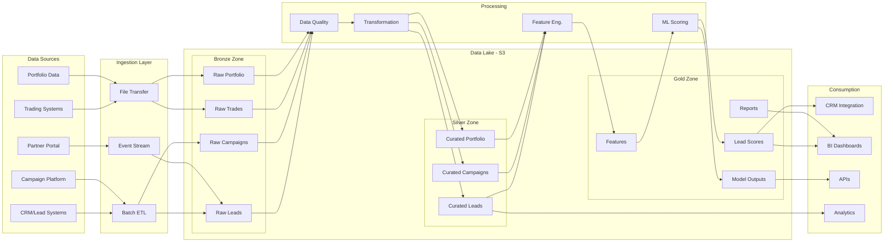

### 2.2 Lead Scoring Data Flow (Phase 1)

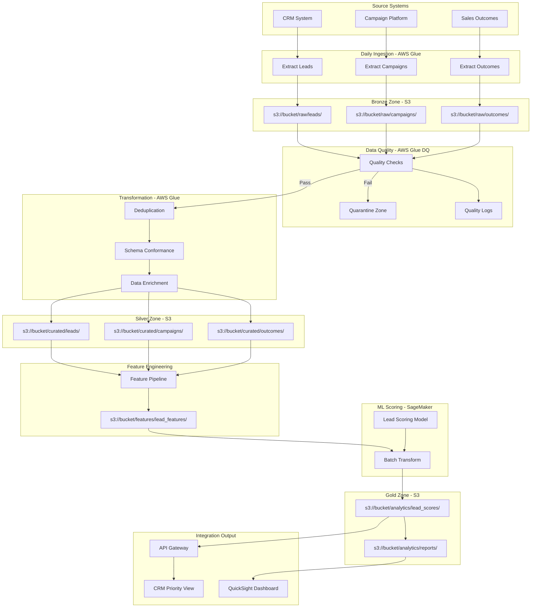

---

## 3. Data Ingestion Patterns

### 3.1 Ingestion Pattern Overview

| Pattern | Description | Use Case | Frequency | Technology |
|---------|-------------|----------|-----------|------------|
| **Batch ETL** | Scheduled extraction and load | CRM, Campaign data | Daily/Hourly | AWS Glue |
| **File Drop** | File-based data transfer | Legacy systems, Partner data | As available | S3 + Lambda trigger |
| **SFTP Transfer** | Secure file exchange | External partners | Scheduled | AWS Transfer Family |
| **Database Extract** | Direct database connection | Transactional systems | Daily | Glue JDBC |
| **API Polling** | REST API extraction | Modern systems | Scheduled | Lambda + EventBridge |
| **Event Streaming** | Real-time event capture | Future: Portal events | Continuous | Kinesis (Phase 3+) |

### 3.2 Batch Ingestion Flow

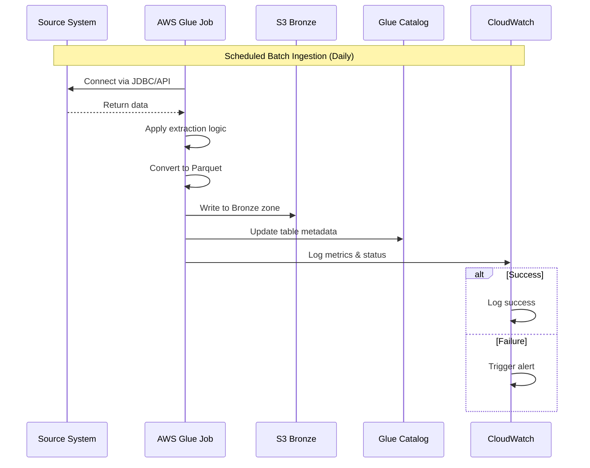

### 3.3 File Drop Ingestion Flow

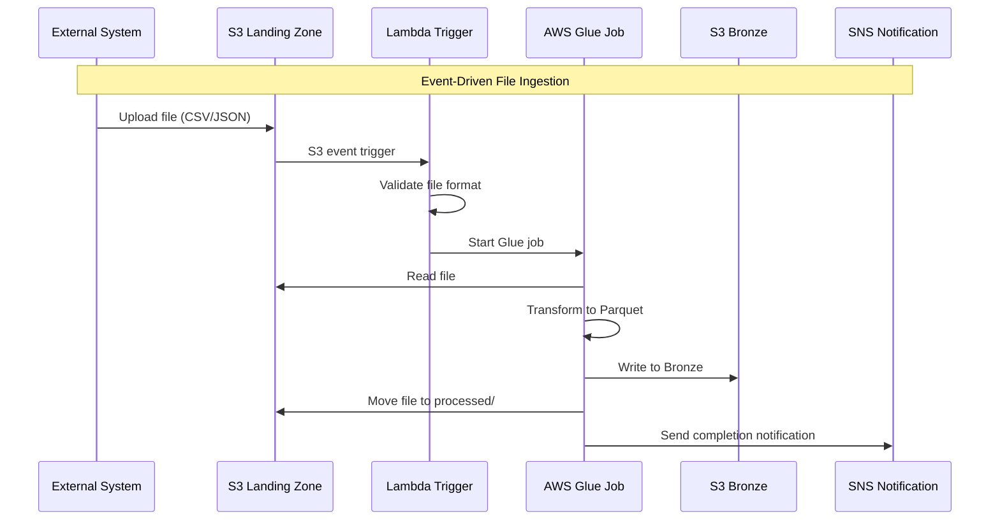

### 3.4 Real-Time Streaming (Future State)

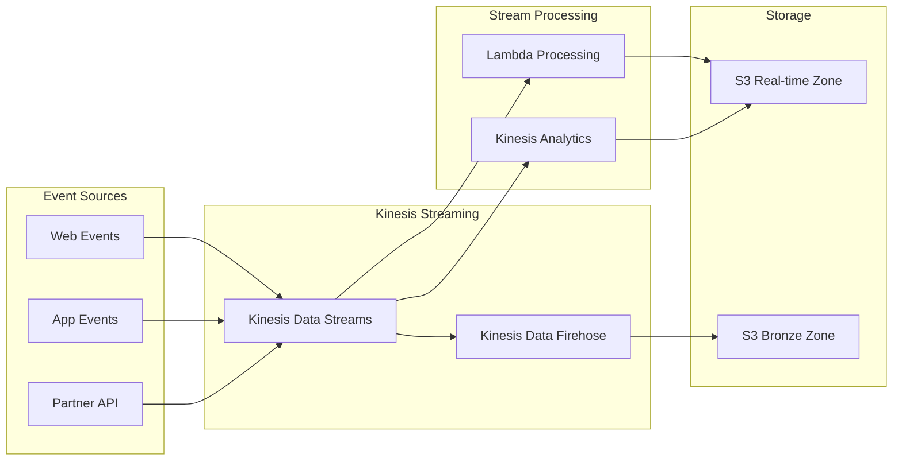

---

## 4. Data Transformation and Processing Pipeline

### 4.1 Processing Stages

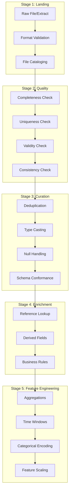

### 4.2 Data Quality Framework

| Dimension | Check Type | Threshold | Action on Failure |
|-----------|------------|-----------|-------------------|
| **Completeness** | Null/missing value counts | >5% nulls in key fields | Alert + quarantine records |
| **Uniqueness** | Duplicate detection on key | Any duplicates | Deduplicate + log |
| **Validity** | Data type validation | Any type mismatch | Reject invalid records |
| **Accuracy** | Business rule validation | Per-rule threshold | Flag for review |
| **Timeliness** | Data freshness | >6 hours stale | Alert operations |
| **Consistency** | Cross-source reconciliation | >1% variance | Investigation trigger |

### 4.3 Transformation Rules by Zone

#### Bronze to Silver Transformations

| Transformation | Description | Implementation |
|----------------|-------------|----------------|
| **Deduplication** | Remove duplicate records | Glue DynamicFrame dedupe |
| **Type Casting** | Standardize data types | Schema mapping |
| **Null Handling** | Apply default values or flags | Coalesce functions |
| **Date Normalization** | Standardize date formats | Date parsing functions |
| **Schema Conformance** | Apply target schema | Glue schema evolution |
| **Data Masking** | Mask sensitive fields for non-prod | Lake Formation masking |

#### Silver to Gold Transformations

| Transformation | Description | Implementation |
|----------------|-------------|----------------|
| **Aggregation** | Compute summary metrics | GroupBy operations |
| **Joins** | Combine related datasets | Broadcast joins for dimensions |
| **Calculations** | Derived business metrics | UDF functions |
| **Pivoting** | Reshape data for analysis | Pivot operations |
| **Feature Computation** | ML-ready feature vectors | Feature engineering pipeline |

### 4.4 ETL Job Configuration

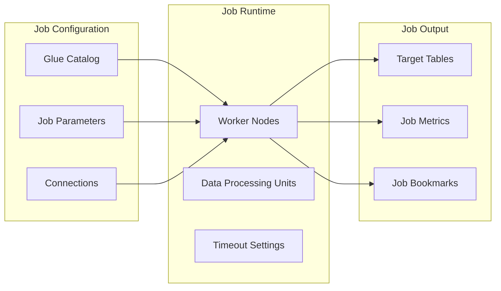

**Standard Job Parameters:**

| Parameter | Value | Purpose |
|-----------|-------|---------|
| Worker Type | G.1X / G.2X | Based on data volume |
| Number of Workers | 2-10 (auto-scaling) | Scale with data |
| Job Timeout | 2-4 hours | Prevent runaway jobs |
| Job Bookmark | Enabled | Incremental processing |
| Retry Attempts | 3 | Handle transient failures |

---

## 5. Data Storage Strategy

### 5.1 Storage Tier Overview

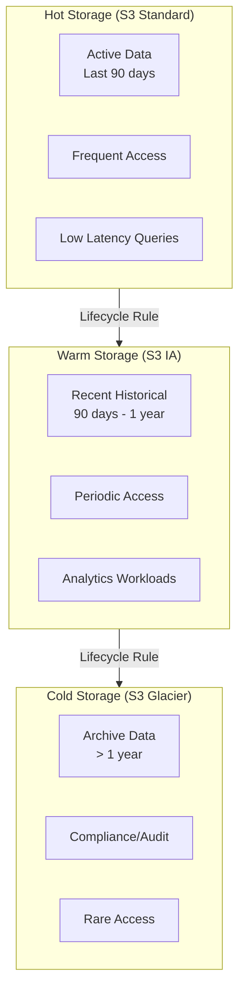

### 5.2 Storage Configuration by Zone

| Zone | Storage Class | Lifecycle Policy | Encryption | Versioning |
|------|---------------|------------------|------------|------------|
| **Bronze** | S3 Standard → IA (90d) → Glacier (1y) | 7 year retention | SSE-KMS | Enabled |
| **Silver** | S3 Standard → IA (180d) | 3 year retention | SSE-KMS | Enabled |
| **Gold** | S3 Standard → IA (1y) | 2 year retention | SSE-KMS | Enabled |
| **Features** | S3 Standard | 1 year retention | SSE-KMS | Enabled |
| **Models** | S3 Standard | Indefinite | SSE-KMS | Enabled |

### 5.3 Partitioning Strategy

```
s3://data-platform-bucket/
├── raw/
│   └── leads/
│       └── year=2024/
│           └── month=12/
│               └── day=01/
│                   └── data.parquet
├── curated/
│   └── leads/
│       └── dt=2024-12-01/
│           └── part-00000.parquet
├── analytics/
│   └── lead_scores/
│       └── score_date=2024-12-01/
│           └── model_version=v1.2/
│               └── scores.parquet
└── features/
    └── lead_features/
        └── snapshot_date=2024-12-01/
            └── features.parquet
```

**Partition Keys by Table:**

| Table | Partition Keys | Rationale |
|-------|----------------|-----------|
| Raw Leads | year, month, day | Time-based ingestion |
| Curated Leads | dt (date) | Daily processing |
| Lead Scores | score_date, model_version | Track by scoring run |
| Features | snapshot_date | Point-in-time features |
| Outcomes | outcome_date | Time-series analysis |

### 5.4 File Format Standards

| Format | Use Case | Compression | Benefits |
|--------|----------|-------------|----------|
| **Parquet** | Analytics, ML | Snappy | Columnar, efficient queries |
| **JSON** | Raw ingestion | GZIP | Schema flexibility |
| **CSV** | Legacy integration | GZIP | Compatibility |
| **Avro** | Schema evolution | Snappy | Schema in file |

---

## 6. Data Access Patterns and Consumption Layers

### 6.1 Consumption Architecture

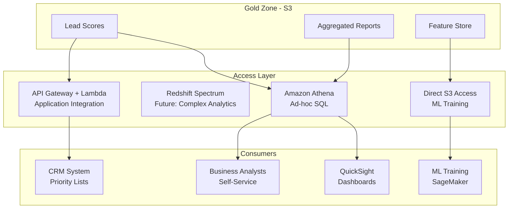

### 6.2 Access Patterns by Persona

| Persona | Access Method | Data Scope | Governance |
|---------|---------------|------------|------------|
| **Data Scientist** | SageMaker Studio, Athena | All zones (dev), Silver/Gold (prod) | Lake Formation policies |
| **Data Engineer** | Glue Console, Athena | All zones | Admin IAM role |
| **Business Analyst** | QuickSight, Athena | Gold zone only | Read-only Lake Formation |
| **Application** | API Gateway | Specific datasets | Service account |
| **External System** | SFTP/API | Defined exports | Limited scope |

### 6.3 Query Patterns

#### Ad-hoc Analytics (Athena)

```sql
-- Example: Lead score distribution query
SELECT 
    score_band,
    COUNT(*) as lead_count,
    AVG(score_value) as avg_score
FROM analytics.lead_scores
WHERE score_date = DATE '2024-12-01'
GROUP BY score_band
ORDER BY avg_score DESC;
```

#### API Response Pattern

```json
{
  "leadId": "L12345",
  "score": 0.87,
  "scoreBand": "Hot",
  "topDrivers": [
    {"feature": "engagement_score", "contribution": 0.35},
    {"feature": "recency_days", "contribution": 0.28},
    {"feature": "channel_quality", "contribution": 0.22}
  ],
  "modelVersion": "v1.2",
  "scoreDate": "2024-12-01"
}
```

### 6.4 Integration Patterns

#### CRM Integration Flow

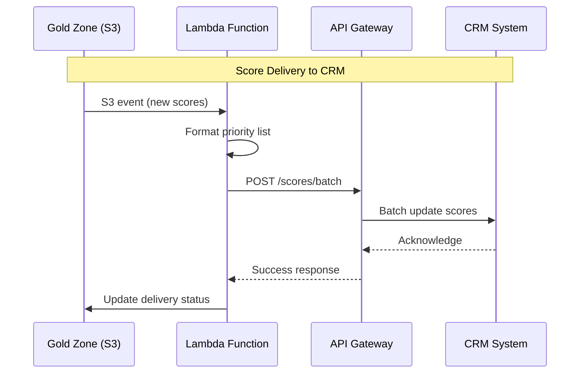

#### Batch Export Pattern

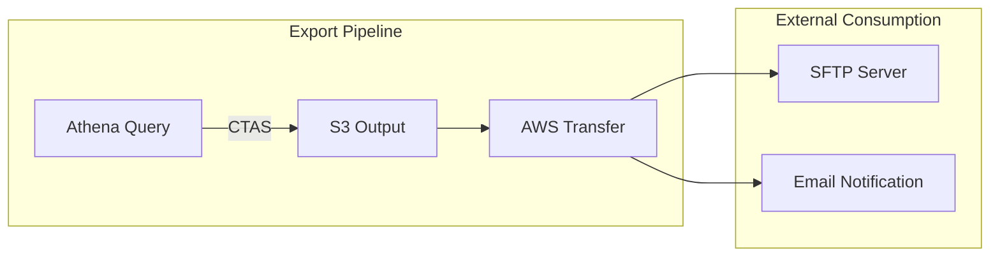

---

## 7. Data Lineage and Metadata

### 7.1 Lineage Tracking

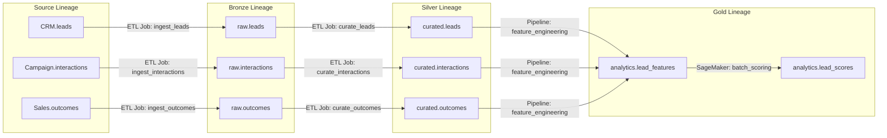

### 7.2 Metadata Management

| Metadata Type | Storage | Purpose |
|---------------|---------|---------|
| **Technical Metadata** | Glue Data Catalog | Schema, partitions, statistics |
| **Operational Metadata** | CloudWatch Logs | Job runs, errors, metrics |
| **Business Metadata** | Data Catalog Tags | Ownership, classification, glossary |
| **Lineage Metadata** | Glue Lineage | Data flow tracking |
| **Quality Metadata** | S3 + Athena | Quality scores, issues |

---

## 8. Performance Optimization

### 8.1 Query Optimization

| Technique | Application | Impact |
|-----------|-------------|--------|
| **Partitioning** | Time-based queries | 10-100x faster |
| **Columnar Format** | Analytics queries | 50-90% less data scan |
| **Compression** | All storage | 3-5x storage reduction |
| **Predicate Pushdown** | Filter operations | Reduced data transfer |
| **Bucketing** | Join operations | Faster joins |

### 8.2 Pipeline Optimization

| Technique | Application | Benefit |
|-----------|-------------|---------|
| **Incremental Processing** | Daily loads | Process only new data |
| **Job Bookmarks** | Glue ETL | Track processed data |
| **Parallel Processing** | Large datasets | Scale horizontally |
| **Broadcast Joins** | Dimension tables | Efficient small table joins |
| **Caching** | Repeated queries | Faster response |

---

## 9. References

- [Architecture Overview](./overview.md)
- [Security & Governance](./security-governance.md)
- [Data Platform Strategy](./data-platform-strategy.md)
- [Component Specifications](../../infra/docs/architecture/component-specifications.md)
- [Operations Guide](../../infra/docs/architecture/operations.md)
