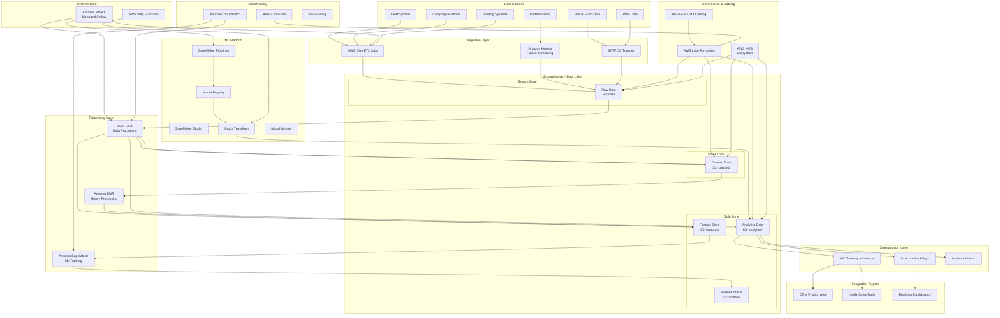
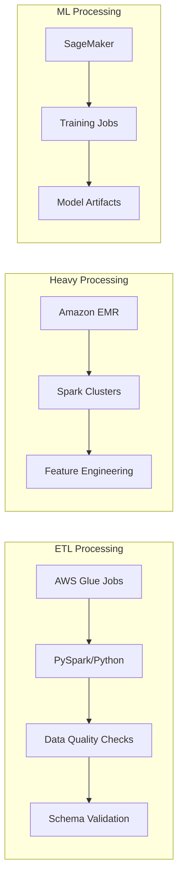
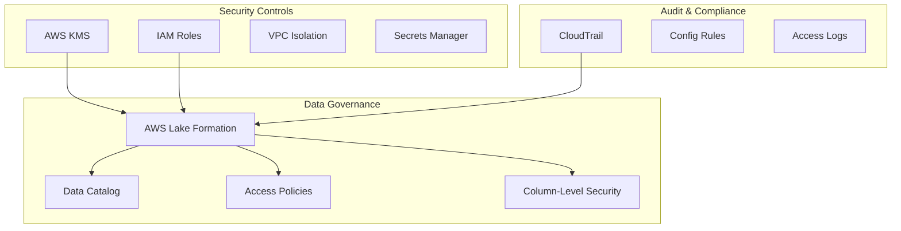
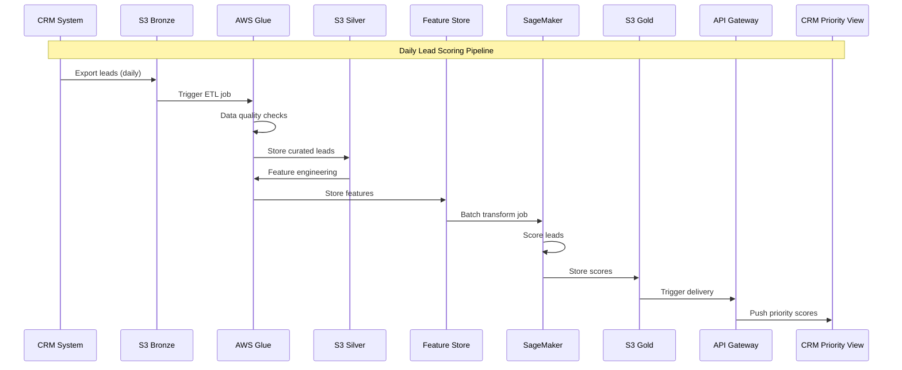
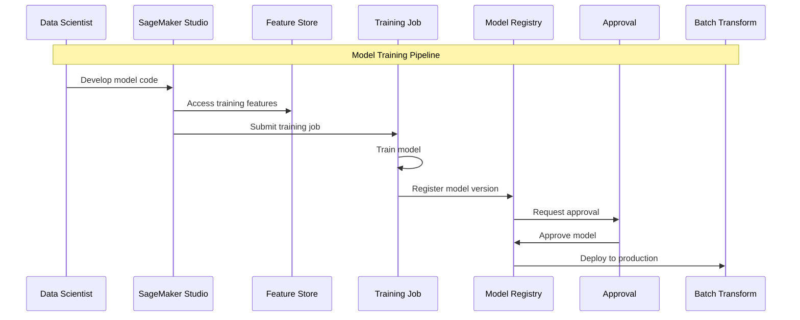
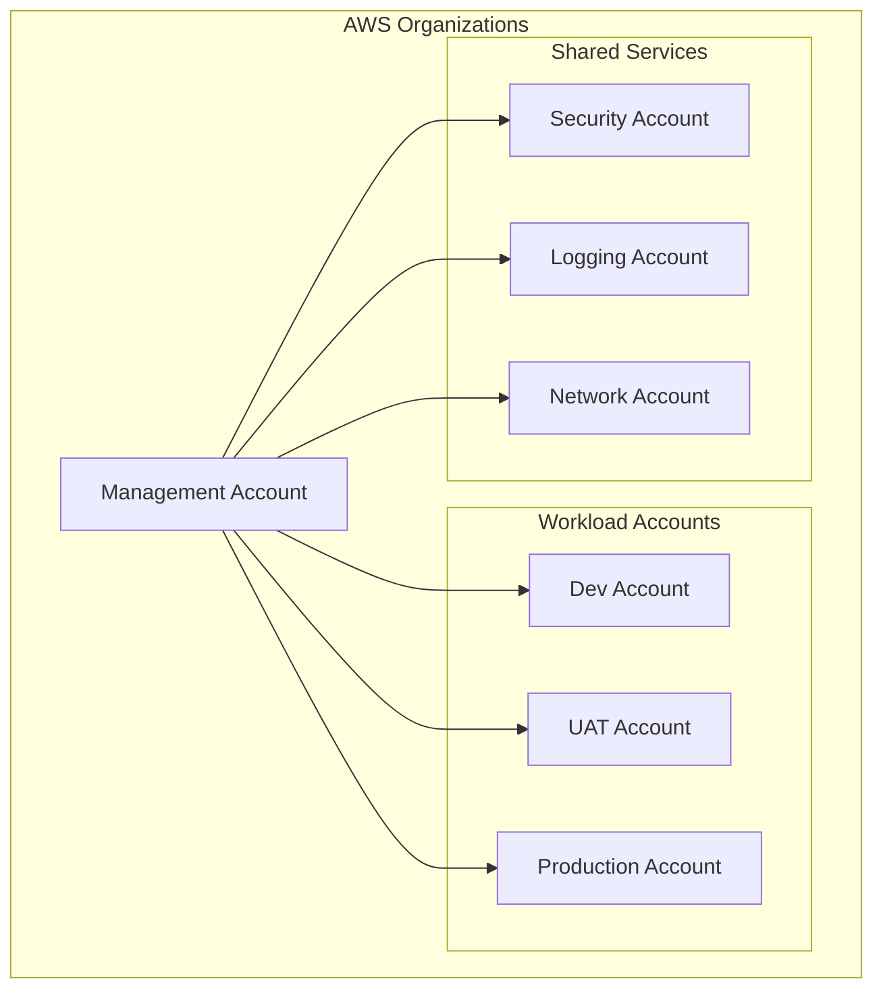

# Data Platform Architecture Overview

**Document Owner:** Data Platform Team  
**Last Updated:** December 2024  
**Status:** Active  
**Related Documents:** [Data Platform Strategy](./data-platform-strategy.md) | [Data Flows](./data-flows.md) | [Security & Governance](./security-governance.md)

---

## 1. Executive Summary

Nuvama Financial's Data Platform is a modern, cloud-based infrastructure designed to enable AI-driven revenue transformation. The platform establishes the foundation for a trusted AI product ecosystem, starting with AI Lead Scoring and scaling to support Portfolio Review, Campaign Intelligence, Client 360, IFA Portal AI, and RM Co-Pilot capabilities.

### 1.1 Platform Vision

The platform delivers:

- **Governed, discoverable, and high-quality data** accessible across the organization
- **AI-first revenue transformation** with embedded governance-by-design
- **Scalable, auditable, and compliant infrastructure** aligned with Indian financial services regulatory requirements
- **Reusable patterns** for rapid deployment of new AI products

### 1.2 Key Outcomes

| Outcome | Target |
|---------|--------|
| Improved lead conversion | 15-25% uplift for prioritized leads |
| RM productivity gains | 20-30% increase in leads processed |
| Data freshness | Daily batch refresh (evolving to near-real-time) |
| Audit compliance | 100% traceability of data access and model decisions |
| New AI use case deployment | 50% time reduction after Phase 1 |

---

## 2. High-Level Logical Architecture

### 2.1 Architecture Diagram

### 2.2 Architecture Layers

| Layer | Purpose | Key Components |
|-------|---------|----------------|
| **Data Sources** | External systems providing data | CRM, Campaign Platform, Trading, MF, PMS, Partner Portal |
| **Ingestion** | Data acquisition and landing | AWS Glue ETL, Kinesis (future), SFTP/S3 |
| **Storage** | Persistent data storage with zones | Amazon S3 (Bronze/Silver/Gold zones) |
| **Processing** | Data transformation and enrichment | AWS Glue, Amazon EMR |
| **Governance** | Access control, catalog, encryption | Lake Formation, Glue Catalog, KMS |
| **Orchestration** | Workflow management | Amazon MWAA, Step Functions |
| **ML Platform** | Model development and deployment | SageMaker (Studio, Pipelines, Registry) |
| **Consumption** | Data access and delivery | API Gateway, QuickSight, Athena |
| **Observability** | Monitoring and audit | CloudWatch, CloudTrail, Config |

---

## 3. Major Components and Relationships

### 3.1 Data Lake Foundation

The platform uses Amazon S3 as the foundation with a **Medallion Architecture** (Bronze → Silver → Gold):

| Zone | Purpose | Data Characteristics |
|------|---------|---------------------|
| **Bronze (Raw)** | Ingestion layer | Source data preserved as-is; minimal transformation; full audit trail |
| **Silver (Curated)** | Cleansed & conformed | Deduplicated, validated, standardized schemas; business-ready structure |
| **Gold (Analytics)** | Business-aligned | Aggregated, modeled for specific use cases; dimensional models; feature stores |

### 3.2 Data Processing Engine

**Primary Processing:** AWS Glue for standard ETL workloads with built-in data quality  
**Heavy Processing:** Amazon EMR for large-scale feature engineering when required  
**ML Processing:** Amazon SageMaker for model training, validation, and deployment

### 3.3 ML Platform

The machine learning platform supports the full ML lifecycle:

| Component | Purpose | Phase |
|-----------|---------|-------|
| **SageMaker Studio** | Development environment, notebooks, EDA | All phases |
| **SageMaker Training** | Managed training jobs with tracking | All phases |
| **SageMaker Feature Store** | Centralized feature management | Phase 2+ |
| **SageMaker Pipelines** | CI/CD for ML workflows | Phase 1 (Production) |
| **Model Registry** | Version control and lifecycle management | Phase 1 (Production) |
| **Batch Transform** | Scheduled batch scoring | Phase 1 |
| **Model Monitor** | Drift detection and alerts | Phase 2+ |

### 3.4 Governance Framework

### 3.5 Integration Architecture

| Integration Type | Pattern | Use Case |
|------------------|---------|----------|
| **Batch File** | S3 drop → Glue trigger | Legacy system data |
| **SFTP** | AWS Transfer Family | Partner data exchange |
| **API (Inbound)** | API Gateway → Lambda → S3 | Real-time event capture |
| **API (Outbound)** | Lambda → External API | CRM score delivery |
| **Database** | Glue JDBC connections | Direct database extraction |

---

## 4. Key Design Principles

### 4.1 Core Principles

| Principle | Description | Implementation |
|-----------|-------------|----------------|
| **Governance-First** | Security and compliance embedded from design | Lake Formation policies, encryption at rest/transit |
| **Cloud-Native** | Leverage managed services for reliability | AWS managed services reduce operational overhead |
| **Scalable by Design** | Architecture supports growth without rework | Auto-scaling services, partitioning strategies |
| **Observable** | Full visibility into platform health | CloudWatch metrics, alerts, dashboards |
| **Cost-Efficient** | Optimize spend without compromising capability | Right-sizing, lifecycle policies, reserved capacity |
| **Batch-First, Streaming-Ready** | Start simple, evolve as needed | Architecture designed to add streaming without major rework |

### 4.2 Data Principles

| Principle | Application |
|-----------|-------------|
| **Single Source of Truth** | S3 data lake as canonical source |
| **Immutable Raw Data** | Bronze zone preserves original data |
| **Progressive Refinement** | Data quality improves through zones |
| **Schema Evolution** | Glue Catalog manages schema versions |
| **Lineage Tracking** | Column-level lineage via Glue |

### 4.3 Security Principles

| Principle | Application |
|-----------|-------------|
| **Least Privilege** | IAM roles with minimal required permissions |
| **Defense in Depth** | Multiple security layers (network, identity, encryption) |
| **Encryption Everywhere** | KMS encryption at rest, TLS in transit |
| **Audit Everything** | CloudTrail logging for all API actions |
| **Data Classification** | Tag-based classification and handling |

---

## 5. Architectural Decisions

### 5.1 Key Decisions Summary

| Decision | Choice | Rationale |
|----------|--------|-----------|
| **Cloud Provider** | AWS | Aligns with organizational preference; mature ML/data services; India region availability |
| **Architecture Pattern** | Medallion (Bronze/Silver/Gold) | Progressive refinement; clear lineage; governance-friendly |
| **Processing Paradigm** | Batch-first with streaming readiness | Meets initial SLAs; lower complexity; clear upgrade path |
| **Storage Format** | Parquet with Iceberg (future) | Open format; cost-effective; supports diverse access patterns |
| **ML Platform** | Amazon SageMaker | Integrated with AWS ecosystem; managed MLOps; governance features |
| **Orchestration** | Amazon MWAA (Airflow) | Open-source based; rich ecosystem; team familiarity |
| **Data Governance** | AWS Lake Formation | Fine-grained access; catalog integration; audit support |

### 5.2 Trade-offs Acknowledged

| Decision | Trade-off | Mitigation |
|----------|-----------|------------|
| AWS-only | Vendor lock-in risk | Open formats (Parquet); abstraction layers where critical |
| Batch-first | No real-time initially | Architecture supports streaming addition |
| Managed services | Less customization | Reduces operational burden; predictable costs |
| Lake Formation | Learning curve | Training plan; phased rollout |

---

## 6. Component Interaction Patterns

### 6.1 Daily Lead Scoring Pipeline

### 6.2 Model Training Pipeline

---

## 7. Environment Strategy

### 7.1 Environment Overview

| Environment | Purpose | Characteristics |
|-------------|---------|-----------------|
| **Dev/Experiment** | Exploration, prototyping | Cost-controlled, rapid iteration, masked data |
| **Test/UAT** | Validation, integration testing | Production-like config, synthetic data |
| **Production** | Live workloads | Full security, governance, monitoring |

### 7.2 AWS Account Structure

---

## 8. Future Evolution

### 8.1 Platform Evolution Path

| Phase | Capability Addition | Architecture Impact |
|-------|---------------------|---------------------|
| **Phase 1** | Lead Scoring | Foundation established |
| **Phase 2** | Portfolio Review | Multi-domain data model; continuous training |
| **Phase 3** | Campaign Intelligence | A/B testing framework; Client 360 foundation |
| **Phase 4** | Partner AI | Real-time scoring option; enterprise MLOps |

### 8.2 Technology Evolution

| Current | Future | Trigger |
|---------|--------|---------|
| Batch processing | Streaming (Kinesis) | Real-time business requirement |
| Parquet format | Apache Iceberg | ACID requirements, time travel needs |
| QuickSight | Enterprise BI integration | Organizational BI consolidation |
| CSV integration | Full API integration | CRM API readiness |

---

## 9. References

- [Data Platform Strategy](./data-platform-strategy.md)
- [Data Flows](./data-flows.md)
- [Security & Governance](./security-governance.md)
- [Component Specifications](../../infra/docs/architecture/component-specifications.md)
- [Network & Security Details](../../infra/docs/architecture/network-security.md)
- [Operations Guide](../../infra/docs/architecture/operations.md)
- [Technology Stack](../project-context/tech-stack.md)
- [Business Case](../project-context/business-case.md)
