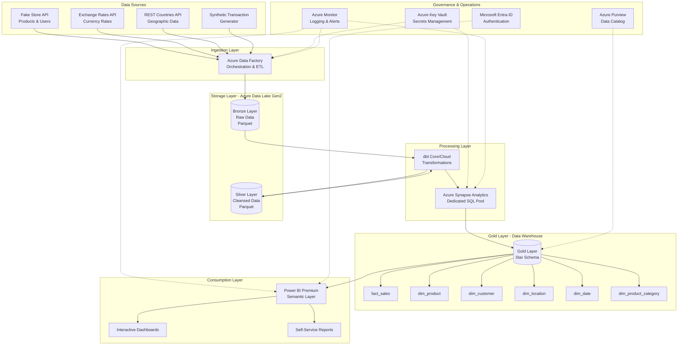

# Data Platform Architecture Overview

## Executive Summary

The PALO IT e-Commerce data platform is a modern, cloud-native analytics solution built on Microsoft Azure that consolidates fragmented data sources into a governed dimensional data warehouse. The platform enables self-service analytics, multi-currency reporting, and data-driven decision making while reducing report generation time from days to minutes.

**Key Characteristics**:
- **Cloud-native**: Azure-managed services minimizing operational overhead
- **Batch-oriented**: Daily refresh cycle optimized for cost and simplicity
- **Medallion architecture**: Progressive data refinement (Bronze → Silver → Gold)
- **Dimensional modeling**: Star schema optimized for business analytics
- **Self-service enabled**: Governed semantic layer empowering business users

**Target Users**: 100 internal users across Finance, Marketing, Sales, Product, and Executive teams

**Data Volume**: 36,000+ order lines annually, 500+ products, 150+ customers, 15+ currencies, 190+ countries

**SLA Commitments**:
- Data freshness: Daily refresh completed by 5:00 AM
- Query performance: <5 second dashboard load times
- Pipeline reliability: <1% failure rate
- Data quality: 95%+ completeness and accuracy

---

## High-Level Logical Architecture

---

## Major Components and Relationships

### 1. Data Ingestion Layer

**Azure Data Factory**
- **Purpose**: Orchestrates API-based data extraction and pipeline scheduling
- **Responsibilities**:
  - HTTP connectors to REST APIs with retry logic
  - Daily batch scheduling (2:00 AM local time)
  - Error handling and alerting
  - Metadata-driven pipeline configuration
- **Integration Points**: Reads from external APIs, writes to Bronze layer in Data Lake

### 2. Storage Layer

**Azure Data Lake Gen2 (Bronze & Silver Layers)**
- **Purpose**: Scalable, cost-optimized storage for raw and cleansed data
- **Responsibilities**:
  - Bronze: Immutable raw data preservation (2-year retention)
  - Silver: Cleansed, validated data (1-year retention)
  - Lifecycle management (Hot → Cool → Archive tiers)
- **Storage Format**: Parquet (compressed, columnar) partitioned by ingestion date
- **Integration Points**: Written by ADF, read by dbt transformations

### 3. Processing Layer

**dbt (Data Build Tool)**
- **Purpose**: Software engineering rigor for data transformations
- **Responsibilities**:
  - SQL-based transformation logic (Bronze → Silver → Gold)
  - Data quality testing framework
  - Documentation generation
  - Version control and lineage tracking
- **Deployment**: dbt Cloud or dbt Core on Azure compute
- **Integration Points**: Reads from Data Lake, executes in Synapse, writes to Gold layer

**Azure Synapse Analytics (Dedicated SQL Pool)**
- **Purpose**: High-performance data warehouse for analytical queries
- **Responsibilities**:
  - Hosts Gold layer dimensional model (star schema)
  - Query execution engine for BI tools
  - Columnstore indexes for performance optimization
  - Workload management and resource governance
- **Configuration**: DW100c SKU (scalable to DW500c based on demand)
- **Integration Points**: Accessed by dbt for transformations, queried by Power BI

### 4. Gold Layer (Data Warehouse)

**Dimensional Model (Star Schema)**
- **Fact Table**: `fact_sales` - Grain: one row per product per order
  - Measures: quantity, unit_price_usd, unit_price_local, total_amount_usd, total_amount_local, exchange_rate
  - Foreign keys: product_key, customer_key, order_date_key, location_key
  
- **Dimension Tables**:
  - `dim_product` (SCD Type 2): Product catalog with price history
  - `dim_customer` (SCD Type 1): Customer demographics and segmentation
  - `dim_location` (SCD Type 1): Geographic reference data
  - `dim_date` (Static): Pre-generated date dimension
  - `dim_product_category` (Static): Product taxonomy

### 5. Consumption Layer

**Power BI Premium**
- **Purpose**: Self-service analytics platform with governed semantic layer
- **Responsibilities**:
  - Semantic model with pre-defined measures and KPIs
  - Interactive dashboards (7 dashboards, 20+ KPIs)
  - Row-level security (RLS) for data access control
  - Incremental refresh for performance optimization
- **Capacity**: Premium capacity ($5K/month) for 100 users
- **Integration Points**: DirectQuery or Import mode from Synapse

### 6. Governance & Operations

**Azure Key Vault**
- **Purpose**: Centralized secrets management
- **Responsibilities**: Store API keys, connection strings, service principal credentials
- **Integration Points**: Referenced by ADF and Synapse via managed identity

**Azure Monitor**
- **Purpose**: Centralized logging, monitoring, and alerting
- **Responsibilities**:
  - Pipeline execution logs and metrics
  - Query performance monitoring
  - Cost tracking and optimization alerts
  - 90-day log retention (extendable to 2 years)
- **Integration Points**: Monitors ADF, Synapse, Power BI, Data Lake

**Microsoft Entra ID (Azure AD)**
- **Purpose**: Identity and access management
- **Responsibilities**:
  - User authentication (SSO)
  - Service principal management
  - Role-based access control (RBAC)
- **Integration Points**: Integrated with all Azure services and Power BI

**Azure Purview (Future Phase)**
- **Purpose**: Data catalog and lineage tracking
- **Responsibilities**:
  - Automated data discovery and classification
  - Business glossary management
  - End-to-end data lineage visualization
- **Integration Points**: Scans Data Lake and Synapse for metadata

---

## Key Design Principles

### 1. Separation of Concerns
- **Bronze Layer**: Preserve raw data unchanged (immutable, auditable)
- **Silver Layer**: Apply data quality and cleansing rules
- **Gold Layer**: Business-aligned dimensional model optimized for consumption
- **Rationale**: Each layer has single responsibility, enabling independent evolution and reprocessability

### 2. Idempotency and Reprocessability
- All transformations produce identical results when re-run
- Bronze layer preserved for 2 years enabling full historical reprocessing
- Incremental loads supported but full refresh always possible
- **Rationale**: Ensures data consistency and enables error recovery (addresses R-004, R-005)

### 3. Cost Optimization Through Tiering
- Bronze: Cool storage tier (rare access, 80% cost savings)
- Silver: Hot storage tier (occasional reprocessing)
- Gold: Dedicated SQL pool with auto-pause capability
- Lifecycle policies automate data movement across tiers
- **Rationale**: Aligns cost with access patterns and business value (addresses R-031, R-032)

### 4. Security by Design
- Managed identities for service-to-service authentication (no stored credentials)
- Azure Key Vault for secrets management (addresses R-023)
- Private endpoints for data lake and Synapse (network isolation)
- Row-level security (RLS) in Power BI for data access control (addresses R-024)
- **Rationale**: Defense-in-depth approach minimizing security vulnerabilities

### 5. Monitoring and Observability
- Comprehensive logging at every layer (ingestion, transformation, consumption)
- Proactive alerting on pipeline failures and data quality violations
- Cost monitoring with budget alerts (addresses R-032)
- Performance metrics tracked against SLAs (addresses R-029, R-030)
- **Rationale**: Enables rapid issue detection and resolution (addresses R-016)

### 6. Incremental Complexity
- Start simple: Batch-only, daily refresh, single region
- Add sophistication incrementally: Streaming sources, real-time dashboards, ML models
- Architecture supports evolution without redesign
- **Rationale**: Matches team skills and business maturity; reduces initial risk (addresses R-008, R-013)

### 7. Cloud-Native with Managed Services
- Leverage Azure-managed services (ADF, Synapse, Power BI) minimizing operational burden
- Avoid custom infrastructure (VMs, Kubernetes) unless necessary
- Use native Azure integrations (Entra ID, Key Vault, Monitor)
- **Rationale**: Reduces operational complexity; matches team capabilities (addresses R-009, R-016)

### 8. Open Standards Where Possible
- dbt for transformations (portable across cloud platforms)
- Parquet for storage (open format, interoperable)
- SQL for queries (standard language, transferable skills)
- Terraform for IaC (multi-cloud compatible)
- **Rationale**: Reduces vendor lock-in risk; supports potential platform migration (addresses R-033, R-036)

---

## Architectural Decisions

### ADR-001: Medallion Architecture Pattern
**Decision**: Implement Bronze → Silver → Gold layered architecture  
**Rationale**: Separates raw data preservation from cleansing and business modeling; enables reprocessability; matches team skills  
**Alternatives Considered**: Data Lake with schema-on-read (rejected: complexity exceeds current needs)  
**Trade-offs**: Additional storage cost for multiple layers (mitigated by tiered storage)

### ADR-002: Dimensional Modeling (Star Schema)
**Decision**: Use star schema with slowly-changing dimensions in Gold layer  
**Rationale**: Business-aligned model; optimized for OLAP queries; intuitive for BI tools; matches team SQL skills  
**Alternatives Considered**: Data vault (rejected: over-engineered for current scale), 3NF (rejected: poor query performance)  
**Trade-offs**: Schema evolution requires DDL changes (managed through dbt migrations)

### ADR-003: Batch-First Processing
**Decision**: Daily batch refresh at 2:00 AM with 2-hour SLA window  
**Rationale**: Aligns with business decision cycle; 3-5x cost savings vs. streaming; simpler operations  
**Alternatives Considered**: Real-time streaming (rejected: unnecessary complexity for current needs)  
**Trade-offs**: Not suitable for real-time use cases (acceptable: no real-time requirements identified)

### ADR-004: Azure Synapse Dedicated SQL Pool
**Decision**: Use dedicated SQL pool (DW100c) for Gold layer vs. serverless SQL pool  
**Rationale**: Predictable performance for BI queries; supports columnstore indexes; enables workload management  
**Alternatives Considered**: Serverless SQL pool (rejected: variable performance, limited optimization), Databricks (rejected: cost and complexity)  
**Trade-offs**: Fixed cost even during low usage (mitigated by auto-pause configuration)

### ADR-005: Power BI Premium Capacity
**Decision**: Power BI Premium ($5K/month) for 100 users vs. Pro licenses  
**Rationale**: Lower per-user cost at scale; supports incremental refresh; enables deployment pipelines  
**Alternatives Considered**: Pro licenses only (rejected: $10/user × 100 = $10K/month)  
**Trade-offs**: Fixed monthly cost regardless of usage (acceptable: high user adoption expected)

### ADR-006: dbt for Transformations
**Decision**: Use dbt (Cloud or Core) for all Silver and Gold layer transformations  
**Rationale**: Software engineering best practices (version control, testing, documentation); SQL-based (matches team skills); portable  
**Alternatives Considered**: Azure Data Factory data flows (rejected: proprietary, harder to test), Databricks notebooks (rejected: cost)  
**Trade-offs**: Requires dbt skill development (mitigated: 2-day training allocation)

### ADR-007: Dual-Currency Storage Pattern
**Decision**: Store both local_amount and usd_amount in fact_sales  
**Rationale**: Eliminates runtime conversion complexity; ensures consistent reporting; improves query performance  
**Alternatives Considered**: Runtime conversion (rejected: recalculation errors, performance impact)  
**Trade-offs**: Additional storage (negligible: 8 bytes per row) and ingestion logic

### ADR-008: SCD Type 2 for Product Dimension
**Decision**: Implement slowly-changing dimension Type 2 for dim_product to track price changes  
**Rationale**: Enables accurate historical revenue analysis when prices change; critical for trend analysis  
**Alternatives Considered**: SCD Type 1 (rejected: loses price history), SCD Type 3 (rejected: limited history depth)  
**Trade-offs**: Increased dimension size and join complexity (acceptable: product catalog is small)

### ADR-009: Private Endpoints for Data Lake
**Decision**: Use private endpoints for Data Lake and Synapse (disable public access)  
**Rationale**: Network isolation; reduces attack surface; aligns with security best practices  
**Alternatives Considered**: Public access with firewall rules (rejected: broader attack surface)  
**Trade-offs**: Requires VNet configuration and adds complexity (acceptable: security priority)

### ADR-010: Parquet Storage Format
**Decision**: Use Parquet (compressed, columnar) for Bronze and Silver layers  
**Rationale**: Efficient compression (3-5x); columnar format optimized for analytics; open standard; widely supported  
**Alternatives Considered**: JSON (rejected: poor performance, larger storage), Avro (rejected: row-based format)  
**Trade-offs**: Requires schema definition (acceptable: schemas stable)

---

## Non-Functional Requirements

### Performance
- **Dashboard load time**: <5 seconds (P95)
- **Query response time**: <10 seconds for ad-hoc queries (P95)
- **Pipeline runtime**: <2 hours for full daily refresh
- **Data latency**: Data available by 5:00 AM (3 hours after pipeline start)

### Scalability
- **Data volume growth**: Architecture supports 100x growth (36M rows)
- **User growth**: Power BI Premium capacity supports 500 concurrent users
- **Query concurrency**: Synapse workload management supports 20+ concurrent queries
- **Horizontal scaling**: Synapse DW scalable from DW100c to DW3000c without redesign

### Reliability
- **Pipeline SLA**: 99% success rate (maximum 3 failures per year)
- **Data quality SLA**: 95% completeness and accuracy
- **Platform availability**: 99.9% uptime (Azure service SLA)
- **Recovery time objective (RTO)**: 4 hours
- **Recovery point objective (RPO)**: 24 hours (daily snapshots)

### Security
- **Authentication**: Microsoft Entra ID (Azure AD) with SSO
- **Authorization**: Role-based access control (RBAC) with least privilege
- **Encryption**: TLS 1.2+ in transit, AES-256 at rest
- **Secrets management**: Azure Key Vault (no hard-coded credentials)
- **Audit logging**: 90-day retention (extendable to 2 years for compliance)

### Cost
- **Target monthly cost**: $8,000 - $10,000
  - Azure Data Factory: $500/month
  - Azure Data Lake Gen2: $300/month
  - Azure Synapse (DW100c): $1,500/month
  - Power BI Premium: $5,000/month
  - dbt Cloud: $500/month
  - Monitoring & misc: $200/month
- **Cost optimization**: Auto-pause Synapse during off-hours (40% savings)

### Maintainability
- **Infrastructure as Code**: Terraform for all Azure resources
- **Version control**: GitHub for code, dbt models, documentation
- **Documentation**: Markdown files co-located with code
- **Runbooks**: Incident response procedures for common failures
- **Knowledge transfer**: 2 FTE internal team post-handoff

---

## Integration Points

### Inbound Integrations (Data Sources)
- **Fake Store API**: REST API for product catalog and user data
- **Exchange Rates API**: REST API for daily currency exchange rates
- **REST Countries API**: REST API for geographic reference data
- **Synthetic Transaction Generator**: Python script generating realistic order data

### Outbound Integrations (Data Consumers)
- **Power BI Service**: Primary consumption layer for dashboards and reports
- **Excel (via Power BI)**: Export capability for ad-hoc analysis
- **API Gateway (Future)**: REST API exposing Gold layer data for external applications

### Internal Integrations
- **Azure Key Vault**: Secrets management for all services
- **Microsoft Entra ID**: Authentication and authorization for all users
- **Azure Monitor**: Logging and monitoring for all services
- **Azure Purview (Future)**: Data catalog and lineage tracking

---

## Future Enhancements

### Phase 4+ Capabilities
- **Real-time streaming**: Azure Event Hubs for low-latency order ingestion
- **Machine learning**: Azure ML for customer churn prediction and demand forecasting
- **Advanced analytics**: Synapse Spark for large-scale data science workloads
- **Data marketplace**: Internal data sharing platform with self-service provisioning
- **Embedded analytics**: White-labeled dashboards in customer-facing applications

### Scalability Roadmap
- **Multi-region deployment**: Geo-redundancy for disaster recovery
- **Data mesh architecture**: Domain-oriented data ownership with federated governance
- **Data virtualization**: Polyglot data access across multiple storage systems
- **Advanced governance**: Automated data classification and PII detection with Purview

---

## Success Metrics

### Business Metrics
- Report generation time reduced from 2-3 days to <5 minutes ✓
- 15+ hours/week saved across business teams ✓
- $80K annual productivity savings ✓
- 50%+ self-service adoption rate within 3 months
- <5% variance in metrics across teams (single source of truth)

### Technical Metrics
- 99% pipeline success rate (SLA compliance)
- 95%+ data quality score (completeness, accuracy)
- <5 second dashboard load times (performance SLA)
- <1% cost overrun vs. budget ($8K-$10K/month target)
- <4 hour mean time to resolution (MTTR) for incidents

### Adoption Metrics
- 100 active users within 6 months
- 7 dashboards deployed across 5 business domains
- 20+ KPIs tracked and reported daily
- 80%+ user satisfaction score (quarterly survey)
- 90%+ dashboard usage rate (weekly active users)

---

## Document Version Control

| Version | Date | Author | Changes |
|---------|------|--------|---------|
| 1.0 | 2025-10-14 | Data Platform Architect | Initial architecture design |

---

## Related Documents

- [Data Platform Strategy](../project-context/data-platform-strategy.md)
- [Risk & Constraint Register](../project-context/risk-constraint-register.md)
- [Data Flows](./data-flows.md)
- [Security & Governance](./security-governance.md)
- [Component Specifications](../../infra/docs/architecture/component-specifications.md)
- [Network Security](../../infra/docs/architecture/network-security.md)
- [Operations](../../infra/docs/architecture/operations.md)
