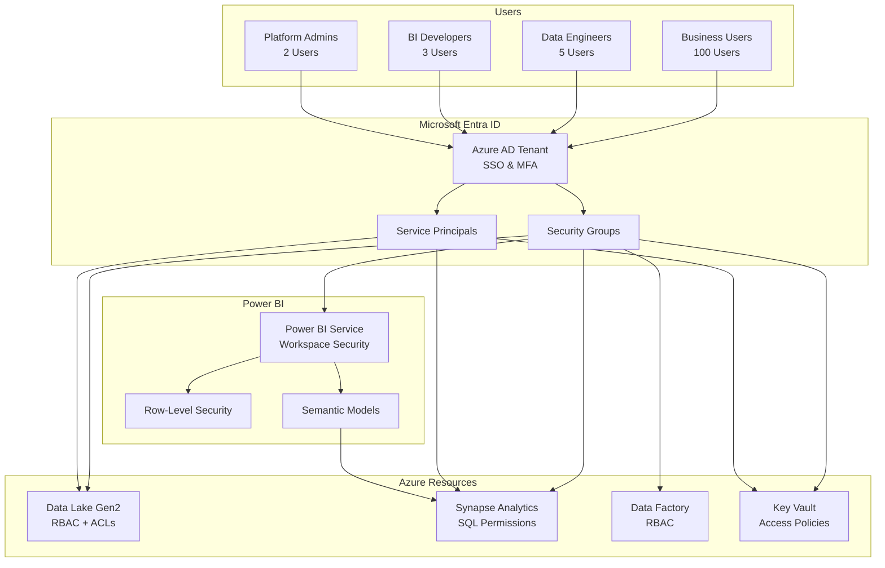
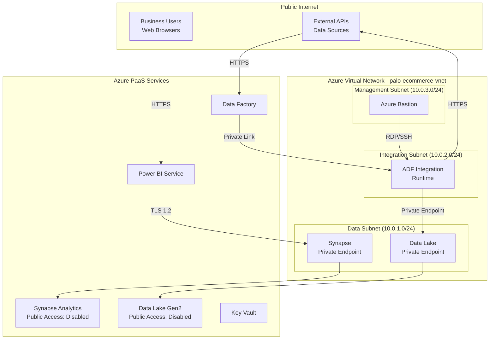
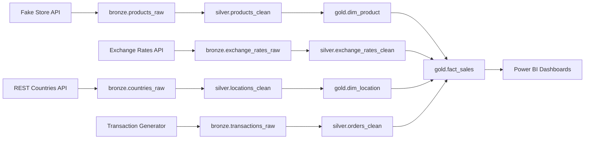

# Security & Governance Architecture

## Overview

This document details the security and governance framework for the PALO IT e-Commerce data platform, covering authentication, authorization, data protection, compliance, and audit mechanisms. The platform implements a defense-in-depth security strategy with multiple layers of protection.

**Security Principles**:
- **Zero Trust**: Verify explicitly, use least privilege access, assume breach
- **Defense in Depth**: Multiple security layers (network, identity, data, application)
- **Compliance by Design**: Built-in controls for GDPR, SOX, and audit requirements
- **Automated Governance**: Policy-driven data access and quality enforcement

---

## Authentication & Authorization

### Identity & Access Management Architecture



---

### User Roles & Permissions

#### Role-Based Access Control (RBAC)

| Role | Azure AD Group | Data Lake | Synapse | Power BI | Typical Users |
|------|----------------|-----------|---------|----------|---------------|
| **Platform Admin** | `data-platform-admins` | Owner | db_owner | Admin | Infrastructure team, Project lead |
| **Data Engineer** | `data-engineers` | Contributor (Bronze/Silver/Gold) | db_datareader, db_datawriter | Member | ETL developers, Data architects |
| **BI Developer** | `bi-developers` | Reader (Gold only) | db_datareader | Member | Report developers, Analysts |
| **Business User - Executive** | `business-executives` | None | None | Viewer (all dashboards) | C-level, VPs |
| **Business User - Finance** | `business-finance` | None | None | Viewer (Financial dashboards) | Finance team, Controllers |
| **Business User - Marketing** | `business-marketing` | None | None | Viewer (Marketing dashboards) | Marketing team, Product managers |
| **Business User - Sales** | `business-sales` | None | None | Viewer (Sales dashboards) | Sales reps, Account managers |
| **Read-Only Auditor** | `data-auditors` | Reader (all layers) | db_datareader | Viewer (all content) | Compliance, Internal audit |

#### Detailed Permission Matrix

**Data Lake Gen2 Permissions**:
```yaml
data-platform-admins:
  - role: "Storage Blob Data Owner"
  - scope: "/subscriptions/{sub}/resourceGroups/{rg}/providers/Microsoft.Storage/storageAccounts/{datalake}"
  - permissions: ["Read", "Write", "Delete", "Manage ACLs"]

data-engineers:
  - role: "Storage Blob Data Contributor"
  - scope: "/bronze/*, /silver/*, /gold/*"
  - permissions: ["Read", "Write", "Delete"]
  - restrictions: ["Cannot modify ACLs"]

bi-developers:
  - role: "Storage Blob Data Reader"
  - scope: "/gold/*"
  - permissions: ["Read"]
  - restrictions: ["No access to Bronze/Silver layers"]
```

**Azure Synapse Analytics Permissions**:
```sql
-- Data Engineers
CREATE USER [data-engineers] FROM EXTERNAL PROVIDER;
ALTER ROLE db_datareader ADD MEMBER [data-engineers];
ALTER ROLE db_datawriter ADD MEMBER [data-engineers];
GRANT CREATE TABLE TO [data-engineers];
GRANT CREATE VIEW TO [data-engineers];
GRANT CREATE PROCEDURE TO [data-engineers];

-- BI Developers
CREATE USER [bi-developers] FROM EXTERNAL PROVIDER;
ALTER ROLE db_datareader ADD MEMBER [bi-developers];
-- Read-only access to Gold schema
GRANT SELECT ON SCHEMA::gold TO [bi-developers];
DENY INSERT, UPDATE, DELETE, ALTER ON SCHEMA::gold TO [bi-developers];

-- Business Users (via Power BI service principal only)
CREATE USER [powerbi-service-principal] FROM EXTERNAL PROVIDER;
ALTER ROLE db_datareader ADD MEMBER [powerbi-service-principal];
GRANT SELECT ON SCHEMA::gold TO [powerbi-service-principal];
```

**Power BI Workspace Permissions**:
```yaml
Production Workspace:
  - Admins: [data-platform-admins, bi-developers]
  - Members: []  # No direct members
  - Contributors: []
  - Viewers: [business-executives, business-finance, business-marketing, business-sales]
  
Development Workspace:
  - Admins: [data-platform-admins]
  - Members: [bi-developers, data-engineers]
  - Contributors: []
  - Viewers: []
```

---

### Service Principal Management

**Purpose**: Enable secure service-to-service authentication without user credentials

**Service Principals Created**:

1. **Azure Data Factory Service Principal**
   - **Purpose**: Access Data Lake for reading/writing data
   - **Permissions**: Storage Blob Data Contributor on Data Lake
   - **Authentication**: Managed Identity (no secrets to manage)
   - **Scope**: Bronze, Silver layers (write); Gold layer (read)

2. **dbt Service Principal**
   - **Purpose**: Execute transformations in Synapse, read from Data Lake
   - **Permissions**: 
     - Storage Blob Data Reader on Data Lake (Silver layer)
     - db_datawriter on Synapse (Gold schema)
   - **Authentication**: Managed Identity or Service Principal with certificate
   - **Rotation**: Certificates rotated every 6 months

3. **Power BI Service Principal**
   - **Purpose**: Refresh semantic models from Synapse
   - **Permissions**: db_datareader on Synapse (Gold schema only)
   - **Authentication**: Service Principal with client secret
   - **Secret Storage**: Azure Key Vault
   - **Rotation**: Secrets rotated every 90 days

4. **Monitoring & Logging Service Principal**
   - **Purpose**: Azure Monitor access for centralized logging
   - **Permissions**: Monitoring Reader on all data platform resources
   - **Authentication**: Managed Identity

**Service Principal Configuration Example**:
```bash
# Create service principal for Power BI
az ad sp create-for-rbac \
  --name "palo-ecommerce-powerbi-sp" \
  --role "Storage Blob Data Reader" \
  --scopes /subscriptions/{sub}/resourceGroups/{rg}/providers/Microsoft.Storage/storageAccounts/{datalake}/blobServices/default/containers/gold

# Store client secret in Key Vault
az keyvault secret set \
  --vault-name "palo-ecommerce-kv" \
  --name "powerbi-sp-secret" \
  --value "{client-secret}" \
  --expires "2025-01-14T00:00:00Z"
```

---

### Multi-Factor Authentication (MFA)

**MFA Policy**:
- **Required for**: All users accessing Azure portal, Power BI Service
- **Enforcement**: Conditional Access Policy in Azure AD
- **Exemptions**: Service principals (use certificate authentication instead)
- **MFA Methods**: Microsoft Authenticator app (preferred), SMS (backup)

**Conditional Access Policy**:
```yaml
policy_name: "Data Platform MFA Enforcement"
conditions:
  users:
    include: ["All users"]
    exclude: ["Service accounts", "Break-glass admin"]
  cloud_apps:
    include: ["Azure Portal", "Power BI", "Azure Synapse"]
  locations:
    exclude: ["Trusted corporate network"]  # Optional: Skip MFA from office
grant_controls:
  require_mfa: true
  require_compliant_device: true
  session_controls:
    sign_in_frequency: 8 hours
```

---

## Data Encryption

### Encryption at Rest

**Azure Data Lake Gen2**:
- **Method**: Microsoft-managed encryption keys (default)
- **Algorithm**: AES-256
- **Scope**: All data in Bronze, Silver layers
- **Key Rotation**: Automatic, managed by Microsoft (every 90 days)
- **Alternative**: Customer-managed keys (CMK) in Azure Key Vault (if required for compliance)

**Azure Synapse Analytics**:
- **Method**: Transparent Data Encryption (TDE)
- **Algorithm**: AES-256
- **Scope**: All databases in dedicated SQL pool
- **Key Management**: Microsoft-managed (default) or customer-managed keys
- **Backup Encryption**: Automated encrypted backups (30-day retention)

**Power BI**:
- **Method**: Microsoft-managed encryption
- **Algorithm**: AES-256
- **Scope**: Semantic models, cached data
- **Note**: Data encrypted in Power BI datacenters (US, EU regions)

**Configuration Example (Customer-Managed Keys)**:
```bash
# Create encryption key in Key Vault
az keyvault key create \
  --vault-name "palo-ecommerce-kv" \
  --name "data-lake-encryption-key" \
  --kty RSA \
  --size 2048 \
  --ops encrypt decrypt

# Enable CMK on Data Lake
az storage account update \
  --name "paloecommercedatalake" \
  --resource-group "palo-ecommerce-rg" \
  --encryption-key-source Microsoft.Keyvault \
  --encryption-key-vault "https://palo-ecommerce-kv.vault.azure.net/" \
  --encryption-key-name "data-lake-encryption-key"
```

---

### Encryption in Transit

**Protocol Standards**:
- **TLS Version**: TLS 1.2 minimum (TLS 1.3 preferred)
- **Cipher Suites**: Strong ciphers only (AES-GCM, ChaCha20)
- **Certificate Management**: Azure-managed certificates (auto-renewal)

**Enforcement Points**:

1. **API Ingestion (External)**:
   - Fake Store API: HTTPS only
   - Exchange Rates API: HTTPS only
   - REST Countries API: HTTPS only
   - Certificate validation: Enabled (reject invalid certificates)

2. **Azure Service-to-Service**:
   - Data Factory → Data Lake: HTTPS (port 443)
   - Synapse → Data Lake: Private endpoint (internal Azure backbone)
   - Power BI → Synapse: TLS 1.2 encrypted SQL connection

3. **User Access**:
   - Power BI Desktop → Power BI Service: HTTPS
   - Azure Portal access: HTTPS
   - Synapse Studio: HTTPS

**Configuration Example**:
```bash
# Enforce HTTPS-only on Data Lake
az storage account update \
  --name "paloecommercedatalake" \
  --resource-group "palo-ecommerce-rg" \
  --https-only true \
  --min-tls-version TLS1_2
```

---

## Network Security & Isolation

### Network Architecture



---

### Private Endpoints Configuration

**Azure Data Lake Gen2**:
```yaml
private_endpoint:
  name: "palo-datalake-pe"
  subnet: "data-subnet"
  private_dns_zone: "privatelink.dfs.core.windows.net"
  public_network_access: "Disabled"
  allowed_ip_ranges: []  # No public access
```

**Azure Synapse Analytics**:
```yaml
private_endpoint:
  name: "palo-synapse-pe"
  subnet: "data-subnet"
  private_dns_zone: "privatelink.sql.azuresynapse.net"
  public_network_access: "Disabled"
  firewall_rules:
    - name: "AllowPowerBI"
      start_ip: "Power BI Service Tag"
      end_ip: "Power BI Service Tag"
```

**Azure Key Vault**:
```yaml
private_endpoint:
  name: "palo-keyvault-pe"
  subnet: "data-subnet"
  private_dns_zone: "privatelink.vaultcore.azure.net"
  public_network_access: "Disabled"
  network_acls:
    bypass: "AzureServices"  # Allow Azure services
    default_action: "Deny"
```

---

### Network Security Groups (NSGs)

**Data Subnet NSG Rules**:
```yaml
nsg_name: "data-subnet-nsg"
rules:
  - name: "Allow-HTTPS-from-Integration-Subnet"
    priority: 100
    direction: "Inbound"
    access: "Allow"
    protocol: "TCP"
    source: "10.0.2.0/24"  # Integration subnet
    destination: "10.0.1.0/24"
    destination_port: "443"
  
  - name: "Allow-SQL-from-PowerBI"
    priority: 110
    direction: "Inbound"
    access: "Allow"
    protocol: "TCP"
    source: "PowerBI"  # Service Tag
    destination: "10.0.1.0/24"
    destination_port: "1433"
  
  - name: "Deny-All-Inbound"
    priority: 1000
    direction: "Inbound"
    access: "Deny"
    protocol: "*"
    source: "*"
    destination: "*"
    destination_port: "*"
```

**Integration Subnet NSG Rules**:
```yaml
nsg_name: "integration-subnet-nsg"
rules:
  - name: "Allow-HTTPS-Outbound-to-Internet"
    priority: 100
    direction: "Outbound"
    access: "Allow"
    protocol: "TCP"
    source: "10.0.2.0/24"
    destination: "Internet"
    destination_port: "443"
  
  - name: "Allow-HTTPS-to-Data-Subnet"
    priority: 110
    direction: "Outbound"
    access: "Allow"
    protocol: "TCP"
    source: "10.0.2.0/24"
    destination: "10.0.1.0/24"
    destination_port: "443"
```

---

### Firewall Configuration

**Azure Synapse Firewall**:
```bash
# Disable public network access
az synapse workspace firewall-rule delete \
  --name "AllowAllWindowsAzureIps" \
  --workspace-name "palo-ecommerce-synapse"

# Allow Power BI service tag
az synapse workspace firewall-rule create \
  --name "AllowPowerBI" \
  --workspace-name "palo-ecommerce-synapse" \
  --start-ip-address "0.0.0.0" \
  --end-ip-address "0.0.0.0" \
  --resource-group "palo-ecommerce-rg"
```

---

## Data Governance Framework

### Data Catalog & Discovery (Azure Purview - Future Phase)

**Capabilities**:
- **Automated Scanning**: Discover data assets across Data Lake and Synapse
- **Metadata Management**: Capture schema, lineage, and business definitions
- **Business Glossary**: Centralized terminology (e.g., "Customer", "Revenue")
- **Data Classification**: Auto-tag sensitive data (PII, Financial)
- **Search & Discovery**: Business users can search for datasets

**Implementation Roadmap**:
- Phase 1-3: Manual documentation (Markdown, dbt docs)
- Phase 4: Deploy Azure Purview for automated cataloging

---

### Data Lineage Tracking

**Lineage Visualization** (via dbt):



**Lineage Metadata Captured**:
- Source system → Bronze table mapping
- Transformation logic (dbt model SQL)
- Column-level lineage (which source columns populate target columns)
- Dependency graph (upstream/downstream models)

**dbt Lineage Documentation**:
```yaml
# models/gold/fact_sales.yml
models:
  - name: fact_sales
    description: "Sales fact table capturing order line transactions"
    meta:
      lineage:
        upstream_models:
          - silver.orders_clean
          - silver.products_clean
          - silver.customers_clean
          - silver.exchange_rates_clean
        source_systems:
          - Fake Store API (products, customers)
          - Exchange Rates API
          - Synthetic Transaction Generator
    columns:
      - name: total_amount_usd
        description: "Total order line amount in USD"
        meta:
          derived_from:
            - silver.orders_clean.unit_price_local
            - silver.exchange_rates_clean.exchange_rate_usd
            - silver.orders_clean.quantity
```

---

### Data Quality Governance

**Data Quality Framework**:

| Dimension | Definition | Measurement | Target | Enforcement |
|-----------|------------|-------------|--------|-------------|
| **Completeness** | % required fields populated | COUNT(non-null) / COUNT(total) | 100% | dbt not_null tests |
| **Accuracy** | % records passing validation | COUNT(valid) / COUNT(total) | 95%+ | dbt accepted_range tests |
| **Consistency** | % foreign keys resolving | COUNT(valid FK) / COUNT(total) | 100% | dbt relationships tests |
| **Timeliness** | Data freshness | Current_time - max(created_at) | <24 hours | dbt freshness tests |
| **Uniqueness** | % duplicate-free records | COUNT(distinct PK) / COUNT(total) | 100% | dbt unique tests |

**Data Quality Monitoring Dashboard** (Azure Monitor):
```kusto
// Data quality metrics query
DataQualityMetrics
| where TimeGenerated > ago(7d)
| summarize 
    AvgCompleteness = avg(completeness_pct),
    AvgAccuracy = avg(accuracy_pct),
    TestFailures = countif(test_status == "fail")
  by TableName
| where TestFailures > 0 or AvgCompleteness < 95 or AvgAccuracy < 95
| order by TestFailures desc
```

---

### Data Classification & Sensitivity Labels

**Classification Levels**:

| Level | Description | Examples | Access Control | Encryption |
|-------|-------------|----------|----------------|------------|
| **Public** | Non-sensitive, publicly shareable | Product catalog, country data | All authenticated users | Standard (AES-256) |
| **Internal** | Business-sensitive, internal only | Sales data, revenue metrics | Business users (role-based) | Standard (AES-256) |
| **Confidential** | Restricted, need-to-know | Customer PII, financial details | Data engineers, admins only | Enhanced (CMK) |
| **Highly Confidential** | Regulated, audit-required | Payment data, audit logs | Admins only, logged access | Enhanced (CMK) + Audit |

**Classification by Data Asset**:

| Data Asset | Classification | Rationale |
|------------|----------------|-----------|
| `bronze.products_raw` | Public | Product information publicly available on website |
| `silver.customers_clean` | Confidential | Contains PII (name, email, address, phone) |
| `gold.fact_sales` | Internal | Business-sensitive revenue data |
| `gold.dim_customer` | Confidential | Customer PII and behavioral data |
| `exchange_rates_clean` | Public | Public exchange rate information |
| Azure AD audit logs | Highly Confidential | Access audit trail for compliance |

**Implementation** (Azure Purview - Future Phase):
- Automated classification based on column names (e.g., "email" → PII)
- Manual override capability for misclassified data
- Classification labels propagate through lineage (upstream sensitivity determines downstream)

---

## Compliance Controls

### GDPR Compliance

**Data Subject Rights Implementation**:

1. **Right to Access (Article 15)**:
   - Mechanism: Self-service Power BI dashboard showing customer's own data
   - Technical: Row-level security filters data to logged-in user
   - Response time: Immediate (real-time dashboard access)

2. **Right to Rectification (Article 16)**:
   - Mechanism: Customer service portal submits correction requests
   - Technical: Update `dim_customer` record (SCD Type 1 overwrite)
   - Response time: Within 24 hours (next pipeline run)

3. **Right to Erasure (Article 17)**:
   - Mechanism: Data deletion request via customer service
   - Technical: Anonymize customer record (replace PII with "DELETED_USER")
   - Retention: Preserve aggregated sales data (anonymized)
   - Response time: Within 30 days (compliance requirement)

4. **Right to Data Portability (Article 20)**:
   - Mechanism: Export customer data to CSV/JSON format
   - Technical: SQL query extracting customer's orders and profile
   - Response time: Within 48 hours

**GDPR Implementation Example**:
```sql
-- Anonymize customer data (Right to Erasure)
UPDATE gold.dim_customer
SET 
  first_name = 'DELETED',
  last_name = 'USER',
  email = 'deleted@example.com',
  phone = NULL,
  address_street = NULL,
  address_city = NULL,
  address_zipcode = NULL,
  updated_at = GETDATE()
WHERE customer_id = @customer_id_to_delete;

-- Preserve sales data (anonymized)
-- fact_sales retains customer_key but no PII exposed
```

**Synthetic Data Compliance** (R-025 mitigation):
- All customer data synthesized using Faker library (no real PII)
- Legal review completed confirming no GDPR applicability to synthetic data
- Data generation documented with seed values for reproducibility

---

### SOX Compliance (Financial Reporting)

**Control Objectives**:
1. **Segregation of Duties**: No single user can modify financial data and approve reports
2. **Audit Trail**: All data changes logged with timestamp and user
3. **Access Reviews**: Quarterly review of user permissions
4. **Change Management**: All production changes require approval and testing

**SOX Controls Implementation**:

| Control | Implementation | Frequency | Owner |
|---------|----------------|-----------|-------|
| **IT General Controls (ITGC)** | | | |
| Access Management | RBAC with quarterly access reviews | Quarterly | Platform Admin |
| Change Management | GitHub pull requests with approvals | Per change | Tech Lead |
| Backup & Recovery | Automated daily backups, tested quarterly | Daily / Quarterly | Azure Admin |
| **Application Controls** | | | |
| Data Validation | dbt tests on financial metrics (revenue, costs) | Daily | Data Engineer |
| Reconciliation | Monthly reconciliation of sales data vs. source | Monthly | Finance Team |
| Immutability | Bronze layer write-once, Gold layer versioned | Continuous | Data Engineer |

**Audit Log Retention**:
```yaml
log_retention:
  azure_ad_signin_logs: 90 days (extendable to 2 years)
  azure_activity_logs: 90 days (extendable to 2 years)
  synapse_audit_logs: 90 days (extendable to 2 years)
  data_factory_logs: 90 days
  power_bi_activity_logs: 30 days (extendable via API export)
  
export_to_cold_storage:
  destination: "Azure Blob Storage (Archive tier)"
  retention: 7 years
  cost: ~$0.01/GB/month
```

---

### Access Audit & Monitoring

**Audit Events Tracked**:

| Event Type | Data Captured | Retention | Alerting |
|------------|---------------|-----------|----------|
| User Login | User ID, timestamp, IP, MFA status | 90 days | Alert on failed MFA >3 attempts |
| Data Access (Synapse) | User, table, query, timestamp | 90 days | Alert on bulk export (>10K rows) |
| Data Modification | User, table, rows affected, before/after values | 2 years | Alert on Gold table modifications |
| Pipeline Execution | Pipeline name, status, duration, errors | 90 days | Alert on failures |
| Permission Changes | Changed by, user affected, old/new permissions | 2 years | Alert on admin role changes |
| Secret Access (Key Vault) | Service principal, secret name, timestamp | 90 days | Alert on secret access from unknown IP |

**Azure Monitor Query Examples**:
```kusto
// Failed login attempts
SigninLogs
| where TimeGenerated > ago(24h)
| where ResultType != 0  // Non-success
| summarize FailedAttempts = count() by UserPrincipalName, IPAddress
| where FailedAttempts > 3
| order by FailedAttempts desc

// Synapse audit: Large data exports
SQLSecurityAuditEvents
| where TimeGenerated > ago(7d)
| where statement_s contains "SELECT"
| where affected_rows_d > 10000
| project TimeGenerated, server_principal_name_s, affected_rows_d, statement_s
| order by affected_rows_d desc

// Key Vault secret access
AzureDiagnostics
| where ResourceType == "VAULTS"
| where OperationName == "SecretGet"
| where TimeGenerated > ago(24h)
| project TimeGenerated, identity_claim_http_schemas_xmlsoap_org_ws_2005_05_identity_claims_upn_s, 
          CallerIPAddress, requestUri_s
```

---

## Secrets Management

### Azure Key Vault Architecture

**Key Vault Purpose**:
- Centralized secrets storage for API keys, connection strings, service principal credentials
- Eliminates hard-coded secrets in code, configuration files, or environment variables
- Enables secret rotation without code changes

**Secrets Stored**:

| Secret Name | Description | Rotation Frequency | Access |
|-------------|-------------|--------------------|--------|
| `fakestoreapi-key` | Fake Store API key (if required) | N/A (public API) | Data Factory SP |
| `exchangeratesapi-key` | Exchange Rates API subscription key | Annually | Data Factory SP |
| `synapse-admin-password` | Synapse SQL admin password | 90 days | Platform Admins only |
| `powerbi-sp-secret` | Power BI service principal client secret | 90 days | Power BI SP |
| `dbt-sp-secret` | dbt service principal client secret | 90 days | dbt Cloud |
| `datalake-connection-string` | Data Lake connection string (backup) | N/A (use managed identity) | Data Factory SP |

**Secret Rotation Process**:
1. **Pre-rotation**: Generate new secret in target system (e.g., Azure AD)
2. **Dual-running**: Add new secret to Key Vault with versioning, keep old secret active
3. **Update references**: Update Data Factory/dbt to use new secret version
4. **Validation**: Test pipelines with new secret
5. **Deactivation**: Disable old secret version after 48-hour validation period
6. **Audit**: Log rotation event with timestamp and rotated-by user

**Key Vault Access Policies**:
```yaml
access_policies:
  - object_id: "data-factory-managed-identity"
    secret_permissions: ["Get", "List"]
    key_permissions: []
    certificate_permissions: []
  
  - object_id: "powerbi-service-principal"
    secret_permissions: ["Get"]
    key_permissions: []
    certificate_permissions: []
  
  - object_id: "data-platform-admins-group"
    secret_permissions: ["Get", "List", "Set", "Delete", "Backup", "Restore", "Recover", "Purge"]
    key_permissions: ["All"]
    certificate_permissions: ["All"]
```

**Reference Secrets from Data Factory**:
```json
{
  "type": "AzureKeyVaultSecret",
  "linkedServiceName": {
    "referenceName": "AzureKeyVault_LinkedService",
    "type": "LinkedServiceReference"
  },
  "secretName": "exchangeratesapi-key",
  "secretVersion": ""  // Empty = use latest version
}
```

---

## Data Privacy & PII Protection

### PII Identification

**PII Data Elements** (GDPR Article 4):
- **Direct Identifiers**: Name, email, phone, IP address, customer ID
- **Indirect Identifiers**: Address, zipcode, birthdate, purchase history (when combined)

**PII Locations in Platform**:

| Table | PII Columns | Protection Measures |
|-------|-------------|---------------------|
| `bronze.users_raw` | email, name, address, phone | Synthetic data only, Bronze Cool storage |
| `silver.customers_clean` | email, first_name, last_name, phone, address | Synthetic data, access restricted to Data Engineers |
| `gold.dim_customer` | email, first_name, last_name, phone, address | Synthetic data, RLS in Power BI (users see own data only) |
| `gold.fact_sales` | No direct PII (foreign keys only) | Aggregated for reporting |

**PII Protection Strategy**:
1. **Minimize Collection**: Only capture PII necessary for analytics (no payment data)
2. **Pseudonymization**: Use customer_key (surrogate key) in fact tables instead of customer_id
3. **Access Control**: Restrict PII access to Data Engineers and Admins only
4. **Synthetic Data**: Use Faker library ensuring no real customer data in platform
5. **Row-Level Security**: Business users see only aggregated data, not individual customer records

---

### Row-Level Security (RLS) Implementation

**Power BI RLS Roles**:

**Role 1: Executive (All Data)**
```dax
-- Executives see all data
[Segment] IN {"new", "regular", "vip"}
```

**Role 2: Regional Manager (Region Filter)**
```dax
-- Regional managers see only their assigned region
[Region] = USERPRINCIPALNAME()  -- Lookup user's region from user table
```

**Role 3: Sales Rep (Customer Filter)**
```dax
-- Sales reps see only their assigned customers
[SalesRepEmail] = USERPRINCIPALNAME()
```

**Role 4: Customer Self-Service (User's Own Data)**
```dax
-- Customers see only their own purchase history
[CustomerEmail] = USERPRINCIPALNAME()
```

**RLS Testing Checklist**:
- [ ] Test each role with representative user accounts
- [ ] Validate no data leakage between roles
- [ ] Confirm row counts match expected scope
- [ ] Test with "View as Role" feature in Power BI Desktop
- [ ] Document role membership in Azure AD groups

---

## Incident Response & Breach Notification

### Data Breach Response Plan

**Breach Definition**: Unauthorized access, disclosure, or loss of confidential/PII data

**Response Phases**:

**Phase 1: Detection & Containment (0-2 hours)**
1. **Detect**: Automated alerts (Azure Monitor, Sentinel) or user report
2. **Assess**: Determine scope (which data, how many records, who accessed)
3. **Contain**: Revoke compromised credentials, disable affected accounts
4. **Escalate**: Notify Platform Admin and Security Team

**Phase 2: Investigation (2-24 hours)**
1. **Forensics**: Analyze audit logs to determine breach timeline and method
2. **Impact Assessment**: Identify affected customers, data sensitivity
3. **Remediation**: Patch vulnerability, rotate secrets, harden access controls
4. **Evidence Preservation**: Export logs for legal/compliance review

**Phase 3: Notification (24-72 hours)**
1. **Internal**: Notify executive team, legal, compliance
2. **Regulatory** (if required): GDPR breach notification to supervisory authority (72 hours)
3. **Customer** (if high risk): Notify affected individuals via email
4. **Public** (if material): Public disclosure (press release, website)

**Phase 4: Post-Incident Review (1-2 weeks)**
1. **Root Cause Analysis**: Document what happened, why, how to prevent
2. **Remediation Verification**: Confirm controls in place to prevent recurrence
3. **Lessons Learned**: Update incident response plan, conduct team training
4. **Compliance Documentation**: Maintain breach log for audit purposes

**Breach Notification Templates**:
- GDPR Template: [Link to GDPR breach notification form]
- Customer Notification Email: [Link to customer breach notification template]

---

## Compliance Certifications

### Target Certifications

**ISO 27001 (Information Security Management)**:
- **Status**: Not certified (target for Phase 4)
- **Scope**: Data platform infrastructure and operations
- **Key Controls**: Access management, encryption, audit logging, incident response
- **Timeline**: 12-month certification process starting Phase 4

**SOC 2 Type II (Service Organization Control)**:
- **Status**: Not applicable (internal platform, not SaaS offering)
- **Alternative**: Leverage Azure SOC 2 certification for underlying infrastructure

**Azure Compliance Coverage**:
- Azure Data Lake Gen2: ISO 27001, SOC 2, GDPR, HIPAA certified
- Azure Synapse Analytics: ISO 27001, SOC 2, GDPR certified
- Power BI: ISO 27001, SOC 2, GDPR certified

---

## Security Monitoring & Alerting

### Azure Sentinel (SIEM) Integration (Future Phase)

**Use Cases**:
- **Threat Detection**: Anomalous access patterns, brute-force attacks
- **Compliance Monitoring**: Failed audits, unauthorized permission changes
- **Incident Response**: Centralized security event triage and investigation

**Detection Rules**:
1. **Multiple Failed Login Attempts**: >5 failed logins within 15 minutes
2. **Privileged Role Assignment**: Alert when user added to admin group
3. **Large Data Export**: Query returning >50K rows from Synapse
4. **Secret Access from Unknown IP**: Key Vault access from non-whitelisted IP
5. **Off-Hours Access**: Data access outside business hours (6 PM - 6 AM)

---

## Related Documents

- [Architecture Overview](./overview.md)
- [Data Flows](./data-flows.md)
- [Component Specifications](../../infra/docs/architecture/component-specifications.md)
- [Network Security Details](../../infra/docs/architecture/network-security.md)
- [Operations Guide](../../infra/docs/architecture/operations.md)
