# Security and Governance Architecture

**Document Owner:** Security & Governance Team  
**Last Updated:** December 2025  
**Status:** Active  
**Related Documents:** [Architecture Overview](./overview.md) | [Data Flows](./data-flows.md) | [Network Security Details](../../infra/docs/architecture/network-security.md)

---

## 1. Overview

This document defines the security and governance framework for the Nuvama Data Platform. It establishes the controls, policies, and mechanisms required to protect data assets, ensure regulatory compliance, and maintain data quality across the platform.

### 1.1 Security Principles

| Principle | Description |
|-----------|-------------|
| **Defense in Depth** | Multiple layers of security controls |
| **Least Privilege** | Minimum necessary access permissions |
| **Zero Trust** | Verify explicitly, assume breach |
| **Encryption Everywhere** | Data protected at rest and in transit |
| **Audit Everything** | Complete visibility into all actions |
| **Compliance by Design** | Regulatory requirements built into architecture |

---

## 2. Authentication and Authorization

### 2.1 Identity Architecture

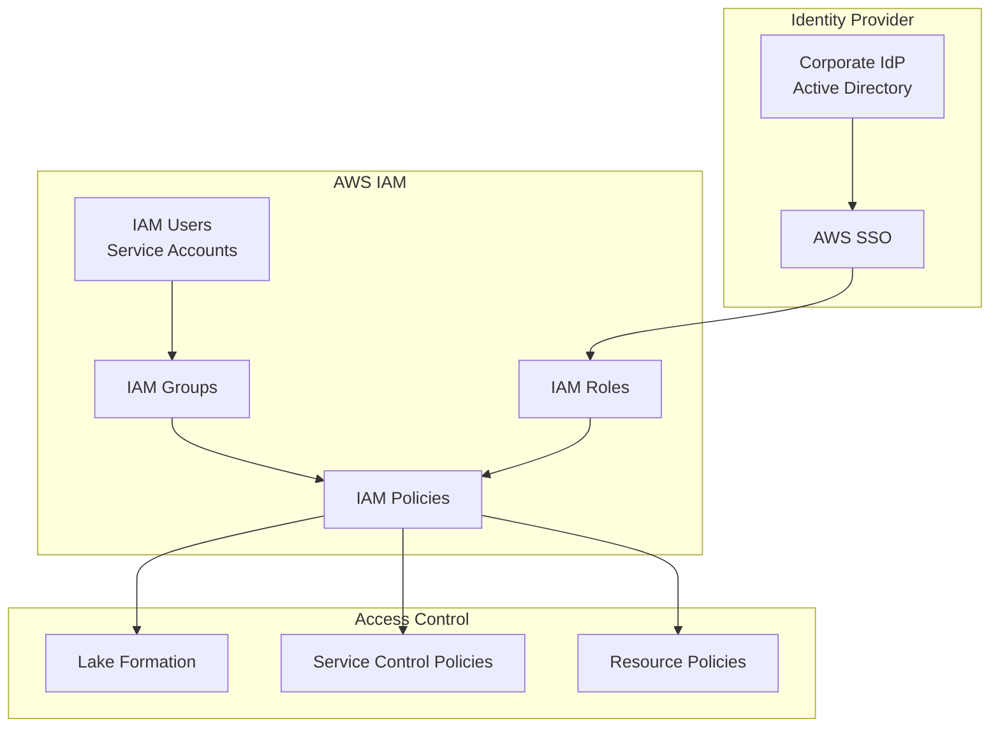

### 2.2 Authentication Methods

| Method | Use Case | Implementation |
|--------|----------|----------------|
| **AWS SSO** | Human users | Federated with corporate IdP |
| **IAM Roles** | Service-to-service | AssumeRole with session tokens |
| **Service Accounts** | Applications | IAM users with access keys (rotated) |
| **Instance Profiles** | EC2/ECS | Attached IAM roles |
| **Web Identity** | External apps | OIDC federation |

### 2.3 Role-Based Access Control (RBAC)

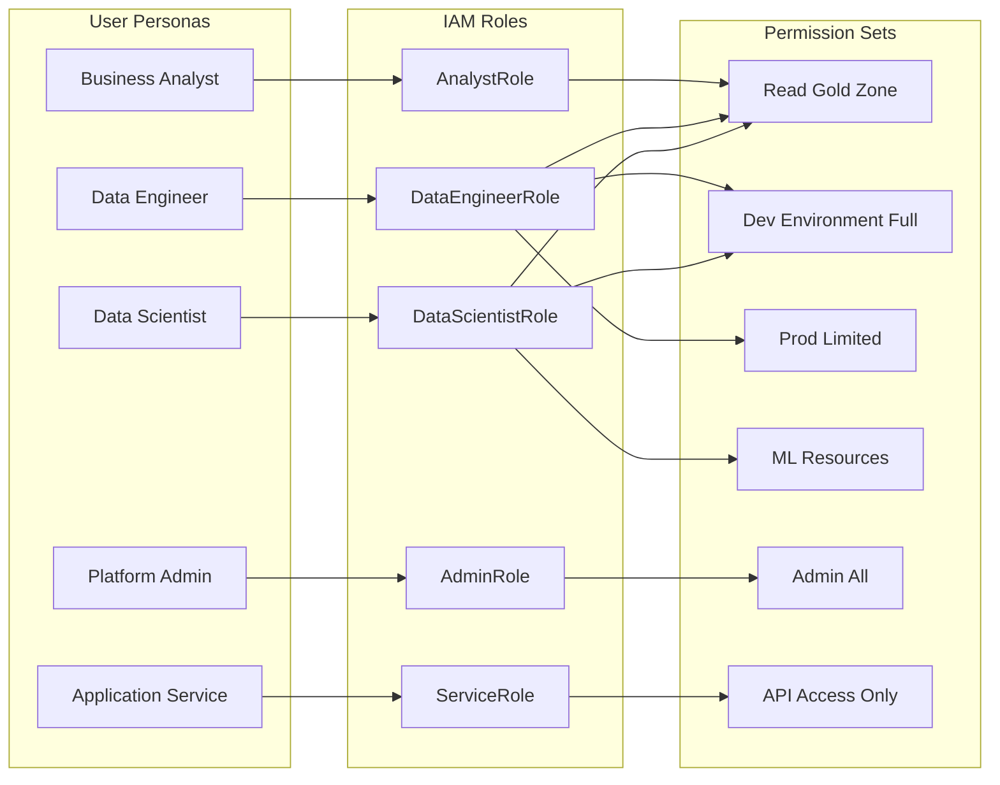

### 2.4 Role Definitions

| Role | Scope | Key Permissions |
|------|-------|-----------------|
| **DataScientistRole** | ML development | SageMaker full, S3 read (silver/gold), Athena query |
| **DataEngineerRole** | Data pipeline development | Glue full, S3 read/write (all zones), Lake Formation admin |
| **AnalystRole** | Business analytics | S3 read (gold only), Athena query, QuickSight |
| **PlatformAdminRole** | Infrastructure management | Full AWS access within account |
| **ServiceRole** | Application integration | S3 read (specific prefixes), API Gateway invoke |
| **AuditRole** | Compliance review | CloudTrail read, Config read, Lake Formation audit |

### 2.5 Lake Formation Access Control

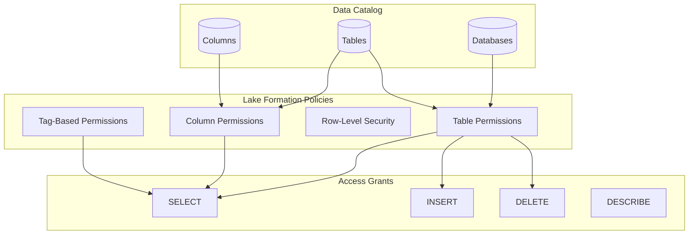

**Lake Formation Permission Matrix:**

| Principal | Database | Table | Columns | Operations |
|-----------|----------|-------|---------|------------|
| DataScientistRole | curated, analytics | All | All | SELECT |
| DataEngineerRole | All | All | All | ALL |
| AnalystRole | analytics | dim_*, fact_*, rpt_* | Non-PII | SELECT |
| ServiceRole | analytics | lead_scores | score_* | SELECT |

---

## 3. Data Encryption

### 3.1 Encryption Architecture

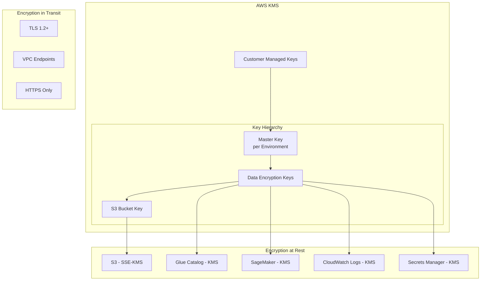

### 3.2 Encryption at Rest

| Service | Encryption Method | Key Type | Key Rotation |
|---------|-------------------|----------|--------------|
| **S3** | SSE-KMS with bucket keys | Customer Managed | Annual |
| **Glue Data Catalog** | KMS encryption | Customer Managed | Annual |
| **SageMaker** | KMS for volumes and artifacts | Customer Managed | Annual |
| **CloudWatch Logs** | KMS encryption | Customer Managed | Annual |
| **Secrets Manager** | KMS encryption | AWS Managed | Automatic |
| **RDS (if used)** | KMS encryption | Customer Managed | Annual |

### 3.3 Encryption in Transit

| Communication Path | Encryption | Certificate |
|--------------------|------------|-------------|
| Client → AWS Services | TLS 1.2+ | AWS Certificate |
| VPC → S3 | TLS via VPC Endpoint | AWS Certificate |
| Cross-Account | TLS 1.2+ | AWS Certificate |
| SFTP Transfer | SSH/TLS | Customer Certificate |
| API Gateway | TLS 1.2+ | ACM Certificate |

### 3.4 Key Management

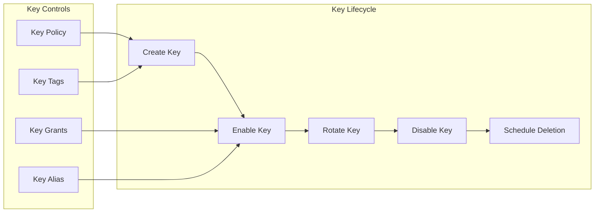

**Key Policy Principles:**

- Separate keys per environment (dev, uat, prod)
- Key administrators cannot use keys
- Key users cannot administer keys
- Cross-account access via grants (not policies)
- All key usage logged in CloudTrail

---

## 4. Network Security and Isolation

### 4.1 Network Architecture Overview

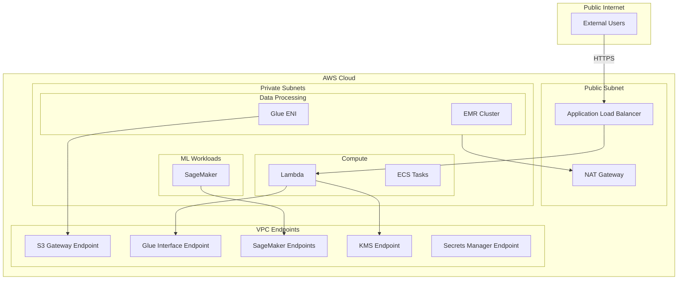

### 4.2 Security Groups

| Security Group | Purpose | Inbound | Outbound |
|----------------|---------|---------|----------|
| **sg-glue** | Glue jobs | Self-reference (all ports) | HTTPS to VPC endpoints |
| **sg-sagemaker** | SageMaker workloads | Self-reference | HTTPS to VPC endpoints |
| **sg-lambda** | Lambda functions | None | HTTPS to VPC endpoints |
| **sg-emr** | EMR clusters | Self-reference, SSH from bastion | HTTPS to VPC endpoints |
| **sg-endpoints** | VPC endpoints | HTTPS from private subnets | None |

### 4.3 Network ACLs

| Rule | Direction | Protocol | Port | Source/Dest | Action |
|------|-----------|----------|------|-------------|--------|
| 100 | Inbound | TCP | 443 | 10.0.0.0/8 | Allow |
| 200 | Inbound | TCP | 1024-65535 | 10.0.0.0/8 | Allow |
| * | Inbound | All | All | 0.0.0.0/0 | Deny |
| 100 | Outbound | TCP | 443 | 0.0.0.0/0 | Allow |
| 200 | Outbound | TCP | 1024-65535 | 10.0.0.0/0 | Allow |
| * | Outbound | All | All | 0.0.0.0/0 | Deny |

For detailed network configuration, see [Network Security Details](../../infra/docs/architecture/network-security.md).

---

## 5. Data Governance and Lineage Framework

### 5.1 Governance Model

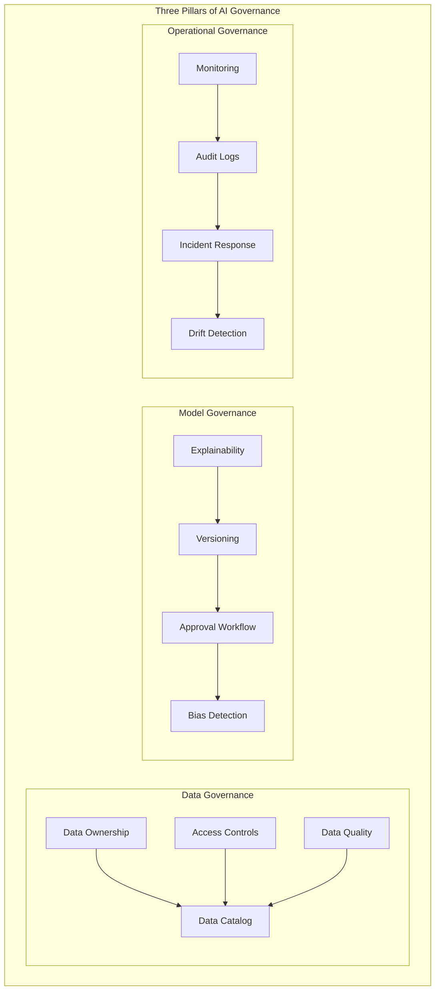

### 5.2 Data Ownership Model

| Domain | Data Steward | Technical Owner | Business Owner |
|--------|--------------|-----------------|----------------|
| **Leads** | Data Governance Lead | Data Engineering | Sales Operations |
| **Campaigns** | Data Governance Lead | Data Engineering | Marketing |
| **Outcomes** | Data Governance Lead | Data Engineering | Sales Leadership |
| **Portfolios** | Data Governance Lead | Data Engineering | Operations |
| **Models** | ML Lead | ML Engineering | Product |
| **Scores** | ML Lead | ML Engineering | Sales Operations |

### 5.3 Data Classification

| Classification | Description | Handling Requirements | Examples |
|----------------|-------------|----------------------|----------|
| **Public** | No restrictions | Standard controls | Product names, public metrics |
| **Internal** | Internal use only | Access logging | Aggregated reports, dashboards |
| **Confidential** | Business sensitive | Encryption, access control | Lead data, scores, features |
| **Restricted** | PII, Regulatory | Enhanced controls, masking | Customer names, contact info |

### 5.4 Data Lineage

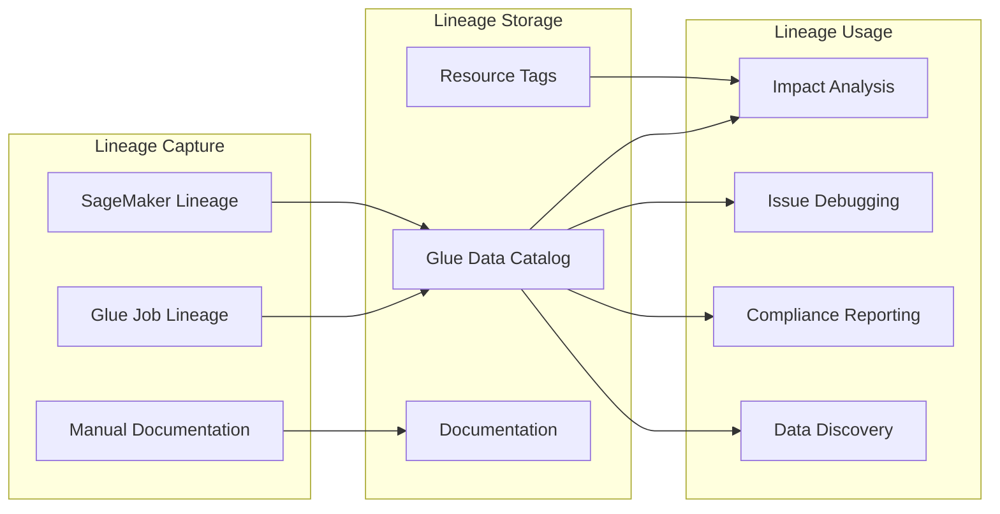

**Lineage Tracking Implementation:**

| Level | Tool | Granularity |
|-------|------|-------------|
| **Job Level** | Glue Job Runs | Job → Tables |
| **Table Level** | Glue Catalog | Table → Table |
| **Column Level** | Glue Lineage | Column → Column |
| **Model Level** | SageMaker Lineage | Feature → Model → Output |

### 5.5 Data Quality Governance

| Dimension | Measurement | Threshold | Escalation |
|-----------|-------------|-----------|------------|
| **Completeness** | % non-null in required fields | >95% | Data Steward |
| **Accuracy** | % records passing business rules | >98% | Data Steward |
| **Timeliness** | Hours since last update | <24h | Platform Team |
| **Uniqueness** | % duplicate records | <0.1% | Data Engineer |
| **Consistency** | Cross-source variance | <1% | Data Steward |

---

## 6. Compliance Controls and Audit Mechanisms

### 6.1 Regulatory Alignment

| Regulation | Requirement | Implementation |
|------------|-------------|----------------|
| **Data Protection (India)** | Data residency | AWS Mumbai region (ap-south-1) |
| **Financial Services** | Audit trail | CloudTrail, Lake Formation audit |
| **PII Protection** | Data minimization | Column-level access, masking |
| **Model Explainability** | Transparency | SHAP values, feature importance |
| **Data Retention** | Defined periods | S3 lifecycle policies |

### 6.2 Audit Architecture

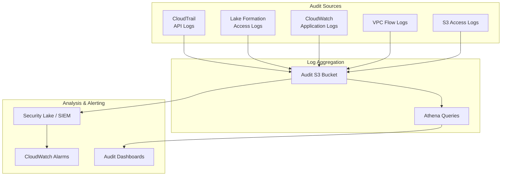

### 6.3 Audit Log Types

| Log Type | Source | Retention | Use Case |
|----------|--------|-----------|----------|
| **CloudTrail** | All AWS API calls | 7 years | Security audit, compliance |
| **Lake Formation** | Data access | 7 years | Data access audit |
| **S3 Access Logs** | Object access | 1 year | Access patterns |
| **VPC Flow Logs** | Network traffic | 90 days | Network security |
| **CloudWatch Logs** | Application logs | 1 year | Operational audit |
| **Glue Job Logs** | ETL execution | 90 days | Pipeline audit |

### 6.4 Compliance Reporting

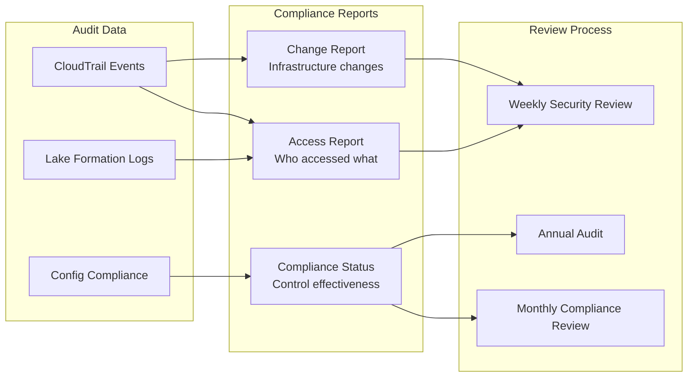

### 6.5 Security Controls Checklist

| Control Category | Control | Status | Evidence |
|------------------|---------|--------|----------|
| **Access Control** | MFA enforced | ✅ | IAM Policy |
| **Access Control** | Least privilege IAM | ✅ | IAM Policy Review |
| **Access Control** | Lake Formation policies | ✅ | LF Configuration |
| **Encryption** | S3 encryption enabled | ✅ | S3 Bucket Policy |
| **Encryption** | KMS key rotation | ✅ | KMS Configuration |
| **Encryption** | TLS 1.2+ enforced | ✅ | S3 Bucket Policy |
| **Network** | VPC isolation | ✅ | VPC Configuration |
| **Network** | Private endpoints | ✅ | VPC Endpoints |
| **Logging** | CloudTrail enabled | ✅ | CloudTrail Config |
| **Logging** | Lake Formation audit logs | ✅ | LF Configuration |
| **Monitoring** | Security alarms | ✅ | CloudWatch Alarms |
| **Compliance** | AWS Config rules | ✅ | Config Rules |

---

## 7. Model Governance

### 7.1 Model Lifecycle Governance

```mermaid
flowchart LR
    subgraph Development["Development"]
        DEV[Development]
        TEST[Testing]
        VALID[Validation]
    end
    
    subgraph Review["Review & Approval"]
        TECH[Technical Review]
        BUS[Business Review]
        COMPLY[Compliance Review]
    end
    
    subgraph Production["Production"]
        STAGE[Staging]
        PROD[Production]
        MONITOR[Monitoring]
    end
    
    subgraph Retirement["Retirement"]
        DEPRECATE[Deprecation]
        ARCHIVE[Archive]
    end
    
    DEV --> TEST --> VALID
    VALID --> TECH --> BUS --> COMPLY
    COMPLY --> STAGE --> PROD --> MONITOR
    MONITOR -->|Degradation| DEPRECATE
    DEPRECATE --> ARCHIVE
```

### 7.2 Model Approval Workflow

| Stage | Approver | Criteria |
|-------|----------|----------|
| **Technical Review** | ML Lead | Accuracy, performance, code quality |
| **Business Review** | Product Owner | Business alignment, threshold validation |
| **Compliance Review** | Compliance | Explainability, bias check, audit readiness |
| **Production Approval** | Platform Lead | Infrastructure readiness, monitoring setup |

### 7.3 Model Registry Controls

| Control | Implementation | Purpose |
|---------|----------------|---------|
| **Version Control** | SageMaker Model Registry | Track all model versions |
| **Approval Status** | Model Package Groups | Staging → Approved → Archived |
| **Metadata Tracking** | Model Artifacts | Training data, parameters, metrics |
| **Lineage** | SageMaker Lineage | Features → Model → Predictions |
| **Access Control** | IAM Policies | Who can deploy models |

### 7.4 Explainability Requirements

| Requirement | Implementation | Output |
|-------------|----------------|--------|
| **Feature Importance** | SHAP values | Top 5 drivers per prediction |
| **Global Explanation** | Feature importance plots | Model behavior overview |
| **Local Explanation** | Individual SHAP | Per-lead score explanation |
| **Bias Detection** | SageMaker Clarify | Fairness metrics |
| **Documentation** | Model Cards | Model purpose, limitations |

---

## 8. Incident Response

### 8.1 Security Incident Process

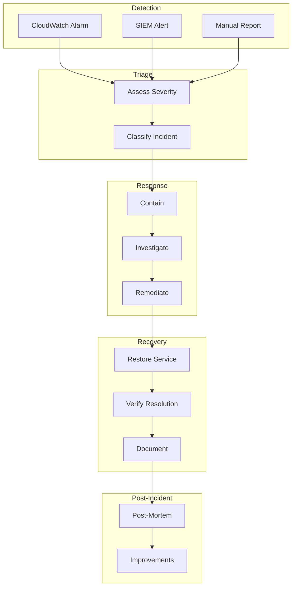

### 8.2 Incident Severity Levels

| Level | Description | Response Time | Escalation |
|-------|-------------|---------------|------------|
| **P1 - Critical** | Data breach, service outage | 15 minutes | Executive, Security |
| **P2 - High** | Security vulnerability, data quality issue | 1 hour | Platform Lead |
| **P3 - Medium** | Access violation, policy breach | 4 hours | Security Team |
| **P4 - Low** | Minor policy deviation | 24 hours | Operations |

---

## 9. References

- [Architecture Overview](./overview.md)
- [Data Flows](./data-flows.md)
- [Network Security Details](../../infra/docs/architecture/network-security.md)
- [Operations Guide](../../infra/docs/architecture/operations.md)
- [Risk & Constraint Register](./risk-constraint-register.md)
