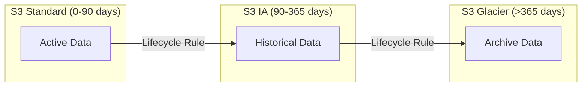
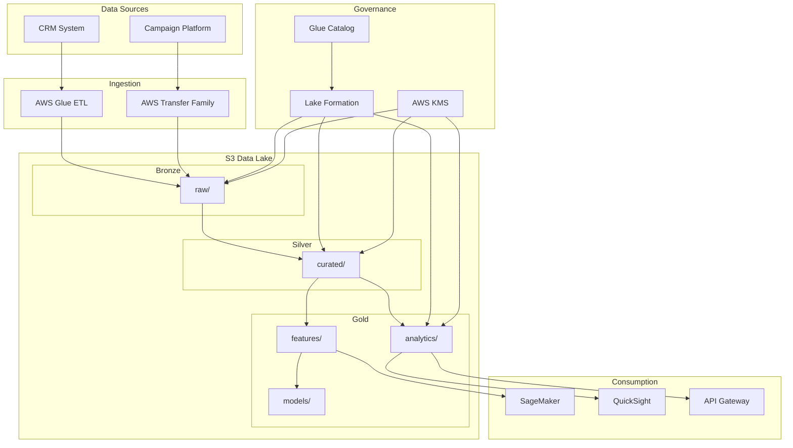

# 01 - Data Lake Foundation Setup

## 📝 Description

As a **Data Engineer**, I want to establish the foundational S3-based data lake with Bronze/Silver/Gold zones so that the platform can support progressive data refinement with clear data lineage and governance controls from inception.

## 🎯 Acceptance Criteria

### 1. S3 Bucket Structure
- S3 buckets created with proper naming convention following environment prefix (dev/uat/prod)
- Three storage zones established:
  - Bronze (raw/) - for source data preservation
  - Silver (curated/) - for cleansed and conformed data
  - Gold (analytics/) - for business-aligned aggregated data
- Additional zones created for:
  - features/ - ML feature store data
  - models/ - ML model artifacts
  - outputs/ - scoring and report outputs

### 2. Storage Configuration
- S3 Standard storage class applied for active data (last 90 days)
- S3 Intelligent-Tiering configured for historical data with variable access patterns
- S3 Glacier configured for compliance archives (>1 year)
- Lifecycle policies implemented:
  - Bronze: S3 Standard → IA (90d) → Glacier (1y)
  - Silver: S3 Standard → IA (180d)
  - Gold: S3 Standard → IA (1y)

### 3. Partitioning Strategy
- Time-based partitioning implemented (year/month/day for raw, dt for curated)
- Partition keys documented for each table type
- Parquet format used as default for analytics data
- Snappy compression enabled

### 4. Encryption & Security
- SSE-KMS encryption enabled for all buckets
- Bucket versioning enabled
- Public access blocked
- VPC endpoints configured for private access

## 🔒 Technical Constraints

- All infrastructure must be defined as Terraform code (IaC)
- AWS Mumbai region (ap-south-1) required for data residency compliance
- Must integrate with AWS Lake Formation for access control
- Bucket keys must be Customer Managed Keys (CMK)

## 📦 Dependencies

- AWS Organizations account structure
- VPC with private subnets configured
- KMS keys provisioned
- IAM roles for data platform team

## ✅ Tasks

### Infrastructure (Terraform)
- ⬜ Create S3 bucket module with zone configuration
- ⬜ Configure lifecycle policies per zone
- ⬜ Set up KMS key for data encryption
- ⬜ Configure bucket policies for VPC endpoint access
- ⬜ Enable access logging to audit bucket

### Governance Setup
- ⬜ Register buckets with Lake Formation
- ⬜ Create Glue Data Catalog database per zone
- ⬜ Document partition strategy in architecture docs

### Validation
- ⬜ Verify encryption at rest
- ⬜ Test lifecycle policy transitions
- ⬜ Validate VPC endpoint connectivity
- ⬜ Confirm Lake Formation registration

## 📊 Success Metrics

| Metric | Target |
|--------|--------|
| Data ingestion success | Zone structure supports batch loads |
| Governance compliance | 100% buckets under Lake Formation control |
| Cost optimization | Lifecycle policies reducing storage costs by 30% after 6 months |

## 🔗 Related Documents

- [Architecture Overview](../../../architecture/overview.md)
- [Data Platform Strategy](../../../architecture/data-platform-strategy.md)
- [Data Flows](../../../architecture/data-flows.md)

## 📚 Relevant Context

### Strategic Alignment
This story establishes the foundational infrastructure for Strategic Bet #1: "Prioritize curated, governed analytics over raw data exploration in Phase 1" per [Data Platform Strategy](../../../architecture/data-platform-strategy.md). The S3 data lake serves as the "Single Source of Truth" for all downstream analytics and ML workloads.

### Architecture Context
- **Medallion Architecture**: Bronze/Silver/Gold zone structure per [Architecture Overview §3.1](../../../architecture/overview.md) and [Data Platform Strategy §3.1](../../../architecture/data-platform-strategy.md)
- **Storage Strategy**: S3 Standard → Intelligent-Tiering → Glacier lifecycle per [Data Platform Strategy §3.2](../../../architecture/data-platform-strategy.md)
- **Integration with Lake Formation**: S3 buckets registered for fine-grained access control per governance requirements

### Timeline & Milestones
- Part of **Phase 1** "Data Platform Foundation Setup" (Weeks 2-4) per [Value Delivery Roadmap §3.1](../../../architecture/value-delivery-roadmap.md)
- Target milestone: **M2: Platform Foundation** (Week 4) - Data lake operational
- Success criteria: Zone structure supports batch loads, 100% buckets under Lake Formation control

### Key Risks & Constraints
- **C02**: Data must remain in AWS Mumbai region (ap-south-1) for regulatory compliance ([Risk Register](../../../architecture/risk-constraint-register.md))
- **C04**: All infrastructure must be defined as Terraform code (IaC)
- **A06**: AWS cloud infrastructure can be provisioned within standard timelines (1-2 weeks)
- Security: Encryption at rest (SSE-KMS), VPC endpoints for private access, bucket versioning enabled

### Storage Zone Configuration
Per [Data Platform Strategy §3.2](../../../architecture/data-platform-strategy.md):
| Zone | Purpose | Lifecycle Policy |
|------|---------|------------------|
| Bronze (raw/) | Source data preserved | S3 Standard → IA (90d) → Glacier (1y) |
| Silver (curated/) | Cleansed, conformed | S3 Standard → IA (180d) |
| Gold (analytics/) | Business-aligned | S3 Standard → IA (1y) |
| Features | ML feature store | S3 Standard (1 year retention) |
| Models | ML artifacts | S3 Standard (indefinite) |

### File Format & Partitioning
Per [Data Flows §5.3-5.4](../../../architecture/data-flows.md):
- **Default format**: Parquet with Snappy compression for analytics
- **Partitioning**: Time-based (year/month/day for raw, dt for curated)
- **Versioning**: Enabled on all buckets for recovery and audit

### Technology Stack
Per [Tech Stack](../../../project-context/tech-stack.md):
- **Amazon S3** as single source of truth
- **AWS Lake Formation** for registration and access control
- **AWS Glue Data Catalog** for database-per-zone metadata
- **AWS KMS** with Customer Managed Keys (CMK) for encryption
- **Terraform** for infrastructure as code

---

## Implementation Plan

### 1. Feature Overview

**Goal:** Establish the foundational S3-based data lake with Bronze/Silver/Gold zones implementing the Medallion Architecture pattern for progressive data refinement with clear data lineage and governance controls.

**Primary User Role:** Data Engineer

**Business Value:** This foundational infrastructure enables all downstream analytics and ML workloads, serving as the "Single Source of Truth" for the platform. It directly supports Strategic Bet #1 and enables the Lead Scoring AI product.

### 2. Component Analysis & Reuse Strategy

#### Existing Components
| Component | Location | Reuse Decision |
|-----------|----------|----------------|
| VPC Infrastructure | Security Story 01 | **REUSE** - S3 VPC endpoints depend on VPC |
| KMS Keys | Security Story 02 | **REUSE** - Encryption keys for S3 buckets |
| IAM Roles | Shared infrastructure | **REUSE** - Platform roles for bucket access |

#### New Components Required
| Component | Purpose | Priority |
|-----------|---------|----------|
| S3 Bucket Module | Reusable Terraform module for zone buckets | High |
| Lifecycle Policies | Storage class transitions | High |
| Bucket Policies | VPC endpoint and encryption enforcement | High |
| Lake Formation Registration | Governance integration | Medium |

#### Gaps Identified
- No existing S3 module with lifecycle and governance configuration
- Lake Formation registration automation not yet defined

### 3. Affected Files

#### Infrastructure (Terraform)
| File Path | Action | Description |
|-----------|--------|-------------|
| `infra/modules/s3-data-lake/main.tf` | [CREATE] | S3 bucket module with zone configuration |
| `infra/modules/s3-data-lake/variables.tf` | [CREATE] | Module input variables |
| `infra/modules/s3-data-lake/outputs.tf` | [CREATE] | Module outputs (bucket ARNs, names) |
| `infra/modules/s3-data-lake/lifecycle.tf` | [CREATE] | Lifecycle policy configurations |
| `infra/modules/s3-data-lake/policies.tf` | [CREATE] | Bucket policies for VPC and encryption |
| `infra/components/storage/main.tf` | [CREATE] | Storage component using S3 module |
| `infra/components/storage/variables.tf` | [CREATE] | Storage component variables |
| `infra/components/storage/outputs.tf` | [CREATE] | Storage component outputs |
| `infra/environments/dev/storage.tfvars` | [CREATE] | Dev environment storage config |
| `infra/environments/uat/storage.tfvars` | [CREATE] | UAT environment storage config |
| `infra/environments/prod/storage.tfvars` | [CREATE] | Prod environment storage config |

#### Documentation
| File Path | Action | Description |
|-----------|--------|-------------|
| `infra/modules/s3-data-lake/README.md` | [CREATE] | Module documentation |
| `docs/architecture/data-flows.md` | [MODIFY] | Update with S3 path conventions |

#### Tests
| File Path | Action | Description |
|-----------|--------|-------------|
| `infra/tests/s3-data-lake/terratest_test.go` | [CREATE] | Infrastructure tests for S3 module |
| `infra/tests/s3-data-lake/policy_test.go` | [CREATE] | Bucket policy validation tests |

### 4. Component Breakdown

#### 4.1 S3 Bucket Module (`infra/modules/s3-data-lake/`)

**Purpose:** Reusable Terraform module for creating S3 buckets with standardized configuration for data lake zones.

**Configuration:**
```hcl
# Example module configuration
module "data_lake" {
  source = "./modules/s3-data-lake"
  
  environment     = "prod"
  project_name    = "nuvama-data-platform"
  kms_key_arn     = module.kms.data_key_arn
  vpc_endpoint_id = module.vpc.s3_endpoint_id
  
  zones = {
    raw = {
      lifecycle_ia_days      = 90
      lifecycle_glacier_days = 365
    }
    curated = {
      lifecycle_ia_days      = 180
      lifecycle_glacier_days = null  # No glacier for curated
    }
    analytics = {
      lifecycle_ia_days      = 365
      lifecycle_glacier_days = null
    }
    features = {
      lifecycle_ia_days      = 365
      lifecycle_glacier_days = null
    }
    models = {
      lifecycle_ia_days      = null  # Indefinite standard
      lifecycle_glacier_days = null
    }
  }
}
```

**Key Features:**
- SSE-KMS encryption with customer-managed keys
- Bucket versioning enabled
- Public access blocked
- VPC endpoint access only
- Access logging to audit bucket
- Lifecycle policies per zone

#### 4.2 Zone Structure

```
s3://{env}-{project}-data-lake/
├── raw/                    # Bronze Zone
│   ├── leads/
│   │   └── year=YYYY/month=MM/day=DD/
│   ├── campaigns/
│   │   └── year=YYYY/month=MM/day=DD/
│   └── outcomes/
│       └── year=YYYY/month=MM/day=DD/
├── curated/                # Silver Zone
│   ├── leads/
│   │   └── dt=YYYY-MM-DD/
│   ├── campaigns/
│   │   └── dt=YYYY-MM-DD/
│   └── outcomes/
│       └── dt=YYYY-MM-DD/
├── analytics/              # Gold Zone
│   ├── lead_scores/
│   │   └── score_date=YYYY-MM-DD/model_version=vX.Y/
│   └── reports/
│       └── report_date=YYYY-MM-DD/
├── features/               # ML Feature Store
│   └── lead_features/
│       └── snapshot_date=YYYY-MM-DD/
├── models/                 # ML Model Artifacts
│   └── lead_scoring/
│       └── version=vX.Y.Z/
└── outputs/                # Scoring & Report Outputs
    └── crm_delivery/
        └── delivery_date=YYYY-MM-DD/
```

### 5. Data Flow & Pipeline Architecture

#### Storage Tier Flow


#### Zone Lifecycle Configuration
| Zone | S3 Standard | Transition to IA | Transition to Glacier | Retention |
|------|-------------|------------------|----------------------|-----------|
| Bronze (raw/) | 0-90 days | 90 days | 365 days | 7 years |
| Silver (curated/) | 0-180 days | 180 days | N/A | 3 years |
| Gold (analytics/) | 0-365 days | 365 days | N/A | 2 years |
| Features | 0-365 days | 365 days | N/A | 1 year |
| Models | Indefinite | N/A | N/A | Indefinite |

### 6. Integration Diagram



### 7. Security Considerations

| Security Control | Implementation |
|-----------------|----------------|
| Encryption at Rest | SSE-KMS with Customer Managed Keys (CMK) |
| Encryption in Transit | TLS 1.2+ enforced via bucket policy |
| Access Control | VPC endpoint access only, no public access |
| Versioning | Enabled for all buckets for recovery and audit |
| Logging | S3 access logs to dedicated audit bucket |
| Governance | Lake Formation registration for fine-grained access |

**Bucket Policy Requirements:**
- Deny requests not using HTTPS (TLS)
- Deny requests not from VPC endpoint
- Require SSE-KMS encryption for all objects
- Block public access at bucket and account level

### 8. Testing Strategy

#### Infrastructure Tests
| Test Type | Test Description | Tool |
|-----------|------------------|------|
| Unit Test | Terraform plan validation | `terraform validate` |
| Unit Test | Bucket policy compliance | Terratest |
| Integration Test | VPC endpoint connectivity | Terratest |
| Integration Test | Encryption verification | AWS CLI scripts |
| Compliance Test | Public access block verification | AWS Config Rules |

#### Test File Locations
- `infra/tests/s3-data-lake/terratest_test.go` - Main infrastructure tests
- `infra/tests/s3-data-lake/policy_test.go` - Policy validation tests

#### Validation Checklist
- [ ] Verify SSE-KMS encryption enabled on all buckets
- [ ] Confirm public access blocked
- [ ] Test VPC endpoint connectivity from Glue job
- [ ] Validate lifecycle policy transitions with test objects
- [ ] Confirm Lake Formation registration successful
- [ ] Verify access logging to audit bucket

### 9. Accessibility (A11y) Considerations

Not applicable for infrastructure components.

### 10. Implementation Steps

#### Phase 1: Infrastructure & Schema Setup (Week 2)
- [ ] **Step 1.1:** Create KMS key for data encryption (dependency on Security Story 02)
- [ ] **Step 1.2:** Create S3 bucket Terraform module with base configuration
- [ ] **Step 1.3:** Implement lifecycle policies per zone
- [ ] **Step 1.4:** Configure bucket policies for VPC endpoint access
- [ ] **Step 1.5:** Enable access logging to audit bucket
- [ ] **Step 1.6:** Apply Terraform for dev environment
- [ ] **Step 1.7:** Validate encryption and access controls

#### Phase 2: Governance Setup (Week 3)
- [ ] **Step 2.1:** Register S3 buckets with Lake Formation
- [ ] **Step 2.2:** Create Glue Data Catalog database per zone
  - `raw_db` for Bronze zone
  - `curated_db` for Silver zone
  - `analytics_db` for Gold zone
  - `features_db` for ML features
- [ ] **Step 2.3:** Document partition strategy in architecture docs
- [ ] **Step 2.4:** Configure Lake Formation permissions for platform roles

#### Phase 3: Validation & Documentation (Week 4)
- [ ] **Step 3.1:** Run infrastructure tests (Terratest)
- [ ] **Step 3.2:** Verify encryption at rest with sample data
- [ ] **Step 3.3:** Test lifecycle policy transitions
- [ ] **Step 3.4:** Validate VPC endpoint connectivity
- [ ] **Step 3.5:** Confirm Lake Formation registration
- [ ] **Step 3.6:** Update architecture documentation
- [ ] **Step 3.7:** Apply Terraform for UAT environment
- [ ] **Step 3.8:** Promote to production after validation

### 11. Monitoring & Alerting

| Metric | Threshold | Alert Action |
|--------|-----------|--------------|
| S3 bucket size growth | >80% of quota | Notify Platform Team |
| Failed encryption | Any | P1 Alert |
| Public access attempt | Any | P1 Security Alert |
| Lifecycle transition failures | Any | P2 Alert |

### 12. Rollback Plan

1. **Terraform State Backup:** Ensure state backup before any changes
2. **Bucket Versioning:** Enables object-level rollback
3. **Lifecycle Policy Rollback:** Modify lifecycle rules (does not affect existing object classes)
4. **Lake Formation:** Remove registration if causing access issues

### 13. Dependencies & Prerequisites

| Dependency | Source | Status |
|------------|--------|--------|
| VPC with private subnets | Security Story 01 | Required |
| KMS keys provisioned | Security Story 02 | Required |
| IAM roles for data platform team | Shared infrastructure | Required |
| AWS Organizations account structure | Platform setup | Required |
