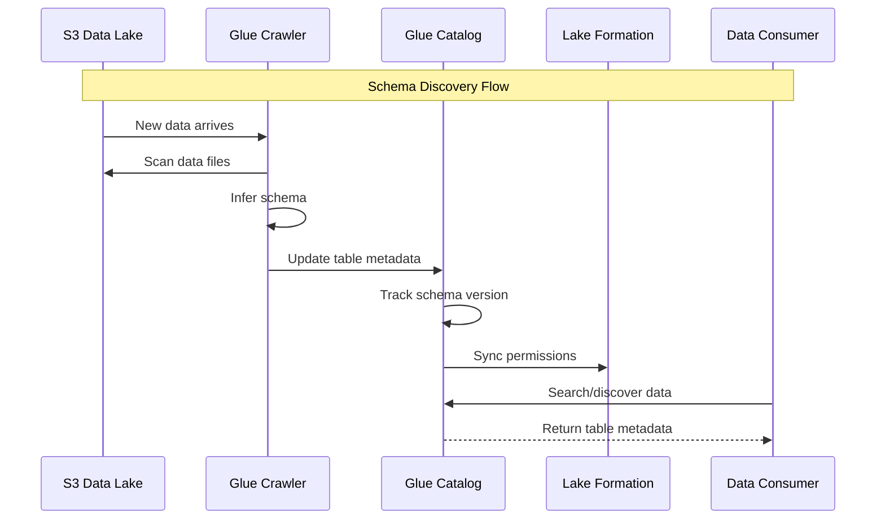
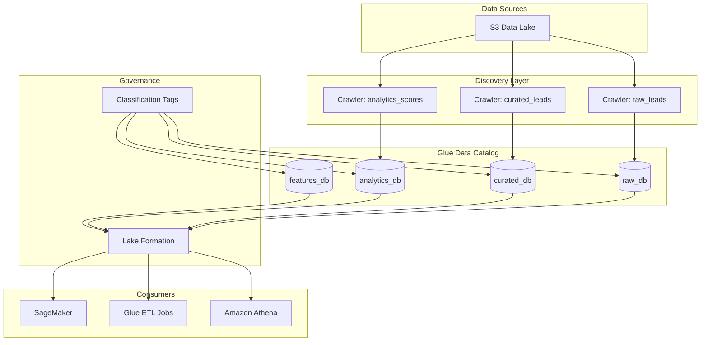

# 02 - Glue Data Catalog and Schema Management

## 📝 Description

As a **Data Engineer**, I want to set up AWS Glue Data Catalog with schema discovery and versioning so that all data assets are discoverable, documented, and maintain consistent schemas across the platform.

## 🎯 Acceptance Criteria

### 1. Database Structure
- Glue databases created for each zone:
  - `raw_db` for Bronze zone tables
  - `curated_db` for Silver zone tables
  - `analytics_db` for Gold zone tables
  - `features_db` for ML feature tables
- Database naming convention follows `{env}_{zone}_db` pattern

### 2. Table Registration
- Crawler configured for automatic schema discovery
- Initial tables registered:
  - raw_db: leads, campaigns, outcomes
  - curated_db: leads, campaigns, outcomes (conformed)
  - analytics_db: lead_scores, lead_features, reports
- Schema versioning enabled for tracking changes

### 3. Metadata Management
- Business glossary tags applied to tables
- Data classification tags (PII, Confidential, Internal) configured
- Table descriptions and column comments documented
- Data owner and steward tags assigned

### 4. Search and Discovery
- Tables searchable by name, tags, and description
- Column-level search enabled
- Integration with Lake Formation for access control metadata

## 🔒 Technical Constraints

- Glue Catalog must be encrypted with KMS
- Crawler schedules must not conflict with ETL jobs
- Schema evolution must be backward compatible
- All catalog changes logged for audit

## 📦 Dependencies

- S3 Data Lake Foundation (Story 01)
- Lake Formation configured
- IAM roles for Glue service
- KMS keys for catalog encryption

## ✅ Tasks

### Infrastructure (Terraform)
- ⬜ Create Glue databases per zone
- ⬜ Configure Glue crawlers for each data source
- ⬜ Set up crawler schedules (off-peak hours)
- ⬜ Enable Glue Data Catalog encryption

### Schema Management
- ⬜ Define initial table schemas for leads data
- ⬜ Define initial table schemas for campaign data
- ⬜ Define initial table schemas for outcome data
- ⬜ Configure schema versioning

### Metadata Enrichment
- ⬜ Create tag taxonomy (classification, ownership, sensitivity)
- ⬜ Apply tags to existing tables
- ⬜ Document column-level business definitions
- ⬜ Set up data steward assignments

### Validation
- ⬜ Verify crawler discovers new data correctly
- ⬜ Test schema evolution with sample data changes
- ⬜ Validate tag-based search functionality
- ⬜ Confirm audit logging for catalog changes

## 📊 Success Metrics

| Metric | Target |
|--------|--------|
| Table registration | 100% of data assets cataloged |
| Metadata completeness | All tables have descriptions and owners |
| Schema accuracy | Crawler discovers schema correctly on first run |
| Discovery time | Users find relevant data in <30 seconds |

## 🔗 Related Documents

- [Architecture Overview](../../../architecture/overview.md)
- [Data Platform Strategy - Data Catalog](../../../architecture/data-platform-strategy.md#36-data-lineage-catalog--observability)
- [Security & Governance](../../../architecture/security-governance.md)

## 📚 Relevant Context

### Strategic Alignment
This story implements the "Governed, discoverable, and high-quality data accessible across the organization" vision from [Data Platform Strategy §1.2](../../../architecture/data-platform-strategy.md). The Glue Catalog serves as the central metadata repository enabling data discovery and schema management.

### Architecture Context
- **Catalog Integration**: Glue Catalog integrated with Lake Formation for access control metadata per [Architecture Overview §3.4](../../../architecture/overview.md)
- **Schema Management**: Schema versioning and evolution support per [Data Platform Strategy §3.6](../../../architecture/data-platform-strategy.md)
- **Data Lineage**: Column-level lineage tracking via Glue per [Data Platform Strategy §3.6](../../../architecture/data-platform-strategy.md)

### Timeline & Milestones
- Part of **Phase 1** "Data Platform Foundation Setup" (Weeks 2-4) per [Value Delivery Roadmap §3.1](../../../architecture/value-delivery-roadmap.md)
- Target milestone: **M2: Platform Foundation** (Week 4) - Data catalog operational
- Supports future self-service: Phase 2 delivers "Curated Data Mart" for analyst access (Week 24)

### Key Risks & Constraints
- **A17**: Assumes data quality is sufficient - catalog metadata enables quality tracking per dataset ([Risk Register](../../../architecture/risk-constraint-register.md))
- **C04**: All infrastructure must be defined as Terraform code
- Crawler schedules must not conflict with ETL jobs (operational constraint)
- Schema evolution must be backward compatible

### Database Structure
Per [Data Platform Strategy §3.2](../../../architecture/data-platform-strategy.md):
| Database | Zone | Initial Tables |
|----------|------|----------------|
| raw_db | Bronze | leads, campaigns, outcomes |
| curated_db | Silver | leads, campaigns, outcomes (conformed) |
| analytics_db | Gold | lead_scores, lead_features, reports |
| features_db | Features | lead_features, model_features |

### Metadata & Governance Tags
Per [Security & Governance §5.3](../../../architecture/security-governance.md):
- **Data Classification**: PII, Confidential, Internal, Public
- **Ownership**: Data Steward, Technical Owner, Business Owner
- **Sensitivity**: Tags for Lake Formation column-level security

### Technology Stack
Per [Tech Stack](../../../project-context/tech-stack.md):
- **AWS Glue Data Catalog** for schema discovery and versioning
- **AWS Glue Crawlers** for automatic schema detection
- **AWS Lake Formation** for access control metadata integration
- **AWS KMS** for catalog encryption
- **Terraform** for infrastructure as code

---

## Implementation Plan

### 1. Feature Overview

**Goal:** Establish AWS Glue Data Catalog with schema discovery and versioning to ensure all data assets are discoverable, documented, and maintain consistent schemas across the platform.

**Primary User Role:** Data Engineer

**Business Value:** Enables data discovery, schema management, and metadata governance - foundational for analytics self-service and AI model development. Supports the "governed, discoverable, and high-quality data accessible across the organization" vision.

### 2. Component Analysis & Reuse Strategy

#### Existing Components
| Component | Location | Reuse Decision |
|-----------|----------|----------------|
| S3 Data Lake | Data Platform Story 01 | **REUSE** - Catalog points to S3 locations |
| KMS Keys | Security Story 02 | **REUSE** - Catalog encryption |
| Lake Formation | Data Governance Story 01 | **INTEGRATE** - Access control integration |

#### New Components Required
| Component | Purpose | Priority |
|-----------|---------|----------|
| Glue Database Module | Terraform module for database creation | High |
| Glue Crawler Module | Reusable crawler configuration | High |
| Catalog Encryption Config | KMS encryption for catalog | High |
| Tag Taxonomy | Classification and ownership tags | Medium |

#### Gaps Identified
- No existing Glue database/crawler Terraform modules
- Tag taxonomy needs business alignment

### 3. Affected Files

#### Infrastructure (Terraform)
| File Path | Action | Description |
|-----------|--------|-------------|
| `infra/modules/glue-catalog/main.tf` | [CREATE] | Glue database and catalog module |
| `infra/modules/glue-catalog/variables.tf` | [CREATE] | Module input variables |
| `infra/modules/glue-catalog/outputs.tf` | [CREATE] | Module outputs |
| `infra/modules/glue-catalog/crawlers.tf` | [CREATE] | Crawler configurations |
| `infra/modules/glue-catalog/encryption.tf` | [CREATE] | Catalog encryption settings |
| `infra/components/data-platform/glue-catalog.tf` | [CREATE] | Catalog component |
| `infra/environments/dev/glue-catalog.tfvars` | [CREATE] | Dev environment config |
| `infra/environments/prod/glue-catalog.tfvars` | [CREATE] | Prod environment config |

#### Schema Definitions
| File Path | Action | Description |
|-----------|--------|-------------|
| `infra/schemas/leads/lead_raw.json` | [CREATE] | Raw leads schema |
| `infra/schemas/leads/lead_curated.json` | [CREATE] | Curated leads schema |
| `infra/schemas/campaigns/campaign_raw.json` | [CREATE] | Raw campaigns schema |
| `infra/schemas/outcomes/outcome_raw.json` | [CREATE] | Raw outcomes schema |

#### Documentation
| File Path | Action | Description |
|-----------|--------|-------------|
| `infra/modules/glue-catalog/README.md` | [CREATE] | Module documentation |
| `docs/data-catalog/schema-registry.md` | [CREATE] | Schema documentation |
| `docs/data-catalog/tag-taxonomy.md` | [CREATE] | Tag classification guide |

#### Tests
| File Path | Action | Description |
|-----------|--------|-------------|
| `infra/tests/glue-catalog/terratest_test.go` | [CREATE] | Infrastructure tests |
| `infra/tests/glue-catalog/crawler_test.py` | [CREATE] | Crawler validation tests |

### 4. Component Breakdown

#### 4.1 Glue Database Structure

| Database | Zone | Description | Initial Tables |
|----------|------|-------------|----------------|
| `{env}_raw_db` | Bronze | Raw ingested data | leads, campaigns, outcomes |
| `{env}_curated_db` | Silver | Cleansed, conformed data | leads, campaigns, outcomes |
| `{env}_analytics_db` | Gold | Business-ready analytics | lead_scores, reports |
| `{env}_features_db` | Features | ML feature tables | lead_features, model_features |

#### 4.2 Crawler Configuration

```hcl
# Example crawler configuration
module "glue_crawlers" {
  source = "./modules/glue-catalog"
  
  environment = "prod"
  
  crawlers = {
    raw_leads = {
      database_name = "prod_raw_db"
      s3_target     = "s3://prod-data-lake/raw/leads/"
      schedule      = "cron(0 2 * * ? *)"  # 2 AM daily
      table_prefix  = ""
    }
    curated_leads = {
      database_name = "prod_curated_db"
      s3_target     = "s3://prod-data-lake/curated/leads/"
      schedule      = "cron(0 4 * * ? *)"  # 4 AM daily
      table_prefix  = ""
    }
  }
  
  crawler_role_arn = aws_iam_role.glue_crawler.arn
}
```

#### 4.3 Tag Taxonomy

| Tag Key | Description | Example Values |
|---------|-------------|----------------|
| `data_classification` | Security classification | PII, Confidential, Internal, Public |
| `data_owner` | Business owner | "Sales Analytics Team" |
| `data_steward` | Technical steward | "Data Platform Team" |
| `sensitivity` | Sensitivity level | High, Medium, Low |
| `pii_columns` | Columns containing PII | "contact_email,contact_phone" |
| `update_frequency` | Data refresh frequency | Daily, Hourly, Real-time |

### 5. Data Flow & Pipeline Architecture

#### Schema Discovery Flow



#### Initial Schema: Leads Table

```json
{
  "tableName": "leads",
  "columns": [
    {"name": "lead_id", "type": "string", "comment": "Unique lead identifier (PK)", "pii": false},
    {"name": "lead_source", "type": "string", "comment": "Source system of lead", "pii": false},
    {"name": "lead_channel", "type": "string", "comment": "Acquisition channel", "pii": false},
    {"name": "acquisition_date", "type": "timestamp", "comment": "Date lead was acquired", "pii": false},
    {"name": "contact_email", "type": "string", "comment": "Lead email address", "pii": true},
    {"name": "contact_phone", "type": "string", "comment": "Lead phone number", "pii": true},
    {"name": "engagement_score", "type": "decimal(10,4)", "comment": "Engagement score (0-100)", "pii": false},
    {"name": "lead_status", "type": "string", "comment": "Current lead status", "pii": false},
    {"name": "last_updated", "type": "timestamp", "comment": "Last modification timestamp", "pii": false}
  ],
  "partitionKeys": [
    {"name": "dt", "type": "string", "comment": "Partition date (YYYY-MM-DD)"}
  ]
}
```

### 6. Integration Diagram



### 7. Security Considerations

| Security Control | Implementation |
|-----------------|----------------|
| Catalog Encryption | AWS KMS with Customer Managed Key |
| Access Control | Lake Formation fine-grained permissions |
| Schema Changes | Audit logging via CloudTrail |
| PII Protection | Column-level tags for sensitive data |
| Crawler Security | IAM role with least privilege |

### 8. Testing Strategy

#### Infrastructure Tests
| Test Type | Test Description | Tool |
|-----------|------------------|------|
| Unit Test | Database creation validation | Terraform validate |
| Unit Test | Crawler configuration validation | Terraform validate |
| Integration Test | Crawler discovers schema correctly | Python pytest |
| Integration Test | Schema evolution handling | Python pytest |
| Compliance Test | Encryption enabled | AWS Config Rules |

#### Validation Checklist
- [ ] Verify crawler discovers new data correctly
- [ ] Test schema evolution with sample data changes
- [ ] Validate tag-based search functionality
- [ ] Confirm audit logging for catalog changes
- [ ] Test Lake Formation permission sync

### 9. Accessibility (A11y) Considerations

Not applicable for infrastructure components.

### 10. Implementation Steps

#### Phase 1: Infrastructure & Schema Setup (Week 2-3)
- [ ] **Step 1.1:** Create Glue Catalog Terraform module
- [ ] **Step 1.2:** Configure catalog encryption with KMS
- [ ] **Step 1.3:** Create databases per zone (raw_db, curated_db, analytics_db, features_db)
- [ ] **Step 1.4:** Apply Terraform for dev environment
- [ ] **Step 1.5:** Define initial table schemas for leads, campaigns, outcomes

#### Phase 2: Crawler Configuration (Week 3)
- [ ] **Step 2.1:** Create Glue crawlers for each data source
- [ ] **Step 2.2:** Configure crawler schedules (off-peak hours: 2-4 AM)
- [ ] **Step 2.3:** Test crawler with sample data
- [ ] **Step 2.4:** Validate schema discovery accuracy
- [ ] **Step 2.5:** Configure schema versioning

#### Phase 3: Metadata Enrichment (Week 3-4)
- [ ] **Step 3.1:** Create tag taxonomy documentation
- [ ] **Step 3.2:** Apply classification tags to tables (PII, Confidential, etc.)
- [ ] **Step 3.3:** Document column-level business definitions
- [ ] **Step 3.4:** Set up data steward assignments
- [ ] **Step 3.5:** Integrate with Lake Formation for access control

#### Phase 4: Validation & Documentation (Week 4)
- [ ] **Step 4.1:** Run infrastructure tests
- [ ] **Step 4.2:** Test schema evolution handling
- [ ] **Step 4.3:** Validate tag-based search functionality
- [ ] **Step 4.4:** Confirm audit logging captures all changes
- [ ] **Step 4.5:** Create user documentation
- [ ] **Step 4.6:** Promote to UAT/Prod environments

### 11. Monitoring & Alerting

| Metric | Threshold | Alert Action |
|--------|-----------|--------------|
| Crawler failure | Any | P2 Alert to Data Engineering |
| Schema change detected | Any | Notify Data Stewards |
| Catalog access denied | >10/hour | Security Review |
| Missing metadata | Any table without owner | Weekly Report |

### 12. Rollback Plan

1. **Schema Versioning:** Glue maintains schema history; rollback to previous version if needed
2. **Crawler Disable:** Disable crawlers if causing issues
3. **Tag Removal:** Tags can be removed without affecting data
4. **Database Recreation:** Databases can be recreated from S3 data

### 13. Dependencies & Prerequisites

| Dependency | Source | Status |
|------------|--------|--------|
| S3 Data Lake Foundation | Data Platform Story 01 | Required |
| Lake Formation configured | Data Governance Story 01 | Required |
| IAM roles for Glue service | Shared infrastructure | Required |
| KMS keys for catalog encryption | Security Story 02 | Required |
