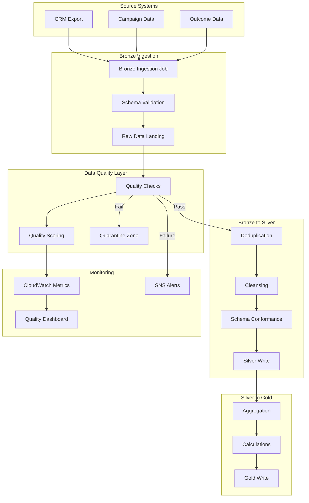
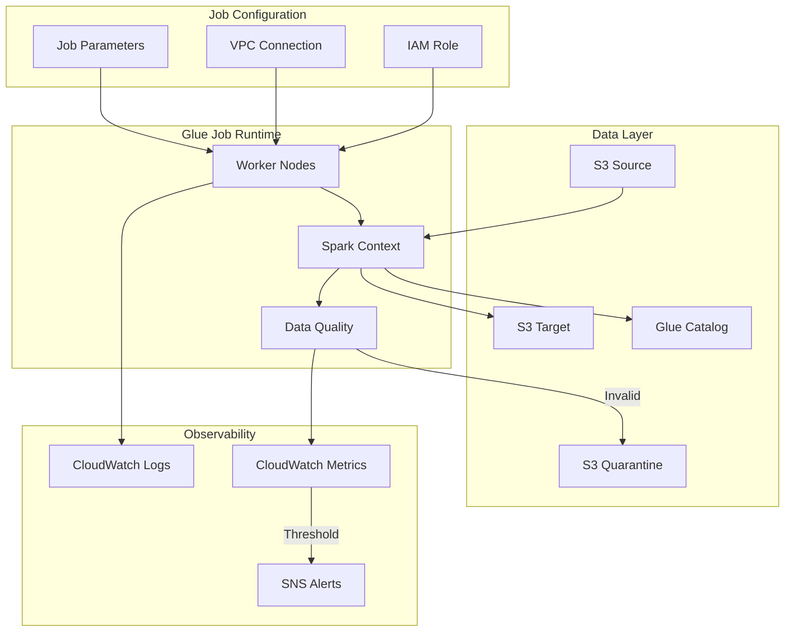

# 03 - ETL Pipeline Framework with AWS Glue

## 📝 Description

As a **Data Engineer**, I want to establish a standardized ETL pipeline framework using AWS Glue so that data can be reliably ingested, transformed, and loaded across Bronze, Silver, and Gold zones with built-in data quality checks.

## 🎯 Acceptance Criteria

### 1. Glue Job Templates
- Reusable job templates created for:
  - Bronze ingestion (raw data landing)
  - Bronze to Silver transformation (cleansing, deduplication)
  - Silver to Gold aggregation (business metrics, features)
- Templates support both PySpark and Python shell jobs
- Job bookmarks enabled for incremental processing

### 2. Data Quality Integration
- AWS Glue Data Quality rules integrated into pipelines
- Quality checks include:
  - Completeness (null/missing value detection)
  - Uniqueness (duplicate detection on key fields)
  - Validity (schema conformance, data type validation)
  - Accuracy (business rule validation)
- Quarantine zone for failed records
- Quality scores tracked per dataset

### 3. Job Configuration
- Standardized job parameters:
  - Worker type: G.1X/G.2X based on data volume
  - Auto-scaling workers: 2-10 based on data
  - Job timeout: 2-4 hours with alerts
  - Retry attempts: 3 with exponential backoff
- Job bookmarks for incremental processing
- Metrics pushed to CloudWatch

### 4. Error Handling
- Structured error logging to CloudWatch
- Failed record routing to quarantine bucket
- Alerting on job failures via SNS
- Retry logic with dead-letter handling

## 🔒 Technical Constraints

- Jobs must run in VPC with private subnets
- No public internet access from Glue jobs
- All credentials accessed via Secrets Manager
- Job code stored in version-controlled S3 location

## 📦 Dependencies

- S3 Data Lake Foundation (Story 01)
- Glue Data Catalog (Story 02)
- VPC endpoints for Glue, S3, CloudWatch
- IAM execution role for Glue jobs

## ✅ Tasks

### Pipeline Templates
- ⬜ Create Bronze ingestion job template (batch extract)
- ⬜ Create Bronze-to-Silver transformation template
- ⬜ Create Silver-to-Gold aggregation template
- ⬜ Implement common utility functions library

### Data Quality
- ⬜ Define data quality ruleset for leads data
- ⬜ Define data quality ruleset for campaigns data
- ⬜ Create quarantine zone and routing logic
- ⬜ Set up quality score tracking

### Infrastructure (Terraform)
- ⬜ Create Glue job IAM role with least privilege
- ⬜ Configure Glue connection for VPC
- ⬜ Set up CloudWatch log groups for jobs
- ⬜ Create SNS topics for job alerts

### Validation
- ⬜ Test Bronze ingestion with sample data
- ⬜ Verify data quality checks catch bad records
- ⬜ Validate incremental processing with bookmarks
- ⬜ Confirm alerting on job failures

## 📊 Success Metrics

| Metric | Target |
|--------|--------|
| Pipeline success rate | >99% daily job completion |
| Data quality pass rate | >95% records passing quality checks |
| Processing time | Daily batch completes within 2 hours |
| Incremental efficiency | Only new/changed records processed |

## 🔗 Related Documents

- [Data Flows Architecture](../../../architecture/data-flows.md)
- [Data Platform Strategy - Processing](../../../architecture/data-platform-strategy.md#33-batch-vs-streaming-strategy)
- [Operations Guide](../../../../infra/docs/architecture/operations.md)

## 📚 Relevant Context

### Strategic Alignment
This story implements the "Batch-First with Streaming Readiness" processing strategy per [Data Platform Strategy §3.3](../../../architecture/data-platform-strategy.md). The ETL framework establishes reusable patterns that will support all AI products from Lead Scoring through RM Co-Pilot.

### Architecture Context
- **Processing Engine**: AWS Glue for standard ETL, EMR for heavy processing per [Architecture Overview §3.2](../../../architecture/overview.md)
- **Data Flow**: Implements transformation stages defined in [Data Flows §4](../../../architecture/data-flows.md): Landing → Quality → Curation → Enrichment → Features
- **Quality Integration**: AWS Glue Data Quality for automated checks per [Data Platform Strategy §3.5](../../../architecture/data-platform-strategy.md)

### Timeline & Milestones
- Part of **Phase 1** "Data Platform Foundation Setup" (Weeks 2-4) and "Data Prep & Feature Build" (Weeks 3-5) per [Value Delivery Roadmap](../../../architecture/value-delivery-roadmap.md)
- Target: Daily batch processing completes within 2 hours
- Pipeline success rate >99% required for production SLA

### Key Risks & Constraints
- **R06 (Medium)**: Feature engineering complexity - start with proven patterns, leverage SageMaker built-in capabilities ([Risk Register](../../../architecture/risk-constraint-register.md))
- **C03**: Production systems require VPC isolation - Glue jobs must run in private subnets
- **C04**: All infrastructure defined as Terraform code
- Jobs must run in VPC with private subnets, no public internet access

### Data Quality Framework
Per [Data Platform Strategy §3.5](../../../architecture/data-platform-strategy.md):
| Dimension | Action on Failure |
|-----------|-------------------|
| Completeness (>5% nulls) | Alert + quarantine records |
| Uniqueness (duplicates) | Deduplicate + log |
| Validity (type mismatch) | Reject invalid records |
| Accuracy (rule failure) | Flag for review |

### Job Configuration Standards
Per [Data Flows §4.4](../../../architecture/data-flows.md):
| Parameter | Value | Purpose |
|-----------|-------|---------|
| Worker Type | G.1X/G.2X | Based on data volume |
| Auto-scaling | 2-10 workers | Scale with data |
| Job Timeout | 2-4 hours | Prevent runaway jobs |
| Job Bookmark | Enabled | Incremental processing |
| Retry Attempts | 3 | Handle transient failures |

### Technology Stack
Per [Tech Stack](../../../project-context/tech-stack.md):
- **AWS Glue** for batch ETL extraction and transformation
- **AWS Glue Data Quality** for integrated quality checks
- **Amazon S3** for quarantine zone (failed records)
- **Amazon CloudWatch** for job metrics and alerting
- **Amazon SNS** for failure notifications
- **Terraform** for infrastructure as code

---

## Implementation Plan

### 1. Feature Overview

**Goal:** Establish a standardized ETL pipeline framework using AWS Glue for reliable data ingestion, transformation, and loading across Bronze, Silver, and Gold zones with built-in data quality checks.

**Primary User Role:** Data Engineer

**Business Value:** Enables automated, reliable data processing pipelines with >99% success rate and built-in quality controls. This framework supports all downstream AI/ML workloads and establishes reusable patterns for future use cases.

### 2. Component Analysis & Reuse Strategy

#### Existing Components
| Component | Location | Reuse Decision |
|-----------|----------|----------------|
| S3 Data Lake | Data Platform Story 01 | **REUSE** - Source and target storage |
| Glue Data Catalog | Data Platform Story 02 | **REUSE** - Schema and metadata |
| VPC Infrastructure | Security Story 01 | **REUSE** - Glue jobs run in VPC |
| KMS Keys | Security Story 02 | **REUSE** - Data encryption |

#### New Components Required
| Component | Purpose | Priority |
|-----------|---------|----------|
| Glue Job Templates | Reusable PySpark/Python templates | High |
| Data Quality Rulesets | AWS Glue DQ configurations | High |
| Utility Functions Library | Common ETL operations | High |
| Quarantine Zone Config | Failed record handling | Medium |
| Job Alert Configuration | SNS notification setup | Medium |

#### Gaps Identified
- No existing Glue job templates or utility library
- Data quality rules need business definition
- Quarantine zone routing logic not yet defined

### 3. Affected Files

#### Infrastructure (Terraform)
| File Path | Action | Description |
|-----------|--------|-------------|
| `infra/modules/glue-job/main.tf` | [CREATE] | Glue job module |
| `infra/modules/glue-job/variables.tf` | [CREATE] | Job configuration variables |
| `infra/modules/glue-job/outputs.tf` | [CREATE] | Module outputs |
| `infra/modules/glue-job/iam.tf` | [CREATE] | IAM role with least privilege |
| `infra/components/data-platform/glue-jobs.tf` | [CREATE] | ETL jobs component |
| `infra/components/data-platform/glue-connections.tf` | [CREATE] | VPC connections |

#### ETL Code
| File Path | Action | Description |
|-----------|--------|-------------|
| `src/etl/templates/bronze_ingestion.py` | [CREATE] | Bronze zone ingestion template |
| `src/etl/templates/bronze_to_silver.py` | [CREATE] | B2S transformation template |
| `src/etl/templates/silver_to_gold.py` | [CREATE] | S2G aggregation template |
| `src/etl/utils/common.py` | [CREATE] | Common utility functions |
| `src/etl/utils/quality.py` | [CREATE] | Data quality utilities |
| `src/etl/utils/logging.py` | [CREATE] | Structured logging utilities |

#### Data Quality
| File Path | Action | Description |
|-----------|--------|-------------|
| `src/etl/quality/leads_rules.json` | [CREATE] | Leads data quality rules |
| `src/etl/quality/campaigns_rules.json` | [CREATE] | Campaigns quality rules |
| `src/etl/quality/outcomes_rules.json` | [CREATE] | Outcomes quality rules |

#### Tests
| File Path | Action | Description |
|-----------|--------|-------------|
| `tests/etl/test_bronze_ingestion.py` | [CREATE] | Bronze ingestion tests |
| `tests/etl/test_bronze_to_silver.py` | [CREATE] | B2S transformation tests |
| `tests/etl/test_quality_utils.py` | [CREATE] | Quality function tests |
| `tests/etl/test_common_utils.py` | [CREATE] | Common utility tests |

#### Documentation
| File Path | Action | Description |
|-----------|--------|-------------|
| `docs/etl/pipeline-guide.md` | [CREATE] | ETL development guide |
| `docs/etl/quality-rules.md` | [CREATE] | Data quality documentation |

### 4. Component Breakdown

#### 4.1 Bronze Ingestion Template

```python
# src/etl/templates/bronze_ingestion.py
"""
Bronze Zone Ingestion Template
Handles raw data landing with minimal transformation and quality validation.
"""

import sys
from awsglue.transforms import *
from awsglue.utils import getResolvedOptions
from awsglue.context import GlueContext
from awsglue.job import Job
from awsglue.dynamicframe import DynamicFrame
from pyspark.context import SparkContext
from etl.utils.common import get_partition_path, write_parquet
from etl.utils.quality import validate_schema, check_completeness
from etl.utils.logging import setup_logger, log_metrics

# Job parameters
args = getResolvedOptions(sys.argv, [
    'JOB_NAME', 'source_path', 'target_path', 
    'database_name', 'table_name', 'partition_date'
])

sc = SparkContext()
glueContext = GlueContext(sc)
spark = glueContext.spark_session
job = Job(glueContext)
job.init(args['JOB_NAME'], args)
logger = setup_logger(args['JOB_NAME'])

try:
    # Read source data
    logger.info(f"Reading from: {args['source_path']}")
    source_df = spark.read.format("csv").option("header", "true").load(args['source_path'])
    
    # Schema validation
    schema_valid, schema_errors = validate_schema(source_df, args['table_name'])
    if not schema_valid:
        logger.error(f"Schema validation failed: {schema_errors}")
        raise ValueError(f"Schema validation failed: {schema_errors}")
    
    # Completeness check
    completeness_score = check_completeness(source_df, required_columns=['lead_id'])
    logger.info(f"Completeness score: {completeness_score}")
    
    # Convert to Parquet and write to Bronze zone
    partition_path = get_partition_path(args['target_path'], args['partition_date'])
    write_parquet(source_df, partition_path)
    
    # Log metrics
    log_metrics(job_name=args['JOB_NAME'], records_processed=source_df.count(), 
                completeness_score=completeness_score, status='SUCCESS')
    
    job.commit()
    
except Exception as e:
    logger.error(f"Job failed: {str(e)}")
    log_metrics(job_name=args['JOB_NAME'], status='FAILED', error=str(e))
    raise
```

#### 4.2 Bronze to Silver Transformation Template

```python
# src/etl/templates/bronze_to_silver.py
"""
Bronze to Silver Transformation Template
Cleanses, deduplicates, and conforms data to standard schema.
"""

# Key transformations:
# 1. Deduplication based on primary key
# 2. Null handling (required vs optional fields)
# 3. Data type casting
# 4. Date normalization to ISO 8601
# 5. Schema conformance
# 6. Quality scoring

def transform_bronze_to_silver(source_df, config):
    """
    Main transformation function.
    
    Args:
        source_df: Input DataFrame from Bronze zone
        config: Transformation configuration dict
    
    Returns:
        Tuple of (transformed_df, quarantine_df, quality_metrics)
    """
    # Deduplication
    deduped_df = deduplicate(source_df, config['primary_key'], config['dedup_strategy'])
    
    # Null handling
    cleaned_df = handle_nulls(deduped_df, config['null_rules'])
    
    # Type casting
    typed_df = cast_types(cleaned_df, config['schema'])
    
    # Date normalization
    normalized_df = normalize_dates(typed_df, config['date_columns'])
    
    # Schema conformance
    conformed_df, invalid_df = conform_schema(normalized_df, config['target_schema'])
    
    # Quality scoring
    quality_metrics = compute_quality_score(conformed_df, config['quality_rules'])
    
    return conformed_df, invalid_df, quality_metrics
```

#### 4.3 Data Quality Rules Configuration

```json
{
  "ruleset_name": "leads_quality_rules",
  "rules": [
    {
      "name": "lead_id_completeness",
      "type": "Completeness",
      "column": "lead_id",
      "threshold": 1.0,
      "severity": "CRITICAL",
      "action": "REJECT"
    },
    {
      "name": "lead_id_uniqueness",
      "type": "Uniqueness",
      "column": "lead_id",
      "threshold": 1.0,
      "severity": "CRITICAL",
      "action": "DEDUPLICATE"
    },
    {
      "name": "lead_source_validity",
      "type": "ColumnValues",
      "column": "lead_source",
      "expected_values": ["CRM", "CAMPAIGN", "PARTNER", "DIRECT", "REFERRAL"],
      "severity": "HIGH",
      "action": "FLAG"
    },
    {
      "name": "engagement_score_range",
      "type": "ValueRange",
      "column": "engagement_score",
      "min_value": 0,
      "max_value": 100,
      "severity": "MEDIUM",
      "action": "FLAG"
    },
    {
      "name": "acquisition_date_format",
      "type": "DateFormat",
      "column": "acquisition_date",
      "format": "yyyy-MM-dd",
      "severity": "HIGH",
      "action": "REJECT"
    }
  ]
}
```

### 5. Data Flow & Pipeline Architecture

#### ETL Pipeline Flow



### 6. Integration Diagram



### 7. Security Considerations

| Security Control | Implementation |
|-----------------|----------------|
| VPC Isolation | Jobs run in private subnets via VPC connection |
| Network Security | No public internet access from Glue jobs |
| Credential Management | All credentials via Secrets Manager |
| Encryption | SSE-KMS for all S3 data |
| Access Control | IAM role with least privilege |
| Audit Logging | CloudTrail captures all Glue API calls |

### 8. Testing Strategy

#### Unit Tests
| Test | Description | Location |
|------|-------------|----------|
| Schema validation | Test schema validation logic | `tests/etl/test_quality_utils.py` |
| Deduplication | Test dedup logic with various scenarios | `tests/etl/test_bronze_to_silver.py` |
| Null handling | Test null handling rules | `tests/etl/test_bronze_to_silver.py` |
| Type casting | Test type conversion | `tests/etl/test_common_utils.py` |

#### Integration Tests
| Test | Description | Tool |
|------|-------------|------|
| End-to-end Bronze | Full Bronze ingestion test | pytest + moto |
| End-to-end B2S | Full transformation test | pytest + moto |
| Quality rules | DQ rules integration | Glue DQ test job |

#### Data Quality Tests
- [ ] Completeness: >95% non-null required fields
- [ ] Uniqueness: 100% unique primary keys after dedup
- [ ] Validity: 100% records conform to schema
- [ ] Accuracy: Business rules validated per table

### 9. Accessibility (A11y) Considerations

Not applicable for backend ETL components.

### 10. Implementation Steps

#### Phase 1: Infrastructure & Templates (Week 2-3)
- [ ] **Step 1.1:** Create Glue job Terraform module
- [ ] **Step 1.2:** Configure Glue VPC connection
- [ ] **Step 1.3:** Create IAM execution role with least privilege
- [ ] **Step 1.4:** Set up CloudWatch log groups
- [ ] **Step 1.5:** Create SNS topics for job alerts
- [ ] **Step 1.6:** Deploy infrastructure to dev environment

#### Phase 2: ETL Code Development (Week 3-4)
- [ ] **Step 2.1:** Create Bronze ingestion job template
- [ ] **Step 2.2:** Create Bronze-to-Silver transformation template
- [ ] **Step 2.3:** Create Silver-to-Gold aggregation template
- [ ] **Step 2.4:** Implement common utility functions library
- [ ] **Step 2.5:** Write unit tests for all templates

#### Phase 3: Data Quality Integration (Week 4)
- [ ] **Step 3.1:** Define data quality ruleset for leads data
- [ ] **Step 3.2:** Define data quality ruleset for campaigns data
- [ ] **Step 3.3:** Create quarantine zone and routing logic
- [ ] **Step 3.4:** Set up quality score tracking
- [ ] **Step 3.5:** Configure quality metrics export to CloudWatch

#### Phase 4: Validation & Deployment (Week 4-5)
- [ ] **Step 4.1:** Test Bronze ingestion with sample data
- [ ] **Step 4.2:** Verify data quality checks catch bad records
- [ ] **Step 4.3:** Validate incremental processing with bookmarks
- [ ] **Step 4.4:** Confirm alerting on job failures
- [ ] **Step 4.5:** Performance test with realistic data volumes
- [ ] **Step 4.6:** Deploy to UAT environment
- [ ] **Step 4.7:** Promote to production after validation

### 11. Job Configuration Standards

| Parameter | Value | Purpose |
|-----------|-------|---------|
| Worker Type | G.1X (standard), G.2X (large) | Based on data volume |
| Number of Workers | 2-10 (auto-scaling) | Scale with data |
| Job Timeout | 2-4 hours | Prevent runaway jobs |
| Job Bookmark | Enabled | Incremental processing |
| Retry Attempts | 3 | Handle transient failures |
| Max Concurrent Runs | 1 | Prevent duplicate runs |

### 12. Monitoring & Alerting

| Metric | Threshold | Alert Action |
|--------|-----------|--------------|
| Job failure | Any | P2 Alert via SNS |
| Job duration > SLA | >2 hours | P3 Alert |
| Quality score < threshold | <95% | P2 Alert |
| Quarantine records > threshold | >5% of batch | P2 Alert |
| Worker utilization | <20% or >90% | Capacity review |

### 13. Rollback Plan

1. **Job Versioning:** Keep previous job script versions in S3
2. **Job Bookmark Reset:** Reset bookmark to reprocess data
3. **Data Recovery:** Bronze zone preserves raw data for reprocessing
4. **Quick Disable:** Jobs can be disabled without affecting data

### 14. Dependencies & Prerequisites

| Dependency | Source | Status |
|------------|--------|--------|
| S3 Data Lake Foundation | Data Platform Story 01 | Required |
| Glue Data Catalog | Data Platform Story 02 | Required |
| VPC with private subnets | Security Story 01 | Required |
| VPC endpoints for Glue, S3, CloudWatch | Security Story 01 | Required |
| KMS keys | Security Story 02 | Required |
| IAM execution role | Shared infrastructure | Required |
