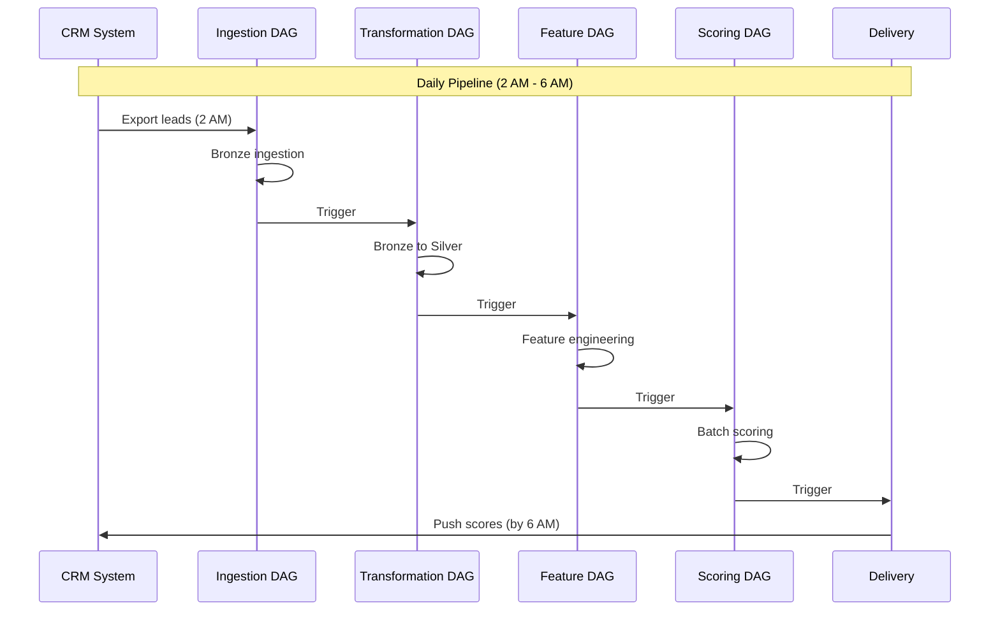
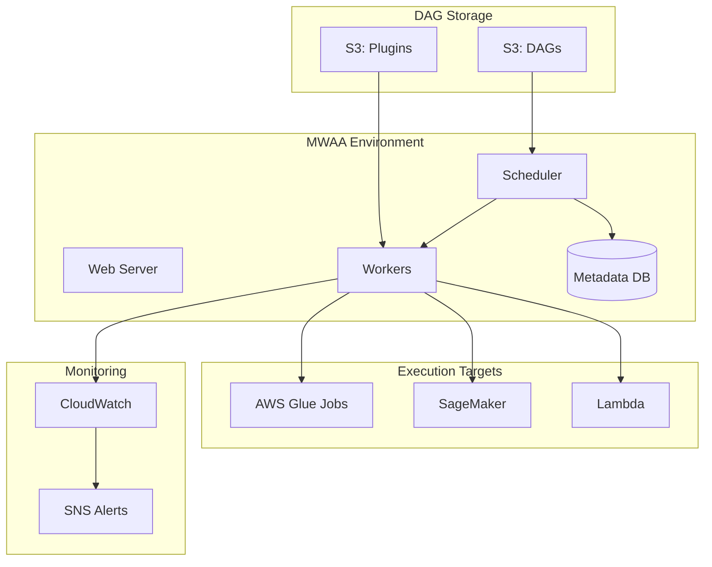

# 04 - Workflow Orchestration with Amazon MWAA

## 📝 Description

As a **Data Engineer**, I want to set up Amazon MWAA (Managed Airflow) for workflow orchestration so that data pipelines and ML workflows can be scheduled, monitored, and managed with dependencies in a unified interface.

## 🎯 Acceptance Criteria

### 1. MWAA Environment
- MWAA environment provisioned in private VPC
- Environment class sized appropriately (mw1.small for dev, mw1.medium for prod)
- Airflow version 2.x configured
- Web server accessible via VPN/private access

### 2. DAG Structure
- Standard DAG templates created for:
  - Daily lead data ingestion pipeline
  - Bronze-to-Silver transformation workflow
  - Feature engineering pipeline
  - ML scoring pipeline
- DAGs organized by domain (data, ml, integration)
- Common utility operators for Glue, SageMaker, S3

### 3. Scheduling & Dependencies
- Cron-based scheduling for daily batch jobs
- Cross-DAG dependencies via sensors
- SLA monitoring configured
- Backfill capability for historical reruns

### 4. Monitoring & Alerting
- Airflow metrics exported to CloudWatch
- Task failure alerts via SNS/email
- DAG run history retained for 30 days
- Custom dashboard for pipeline health

## 🔒 Technical Constraints

- MWAA must run in private subnets
- No public endpoint for web server
- IAM roles for Airflow execution with least privilege
- DAG code version-controlled in Git, synced to S3

## 📦 Dependencies

- VPC with private subnets and NAT gateway
- S3 bucket for DAG storage
- Glue jobs created (Story 03)
- IAM roles for Airflow execution

## ✅ Tasks

### Infrastructure (Terraform)
- ⬜ Create MWAA environment with VPC configuration
- ⬜ Configure S3 bucket for DAGs and plugins
- ⬜ Set up IAM execution role for Airflow
- ⬜ Configure security groups for MWAA

### DAG Development
- ⬜ Create lead ingestion DAG
- ⬜ Create transformation pipeline DAG
- ⬜ Create feature engineering DAG
- ⬜ Create ML scoring DAG
- ⬜ Implement common operators module

### Monitoring
- ⬜ Configure CloudWatch metrics export
- ⬜ Set up SNS alerts for task failures
- ⬜ Create Airflow health dashboard
- ⬜ Define SLA for critical pipelines

### Validation
- ⬜ Test DAG execution end-to-end
- ⬜ Verify cross-DAG dependencies work
- ⬜ Test backfill for historical dates
- ⬜ Confirm alerting on failures

## 📊 Success Metrics

| Metric | Target |
|--------|--------|
| DAG success rate | >99% scheduled runs complete |
| SLA adherence | >95% jobs complete within SLA |
| Pipeline visibility | All runs visible in Airflow UI |
| Alert response time | Failures notified within 5 minutes |

## 🔗 Related Documents

- [Architecture Overview](../../../architecture/overview.md)
- [Data Platform Strategy - Orchestration](../../../architecture/data-platform-strategy.md)
- [Operations Guide](../../../../infra/docs/architecture/operations.md)

## 📚 Relevant Context

### Strategic Alignment
This story implements the orchestration layer supporting all data and ML workflows per [Data Platform Strategy §4.1](../../../architecture/data-platform-strategy.md). MWAA (Managed Airflow) was selected per Decision 5 for its open-source foundation, managed infrastructure, rich ecosystem, and team familiarity.

### Architecture Context
- **Orchestration Layer**: MWAA manages ETL pipelines, ML workflows, and integration jobs per [Architecture Overview §2.2](../../../architecture/overview.md)
- **Multi-step Workflows**: Coordinates Glue ETL → Feature Engineering → SageMaker Pipelines → Score Delivery per [Data Flows §2.2](../../../architecture/data-flows.md)
- **Integration with ML**: Triggers SageMaker Batch Transform for daily scoring per [Architecture Overview §6.1](../../../architecture/overview.md)

### Timeline & Milestones
- Part of **Phase 1** foundation, supports "Integration & Pilot Launch" (Weeks 8-10) per [Value Delivery Roadmap](../../../architecture/value-delivery-roadmap.md)
- Target: >99% DAG success rate, >95% SLA adherence
- Critical for achieving "Scores available by 6 AM daily" SLA

### Key Risks & Constraints
- **R04 (High)**: Timeline pressure - MWAA setup required early to support pipeline testing ([Risk Register](../../../architecture/risk-constraint-register.md))
- **C03**: Production systems require VPC isolation - MWAA must run in private subnets
- **C04**: All infrastructure defined as Terraform code
- DAG code version-controlled in Git, synced to S3

### Platform Health Metrics
Per [Data Platform Strategy §6.1](../../../architecture/data-platform-strategy.md):
| Metric | Target |
|--------|--------|
| Data pipeline success rate | >99% |
| Data freshness SLA adherence | >95% |
| Mean time to recover (MTTR) | <4 hours |

### Orchestration Decision Rationale
Per [Data Platform Strategy Decision 5](../../../architecture/data-platform-strategy.md):
- **Selected**: Amazon MWAA (Managed Airflow)
- **Pros**: Open-source based, managed infrastructure, rich ecosystem, team familiarity
- **Cons**: Higher cost than Step Functions for simple workflows
- **Reversibility**: Medium - DAG code portable to other Airflow deployments

### Technology Stack
Per [Tech Stack](../../../project-context/tech-stack.md):
- **Amazon MWAA** for multi-step pipeline orchestration
- **AWS Step Functions** as lightweight alternative for deterministic workflows
- **Amazon CloudWatch** for Airflow metrics export
- **Amazon SNS** for task failure alerts
- **Amazon S3** for DAG storage and plugins
- **Terraform** for infrastructure as code

---

## Implementation Plan

### 1. Feature Overview

**Goal:** Set up Amazon MWAA (Managed Airflow) for workflow orchestration to enable scheduling, monitoring, and management of data pipelines and ML workflows with dependencies in a unified interface.

**Primary User Role:** Data Engineer

**Business Value:** Enables reliable pipeline orchestration with >99% DAG success rate and SLA monitoring. Critical for achieving daily score delivery by 6 AM and supporting all Phase 1 AI Lead Scoring workflows.

### 2. Component Analysis & Reuse Strategy

#### Existing Components
| Component | Location | Reuse Decision |
|-----------|----------|----------------|
| VPC Infrastructure | Security Story 01 | **REUSE** - MWAA runs in private subnets |
| Glue Jobs | Data Platform Story 03 | **INTEGRATE** - Airflow triggers Glue jobs |
| S3 Buckets | Data Platform Story 01 | **REUSE** - DAG storage bucket |

#### New Components Required
| Component | Purpose | Priority |
|-----------|---------|----------|
| MWAA Environment | Managed Airflow infrastructure | High |
| DAG Templates | Reusable workflow patterns | High |
| Custom Operators | Glue, SageMaker integration | High |
| Monitoring Dashboard | Pipeline health visibility | Medium |

#### Gaps Identified
- No existing Airflow DAG templates
- Custom operators for AWS services need development
- SLA monitoring configuration required

### 3. Affected Files

#### Infrastructure (Terraform)
| File Path | Action | Description |
|-----------|--------|-------------|
| `infra/modules/mwaa/main.tf` | [CREATE] | MWAA environment module |
| `infra/modules/mwaa/variables.tf` | [CREATE] | Module variables |
| `infra/modules/mwaa/outputs.tf` | [CREATE] | Module outputs |
| `infra/modules/mwaa/iam.tf` | [CREATE] | Execution role |
| `infra/modules/mwaa/security_groups.tf` | [CREATE] | Security groups |
| `infra/components/data-platform/mwaa.tf` | [CREATE] | MWAA component |

#### DAGs
| File Path | Action | Description |
|-----------|--------|-------------|
| `src/airflow/dags/lead_ingestion_dag.py` | [CREATE] | Lead data ingestion DAG |
| `src/airflow/dags/transformation_dag.py` | [CREATE] | B2S transformation DAG |
| `src/airflow/dags/feature_engineering_dag.py` | [CREATE] | Feature pipeline DAG |
| `src/airflow/dags/ml_scoring_dag.py` | [CREATE] | ML scoring DAG |
| `src/airflow/dags/utils/common.py` | [CREATE] | Common DAG utilities |

#### Plugins & Operators
| File Path | Action | Description |
|-----------|--------|-------------|
| `src/airflow/plugins/operators/glue_operator.py` | [CREATE] | Custom Glue operator |
| `src/airflow/plugins/operators/sagemaker_operator.py` | [CREATE] | Custom SageMaker operator |
| `src/airflow/plugins/sensors/s3_sensor.py` | [CREATE] | S3 file sensor |

#### Tests
| File Path | Action | Description |
|-----------|--------|-------------|
| `tests/airflow/test_lead_ingestion_dag.py` | [CREATE] | DAG validation tests |
| `tests/airflow/test_operators.py` | [CREATE] | Operator unit tests |

### 4. Component Breakdown

#### 4.1 MWAA Environment Configuration

```hcl
module "mwaa" {
  source = "./modules/mwaa"
  
  environment_name = "${var.environment}-data-platform-airflow"
  environment_class = var.environment == "prod" ? "mw1.medium" : "mw1.small"
  
  airflow_version = "2.8.1"
  
  dag_s3_path = "dags/"
  plugins_s3_path = "plugins.zip"
  requirements_s3_path = "requirements.txt"
  
  source_bucket_arn = aws_s3_bucket.airflow.arn
  
  network_configuration = {
    security_group_ids = [aws_security_group.mwaa.id]
    subnet_ids         = var.private_subnet_ids
  }
  
  webserver_access_mode = "PRIVATE_ONLY"
  
  max_workers = var.environment == "prod" ? 10 : 2
  min_workers = 1
  
  logging_configuration = {
    dag_processing_logs = {
      enabled   = true
      log_level = "INFO"
    }
    scheduler_logs = {
      enabled   = true
      log_level = "INFO"
    }
    webserver_logs = {
      enabled   = true
      log_level = "INFO"
    }
    worker_logs = {
      enabled   = true
      log_level = "INFO"
    }
  }
}
```

#### 4.2 Lead Ingestion DAG

```python
# src/airflow/dags/lead_ingestion_dag.py
"""
Lead Data Ingestion DAG
Orchestrates daily lead data extraction and Bronze zone landing.
"""

from datetime import datetime, timedelta
from airflow import DAG
from airflow.operators.python import PythonOperator
from airflow.providers.amazon.aws.operators.glue import GlueJobOperator
from airflow.providers.amazon.aws.sensors.s3 import S3KeySensor
from airflow.operators.email import EmailOperator

default_args = {
    'owner': 'data-platform',
    'depends_on_past': False,
    'email': ['data-alerts@nuvama.com'],
    'email_on_failure': True,
    'email_on_retry': False,
    'retries': 3,
    'retry_delay': timedelta(minutes=5),
    'execution_timeout': timedelta(hours=2),
}

with DAG(
    dag_id='lead_ingestion_pipeline',
    default_args=default_args,
    description='Daily lead data ingestion from CRM to Bronze zone',
    schedule_interval='0 2 * * *',  # 2 AM daily
    start_date=datetime(2024, 1, 1),
    catchup=False,
    tags=['lead-scoring', 'ingestion', 'bronze'],
    sla_miss_callback=notify_sla_miss,
) as dag:
    
    # Check for source file availability
    check_source_file = S3KeySensor(
        task_id='check_source_file',
        bucket_name='{{ var.value.crm_export_bucket }}',
        bucket_key='leads/{{ ds }}/leads_export.csv',
        aws_conn_id='aws_default',
        timeout=3600,
        poke_interval=300,
    )
    
    # Run Bronze ingestion Glue job
    bronze_ingestion = GlueJobOperator(
        task_id='bronze_ingestion',
        job_name='lead_bronze_ingestion',
        script_args={
            '--source_path': 's3://{{ var.value.crm_export_bucket }}/leads/{{ ds }}/',
            '--target_path': 's3://{{ var.value.data_lake_bucket }}/raw/leads/',
            '--partition_date': '{{ ds }}',
        },
        aws_conn_id='aws_default',
        region_name='ap-south-1',
    )
    
    # Data quality validation
    quality_check = GlueJobOperator(
        task_id='quality_check',
        job_name='lead_quality_validation',
        script_args={
            '--data_path': 's3://{{ var.value.data_lake_bucket }}/raw/leads/year={{ execution_date.year }}/month={{ execution_date.month }}/day={{ execution_date.day }}/',
        },
        aws_conn_id='aws_default',
    )
    
    # Notify success
    notify_success = PythonOperator(
        task_id='notify_success',
        python_callable=send_success_notification,
        op_kwargs={'dag_id': 'lead_ingestion_pipeline'},
    )
    
    check_source_file >> bronze_ingestion >> quality_check >> notify_success
```

#### 4.3 ML Scoring DAG

```python
# src/airflow/dags/ml_scoring_dag.py
"""
ML Lead Scoring DAG
Orchestrates daily model inference and score delivery.
"""

from datetime import datetime, timedelta
from airflow import DAG
from airflow.operators.python import BranchPythonOperator
from airflow.providers.amazon.aws.operators.glue import GlueJobOperator
from airflow.providers.amazon.aws.operators.sagemaker import SageMakerTransformOperator
from airflow.sensors.external_task import ExternalTaskSensor

default_args = {
    'owner': 'ml-platform',
    'depends_on_past': True,
    'retries': 2,
    'retry_delay': timedelta(minutes=10),
    'sla': timedelta(hours=4),  # Must complete by 6 AM
}

with DAG(
    dag_id='ml_lead_scoring',
    default_args=default_args,
    description='Daily lead scoring pipeline using SageMaker Batch Transform',
    schedule_interval='0 3 * * *',  # 3 AM daily (after feature engineering)
    start_date=datetime(2024, 1, 1),
    catchup=False,
    tags=['lead-scoring', 'ml', 'scoring'],
) as dag:
    
    # Wait for feature engineering to complete
    wait_for_features = ExternalTaskSensor(
        task_id='wait_for_features',
        external_dag_id='feature_engineering_pipeline',
        external_task_id='write_features',
        execution_delta=timedelta(hours=1),
        timeout=3600,
    )
    
    # Prepare scoring input
    prepare_input = GlueJobOperator(
        task_id='prepare_scoring_input',
        job_name='lead_scoring_input_prep',
        script_args={
            '--features_path': 's3://{{ var.value.data_lake_bucket }}/features/lead_features/snapshot_date={{ ds }}/',
            '--output_path': 's3://{{ var.value.data_lake_bucket }}/scoring_input/{{ ds }}/',
        },
    )
    
    # Run SageMaker Batch Transform
    batch_scoring = SageMakerTransformOperator(
        task_id='batch_scoring',
        config={
            'TransformJobName': 'lead-scoring-{{ ds_nodash }}',
            'ModelName': '{{ var.value.lead_scoring_model }}',
            'TransformInput': {
                'DataSource': {
                    'S3DataSource': {
                        'S3DataType': 'S3Prefix',
                        'S3Uri': 's3://{{ var.value.data_lake_bucket }}/scoring_input/{{ ds }}/',
                    }
                },
                'ContentType': 'text/csv',
            },
            'TransformOutput': {
                'S3OutputPath': 's3://{{ var.value.data_lake_bucket }}/analytics/lead_scores/score_date={{ ds }}/',
            },
            'TransformResources': {
                'InstanceType': 'ml.m5.xlarge',
                'InstanceCount': 1,
            },
        },
    )
    
    # Score validation
    validate_scores = GlueJobOperator(
        task_id='validate_scores',
        job_name='lead_score_validation',
    )
    
    # Trigger CRM delivery
    trigger_delivery = GlueJobOperator(
        task_id='trigger_crm_delivery',
        job_name='lead_score_crm_delivery',
    )
    
    wait_for_features >> prepare_input >> batch_scoring >> validate_scores >> trigger_delivery
```

### 5. Data Flow & Pipeline Architecture

#### End-to-End Pipeline Flow



### 6. Integration Diagram



### 7. Security Considerations

| Security Control | Implementation |
|-----------------|----------------|
| Network Isolation | MWAA runs in private subnets |
| Web Access | Private endpoint only (no public access) |
| IAM Roles | Execution role with least privilege |
| Secrets | Airflow Connections use Secrets Manager |
| Encryption | KMS encryption for logs and metadata |
| Audit | CloudTrail logs all Airflow operations |

### 8. Testing Strategy

#### DAG Validation Tests
| Test | Description | Location |
|------|-------------|----------|
| DAG import | Verify DAGs load without errors | `tests/airflow/test_dag_import.py` |
| Task dependencies | Validate task relationships | `tests/airflow/test_dag_structure.py` |
| Schedule validation | Verify cron expressions | `tests/airflow/test_schedules.py` |

#### Integration Tests
| Test | Description | Tool |
|------|-------------|------|
| End-to-end execution | Full DAG run in dev | Airflow UI |
| Cross-DAG dependencies | ExternalTaskSensor testing | pytest |
| Backfill testing | Historical date processing | Airflow CLI |

### 9. Accessibility (A11y) Considerations

Not applicable for backend orchestration components.

### 10. Implementation Steps

#### Phase 1: Infrastructure Setup (Week 3-4)
- [ ] **Step 1.1:** Create MWAA Terraform module
- [ ] **Step 1.2:** Configure S3 bucket for DAGs and plugins
- [ ] **Step 1.3:** Set up IAM execution role
- [ ] **Step 1.4:** Configure security groups for MWAA
- [ ] **Step 1.5:** Deploy MWAA environment to dev
- [ ] **Step 1.6:** Verify web server accessibility

#### Phase 2: DAG Development (Week 4-5)
- [ ] **Step 2.1:** Create lead ingestion DAG
- [ ] **Step 2.2:** Create transformation pipeline DAG
- [ ] **Step 2.3:** Create feature engineering DAG
- [ ] **Step 2.4:** Create ML scoring DAG
- [ ] **Step 2.5:** Implement common operators module
- [ ] **Step 2.6:** Write DAG validation tests

#### Phase 3: Monitoring Setup (Week 5)
- [ ] **Step 3.1:** Configure CloudWatch metrics export
- [ ] **Step 3.2:** Set up SNS alerts for task failures
- [ ] **Step 3.3:** Create Airflow health dashboard
- [ ] **Step 3.4:** Define SLA for critical pipelines
- [ ] **Step 3.5:** Configure email notifications

#### Phase 4: Validation & Deployment (Week 5-6)
- [ ] **Step 4.1:** Test DAG execution end-to-end
- [ ] **Step 4.2:** Verify cross-DAG dependencies work
- [ ] **Step 4.3:** Test backfill for historical dates
- [ ] **Step 4.4:** Confirm alerting on failures
- [ ] **Step 4.5:** Performance test with production schedules
- [ ] **Step 4.6:** Deploy to UAT/Prod environments

### 11. DAG Schedule Overview

| DAG | Schedule | SLA | Dependencies |
|-----|----------|-----|--------------|
| lead_ingestion | 2 AM daily | 3 AM | CRM export available |
| transformation | 3 AM daily | 4 AM | Ingestion complete |
| feature_engineering | 3:30 AM daily | 4:30 AM | Transformation complete |
| ml_scoring | 4 AM daily | 6 AM | Features ready |

### 12. Monitoring & Alerting

| Metric | Threshold | Alert Action |
|--------|-----------|--------------|
| DAG failure | Any | P2 Alert via SNS |
| SLA miss | Any | P1 Alert + Email |
| Task duration > expected | >2x normal | P3 Alert |
| Worker queue depth | >10 tasks | Capacity review |
| Scheduler heartbeat miss | Any | P1 Alert |

### 13. Rollback Plan

1. **DAG Version Control:** All DAGs version-controlled in Git
2. **Previous Version Deploy:** Deploy previous DAG version to S3
3. **Pause DAGs:** Pause failing DAGs without environment restart
4. **Backfill:** Re-run failed dates after fix

### 14. Dependencies & Prerequisites

| Dependency | Source | Status |
|------------|--------|--------|
| VPC with private subnets | Security Story 01 | Required |
| NAT Gateway | Security Story 01 | Required |
| S3 bucket for DAGs | Data Platform Story 01 | Required |
| Glue jobs created | Data Platform Story 03 | Required |
| IAM roles for Airflow | Shared infrastructure | Required |
