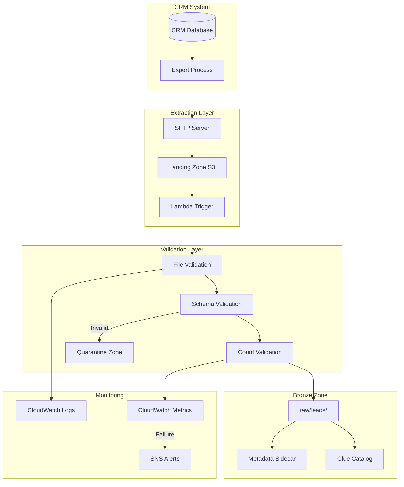
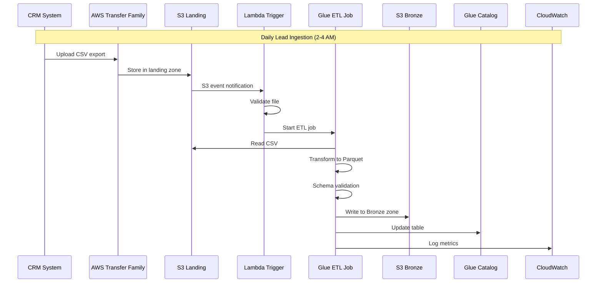

# 01 - Lead Data Ingestion Pipeline

## 📝 Description

As a **Data Engineer**, I want to build an automated pipeline to ingest lead data from the CRM system into the data lake's Bronze zone so that lead information is available for scoring and analytics on a daily basis.

## 🎯 Acceptance Criteria

### 1. Data Extraction
- Daily automated extraction from CRM system
- Support for both full load (initial) and incremental load (daily)
- Extraction captures:
  - Lead demographic information
  - Lead source and channel data
  - Lead engagement signals
  - Lead status and timestamps
- Data format: CSV/JSON from CRM, converted to Parquet for storage

### 2. Bronze Zone Landing
- Data lands in `s3://bucket/raw/leads/year=YYYY/month=MM/day=DD/`
- Original data preserved without transformation
- File-level metadata captured (extraction timestamp, source system, record count)
- Duplicate file detection to prevent re-processing

### 3. Initial Quality Checks
- Record count validation against source
- Schema validation (expected columns present)
- Basic completeness check (non-null lead_id)
- Quarantine zone for malformed files

### 4. Integration Pattern
- Phase 1: SFTP/S3 file drop integration (CSV)
- Phase 2 readiness: API-based extraction via Lambda
- Trigger: S3 event notification or scheduled Glue job
- Retry logic for transient failures

## 🔒 Technical Constraints

- CRM credentials stored in Secrets Manager
- Extraction must not impact CRM performance (off-peak hours)
- PII fields encrypted at rest
- All extractions logged for audit trail

## 📦 Dependencies

- S3 Data Lake Foundation (Data Platform Story 01)
- Glue ETL Framework (Data Platform Story 03)
- CRM system data access approved
- Network connectivity to CRM (VPN/Direct Connect)

## ✅ Tasks

### Data Extraction
- ⬜ Document CRM data schema and extraction fields
- ⬜ Create extraction script (SFTP download or API call)
- ⬜ Implement incremental extraction logic (timestamp-based)
- ⬜ Configure scheduling for off-peak hours

### Pipeline Development
- ⬜ Create Glue job for CSV-to-Parquet conversion
- ⬜ Implement S3 event trigger for file processing
- ⬜ Add file validation and quarantine logic
- ⬜ Set up extraction metrics logging

### Infrastructure
- ⬜ Configure AWS Transfer Family for SFTP (if needed)
- ⬜ Create Lambda trigger for S3 events
- ⬜ Set up CloudWatch alarms for extraction failures
- ⬜ Store CRM credentials in Secrets Manager

### Validation
- ⬜ Test full load extraction
- ⬜ Test incremental extraction
- ⬜ Verify data in Bronze zone matches source
- ⬜ Confirm audit logging captures all operations

## 📊 Success Metrics

| Metric | Target |
|--------|--------|
| Extraction reliability | >99% daily extractions successful |
| Data freshness | Lead data available by 6 AM daily |
| Record accuracy | 100% records extracted vs. source count |
| Processing time | Extraction completes within 30 minutes |

## 🔗 Related Documents

- [Data Flows Architecture](../../../architecture/data-flows.md)
- [Business Case - Lead Scoring](../../../project-context/business-case.md)
- [Value Delivery Roadmap - Phase 1](../../../architecture/value-delivery-roadmap.md)

## 📚 Relevant Context

### Strategic Alignment
This story directly supports **REQ-001: Lead Prioritisation Intelligence** from the [Data Platform Strategy](../../../architecture/data-platform-strategy.md), which establishes lead scoring as the foundation product with governance-by-design. The business case positions lead data ingestion as critical infrastructure for the "Experiment → Production" path outlined in the 5-week PoC plan.

### Architecture Context
- **Medallion Architecture**: Data lands in the Bronze (raw) zone as the first stage of progressive refinement ([Architecture Overview §3.1](../../../architecture/overview.md))
- **Ingestion Patterns**: Supports both Batch ETL and File Drop patterns as defined in [Data Flows §3](../../../architecture/data-flows.md)
- **Storage Strategy**: Uses S3 Standard for active data with lifecycle transitions to IA (90 days) and Glacier (1 year) per [Data Platform Strategy §3.2](../../../architecture/data-platform-strategy.md)

### Timeline & Milestones
- Part of **Phase 1 Foundation** (Weeks 1-12) per [Value Delivery Roadmap §3.1](../../../architecture/value-delivery-roadmap.md)
- Target milestone: **M2: Platform Foundation** (Week 4) - Data lake operational
- Daily lead data availability by 6 AM supports the Phase 1 SLA requirement

### Key Risks & Constraints
- **R01 (Critical)**: Historical lead data quality gaps may impact model accuracy - mitigate by implementing quality checks in ingestion ([Risk Register](../../../architecture/risk-constraint-register.md))
- **R03 (High)**: CRM integration delays - start with CSV/file-based integration per mitigation strategy
- **C02**: Data must remain in AWS Mumbai region (ap-south-1) for regulatory compliance
- **C04**: All infrastructure must be defined as Terraform code

### Technology Stack
Per [Tech Stack](../../../project-context/tech-stack.md):
- **AWS Glue** for batch ETL extraction and transformation
- **Amazon S3** for Bronze zone storage (`raw/leads/`)
- **AWS Transfer Family** for SFTP integration if required
- **AWS Secrets Manager** for CRM credential storage

---

## Implementation Plan

### 1. Feature Overview

**Goal:** Build an automated pipeline to ingest lead data from the CRM system into the data lake's Bronze zone, ensuring lead information is available for scoring and analytics on a daily basis.

**Primary User Role:** Data Engineer

**Business Value:** Enables daily lead data availability by 6 AM, directly supporting the Lead Scoring AI product. This pipeline establishes the foundation for data-driven prioritization, targeting 15-25% conversion improvement.

### 2. Component Analysis & Reuse Strategy

#### Existing Components
| Component | Location | Reuse Decision |
|-----------|----------|----------------|
| S3 Data Lake | Data Platform Story 01 | **REUSE** - Bronze zone storage |
| Glue ETL Framework | Data Platform Story 03 | **REUSE** - Job templates |
| MWAA Orchestration | Data Platform Story 04 | **REUSE** - Scheduling |
| VPC Infrastructure | Security Story 01 | **REUSE** - Network connectivity |
| Secrets Manager | Security Story 04 | **REUSE** - CRM credentials |

#### New Components Required
| Component | Purpose | Priority |
|-----------|---------|----------|
| CRM Extraction Script | Data extraction logic | High |
| Lead Schema Definition | Schema for validation | High |
| Incremental Load Logic | CDC/timestamp-based extraction | High |
| File Validation Job | Quality gate at ingestion | Medium |

#### Gaps Identified
- CRM system data access not yet approved
- Incremental extraction field needs confirmation from CRM team
- File format validation rules need definition

### 3. Affected Files

#### Infrastructure (Terraform)
| File Path | Action | Description |
|-----------|--------|-------------|
| `infra/components/ingestion/lead_ingestion.tf` | [CREATE] | Ingestion infrastructure |
| `infra/components/ingestion/sftp_transfer.tf` | [CREATE] | AWS Transfer Family config |
| `infra/components/ingestion/lambda_trigger.tf` | [CREATE] | S3 event trigger Lambda |

#### ETL Code
| File Path | Action | Description |
|-----------|--------|-------------|
| `src/etl/ingestion/lead_extraction.py` | [CREATE] | CRM extraction script |
| `src/etl/ingestion/lead_bronze_load.py` | [CREATE] | Bronze zone loader |
| `src/etl/ingestion/file_validator.py` | [CREATE] | File validation logic |
| `src/etl/schemas/lead_raw_schema.json` | [CREATE] | Raw lead schema |

#### Airflow DAGs
| File Path | Action | Description |
|-----------|--------|-------------|
| `src/airflow/dags/lead_ingestion_dag.py` | [MODIFY] | Add extraction tasks |

#### Tests
| File Path | Action | Description |
|-----------|--------|-------------|
| `tests/ingestion/test_lead_extraction.py` | [CREATE] | Extraction tests |
| `tests/ingestion/test_file_validator.py` | [CREATE] | Validation tests |
| `tests/ingestion/test_incremental_load.py` | [CREATE] | CDC tests |

### 4. Component Breakdown

#### 4.1 CRM Data Extraction

```python
# src/etl/ingestion/lead_extraction.py
"""
CRM Lead Data Extraction
Supports full and incremental extraction modes.
"""

import boto3
from datetime import datetime, timedelta
from typing import Tuple, Optional
import pandas as pd

class LeadExtractor:
    """Extracts lead data from CRM system."""
    
    def __init__(self, config: dict):
        self.config = config
        self.secrets_client = boto3.client('secretsmanager')
        self.s3_client = boto3.client('s3')
        
    def get_credentials(self) -> dict:
        """Retrieve CRM credentials from Secrets Manager."""
        secret = self.secrets_client.get_secret_value(
            SecretId=self.config['crm_secret_name']
        )
        return json.loads(secret['SecretString'])
    
    def extract_full(self) -> Tuple[pd.DataFrame, dict]:
        """
        Full extraction for initial load.
        Returns: (data, metadata)
        """
        # Implementation depends on CRM API/SFTP
        pass
    
    def extract_incremental(self, last_extraction_date: datetime) -> Tuple[pd.DataFrame, dict]:
        """
        Incremental extraction based on last_updated timestamp.
        Returns: (data, metadata)
        """
        # Extract records where last_updated > last_extraction_date
        pass
    
    def validate_extraction(self, df: pd.DataFrame, source_count: int) -> bool:
        """Validate extracted record count matches source."""
        extracted_count = len(df)
        tolerance = 0.01  # 1% tolerance
        return abs(extracted_count - source_count) / source_count <= tolerance
```

#### 4.2 Bronze Zone Loader

```python
# src/etl/ingestion/lead_bronze_load.py
"""
Bronze Zone Loader
Lands extracted data in Bronze zone with proper partitioning.
"""

def load_to_bronze(
    df: pd.DataFrame,
    target_bucket: str,
    partition_date: str,
    metadata: dict
) -> dict:
    """
    Load data to Bronze zone.
    
    Args:
        df: Extracted DataFrame
        target_bucket: S3 bucket name
        partition_date: YYYY-MM-DD
        metadata: Extraction metadata
        
    Returns:
        Load statistics
    """
    target_path = f"s3://{target_bucket}/raw/leads/year={partition_date[:4]}/month={partition_date[5:7]}/day={partition_date[8:10]}/"
    
    # Convert to Parquet
    df.to_parquet(
        target_path,
        engine='pyarrow',
        compression='snappy',
        index=False
    )
    
    # Write metadata sidecar file
    metadata_path = f"{target_path}_metadata.json"
    write_metadata(metadata_path, {
        'extraction_timestamp': metadata['extraction_timestamp'],
        'source_system': metadata['source_system'],
        'record_count': len(df),
        'file_format': 'parquet',
        'compression': 'snappy'
    })
    
    return {
        'records_loaded': len(df),
        'target_path': target_path,
        'status': 'SUCCESS'
    }
```

#### 4.3 Raw Lead Schema

```json
{
  "schema_name": "lead_raw",
  "version": "1.0.0",
  "columns": [
    {"name": "lead_id", "type": "string", "nullable": false, "description": "Unique lead identifier"},
    {"name": "first_name", "type": "string", "nullable": true, "pii": true},
    {"name": "last_name", "type": "string", "nullable": true, "pii": true},
    {"name": "email", "type": "string", "nullable": true, "pii": true},
    {"name": "phone", "type": "string", "nullable": true, "pii": true},
    {"name": "lead_source", "type": "string", "nullable": false},
    {"name": "lead_channel", "type": "string", "nullable": true},
    {"name": "acquisition_date", "type": "timestamp", "nullable": false},
    {"name": "engagement_score", "type": "double", "nullable": true},
    {"name": "lead_status", "type": "string", "nullable": false},
    {"name": "assigned_rm", "type": "string", "nullable": true},
    {"name": "campaign_id", "type": "string", "nullable": true},
    {"name": "last_interaction_date", "type": "timestamp", "nullable": true},
    {"name": "last_updated", "type": "timestamp", "nullable": false}
  ],
  "partition_keys": [
    {"name": "year", "type": "string"},
    {"name": "month", "type": "string"},
    {"name": "day", "type": "string"}
  ]
}
```

### 5. Data Flow & Pipeline Architecture

#### Ingestion Flow



### 6. Integration Diagram



### 7. Security Considerations

| Security Control | Implementation |
|-----------------|----------------|
| CRM Credentials | AWS Secrets Manager, rotated 90-day |
| SFTP Access | SSH keys, IP allowlisting |
| Data Encryption | TLS in transit, SSE-KMS at rest |
| PII Protection | Fields flagged in schema, masked in non-prod |
| Network Security | VPC endpoints, no public internet |
| Audit Trail | All extractions logged to CloudTrail |

### 8. Testing Strategy

#### Unit Tests
| Test | Description | Location |
|------|-------------|----------|
| Extraction logic | Test full/incremental extraction | `tests/ingestion/test_lead_extraction.py` |
| File validation | Test file format validation | `tests/ingestion/test_file_validator.py` |
| Schema validation | Test schema conformance | `tests/ingestion/test_schema_validator.py` |

#### Integration Tests
| Test | Description | Tool |
|------|-------------|------|
| End-to-end ingestion | Full pipeline test | pytest + moto |
| SFTP upload | File transfer test | pytest |
| Glue job execution | Job runtime test | AWS Glue |

#### Data Quality Tests
- [ ] Record count matches source
- [ ] No null lead_id values
- [ ] Valid date formats
- [ ] Schema conformance 100%

### 9. Accessibility (A11y) Considerations

Not applicable for backend data pipeline components.

### 10. Implementation Steps

#### Phase 1: Infrastructure Setup (Week 3)
- [ ] **Step 1.1:** Document CRM data schema and extraction fields
- [ ] **Step 1.2:** Configure AWS Transfer Family for SFTP
- [ ] **Step 1.3:** Create S3 landing zone bucket
- [ ] **Step 1.4:** Store CRM credentials in Secrets Manager
- [ ] **Step 1.5:** Create Lambda trigger for S3 events
- [ ] **Step 1.6:** Set up CloudWatch alarms for extraction failures

#### Phase 2: Extraction Development (Week 3-4)
- [ ] **Step 2.1:** Create extraction script (SFTP download or API call)
- [ ] **Step 2.2:** Implement incremental extraction logic (timestamp-based)
- [ ] **Step 2.3:** Configure scheduling for off-peak hours (2 AM)
- [ ] **Step 2.4:** Create Glue job for CSV-to-Parquet conversion
- [ ] **Step 2.5:** Implement file validation and quarantine logic

#### Phase 3: Quality & Monitoring (Week 4)
- [ ] **Step 3.1:** Set up extraction metrics logging
- [ ] **Step 3.2:** Configure CloudWatch dashboards
- [ ] **Step 3.3:** Set up SNS alerts for failures
- [ ] **Step 3.4:** Create data quality validation rules

#### Phase 4: Validation & Deployment (Week 4-5)
- [ ] **Step 4.1:** Test full load extraction
- [ ] **Step 4.2:** Test incremental extraction
- [ ] **Step 4.3:** Verify data in Bronze zone matches source
- [ ] **Step 4.4:** Confirm audit logging captures all operations
- [ ] **Step 4.5:** Deploy to UAT environment
- [ ] **Step 4.6:** Production deployment with monitoring

### 11. Monitoring & Alerting

| Metric | Threshold | Alert Action |
|--------|-----------|--------------|
| Extraction failure | Any | P1 Alert (blocks scoring) |
| Record count variance | >1% from source | P2 Alert |
| Extraction latency | >1 hour | P2 Alert |
| File not received | By 3 AM | P1 Alert |
| Schema validation failure | Any | P2 Alert |

### 12. Rollback Plan

1. **Reprocessing:** Bronze zone preserves raw data; re-run from source if needed
2. **File Recovery:** Landing zone retains files for 7 days
3. **Incremental Reset:** Can reset extraction watermark to re-extract data
4. **Manual Override:** CSV can be manually uploaded for emergency processing

### 13. Dependencies & Prerequisites

| Dependency | Source | Status |
|------------|--------|--------|
| S3 Data Lake Foundation | Data Platform Story 01 | Required |
| Glue ETL Framework | Data Platform Story 03 | Required |
| CRM system data access approved | External | Required |
| Network connectivity to CRM | Infrastructure | Required |
| VPC endpoints | Security Story 01 | Required |
| Secrets Manager configured | Security Story 04 | Required |
