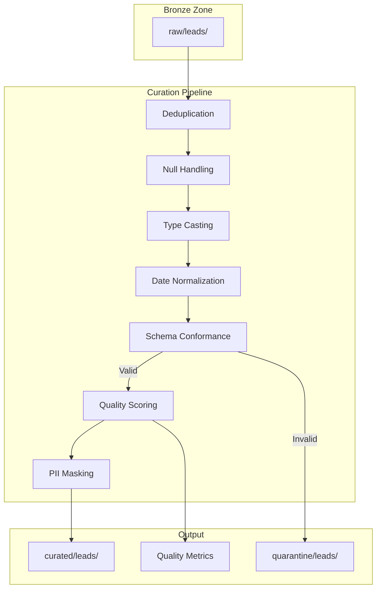

# 02 - Lead Data Curation Pipeline

## 📝 Description

As a **Data Analyst**, I want lead data to be cleansed, deduplicated, and conformed to a standard schema in the Silver zone so that I can trust the data quality for analysis and model training.

## 🎯 Acceptance Criteria

### 1. Data Quality Transformations
- Deduplication based on lead_id (keep most recent)
- Null handling:
  - Required fields: reject if null
  - Optional fields: apply default values or flags
- Data type casting to standard types
- Date normalization to ISO 8601 format

### 2. Schema Conformance
- Standard lead schema applied:
  - lead_id (string, PK)
  - lead_source (string, enum)
  - lead_channel (string, enum)
  - acquisition_date (timestamp)
  - contact_email (string, masked in non-prod)
  - contact_phone (string, masked in non-prod)
  - engagement_score (decimal)
  - lead_status (string, enum)
  - last_updated (timestamp)
- Schema version tracked in Glue Catalog

### 3. Data Quality Scoring
- Quality score computed per batch:
  - Completeness score (% non-null required fields)
  - Validity score (% records passing business rules)
  - Uniqueness score (% unique records)
- Quality metrics logged to CloudWatch
- Quality dashboard updated

### 4. Output to Silver Zone
- Data written to `s3://bucket/curated/leads/dt=YYYY-MM-DD/`
- Parquet format with Snappy compression
- Glue Catalog table updated automatically

## 🔒 Technical Constraints

- PII masking applied in non-production environments
- Transformation logic version-controlled
- Failed records routed to quarantine with reason codes
- Processing must be idempotent (re-runnable)

## 📦 Dependencies

- Lead Data Ingestion (Lead Scoring Story 01)
- Glue ETL Framework (Data Platform Story 03)
- Data quality rules defined with business

## ✅ Tasks

### Transformation Development
- ⬜ Implement deduplication logic
- ⬜ Create null handling functions
- ⬜ Build schema conformance mapper
- ⬜ Implement date normalization

### Data Quality
- ⬜ Define completeness rules for lead data
- ⬜ Define validity rules (enum values, formats)
- ⬜ Implement quality scoring function
- ⬜ Create quarantine routing logic

### Pipeline Integration
- ⬜ Create Glue job for Bronze-to-Silver transformation
- ⬜ Integrate with Airflow DAG
- ⬜ Set up data quality metrics export
- ⬜ Configure quality alerts

### Validation
- ⬜ Test with known data quality issues
- ⬜ Verify deduplication accuracy
- ⬜ Confirm PII masking in non-prod
- ⬜ Validate quality scores against manual review

## 📊 Success Metrics

| Metric | Target |
|--------|--------|
| Data quality pass rate | >95% records passing all checks |
| Deduplication accuracy | 100% duplicates removed |
| Processing latency | Complete within 1 hour of Bronze load |
| Quality score tracking | Scores available for each batch |

## 🔗 Related Documents

- [Data Flows Architecture](../../../architecture/data-flows.md)
- [Data Platform Strategy - Data Quality](../../../architecture/data-platform-strategy.md#35-data-quality-controls)
- [Security & Governance - Data Classification](../../../architecture/security-governance.md)

## 📚 Relevant Context

### Strategic Alignment
This story implements the **Silver (Curated) zone** of the Medallion Architecture, delivering "cleansed & conformed" data that is "deduplicated, validated, standardized schemas; business-ready structure" per [Data Platform Strategy §3.1](../../../architecture/data-platform-strategy.md). The curation pipeline is essential for building trust in AI outputs as outlined in Strategic Bet #3: "Embed data quality and observability from inception."

### Architecture Context
- **Data Quality Framework**: Implements checks across Completeness, Uniqueness, Validity, Accuracy, Timeliness, and Consistency dimensions per [Data Platform Strategy §3.5](../../../architecture/data-platform-strategy.md)
- **Processing Flow**: Bronze → Silver transformation follows the standard pipeline stages defined in [Data Flows §4.1](../../../architecture/data-flows.md)
- **Schema Management**: Uses AWS Glue Data Catalog for schema versioning and evolution per [Architecture Overview §3.4](../../../architecture/overview.md)

### Timeline & Milestones
- Part of **Phase 1 Foundation** (Weeks 1-12) - core to "Data Prep & Feature Build" (Weeks 3-5) per [Value Delivery Roadmap](../../../architecture/value-delivery-roadmap.md)
- Data quality checks enable achieving the 95% data quality score target defined in Platform Health Metrics

### Key Risks & Constraints
- **R01 (Critical)**: Historical lead data quality issues - this story directly addresses risk mitigation through quality checks and quarantine logic ([Risk Register](../../../architecture/risk-constraint-register.md))
- **A17**: Assumes data quality is sufficient for meaningful model training with targeted remediation
- **C05**: Model explainability requires clean, well-documented data lineage from Silver zone

### Data Governance
Per [Security & Governance §5.3](../../../architecture/security-governance.md):
- **Data Classification**: Lead data classified as "Confidential" requiring encryption and access control
- **PII Protection**: Contact email/phone fields require masking in non-production environments
- **Column-Level Security**: Sensitive columns identified and tagged for Lake Formation policies

### Technology Stack
Per [Tech Stack](../../../project-context/tech-stack.md):
- **AWS Glue** for ETL transformations and data quality rules
- **AWS Glue Data Quality** for automated quality checks
- **Amazon S3** for Silver zone storage (`curated/leads/`)
- **Amazon CloudWatch** for quality metrics logging

---

## Implementation Plan

### 1. Feature Overview

**Goal:** Cleanse, deduplicate, and conform lead data to a standard schema in the Silver zone, ensuring data quality for downstream analysis and model training.

**Primary User Role:** Data Analyst

**Business Value:** Delivers trusted, high-quality data with >95% quality pass rate, enabling accurate model training and reliable analytics. Directly addresses R01 risk of historical data quality gaps.

### 2. Component Analysis & Reuse Strategy

#### Existing Components
| Component | Location | Reuse Decision |
|-----------|----------|----------------|
| Bronze Zone Data | Lead Scoring Story 01 | **REUSE** - Source data |
| ETL Framework | Data Platform Story 03 | **REUSE** - Templates |
| Data Quality Rules | Data Platform Story 03 | **EXTEND** - Lead-specific rules |
| Glue Catalog | Data Platform Story 02 | **REUSE** - Schema management |

#### New Components Required
| Component | Purpose | Priority |
|-----------|---------|----------|
| Lead Curation Job | B2S transformation logic | High |
| Quality Scoring Function | Compute quality metrics | High |
| PII Masking Module | Non-prod data masking | High |
| Quarantine Handler | Failed record routing | Medium |

### 3. Affected Files

#### ETL Code
| File Path | Action | Description |
|-----------|--------|-------------|
| `src/etl/curation/lead_curation.py` | [CREATE] | Main curation job |
| `src/etl/curation/deduplication.py` | [CREATE] | Dedup logic |
| `src/etl/curation/null_handler.py` | [CREATE] | Null handling rules |
| `src/etl/curation/schema_conformer.py` | [CREATE] | Schema conformance |
| `src/etl/curation/pii_masking.py` | [CREATE] | PII masking for non-prod |

#### Schema Definitions
| File Path | Action | Description |
|-----------|--------|-------------|
| `src/etl/schemas/lead_curated_schema.json` | [CREATE] | Silver zone schema |

#### Tests
| File Path | Action | Description |
|-----------|--------|-------------|
| `tests/curation/test_lead_curation.py` | [CREATE] | Curation tests |
| `tests/curation/test_deduplication.py` | [CREATE] | Dedup tests |
| `tests/curation/test_quality_scoring.py` | [CREATE] | Quality score tests |

### 4. Component Breakdown

#### 4.1 Lead Curation Pipeline

```python
# src/etl/curation/lead_curation.py
"""
Lead Data Curation Pipeline
Transforms Bronze to Silver with quality checks.
"""

class LeadCurationPipeline:
    """Main curation pipeline for lead data."""
    
    def __init__(self, config: dict):
        self.config = config
        self.quality_metrics = {}
        
    def execute(self, bronze_df: DataFrame) -> Tuple[DataFrame, DataFrame, dict]:
        """
        Execute curation pipeline.
        
        Returns:
            Tuple of (curated_df, quarantine_df, quality_metrics)
        """
        # Step 1: Deduplication
        deduped_df, dup_count = self.deduplicate(bronze_df)
        self.quality_metrics['duplicates_removed'] = dup_count
        
        # Step 2: Null handling
        cleaned_df, null_stats = self.handle_nulls(deduped_df)
        self.quality_metrics['null_stats'] = null_stats
        
        # Step 3: Type casting
        typed_df = self.cast_types(cleaned_df)
        
        # Step 4: Date normalization
        normalized_df = self.normalize_dates(typed_df)
        
        # Step 5: Schema conformance
        conformed_df, invalid_df = self.conform_schema(normalized_df)
        
        # Step 6: Quality scoring
        quality_scores = self.compute_quality_score(conformed_df)
        self.quality_metrics['quality_scores'] = quality_scores
        
        # Step 7: PII masking (non-prod only)
        if self.config.get('environment') != 'prod':
            conformed_df = self.mask_pii(conformed_df)
        
        return conformed_df, invalid_df, self.quality_metrics
    
    def deduplicate(self, df: DataFrame) -> Tuple[DataFrame, int]:
        """Remove duplicates, keeping most recent by last_updated."""
        window = Window.partitionBy('lead_id').orderBy(col('last_updated').desc())
        deduped = df.withColumn('row_num', row_number().over(window)) \
                    .filter(col('row_num') == 1) \
                    .drop('row_num')
        return deduped, df.count() - deduped.count()
```

#### 4.2 Curated Lead Schema

```json
{
  "schema_name": "lead_curated",
  "version": "1.0.0",
  "columns": [
    {"name": "lead_id", "type": "string", "nullable": false, "description": "Unique lead identifier (PK)"},
    {"name": "lead_source", "type": "string", "nullable": false, "enum": ["CRM", "CAMPAIGN", "PARTNER", "DIRECT", "REFERRAL"]},
    {"name": "lead_channel", "type": "string", "nullable": true, "enum": ["WEB", "MOBILE", "CALL", "EMAIL", "PARTNER"]},
    {"name": "acquisition_date", "type": "timestamp", "nullable": false, "format": "ISO8601"},
    {"name": "contact_email", "type": "string", "nullable": true, "pii": true, "masked_in_nonprod": true},
    {"name": "contact_phone", "type": "string", "nullable": true, "pii": true, "masked_in_nonprod": true},
    {"name": "engagement_score", "type": "decimal(10,4)", "nullable": true, "range": [0, 100]},
    {"name": "lead_status", "type": "string", "nullable": false, "enum": ["NEW", "CONTACTED", "QUALIFIED", "CONVERTED", "LOST"]},
    {"name": "last_updated", "type": "timestamp", "nullable": false, "format": "ISO8601"},
    {"name": "dq_completeness_score", "type": "decimal(5,2)", "nullable": false},
    {"name": "dq_validity_score", "type": "decimal(5,2)", "nullable": false}
  ],
  "partition_keys": [
    {"name": "dt", "type": "string", "format": "YYYY-MM-DD"}
  ]
}
```

### 5. Data Flow & Pipeline Architecture



### 6. Testing Strategy

| Test Type | Test Description | Expected Outcome |
|-----------|------------------|------------------|
| Unit Test | Deduplication with various scenarios | 100% duplicates removed |
| Unit Test | Null handling rules | Correct defaults applied |
| Unit Test | PII masking accuracy | All PII fields masked |
| Integration Test | End-to-end curation | >95% quality pass rate |
| Data Quality Test | Schema conformance | 100% records conform |

### 7. Implementation Steps

#### Phase 1: Development (Week 4)
- [ ] **Step 1.1:** Implement deduplication logic
- [ ] **Step 1.2:** Create null handling functions
- [ ] **Step 1.3:** Build schema conformance mapper
- [ ] **Step 1.4:** Implement date normalization

#### Phase 2: Quality Integration (Week 4-5)
- [ ] **Step 2.1:** Define completeness rules for lead data
- [ ] **Step 2.2:** Define validity rules (enum values, formats)
- [ ] **Step 2.3:** Implement quality scoring function
- [ ] **Step 2.4:** Create quarantine routing logic

#### Phase 3: Validation (Week 5)
- [ ] **Step 3.1:** Test with known data quality issues
- [ ] **Step 3.2:** Verify deduplication accuracy
- [ ] **Step 3.3:** Confirm PII masking in non-prod
- [ ] **Step 3.4:** Validate quality scores against manual review

### 8. Dependencies & Prerequisites

| Dependency | Source | Status |
|------------|--------|--------|
| Lead Data Ingestion | Lead Scoring Story 01 | Required |
| Glue ETL Framework | Data Platform Story 03 | Required |
| Data quality rules defined with business | Business | Required |
