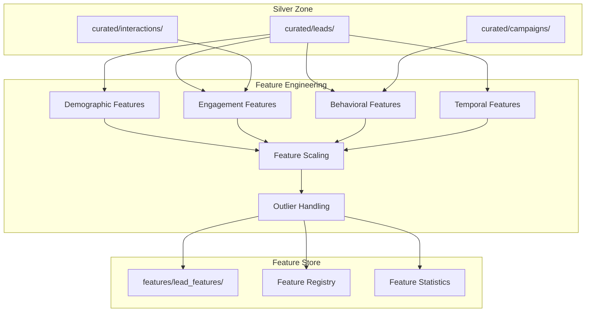

# 03 - Feature Engineering Pipeline for Lead Scoring

## 📝 Description

As a **Data Scientist**, I want an automated feature engineering pipeline that generates predictive features from curated lead data so that I can train and improve lead scoring models efficiently.

## 🎯 Acceptance Criteria

### 1. Feature Categories
- **Demographic Features:**
  - Lead source encoding (one-hot)
  - Channel quality score
  - Geographic region indicators
- **Engagement Features:**
  - Engagement score normalized
  - Interaction frequency (last 7, 30, 90 days)
  - Recency score (days since last interaction)
- **Behavioral Features:**
  - Campaign response rate
  - Content engagement signals
  - Channel preference indicators
- **Temporal Features:**
  - Day of week, hour of acquisition
  - Time in pipeline
  - Seasonality indicators

### 2. Feature Store Output
- Features written to `s3://bucket/features/lead_features/snapshot_date=YYYY-MM-DD/`
- Feature schema documented with:
  - Feature name and description
  - Data type and range
  - Business meaning
  - Calculation logic
- Parquet format with versioning

### 3. Feature Quality
- No nulls in feature vectors (imputation applied)
- Feature scaling applied (standardization/normalization)
- Outlier handling (capping at percentiles)
- Feature statistics tracked (mean, std, distribution)

### 4. Training vs. Inference Parity
- Same feature logic used for training and scoring
- Point-in-time correctness ensured (no data leakage)
- Feature versioning aligned with model versions

## 🔒 Technical Constraints

- Feature computation must be reproducible
- Historical features must support time-travel queries
- No target leakage in feature construction
- Feature store must scale to millions of leads

## 📦 Dependencies

- Lead Data Curation (Lead Scoring Story 02)
- Campaign data curated in Silver zone
- Outcome data available for label creation
- SageMaker Feature Store (optional for Phase 2)

## ✅ Tasks

### Feature Development
- ⬜ Implement demographic feature extraction
- ⬜ Implement engagement feature calculations
- ⬜ Implement behavioral feature derivation
- ⬜ Implement temporal feature extraction
- ⬜ Create feature scaling functions

### Pipeline Integration
- ⬜ Create Glue job for feature engineering
- ⬜ Integrate with Airflow DAG
- ⬜ Set up daily feature snapshot generation
- ⬜ Configure feature quality metrics

### Documentation
- ⬜ Document feature definitions in feature registry
- ⬜ Create feature correlation analysis
- ⬜ Document feature importance from baseline model
- ⬜ Create feature monitoring dashboard

### Validation
- ⬜ Verify feature distributions are reasonable
- ⬜ Test point-in-time correctness
- ⬜ Validate no target leakage
- ⬜ Confirm training-inference parity

## 📊 Success Metrics

| Metric | Target |
|--------|--------|
| Feature completeness | 100% features computed for all leads |
| Processing time | Daily features ready within 2 hours of Silver data |
| Feature stability | Distribution drift <5% week-over-week |
| Model performance lift | Features contribute to >70% model accuracy |

## 🔗 Related Documents

- [Data Platform Strategy - Feature Store](../../../architecture/data-platform-strategy.md)
- [Architecture Overview - ML Platform](../../../architecture/overview.md)
- [Business Case - Lead Scoring](../../../project-context/business-case.md)

## 📚 Relevant Context

### Strategic Alignment
This story supports **REQ-001: Lead Prioritisation Intelligence** by creating the predictive features needed for lead scoring. The feature engineering pipeline establishes reusable patterns per Strategic Bet #1, creating a foundation for future AI products including Portfolio Review and Campaign Intelligence per [Business Case](../../../project-context/business-case.md).

### Architecture Context
- **Feature Store Location**: Features stored in Gold zone at `s3://bucket/features/lead_features/` per [Architecture Overview §3.1](../../../architecture/overview.md)
- **ML Platform Integration**: Features feed into Amazon SageMaker for model training and batch inference per [Architecture Overview §3.3](../../../architecture/overview.md)
- **Processing Engine**: Heavy feature engineering may leverage Amazon EMR for large-scale computation per [Data Platform Strategy §3.3](../../../architecture/data-platform-strategy.md)

### Timeline & Milestones
- Part of **Phase 1** "Data Prep & Feature Build" (Weeks 3-5) and "Model Development" (Weeks 5-8) per [Value Delivery Roadmap §3.1](../../../architecture/value-delivery-roadmap.md)
- Target milestone: **M3: PoC Model Ready** (Week 5) requires feature pipeline operational
- Features must be ready for daily model scoring by Week 9

### Key Risks & Constraints
- **R06 (Medium)**: Feature engineering complexity may exceed available skills/time - mitigate by starting with proven industry patterns and leveraging SageMaker built-in capabilities ([Risk Register](../../../architecture/risk-constraint-register.md))
- **A17**: Assumes data quality is sufficient - feature engineering depends on curated Silver zone data
- **C06**: Real-time feature computation out of scope for Phase 1; batch features only

### Data Modeling Context
Per [Data Platform Strategy §3.4](../../../architecture/data-platform-strategy.md), the feature store supports the dimensional model:
- **Fact tables**: fact_lead_interactions (engagement signals), fact_lead_outcomes (conversion labels)
- **Dimension tables**: dim_lead (demographic attributes), dim_campaign (channel/source info), dim_time (temporal features)

### Technology Stack
Per [Tech Stack](../../../project-context/tech-stack.md):
- **AWS Glue / Amazon EMR** for feature computation at scale
- **Amazon S3** for feature store (`features/lead_features/`)
- **SageMaker Feature Store** (optional for Phase 2) for centralized feature management
- **Parquet with Snappy compression** for optimized storage and query performance

---

## Implementation Plan

### 1. Feature Overview

**Goal:** Build an automated feature engineering pipeline that generates predictive features from curated lead data for training and improving lead scoring models.

**Primary User Role:** Data Scientist

**Business Value:** Creates the predictive signals enabling 15-25% conversion improvement. Features contribute to >70% of model accuracy, directly supporting REQ-001 Lead Prioritisation Intelligence.

### 2. Component Analysis & Reuse Strategy

#### Existing Components
| Component | Location | Reuse Decision |
|-----------|----------|----------------|
| Curated Lead Data | Lead Scoring Story 02 | **REUSE** - Source data |
| ETL Framework | Data Platform Story 03 | **REUSE** - Job templates |
| Glue Catalog | Data Platform Story 02 | **REUSE** - Schema registry |

#### New Components Required
| Component | Purpose | Priority |
|-----------|---------|----------|
| Feature Computation Jobs | Calculate features | High |
| Feature Registry | Document feature definitions | High |
| Feature Quality Checks | Validate feature distributions | Medium |
| Feature Store Output | Write features with versioning | High |

### 3. Affected Files

#### ETL Code
| File Path | Action | Description |
|-----------|--------|-------------|
| `src/etl/features/demographic_features.py` | [CREATE] | Demographic feature extraction |
| `src/etl/features/engagement_features.py` | [CREATE] | Engagement feature calculations |
| `src/etl/features/behavioral_features.py` | [CREATE] | Behavioral feature derivation |
| `src/etl/features/temporal_features.py` | [CREATE] | Temporal feature extraction |
| `src/etl/features/feature_scaler.py` | [CREATE] | Feature scaling functions |
| `src/etl/features/feature_pipeline.py` | [CREATE] | Main pipeline orchestrator |

#### Feature Registry
| File Path | Action | Description |
|-----------|--------|-------------|
| `docs/features/lead-scoring/feature-registry.md` | [CREATE] | Feature documentation |
| `src/etl/schemas/lead_features_schema.json` | [CREATE] | Feature schema definition |

#### Tests
| File Path | Action | Description |
|-----------|--------|-------------|
| `tests/features/test_demographic_features.py` | [CREATE] | Demographic feature tests |
| `tests/features/test_engagement_features.py` | [CREATE] | Engagement feature tests |
| `tests/features/test_feature_pipeline.py` | [CREATE] | Pipeline integration tests |

### 4. Component Breakdown

#### 4.1 Feature Categories

| Category | Features | Description |
|----------|----------|-------------|
| **Demographic** | lead_source_encoded, channel_quality_score, region_indicators | Lead profile attributes |
| **Engagement** | engagement_score_norm, interaction_freq_7d/30d/90d, recency_days | Interaction patterns |
| **Behavioral** | campaign_response_rate, content_engagement, channel_preference | Behavioral signals |
| **Temporal** | dow_acquisition, hour_acquisition, days_in_pipeline, seasonality | Time-based features |

#### 4.2 Feature Pipeline

```python
# src/etl/features/feature_pipeline.py
"""
Lead Feature Engineering Pipeline
Generates ML-ready features from curated data.
"""

class FeatureEngineeringPipeline:
    """Main feature engineering pipeline."""
    
    def __init__(self, config: dict):
        self.config = config
        self.feature_stats = {}
        
    def execute(self, leads_df: DataFrame, interactions_df: DataFrame, 
                campaigns_df: DataFrame, snapshot_date: str) -> DataFrame:
        """
        Execute feature engineering pipeline.
        
        Returns:
            DataFrame with all computed features
        """
        # Demographic features
        demo_features = self.compute_demographic_features(leads_df)
        
        # Engagement features
        engagement_features = self.compute_engagement_features(
            leads_df, interactions_df, snapshot_date
        )
        
        # Behavioral features
        behavioral_features = self.compute_behavioral_features(
            leads_df, campaigns_df
        )
        
        # Temporal features
        temporal_features = self.compute_temporal_features(
            leads_df, snapshot_date
        )
        
        # Join all features
        features_df = demo_features \
            .join(engagement_features, on='lead_id') \
            .join(behavioral_features, on='lead_id') \
            .join(temporal_features, on='lead_id')
        
        # Apply scaling
        scaled_df = self.apply_scaling(features_df)
        
        # Handle outliers
        final_df = self.handle_outliers(scaled_df)
        
        # Validate no nulls in feature vector
        self.validate_completeness(final_df)
        
        return final_df
    
    def compute_engagement_features(self, leads_df, interactions_df, snapshot_date):
        """Compute engagement-based features."""
        # Interaction frequency (7, 30, 90 days)
        # Recency (days since last interaction)
        # Engagement score normalization
        pass
```

#### 4.3 Feature Schema

```json
{
  "schema_name": "lead_features",
  "version": "1.0.0",
  "features": [
    {"name": "lead_id", "type": "string", "nullable": false},
    {"name": "snapshot_date", "type": "date", "nullable": false},
    {"name": "lead_source_crm", "type": "int", "nullable": false, "description": "One-hot: CRM source"},
    {"name": "lead_source_campaign", "type": "int", "nullable": false, "description": "One-hot: Campaign source"},
    {"name": "lead_source_partner", "type": "int", "nullable": false, "description": "One-hot: Partner source"},
    {"name": "channel_quality_score", "type": "double", "nullable": false, "range": [0, 1]},
    {"name": "engagement_score_norm", "type": "double", "nullable": false, "range": [0, 1]},
    {"name": "interaction_freq_7d", "type": "int", "nullable": false},
    {"name": "interaction_freq_30d", "type": "int", "nullable": false},
    {"name": "interaction_freq_90d", "type": "int", "nullable": false},
    {"name": "recency_days", "type": "int", "nullable": false},
    {"name": "campaign_response_rate", "type": "double", "nullable": false, "range": [0, 1]},
    {"name": "days_in_pipeline", "type": "int", "nullable": false},
    {"name": "dow_acquisition", "type": "int", "nullable": false, "range": [0, 6]},
    {"name": "hour_acquisition", "type": "int", "nullable": false, "range": [0, 23]}
  ]
}
```

### 5. Data Flow & Pipeline Architecture



### 6. Testing Strategy

| Test Type | Test Description | Expected Outcome |
|-----------|------------------|------------------|
| Unit Test | Feature calculation accuracy | Correct values computed |
| Unit Test | Null handling | No nulls in output |
| Unit Test | Scaling functions | Values in expected ranges |
| Integration Test | Pipeline completeness | 100% leads have features |
| Data Quality Test | Feature distributions | <5% drift week-over-week |

### 7. Implementation Steps

#### Phase 1: Feature Development (Week 4-5)
- [ ] **Step 1.1:** Implement demographic feature extraction
- [ ] **Step 1.2:** Implement engagement feature calculations
- [ ] **Step 1.3:** Implement behavioral feature derivation
- [ ] **Step 1.4:** Implement temporal feature extraction
- [ ] **Step 1.5:** Create feature scaling functions

#### Phase 2: Pipeline Integration (Week 5)
- [ ] **Step 2.1:** Create Glue job for feature engineering
- [ ] **Step 2.2:** Integrate with Airflow DAG
- [ ] **Step 2.3:** Set up daily feature snapshot generation
- [ ] **Step 2.4:** Configure feature quality metrics

#### Phase 3: Documentation & Validation (Week 5-6)
- [ ] **Step 3.1:** Document feature definitions in registry
- [ ] **Step 3.2:** Create feature correlation analysis
- [ ] **Step 3.3:** Verify feature distributions are reasonable
- [ ] **Step 3.4:** Test point-in-time correctness (no leakage)

### 8. Dependencies & Prerequisites

| Dependency | Source | Status |
|------------|--------|--------|
| Lead Data Curation | Lead Scoring Story 02 | Required |
| Campaign data curated | Lead Scoring Story 02 | Required |
| Outcome data available | External | Required for labels |
