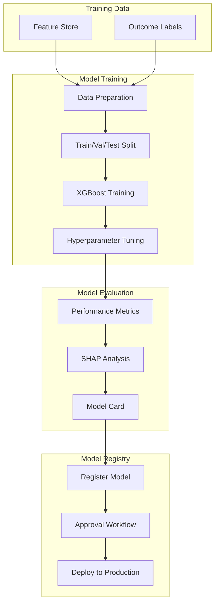

# 04 - Lead Scoring Model Training Pipeline

## 📝 Description

As a **Data Scientist**, I want to train a machine learning model that predicts lead conversion probability so that high-intent leads can be prioritized for RM outreach and improve activation efficiency.

## 🎯 Acceptance Criteria

### 1. Model Development
- Model trained using SageMaker Training Jobs
- Algorithm selection documented (XGBoost, LightGBM, or similar)
- Hyperparameter tuning performed
- Cross-validation used for robust evaluation
- Training data covers 6-12 months of historical leads

### 2. Model Output
- Score: Conversion probability (0-1)
- Priority bands:
  - Hot: Probability > 0.7
  - Warm: Probability 0.4-0.7
  - Cold: Probability < 0.4
- Thresholds configurable by business

### 3. Explainability
- SHAP values computed for feature importance
- Top 5 drivers per prediction available
- Global feature importance documented
- Model card created with:
  - Model purpose and limitations
  - Training data description
  - Performance metrics
  - Bias considerations

### 4. Model Registry
- Model registered in SageMaker Model Registry
- Model versioning with change rationale
- Status workflow: Staging → Approved → Archived
- Model artifacts stored in S3 with versioning

## 🔒 Technical Constraints

- Training must use only historical data (no future leakage)
- Model must produce consistent results (set random seeds)
- Training jobs must run in VPC
- Model size must support batch inference latency

## 📦 Dependencies

- Feature Engineering Pipeline (Lead Scoring Story 03)
- Outcome data for training labels
- SageMaker Studio configured
- Model Registry set up

## ✅ Tasks

### Model Development
- ⬜ Prepare training dataset with features and labels
- ⬜ Split data into train/validation/test sets
- ⬜ Train baseline model
- ⬜ Perform hyperparameter tuning
- ⬜ Evaluate model on test set

### Explainability
- ⬜ Compute SHAP values for test set
- ⬜ Create feature importance visualization
- ⬜ Generate model card documentation
- ⬜ Review explainability with business stakeholders

### Model Registry
- ⬜ Create model package group in SageMaker
- ⬜ Register trained model with metadata
- ⬜ Define approval workflow
- ⬜ Document model versioning process

### Pipeline Integration
- ⬜ Create SageMaker Pipeline for training
- ⬜ Integrate with Airflow for scheduling
- ⬜ Set up model evaluation metrics export
- ⬜ Configure alerts for training failures

### Validation
- ⬜ Validate model accuracy on holdout set
- ⬜ Review predictions with business SMEs
- ⬜ Confirm explainability meets requirements
- ⬜ Test model approval workflow

## 📊 Success Metrics

| Metric | Target |
|--------|--------|
| Model accuracy | AUC > 0.70 on test set |
| Precision at Hot | >50% conversion rate for Hot leads |
| Lift | 2x+ lift for Hot vs. random |
| Explainability | Top 5 drivers available for all predictions |

## 🔗 Related Documents

- [Architecture Overview - ML Platform](../../../architecture/overview.md)
- [Security & Governance - Model Governance](../../../architecture/security-governance.md)
- [Business Case - AI Governance](../../../project-context/business-case.md)

## 📚 Relevant Context

### Strategic Alignment
This story delivers the core AI capability for **REQ-001: Lead Prioritisation Intelligence**, establishing the "governance + data + deployment blueprint" that will be reused for Portfolio Review, Campaign Intelligence, and future AI products per [Business Case](../../../project-context/business-case.md). Model training implements the three-pillar AI Governance approach: Data Governance, Model Governance, and Operational Governance.

### Architecture Context
- **ML Platform**: Uses Amazon SageMaker (Studio, Training, Pipelines, Registry) per [Architecture Overview §3.3](../../../architecture/overview.md)
- **Model Registry**: SageMaker Model Registry for version control and lifecycle management (Staging → Approved → Archived)
- **Explainability**: SHAP/LIME required for top driver analysis per [Business Case - AI Governance](../../../project-context/business-case.md)

### Timeline & Milestones
- Part of **Phase 1** "Model Development & Governance Review" (Weeks 5-8) per [Value Delivery Roadmap §3.1](../../../architecture/value-delivery-roadmap.md)
- Target milestone: **M3: PoC Model Ready** (Week 5) - Lead scoring model validated with directional lift
- Success criteria: AUC > 0.70, model deployed to production with governance artifacts approved

### Key Risks & Constraints
- **R09 (High)**: Model decisions must have sufficient explainability for regulatory requirements - implement SHAP/LIME, document decisions, human-in-the-loop for threshold setting ([Risk Register](../../../architecture/risk-constraint-register.md))
- **R02 (Critical)**: Activation definition ambiguity - lock definition in Week 1 with business sign-off for valid training labels
- **A07**: Assumes historical data covers at least 6-12 months of lead activity and outcomes
- **C05**: Model explainability required - limits model complexity to interpretable approaches

### Model Governance Framework
Per [Security & Governance §7](../../../architecture/security-governance.md):
- **Approval Workflow**: Technical Review → Business Review → Compliance Review → Production Approval
- **Model Documentation**: Model card required with purpose, training data, performance metrics, bias considerations
- **Lineage Tracking**: SageMaker Lineage for Features → Model → Predictions traceability

### Technology Stack
Per [Tech Stack](../../../project-context/tech-stack.md):
- **Amazon SageMaker Studio** for development environment and notebooks
- **SageMaker Training Jobs** for managed training with tracked parameters
- **SageMaker Model Registry** for version control and approval workflow
- **SageMaker Pipelines** for reproducible ML workflows (production phase)

---

## Implementation Plan

### 1. Feature Overview

**Goal:** Train a machine learning model that predicts lead conversion probability, enabling prioritization of high-intent leads for RM outreach and improving activation efficiency.

**Primary User Role:** Data Scientist

**Business Value:** Delivers the core AI capability with AUC >0.70 and 2x+ lift for Hot leads. Establishes the governance blueprint for future AI products (Portfolio Review, Campaign Intelligence, etc.).

### 2. Component Analysis & Reuse Strategy

#### Existing Components
| Component | Location | Reuse Decision |
|-----------|----------|----------------|
| Feature Store | Lead Scoring Story 03 | **REUSE** - Training data source |
| SageMaker Studio | Infrastructure | **REUSE** - Development environment |
| VPC Infrastructure | Security Story 01 | **REUSE** - Training in VPC |

#### New Components Required
| Component | Purpose | Priority |
|-----------|---------|----------|
| Training Pipeline | SageMaker Pipeline definition | High |
| Model Package Group | Registry organization | High |
| Model Card Template | Governance documentation | High |
| SHAP Explainability | Feature importance | High |
| Hyperparameter Config | Tuning configuration | Medium |

### 3. Affected Files

#### ML Code
| File Path | Action | Description |
|-----------|--------|-------------|
| `src/ml/training/train_lead_scorer.py` | [CREATE] | Training script |
| `src/ml/training/evaluate_model.py` | [CREATE] | Evaluation script |
| `src/ml/training/hyperparameter_tuning.py` | [CREATE] | HPO configuration |
| `src/ml/explainability/shap_analysis.py` | [CREATE] | SHAP value computation |

#### Pipeline Definitions
| File Path | Action | Description |
|-----------|--------|-------------|
| `src/ml/pipelines/training_pipeline.py` | [CREATE] | SageMaker Pipeline |
| `src/ml/pipelines/evaluation_pipeline.py` | [CREATE] | Evaluation pipeline |

#### Documentation
| File Path | Action | Description |
|-----------|--------|-------------|
| `docs/ml/model-card-template.md` | [CREATE] | Model card template |
| `docs/ml/lead-scoring-model-card.md` | [CREATE] | Lead scoring model card |

#### Tests
| File Path | Action | Description |
|-----------|--------|-------------|
| `tests/ml/test_training.py` | [CREATE] | Training tests |
| `tests/ml/test_evaluation.py` | [CREATE] | Evaluation tests |

### 4. Component Breakdown

#### 4.1 Training Script

```python
# src/ml/training/train_lead_scorer.py
"""
Lead Scoring Model Training Script
Trains XGBoost/LightGBM model for lead conversion prediction.
"""

import argparse
import xgboost as xgb
from sklearn.model_selection import train_test_split
import shap

def train_model(args):
    """Main training function."""
    # Load training data
    train_df = load_training_data(args.train_path)
    
    # Prepare features and labels
    X = train_df.drop(columns=['lead_id', 'converted'])
    y = train_df['converted']
    
    # Split data
    X_train, X_val, y_train, y_val = train_test_split(
        X, y, test_size=0.2, random_state=42, stratify=y
    )
    
    # Train model
    model = xgb.XGBClassifier(
        n_estimators=args.n_estimators,
        max_depth=args.max_depth,
        learning_rate=args.learning_rate,
        objective='binary:logistic',
        eval_metric='auc',
        random_state=42
    )
    
    model.fit(
        X_train, y_train,
        eval_set=[(X_val, y_val)],
        early_stopping_rounds=10,
        verbose=True
    )
    
    # Compute SHAP values for explainability
    explainer = shap.TreeExplainer(model)
    shap_values = explainer.shap_values(X_val)
    
    # Save model and artifacts
    save_model(model, args.model_dir)
    save_shap_values(shap_values, args.output_dir)
    
    return model
```

#### 4.2 Model Output Schema

```json
{
  "output_schema": {
    "lead_id": "string",
    "score_value": "double (0-1)",
    "score_band": "string (Hot/Warm/Cold)",
    "top_drivers": [
      {"feature": "string", "contribution": "double"},
      {"feature": "string", "contribution": "double"},
      {"feature": "string", "contribution": "double"},
      {"feature": "string", "contribution": "double"},
      {"feature": "string", "contribution": "double"}
    ],
    "model_version": "string (vX.Y.Z)",
    "score_timestamp": "timestamp"
  },
  "band_thresholds": {
    "Hot": "> 0.7",
    "Warm": "0.4 - 0.7",
    "Cold": "< 0.4"
  }
}
```

#### 4.3 Model Card Template

```markdown
# Lead Scoring Model Card

## Model Overview
- **Model Name:** lead_scoring_v{version}
- **Model Type:** XGBoost Classifier
- **Purpose:** Predict lead conversion probability
- **Owner:** ML Platform Team

## Training Data
- **Dataset:** Lead features (6-12 months historical)
- **Features:** {feature_count} features
- **Records:** {record_count} leads
- **Label:** Binary (converted/not converted)
- **Class Balance:** {positive_rate}% positive

## Performance Metrics
| Metric | Value |
|--------|-------|
| AUC | {auc} |
| Precision (Hot band) | {precision_hot} |
| Recall (Hot band) | {recall_hot} |
| Lift (Hot vs Random) | {lift} |

## Limitations
- {list limitations}

## Bias & Fairness
- {bias considerations}
```

### 5. Data Flow & Pipeline Architecture



### 6. Testing Strategy

| Test Type | Test Description | Expected Outcome |
|-----------|------------------|------------------|
| Unit Test | Training script execution | Model trains without errors |
| Unit Test | SHAP computation | Top 5 drivers computed |
| Integration Test | End-to-end pipeline | Model registered |
| Model Quality Test | AUC on test set | AUC > 0.70 |
| Model Quality Test | Hot band precision | >50% conversion rate |

### 7. Implementation Steps

#### Phase 1: Model Development (Week 5-6)
- [ ] **Step 1.1:** Prepare training dataset with features and labels
- [ ] **Step 1.2:** Split data into train/validation/test sets
- [ ] **Step 1.3:** Train baseline model
- [ ] **Step 1.4:** Perform hyperparameter tuning
- [ ] **Step 1.5:** Evaluate model on test set

#### Phase 2: Explainability (Week 6-7)
- [ ] **Step 2.1:** Compute SHAP values for test set
- [ ] **Step 2.2:** Create feature importance visualization
- [ ] **Step 2.3:** Generate model card documentation
- [ ] **Step 2.4:** Review explainability with business stakeholders

#### Phase 3: Registry & Governance (Week 7-8)
- [ ] **Step 3.1:** Create model package group in SageMaker
- [ ] **Step 3.2:** Register trained model with metadata
- [ ] **Step 3.3:** Define approval workflow
- [ ] **Step 3.4:** Document model versioning process
- [ ] **Step 3.5:** Test model approval workflow

### 8. Dependencies & Prerequisites

| Dependency | Source | Status |
|------------|--------|--------|
| Feature Engineering Pipeline | Lead Scoring Story 03 | Required |
| Outcome data for labels | External | Required |
| SageMaker Studio configured | Infrastructure | Required |
| Model Registry set up | Data Governance Story 03 | Required |
