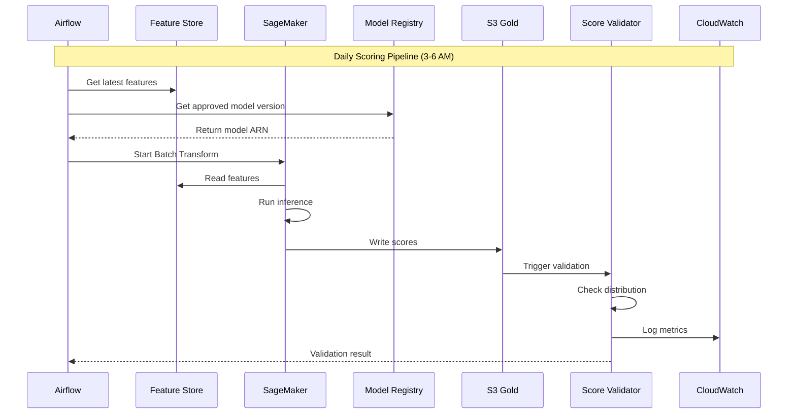

# 05 - Batch Scoring Pipeline

## 📝 Description

As an **Operations Manager**, I want lead scores to be generated automatically on a daily basis so that RMs and inside sales teams have fresh prioritization data every morning to guide their outreach activities.

## 🎯 Acceptance Criteria

### 1. Scoring Pipeline
- Daily batch scoring using SageMaker Batch Transform
- Scores generated for all active leads
- Pipeline triggered after feature engineering completes
- Processing handles millions of leads efficiently

### 2. Score Output
- Scores written to `s3://bucket/analytics/lead_scores/score_date=YYYY-MM-DD/model_version=X.Y/`
- Output includes:
  - lead_id
  - score_value (probability)
  - score_band (Hot/Warm/Cold)
  - top_drivers (JSON array of top 5 features)
  - model_version
  - score_timestamp
- Scores registered in Glue Catalog analytics_db.lead_scores

### 3. Score Quality
- Score distribution validated against expected ranges
- Anomaly detection for unusual score patterns
- Score statistics logged (mean, percentiles, band distribution)
- Alerts for unexpected changes in score distribution

### 4. SLA Compliance
- Scoring complete by 6 AM daily
- End-to-end pipeline from ingestion to scores < 4 hours
- Status updates logged throughout pipeline
- Dashboard showing pipeline progress

## 🔒 Technical Constraints

- Use approved model version from Model Registry
- Scoring must match training-time feature logic
- Batch Transform must run in VPC
- Scores encrypted at rest

## 📦 Dependencies

- Feature Engineering Pipeline (Lead Scoring Story 03)
- Model Training Pipeline (Lead Scoring Story 04)
- Approved model in Model Registry
- Airflow orchestration (Data Platform Story 04)

## ✅ Tasks

### Pipeline Development
- ⬜ Create SageMaker Batch Transform configuration
- ⬜ Implement feature retrieval for active leads
- ⬜ Configure model version retrieval from registry
- ⬜ Set up score output formatting

### Quality Assurance
- ⬜ Implement score distribution validation
- ⬜ Create anomaly detection rules
- ⬜ Set up score statistics logging
- ⬜ Configure alerts for distribution anomalies

### Orchestration
- ⬜ Create Airflow DAG for scoring pipeline
- ⬜ Configure dependencies on feature engineering
- ⬜ Set up SLA monitoring
- ⬜ Create status notification workflow

### Validation
- ⬜ Test end-to-end scoring pipeline
- ⬜ Verify score output schema
- ⬜ Validate SLA compliance
- ⬜ Test recovery from partial failures

## 📊 Success Metrics

| Metric | Target |
|--------|--------|
| Pipeline success rate | >99% daily scoring runs complete |
| SLA adherence | Scores available by 6 AM 95% of time |
| Score coverage | 100% active leads scored |
| Processing throughput | Handle 1M+ leads in <1 hour |

## 🔗 Related Documents

- [Architecture Overview - ML Platform](../../../architecture/overview.md)
- [Data Flows Architecture](../../../architecture/data-flows.md)
- [Value Delivery Roadmap - Phase 1](../../../architecture/value-delivery-roadmap.md)

## 📚 Relevant Context

### Strategic Alignment
This story operationalizes **REQ-001: Lead Prioritisation Intelligence** by delivering daily automated scoring to frontline teams. The batch scoring pipeline implements the "Minimum Viable AI Product" stage from the [Business Case](../../../project-context/business-case.md): "Scheduled batch scoring, CRM integration, Basic dashboard."

### Architecture Context
- **Daily Lead Scoring Pipeline**: Follows the sequence diagram in [Architecture Overview §6.1](../../../architecture/overview.md): Features → SageMaker Batch Transform → Gold Zone → API Gateway → CRM
- **Batch-First Strategy**: Per [Data Platform Strategy §3.3](../../../architecture/data-platform-strategy.md), batch processing meets initial business SLAs with lower complexity
- **Score Storage**: Outputs to Gold zone at `s3://bucket/analytics/lead_scores/` per [Data Flows §5.3](../../../architecture/data-flows.md)

### Timeline & Milestones
- Part of **Phase 1** "Integration & Pilot Launch" (Weeks 8-10) per [Value Delivery Roadmap §3.1](../../../architecture/value-delivery-roadmap.md)
- Target milestone: **M5: Integration Live** (Week 9) - Scoring pipeline operational
- SLA: Scores available by 6 AM daily (data freshness requirement per Strategy §1.3)

### Key Risks & Constraints
- **R04 (High)**: Insufficient time for full uplift measurement - track leading indicators (contact rate, meeting bookings) during pilot ([Risk Register](../../../architecture/risk-constraint-register.md))
- **R11 (High)**: Model performance degradation over time - implement score distribution monitoring as early warning
- **C14**: Phase 1 PoC must demonstrate value within 5 weeks - scoring pipeline is critical path
- **C15**: Production launch targeted within 12 weeks - pipeline reliability >99% required

### Platform Health Metrics
Per [Data Platform Strategy §6.1](../../../architecture/data-platform-strategy.md):
- Data pipeline success rate: >99%
- Data freshness SLA adherence: >95%
- Mean time to recover (MTTR): <4 hours

### Technology Stack
Per [Tech Stack](../../../project-context/tech-stack.md):
- **SageMaker Batch Transform** for daily/hourly scoring with predictable cost
- **SageMaker Model Registry** for retrieving approved model versions
- **Amazon MWAA / Step Functions** for workflow orchestration
- **Amazon CloudWatch** for pipeline monitoring and SLA tracking
- **Amazon S3** for score output storage (Gold zone)

---

## Implementation Plan

### 1. Feature Overview

**Goal:** Generate lead scores automatically on a daily basis so that RMs and inside sales teams have fresh prioritization data every morning to guide their outreach activities.

**Primary User Role:** Operations Manager

**Business Value:** Delivers automated daily scoring by 6 AM with >99% pipeline success rate, directly enabling RM productivity gains of 20-30% more leads processed per day.

### 2. Component Analysis & Reuse Strategy

#### Existing Components
| Component | Location | Reuse Decision |
|-----------|----------|----------------|
| Feature Store | Lead Scoring Story 03 | **REUSE** - Scoring input |
| Trained Model | Lead Scoring Story 04 | **REUSE** - Model artifact |
| MWAA | Data Platform Story 04 | **REUSE** - Orchestration |
| Model Registry | Data Governance Story 03 | **REUSE** - Model retrieval |

#### New Components Required
| Component | Purpose | Priority |
|-----------|---------|----------|
| Batch Transform Config | SageMaker configuration | High |
| Score Validation Job | Anomaly detection | High |
| Score Output Formatter | Standard output schema | High |
| SLA Monitoring | Pipeline timing alerts | Medium |

### 3. Affected Files

#### ML Code
| File Path | Action | Description |
|-----------|--------|-------------|
| `src/ml/scoring/batch_transform_config.py` | [CREATE] | Transform configuration |
| `src/ml/scoring/score_formatter.py` | [CREATE] | Output formatting |
| `src/ml/scoring/score_validator.py` | [CREATE] | Score validation |
| `src/ml/scoring/driver_extractor.py` | [CREATE] | Top driver extraction |

#### Infrastructure
| File Path | Action | Description |
|-----------|--------|-------------|
| `infra/components/ml/batch_transform.tf` | [CREATE] | Batch Transform config |

#### Airflow DAGs
| File Path | Action | Description |
|-----------|--------|-------------|
| `src/airflow/dags/ml_scoring_dag.py` | [MODIFY] | Add scoring tasks |

#### Tests
| File Path | Action | Description |
|-----------|--------|-------------|
| `tests/scoring/test_batch_transform.py` | [CREATE] | Transform tests |
| `tests/scoring/test_score_validator.py` | [CREATE] | Validation tests |

### 4. Component Breakdown

#### 4.1 Score Output Schema

```json
{
  "output_path": "s3://bucket/analytics/lead_scores/score_date={date}/model_version={version}/",
  "schema": {
    "lead_id": "string",
    "score_value": "double",
    "score_band": "string",
    "top_drivers": [
      {"feature": "string", "contribution": "double"}
    ],
    "model_version": "string",
    "score_timestamp": "timestamp"
  }
}
```

#### 4.2 Score Validator

```python
# src/ml/scoring/score_validator.py
"""
Score Validation Module
Detects anomalies in score distributions.
"""

class ScoreValidator:
    """Validates batch scoring output."""
    
    def __init__(self, config: dict):
        self.config = config
        self.baseline_stats = self.load_baseline_stats()
        
    def validate_distribution(self, scores_df: DataFrame) -> dict:
        """Validate score distribution against baseline."""
        current_stats = {
            'mean': scores_df['score_value'].mean(),
            'std': scores_df['score_value'].std(),
            'hot_pct': (scores_df['score_band'] == 'Hot').mean(),
            'warm_pct': (scores_df['score_band'] == 'Warm').mean(),
            'cold_pct': (scores_df['score_band'] == 'Cold').mean(),
        }
        
        # Check for anomalies
        anomalies = []
        if abs(current_stats['mean'] - self.baseline_stats['mean']) > 0.1:
            anomalies.append('mean_shift')
        if current_stats['hot_pct'] > self.baseline_stats['hot_pct'] * 1.5:
            anomalies.append('hot_band_spike')
            
        return {
            'valid': len(anomalies) == 0,
            'anomalies': anomalies,
            'current_stats': current_stats
        }
```

### 5. Data Flow & Pipeline Architecture



### 6. Testing Strategy

| Test Type | Test Description | Expected Outcome |
|-----------|------------------|------------------|
| Unit Test | Score formatting | Correct schema |
| Unit Test | Anomaly detection | Catches distribution shifts |
| Integration Test | End-to-end scoring | All leads scored |
| Performance Test | 1M+ leads | <1 hour processing |
| SLA Test | Complete by 6 AM | >95% SLA adherence |

### 7. Implementation Steps

#### Phase 1: Pipeline Development (Week 8)
- [ ] **Step 1.1:** Create SageMaker Batch Transform configuration
- [ ] **Step 1.2:** Implement feature retrieval for active leads
- [ ] **Step 1.3:** Configure model version retrieval from registry
- [ ] **Step 1.4:** Set up score output formatting

#### Phase 2: Quality Assurance (Week 8-9)
- [ ] **Step 2.1:** Implement score distribution validation
- [ ] **Step 2.2:** Create anomaly detection rules
- [ ] **Step 2.3:** Set up score statistics logging
- [ ] **Step 2.4:** Configure alerts for distribution anomalies

#### Phase 3: Orchestration & Monitoring (Week 9)
- [ ] **Step 3.1:** Create Airflow DAG for scoring pipeline
- [ ] **Step 3.2:** Configure dependencies on feature engineering
- [ ] **Step 3.3:** Set up SLA monitoring (6 AM deadline)
- [ ] **Step 3.4:** Create status notification workflow

### 8. Dependencies & Prerequisites

| Dependency | Source | Status |
|------------|--------|--------|
| Feature Engineering Pipeline | Lead Scoring Story 03 | Required |
| Model Training Pipeline | Lead Scoring Story 04 | Required |
| Approved model in Registry | Data Governance Story 03 | Required |
| Airflow orchestration | Data Platform Story 04 | Required |
