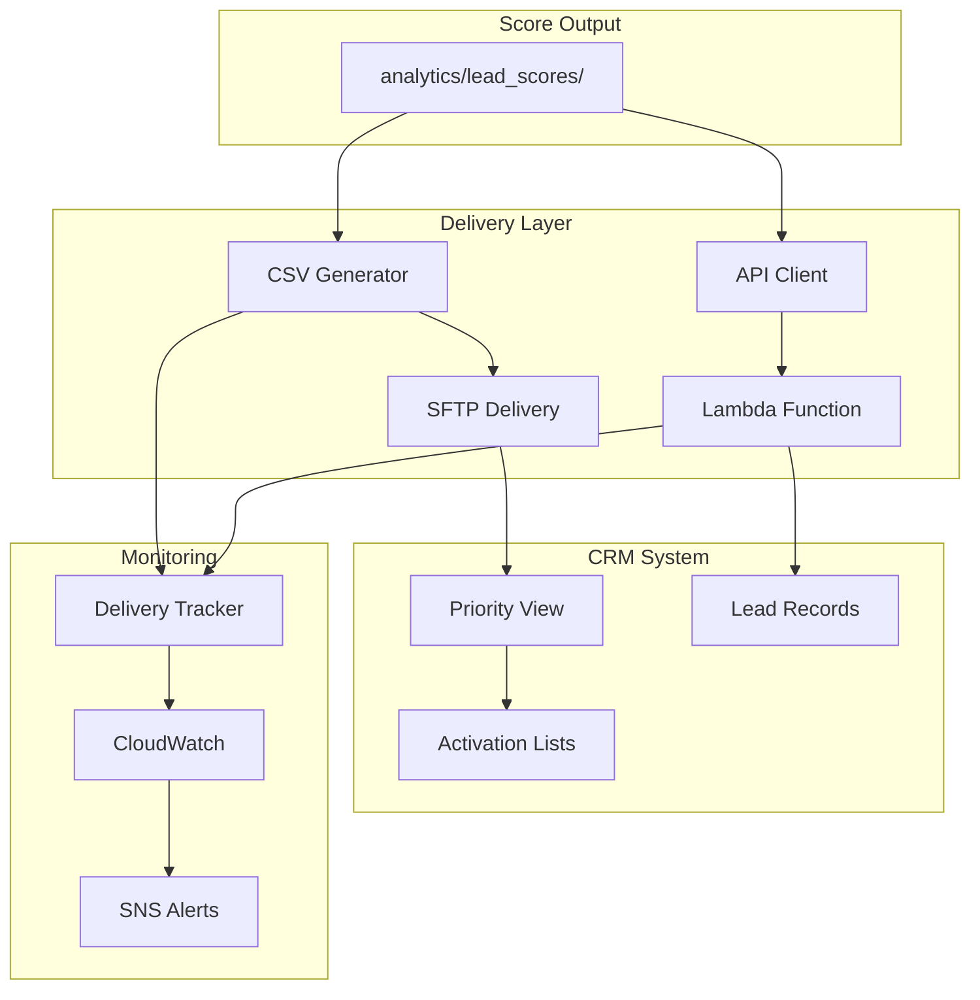

# 06 - CRM Integration for Score Delivery

## 📝 Description

As a **Relationship Manager**, I want lead scores and priority bands delivered to the CRM system so that I can see which leads to contact first and understand why they are prioritized, enabling me to focus my time on high-potential prospects.

## 🎯 Acceptance Criteria

### 1. Score Delivery
- Daily scores pushed to CRM priority view
- Integration supports:
  - Phase 1: CSV file delivery via secure channel
  - Phase 2: API-based real-time push
- Scores visible in CRM lead record within 1 hour of generation

### 2. CRM Display
- Lead score visible on lead record
- Priority band (Hot/Warm/Cold) displayed with visual indicator
- Top 3 drivers shown for context
- Score date/freshness indicated
- Link to detailed explainability if available

### 3. Priority Lists
- Daily activation list generated:
  - Hot leads for immediate follow-up
  - Warm leads for scheduled nurturing
- Lists sortable by score within band
- Assignment to RMs/teams based on rules
- List export capability for offline work

### 4. Audit Trail
- All score deliveries logged
- CRM update confirmations captured
- Failed deliveries trigger retry with alerting
- Score history maintained for trend analysis

## 🔒 Technical Constraints

- CRM credentials stored in Secrets Manager
- API calls must be rate-limited per CRM requirements
- PII handling compliant with data protection policies
- Integration must not impact CRM performance

## 📦 Dependencies

- Batch Scoring Pipeline (Lead Scoring Story 05)
- CRM system API access or file drop location
- API Gateway configured (for API integration)
- Lambda functions for integration logic

## ✅ Tasks

### CSV Integration (Phase 1)
- ⬜ Define CSV schema for score delivery
- ⬜ Create Lambda function for CSV generation
- ⬜ Set up secure file transfer (SFTP or S3)
- ⬜ Configure delivery notification

### API Integration (Phase 2)
- ⬜ Design API payload for score updates
- ⬜ Create Lambda function for batch API calls
- ⬜ Implement rate limiting and retry logic
- ⬜ Configure API Gateway endpoint

### CRM Configuration
- ⬜ Create custom fields for score/band/drivers
- ⬜ Design priority list view
- ⬜ Configure visual indicators for bands
- ⬜ Set up team assignment rules

### Monitoring
- ⬜ Create delivery success dashboard
- ⬜ Set up alerts for delivery failures
- ⬜ Configure audit logging
- ⬜ Implement delivery reconciliation

### Validation
- ⬜ Test CSV delivery end-to-end
- ⬜ Verify scores appear correctly in CRM
- ⬜ Validate priority list functionality
- ⬜ Test failure recovery scenarios

## 📊 Success Metrics

| Metric | Target |
|--------|--------|
| Delivery success rate | >99% daily deliveries successful |
| CRM availability | Scores visible within 1 hour of generation |
| RM adoption | >80% RMs using priority lists daily |
| Data accuracy | 100% scores match source after delivery |

## 🔗 Related Documents

- [Data Flows Architecture](../../../architecture/data-flows.md)
- [Architecture Overview - Integration](../../../architecture/overview.md)
- [Business Case - Integration Path](../../../project-context/business-case.md)

## 📚 Relevant Context

### Strategic Alignment
This story delivers the final step of **REQ-001: Lead Prioritisation Intelligence** - getting scores into the hands of RMs and sales teams. Per [Business Case](../../../project-context/business-case.md), one integration endpoint (CRM priority view OR daily activation list OR campaign audience segment) must be agreed early to enable value realization.

### Architecture Context
- **Integration Pattern**: CRM Integration follows the score delivery flow in [Data Flows §6.4](../../../architecture/data-flows.md): Gold Zone → Lambda → API Gateway → CRM System
- **Phased Approach**: Phase 1 uses CSV/flat-file integration; Phase 2 adds API-based real-time push per [Architecture Overview §3.5](../../../architecture/overview.md)
- **API Design**: RESTful APIs via API Gateway + Lambda for system integration per [Data Platform Strategy §4.3](../../../architecture/data-platform-strategy.md)

### Timeline & Milestones
- Part of **Phase 1** "Integration & Pilot Launch" (Weeks 8-10) per [Value Delivery Roadmap §3.1](../../../architecture/value-delivery-roadmap.md)
- Target milestone: **M5: Integration Live** (Week 9) - CRM integration active with sales teams using priority lists
- Success criteria: >80% RM adoption of priority lists

### Key Risks & Constraints
- **R03 (High)**: CRM integration delays block value realization - mitigate by starting with secure CSV/flat-file integration for PoC, parallel track API development ([Risk Register](../../../architecture/risk-constraint-register.md))
- **R05 (High)**: Low frontline adoption of AI-generated prioritization - co-design priority bands with RMs, keep UI simple, provide training
- **R14 (High)**: External system owners may not prioritize integration work - early stakeholder engagement, executive sponsorship
- **C17**: CRM system changes require coordination with IT operations

### Integration Targets
Per [Architecture Overview §3.5](../../../architecture/overview.md), initial integration points for Phase 1:
- **CRM**: Priority view / API push
- **Inside Sales Tools**: Daily activation list (CSV/API)

### Technology Stack
Per [Tech Stack](../../../project-context/tech-stack.md):
- **Amazon API Gateway + AWS Lambda** for API-based CRM ingestion
- **SFTP/secure file delivery** for CSV-based integration in early phases
- **AWS Secrets Manager** for CRM credential storage
- **Amazon S3** for secure file exchange
- **Amazon CloudWatch** for delivery monitoring and alerting

---

## Implementation Plan

### 1. Feature Overview

**Goal:** Deliver lead scores and priority bands to the CRM system so RMs can see which leads to contact first and understand why they are prioritized.

**Primary User Role:** Relationship Manager

**Business Value:** Enables >80% RM adoption of priority lists, directly driving the 15-25% conversion improvement target. Critical for value realization from the AI Lead Scoring product.

### 2. Component Analysis & Reuse Strategy

#### Existing Components
| Component | Location | Reuse Decision |
|-----------|----------|----------------|
| Score Output | Lead Scoring Story 05 | **REUSE** - Source data |
| API Gateway | Integration Story 01 | **REUSE** - API infrastructure |
| Secrets Manager | Security Story 04 | **REUSE** - CRM credentials |

#### New Components Required
| Component | Purpose | Priority |
|-----------|---------|----------|
| CSV Generator | Phase 1 file delivery | High |
| CRM API Client | Phase 2 API integration | Medium |
| Delivery Tracker | Audit and monitoring | High |
| Priority List Generator | RM activation lists | High |

### 3. Affected Files

#### Integration Code
| File Path | Action | Description |
|-----------|--------|-------------|
| `src/integration/crm/csv_generator.py` | [CREATE] | CSV file generation |
| `src/integration/crm/sftp_delivery.py` | [CREATE] | SFTP file delivery |
| `src/integration/crm/api_client.py` | [CREATE] | CRM API client |
| `src/integration/crm/priority_list.py` | [CREATE] | Priority list generator |
| `src/integration/crm/delivery_tracker.py` | [CREATE] | Delivery tracking |

#### Lambda Functions
| File Path | Action | Description |
|-----------|--------|-------------|
| `src/lambda/score_delivery/handler.py` | [CREATE] | Score delivery Lambda |
| `src/lambda/score_delivery/requirements.txt` | [CREATE] | Lambda dependencies |

#### Tests
| File Path | Action | Description |
|-----------|--------|-------------|
| `tests/integration/test_csv_generator.py` | [CREATE] | CSV tests |
| `tests/integration/test_crm_delivery.py` | [CREATE] | Delivery tests |

### 4. Component Breakdown

#### 4.1 CSV Delivery Schema (Phase 1)

```csv
lead_id,score_value,score_band,driver_1,driver_1_contribution,driver_2,driver_2_contribution,driver_3,driver_3_contribution,model_version,score_date
L12345,0.87,Hot,engagement_score,0.35,recency_days,0.28,channel_quality,0.22,v1.2,2024-12-01
L12346,0.45,Warm,campaign_response,0.30,interaction_freq,0.25,lead_source,0.20,v1.2,2024-12-01
```

#### 4.2 API Payload Schema (Phase 2)

```json
{
  "batch_id": "batch-2024-12-01-001",
  "scores": [
    {
      "lead_id": "L12345",
      "score": 0.87,
      "score_band": "Hot",
      "top_drivers": [
        {"feature": "engagement_score", "contribution": 0.35},
        {"feature": "recency_days", "contribution": 0.28},
        {"feature": "channel_quality", "contribution": 0.22}
      ],
      "model_version": "v1.2",
      "score_date": "2024-12-01"
    }
  ],
  "metadata": {
    "total_records": 1000,
    "delivery_timestamp": "2024-12-01T05:30:00Z"
  }
}
```

#### 4.3 Priority List Generator

```python
# src/integration/crm/priority_list.py
"""
Priority List Generator
Creates daily activation lists for RMs.
"""

class PriorityListGenerator:
    """Generates priority lists from scores."""
    
    def generate_activation_list(self, scores_df: DataFrame, config: dict) -> dict:
        """
        Generate daily activation lists.
        
        Returns:
            Dict with Hot and Warm lists by RM assignment
        """
        # Hot leads for immediate follow-up
        hot_leads = scores_df.filter(col('score_band') == 'Hot') \
            .orderBy(col('score_value').desc())
        
        # Warm leads for scheduled nurturing
        warm_leads = scores_df.filter(col('score_band') == 'Warm') \
            .orderBy(col('score_value').desc())
        
        # Group by assigned RM
        hot_by_rm = hot_leads.groupBy('assigned_rm').agg(
            collect_list(struct('lead_id', 'score_value', 'top_drivers')).alias('leads')
        )
        
        return {
            'hot_leads': hot_by_rm.toPandas().to_dict('records'),
            'warm_leads': warm_leads.limit(config['warm_limit']).toPandas().to_dict('records'),
            'summary': {
                'total_hot': hot_leads.count(),
                'total_warm': warm_leads.count(),
                'generation_timestamp': datetime.utcnow().isoformat()
            }
        }
```

### 5. Data Flow & Pipeline Architecture



### 6. Testing Strategy

| Test Type | Test Description | Expected Outcome |
|-----------|------------------|------------------|
| Unit Test | CSV generation | Correct format/schema |
| Unit Test | Priority list logic | Correct sorting/grouping |
| Integration Test | SFTP delivery | File arrives in CRM |
| Integration Test | API delivery | CRM updates successfully |
| E2E Test | Score visibility | Scores appear in CRM |

### 7. Implementation Steps

#### Phase 1: CSV Integration (Week 8-9)
- [ ] **Step 1.1:** Define CSV schema for score delivery
- [ ] **Step 1.2:** Create Lambda function for CSV generation
- [ ] **Step 1.3:** Set up secure file transfer (SFTP)
- [ ] **Step 1.4:** Configure delivery notification
- [ ] **Step 1.5:** Test end-to-end CSV delivery

#### Phase 2: CRM Configuration (Week 9-10)
- [ ] **Step 2.1:** Create custom fields for score/band/drivers in CRM
- [ ] **Step 2.2:** Design priority list view
- [ ] **Step 2.3:** Configure visual indicators for bands
- [ ] **Step 2.4:** Set up team assignment rules

#### Phase 3: Monitoring & Validation (Week 10)
- [ ] **Step 3.1:** Create delivery success dashboard
- [ ] **Step 3.2:** Set up alerts for delivery failures
- [ ] **Step 3.3:** Configure audit logging
- [ ] **Step 3.4:** Implement delivery reconciliation
- [ ] **Step 3.5:** Test failure recovery scenarios

### 8. Dependencies & Prerequisites

| Dependency | Source | Status |
|------------|--------|--------|
| Batch Scoring Pipeline | Lead Scoring Story 05 | Required |
| CRM API access or file drop | External | Required |
| API Gateway configured | Integration Story 01 | Required (Phase 2) |
| Lambda functions | Infrastructure | Required |
