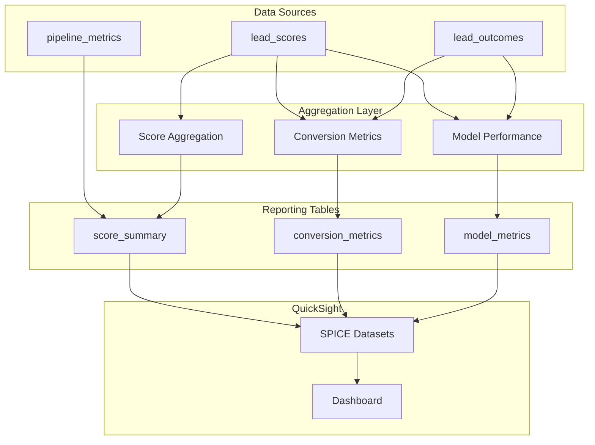

# 07 - Lead Scoring Performance Dashboard

## 📝 Description

As a **Sales Manager**, I want a dashboard showing lead score distribution, conversion tracking, and model performance so that I can monitor the effectiveness of AI-driven prioritization and make data-driven decisions about team focus.

## 🎯 Acceptance Criteria

### 1. Score Distribution View
- Daily score band distribution (Hot/Warm/Cold counts)
- Score distribution histogram
- Trend over time (weekly/monthly)
- Comparison against baseline period

### 2. Conversion Tracking
- Conversion rate by score band
- Lead funnel visualization (scored → contacted → converted)
- Time-to-conversion by band
- A/B comparison vs. non-scored leads (pilot)

### 3. Model Performance Metrics
- Actual vs. predicted conversion rates
- Precision/recall at each band threshold
- Lift chart showing model value
- Feature importance summary

### 4. Operational Metrics
- Pipeline health indicators (success/failure)
- Data freshness (last score update time)
- Coverage metrics (% leads scored)
- Alert status summary

## 🔒 Technical Constraints

- Dashboard built with Amazon QuickSight
- Data sourced from Gold zone (Athena queries)
- Refresh frequency: Daily (automated)
- Access controlled by IAM/QuickSight groups

## 📦 Dependencies

- Batch Scoring Pipeline (Lead Scoring Story 05)
- CRM Integration (Lead Scoring Story 06)
- Outcome data available for conversion tracking
- QuickSight configured with data source access

## ✅ Tasks

### Data Preparation
- ⬜ Create aggregated reporting tables in Gold zone
- ⬜ Define conversion join logic with CRM outcomes
- ⬜ Build Athena views for dashboard queries
- ⬜ Set up incremental refresh for reports

### Dashboard Development
- ⬜ Create score distribution visualizations
- ⬜ Build conversion funnel analysis
- ⬜ Implement model performance charts
- ⬜ Add operational health indicators

### Access Control
- ⬜ Define dashboard access groups
- ⬜ Configure row-level security if needed
- ⬜ Set up scheduled refresh
- ⬜ Create alert rules for KPI deviations

### Documentation
- ⬜ Document metric definitions
- ⬜ Create user guide for dashboard
- ⬜ Define interpretation guidelines
- ⬜ Train sales managers on dashboard use

### Validation
- ⬜ Verify metrics match source data
- ⬜ Test refresh automation
- ⬜ Validate access control rules
- ⬜ Gather user feedback on usability

## 📊 Success Metrics

| Metric | Target |
|--------|--------|
| Dashboard availability | >99.5% uptime |
| Data freshness | Metrics updated by 7 AM daily |
| User adoption | 100% of sales managers access weekly |
| Metric accuracy | Metrics match source within 0.1% |

## 🔗 Related Documents

- [Architecture Overview - Analytics](../../../architecture/overview.md)
- [Value Delivery Roadmap - Success Criteria](../../../architecture/value-delivery-roadmap.md)
- [Tech Stack - QuickSight](../../../project-context/tech-stack.md)

## 📚 Relevant Context

### Strategic Alignment
This story enables measurement of **REQ-001: Lead Prioritisation Intelligence** success criteria per [Business Case](../../../project-context/business-case.md). The dashboard supports the "Closed-Loop Learning System" (REQ-002) by systematically tracking lead outcomes and feeding performance insights back into strategy.

### Architecture Context
- **Analytics Layer**: Dashboard queries Gold zone via Amazon Athena per [Data Flows §6](../../../architecture/data-flows.md)
- **BI Platform**: Amazon QuickSight for dashboards with Athena as data source per [Architecture Overview §2.2](../../../architecture/overview.md)
- **Consumption Pattern**: Self-service access to governed datasets per [Data Platform Strategy §4.4](../../../architecture/data-platform-strategy.md)

### Timeline & Milestones
- Part of **Phase 1** "Measurement, Optimization & Scale Blueprint" (Weeks 10-12) per [Value Delivery Roadmap §3.1](../../../architecture/value-delivery-roadmap.md)
- Target milestone: **M6: Phase 1 Go-Live** (Week 12) - Performance dashboard operational
- Dashboard enables Week 5 PoC report: "Uplift signals, Governance artefacts, Recommendation for Phase 1 production rollout"

### Success Metrics Alignment
Per [Value Delivery Roadmap §3.1.3](../../../architecture/value-delivery-roadmap.md), the dashboard tracks:
- Lead conversion improvement: 15-25% uplift for Hot leads vs. baseline
- RM productivity: 20-30% more leads processed/day
- Time-to-prioritization: Reduce from manual (days) to automated (daily)
- Governance compliance: 100% auditability of scoring decisions

### Key Risks & Constraints
- **R04 (High)**: Insufficient time for full uplift measurement - dashboard should track leading indicators (contact rate, meeting bookings) alongside lagging metrics ([Risk Register](../../../architecture/risk-constraint-register.md))
- **A11**: Assumes conversion improvement will be measurable within 3-6 months - define leading indicators alongside lagging metrics
- Dashboard must support A/B comparison for pilot cohort vs. non-scored leads

### Observability Stack
Per [Data Platform Strategy §3.6](../../../architecture/data-platform-strategy.md):
- **Pipeline Monitoring**: Amazon CloudWatch (logs, metrics, alarms)
- **Data Quality Dashboards**: Amazon QuickSight
- **Model Performance**: SageMaker Model Monitor metrics integration

### Technology Stack
Per [Tech Stack](../../../project-context/tech-stack.md):
- **Amazon QuickSight** for PoC dashboards (lead volume, score distribution, activation indicators)
- **Amazon Athena** for ad-hoc queries against Gold zone
- **AWS Glue Data Catalog** for table metadata and schema documentation
- **Amazon CloudWatch** for operational metrics (pipeline health, data freshness)

---

## Implementation Plan

### 1. Feature Overview

**Goal:** Create a dashboard showing lead score distribution, conversion tracking, and model performance so Sales Managers can monitor AI-driven prioritization effectiveness and make data-driven decisions.

**Primary User Role:** Sales Manager

**Business Value:** Enables measurement of REQ-001 success with visibility into 15-25% conversion improvement target. Supports closed-loop learning by tracking lead outcomes.

### 2. Component Analysis & Reuse Strategy

#### Existing Components
| Component | Location | Reuse Decision |
|-----------|----------|----------------|
| Score Output | Lead Scoring Story 05 | **REUSE** - Dashboard data source |
| Athena | Data Platform | **REUSE** - Query engine |
| Gold Zone Tables | Data Platform Story 01 | **REUSE** - Data storage |

#### New Components Required
| Component | Purpose | Priority |
|-----------|---------|----------|
| Reporting Tables | Aggregated metrics | High |
| QuickSight Datasets | Dashboard data sources | High |
| Dashboard Visualizations | Charts and KPIs | High |
| SPICE Refresh | Scheduled data refresh | Medium |

### 3. Affected Files

#### SQL/Data Preparation
| File Path | Action | Description |
|-----------|--------|-------------|
| `src/analytics/sql/score_distribution.sql` | [CREATE] | Score band aggregation |
| `src/analytics/sql/conversion_tracking.sql` | [CREATE] | Conversion metrics |
| `src/analytics/sql/model_performance.sql` | [CREATE] | Model performance metrics |
| `src/analytics/sql/operational_health.sql` | [CREATE] | Pipeline health metrics |

#### Glue Jobs
| File Path | Action | Description |
|-----------|--------|-------------|
| `src/etl/reporting/aggregate_scores.py` | [CREATE] | Score aggregation job |
| `src/etl/reporting/conversion_join.py` | [CREATE] | Outcome joining |

#### Documentation
| File Path | Action | Description |
|-----------|--------|-------------|
| `docs/dashboards/performance-dashboard-guide.md` | [CREATE] | Dashboard user guide |
| `docs/dashboards/metric-definitions.md` | [CREATE] | Metric documentation |

### 4. Component Breakdown

#### 4.1 Dashboard Sections

| Section | Visualizations | Data Source |
|---------|---------------|-------------|
| **Score Distribution** | Band distribution bar chart, Histogram, Trend line | analytics_db.score_summary |
| **Conversion Tracking** | Funnel chart, Conversion rate by band, Time-to-conversion | analytics_db.conversion_metrics |
| **Model Performance** | Lift chart, Precision/Recall, Feature importance | analytics_db.model_metrics |
| **Operational Health** | Pipeline status, Data freshness, Coverage | analytics_db.operational_health |

#### 4.2 Key Metrics

```sql
-- Score Distribution Query
SELECT 
    score_date,
    score_band,
    COUNT(*) as lead_count,
    AVG(score_value) as avg_score,
    PERCENTILE_APPROX(score_value, 0.5) as median_score
FROM analytics_db.lead_scores
WHERE score_date >= DATE_SUB(CURRENT_DATE, 30)
GROUP BY score_date, score_band
ORDER BY score_date DESC, 
    CASE score_band WHEN 'Hot' THEN 1 WHEN 'Warm' THEN 2 ELSE 3 END;

-- Conversion Rate by Band
SELECT 
    s.score_band,
    COUNT(DISTINCT s.lead_id) as total_leads,
    COUNT(DISTINCT CASE WHEN o.converted = 1 THEN s.lead_id END) as converted_leads,
    ROUND(COUNT(DISTINCT CASE WHEN o.converted = 1 THEN s.lead_id END) * 100.0 / 
          COUNT(DISTINCT s.lead_id), 2) as conversion_rate
FROM analytics_db.lead_scores s
LEFT JOIN analytics_db.lead_outcomes o ON s.lead_id = o.lead_id
WHERE s.score_date = CURRENT_DATE - 30  -- Allow conversion window
GROUP BY s.score_band;

-- Model Lift Calculation
SELECT 
    'Scored (Hot)' as cohort,
    conversion_rate / baseline_rate as lift
FROM (
    SELECT 
        AVG(CASE WHEN score_band = 'Hot' AND converted = 1 THEN 1.0 ELSE 0.0 END) as conversion_rate,
        AVG(CASE WHEN converted = 1 THEN 1.0 ELSE 0.0 END) as baseline_rate
    FROM analytics_db.lead_performance
);
```

#### 4.3 QuickSight Dataset Configuration

```json
{
  "datasets": [
    {
      "name": "score_distribution",
      "source": "Athena",
      "sql": "score_distribution.sql",
      "spice_mode": "SPICE",
      "refresh_schedule": "Daily 6:30 AM"
    },
    {
      "name": "conversion_metrics",
      "source": "Athena",
      "sql": "conversion_tracking.sql",
      "spice_mode": "SPICE",
      "refresh_schedule": "Daily 7:00 AM"
    },
    {
      "name": "model_performance",
      "source": "Athena",
      "sql": "model_performance.sql",
      "spice_mode": "SPICE",
      "refresh_schedule": "Weekly Sunday"
    }
  ]
}
```

### 5. Data Flow & Pipeline Architecture



### 6. Dashboard Wireframe

```
┌─────────────────────────────────────────────────────────────────────┐
│                    Lead Scoring Performance Dashboard                │
├─────────────────────────────────────────────────────────────────────┤
│  ┌───────────────┐ ┌───────────────┐ ┌───────────────┐ ┌──────────┐│
│  │ Total Leads   │ │ Hot Leads     │ │ Conversion    │ │ Model    ││
│  │ Scored: 10K   │ │ Today: 1,200  │ │ Rate: 18%     │ │ Lift: 2.3││
│  └───────────────┘ └───────────────┘ └───────────────┘ └──────────┘│
├─────────────────────────────────────────────────────────────────────┤
│  ┌───────────────────────────────┐  ┌─────────────────────────────┐│
│  │    Score Band Distribution    │  │    Conversion by Band       ││
│  │         ████████ Hot 12%      │  │    Hot   ████████████ 45%   ││
│  │    ████████████ Warm 38%      │  │    Warm  ██████ 18%         ││
│  │    ██████████████████ Cold    │  │    Cold  ██ 5%              ││
│  └───────────────────────────────┘  └─────────────────────────────┘│
├─────────────────────────────────────────────────────────────────────┤
│  ┌───────────────────────────────┐  ┌─────────────────────────────┐│
│  │     Score Trend (30 days)     │  │      Lead Funnel            ││
│  │    /\    /\                   │  │    Scored ─── 10,000        ││
│  │   /  \  /  \                  │  │    Contacted ─ 6,500        ││
│  │  /    \/    \                 │  │    Converted ─ 1,200        ││
│  └───────────────────────────────┘  └─────────────────────────────┘│
├─────────────────────────────────────────────────────────────────────┤
│  Pipeline Health: ✅ All Green  │  Last Refresh: 2024-12-01 06:30  │
└─────────────────────────────────────────────────────────────────────┘
```

### 7. Testing Strategy

| Test Type | Test Description | Expected Outcome |
|-----------|------------------|------------------|
| Data Validation | Metrics match source | <0.1% variance |
| Refresh Test | SPICE refresh | Updates by 7 AM |
| Access Test | User group permissions | Correct access |
| Visual Test | Chart rendering | All charts load |

### 8. Implementation Steps

#### Phase 1: Data Preparation (Week 10)
- [ ] **Step 1.1:** Create aggregated reporting tables in Gold zone
- [ ] **Step 1.2:** Define conversion join logic with CRM outcomes
- [ ] **Step 1.3:** Build Athena views for dashboard queries
- [ ] **Step 1.4:** Set up incremental refresh for reports

#### Phase 2: Dashboard Development (Week 10-11)
- [ ] **Step 2.1:** Create QuickSight SPICE datasets
- [ ] **Step 2.2:** Build score distribution visualizations
- [ ] **Step 2.3:** Create conversion funnel analysis
- [ ] **Step 2.4:** Implement model performance charts
- [ ] **Step 2.5:** Add operational health indicators

#### Phase 3: Access & Documentation (Week 11-12)
- [ ] **Step 3.1:** Define dashboard access groups
- [ ] **Step 3.2:** Configure row-level security if needed
- [ ] **Step 3.3:** Set up scheduled refresh
- [ ] **Step 3.4:** Document metric definitions
- [ ] **Step 3.5:** Create user guide for dashboard

### 9. Dependencies & Prerequisites

| Dependency | Source | Status |
|------------|--------|--------|
| Batch Scoring Pipeline | Lead Scoring Story 05 | Required |
| CRM Integration | Lead Scoring Story 06 | Required |
| Outcome data available | External | Required |
| QuickSight configured | Infrastructure | Required |
