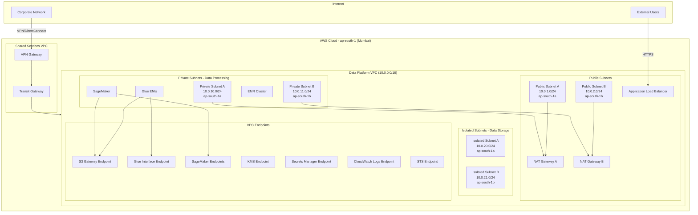
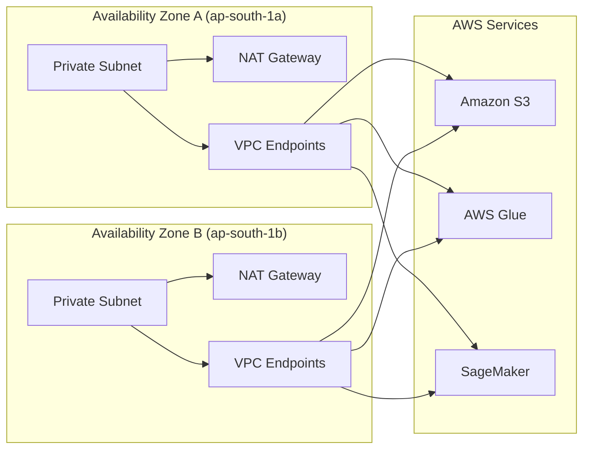
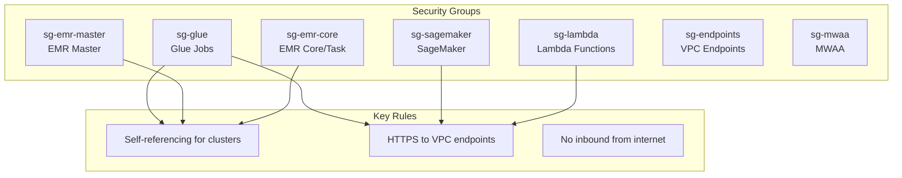
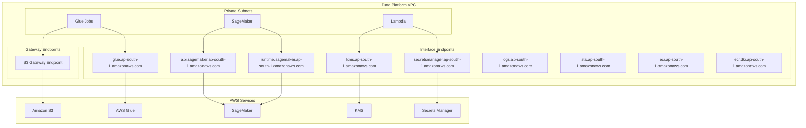
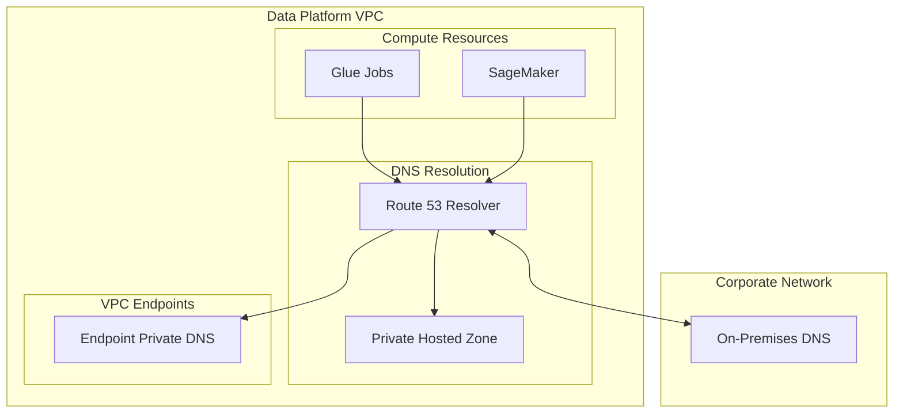
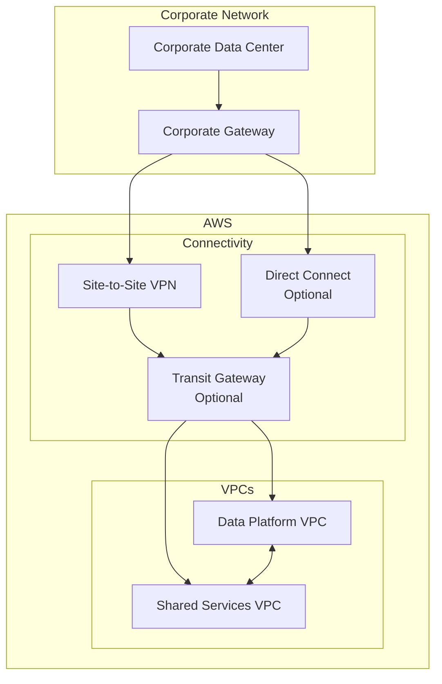

# Network and Security Architecture

**Document Owner:** Infrastructure & Security Team  
**Last Updated:** December 2024  
**Status:** Active  
**Related Documents:** [Security & Governance](../../../docs/architecture/security-governance.md) | [Component Specifications](./component-specifications.md) | [Operations](./operations.md)

---

## 1. Overview

This document details the network topology, security controls, and connectivity design for the Nuvama Data Platform. The architecture prioritizes security, isolation, and compliance with financial services requirements while enabling efficient data processing and ML workloads.

---

## 2. Network Topology and Isolation Design

### 2.1 High-Level Network Architecture



### 2.2 Subnet Design

| Subnet Type | CIDR | Purpose | Availability Zone | Internet Access |
|-------------|------|---------|-------------------|-----------------|
| **Public A** | 10.0.1.0/24 | NAT Gateway, ALB | ap-south-1a | Direct (IGW) |
| **Public B** | 10.0.2.0/24 | NAT Gateway, ALB | ap-south-1b | Direct (IGW) |
| **Private A** | 10.0.10.0/24 | Glue, EMR, SageMaker, Lambda | ap-south-1a | Via NAT Gateway |
| **Private B** | 10.0.11.0/24 | Glue, EMR, SageMaker, Lambda | ap-south-1b | Via NAT Gateway |
| **Isolated A** | 10.0.20.0/24 | Reserved for databases | ap-south-1a | None |
| **Isolated B** | 10.0.21.0/24 | Reserved for databases | ap-south-1b | None |
| **Endpoint A** | 10.0.30.0/24 | VPC Endpoints | ap-south-1a | Via Endpoints |
| **Endpoint B** | 10.0.31.0/24 | VPC Endpoints | ap-south-1b | Via Endpoints |

### 2.3 Multi-AZ Design



---

## 3. Virtual Network Configuration

### 3.1 VPC Configuration

```hcl
# VPC
resource "aws_vpc" "data_platform" {
  cidr_block           = "10.0.0.0/16"
  enable_dns_hostnames = true
  enable_dns_support   = true
  
  tags = {
    Name        = "data-platform-vpc-${var.environment}"
    Environment = var.environment
    Project     = "data-platform"
  }
}

# Internet Gateway
resource "aws_internet_gateway" "main" {
  vpc_id = aws_vpc.data_platform.id
  
  tags = {
    Name = "data-platform-igw-${var.environment}"
  }
}

# Elastic IPs for NAT Gateways
resource "aws_eip" "nat" {
  count  = 2
  domain = "vpc"
  
  tags = {
    Name = "data-platform-nat-eip-${count.index + 1}-${var.environment}"
  }
}

# NAT Gateways
resource "aws_nat_gateway" "main" {
  count         = 2
  allocation_id = aws_eip.nat[count.index].id
  subnet_id     = aws_subnet.public[count.index].id
  
  tags = {
    Name = "data-platform-nat-${count.index + 1}-${var.environment}"
  }
}
```

### 3.2 Subnet Configuration

```hcl
# Public Subnets
resource "aws_subnet" "public" {
  count                   = 2
  vpc_id                  = aws_vpc.data_platform.id
  cidr_block              = "10.0.${count.index + 1}.0/24"
  availability_zone       = data.aws_availability_zones.available.names[count.index]
  map_public_ip_on_launch = false
  
  tags = {
    Name = "data-platform-public-${count.index + 1}-${var.environment}"
    Type = "public"
  }
}

# Private Subnets
resource "aws_subnet" "private" {
  count             = 2
  vpc_id            = aws_vpc.data_platform.id
  cidr_block        = "10.0.${count.index + 10}.0/24"
  availability_zone = data.aws_availability_zones.available.names[count.index]
  
  tags = {
    Name = "data-platform-private-${count.index + 1}-${var.environment}"
    Type = "private"
  }
}

# Isolated Subnets (for future databases)
resource "aws_subnet" "isolated" {
  count             = 2
  vpc_id            = aws_vpc.data_platform.id
  cidr_block        = "10.0.${count.index + 20}.0/24"
  availability_zone = data.aws_availability_zones.available.names[count.index]
  
  tags = {
    Name = "data-platform-isolated-${count.index + 1}-${var.environment}"
    Type = "isolated"
  }
}

# Endpoint Subnets
resource "aws_subnet" "endpoints" {
  count             = 2
  vpc_id            = aws_vpc.data_platform.id
  cidr_block        = "10.0.${count.index + 30}.0/24"
  availability_zone = data.aws_availability_zones.available.names[count.index]
  
  tags = {
    Name = "data-platform-endpoints-${count.index + 1}-${var.environment}"
    Type = "endpoints"
  }
}
```

### 3.3 Route Tables

```hcl
# Public Route Table
resource "aws_route_table" "public" {
  vpc_id = aws_vpc.data_platform.id
  
  route {
    cidr_block = "0.0.0.0/0"
    gateway_id = aws_internet_gateway.main.id
  }
  
  tags = {
    Name = "data-platform-public-rt-${var.environment}"
  }
}

# Private Route Tables (one per AZ for NAT Gateway)
resource "aws_route_table" "private" {
  count  = 2
  vpc_id = aws_vpc.data_platform.id
  
  route {
    cidr_block     = "0.0.0.0/0"
    nat_gateway_id = aws_nat_gateway.main[count.index].id
  }
  
  tags = {
    Name = "data-platform-private-rt-${count.index + 1}-${var.environment}"
  }
}

# Isolated Route Table (no internet access)
resource "aws_route_table" "isolated" {
  vpc_id = aws_vpc.data_platform.id
  
  tags = {
    Name = "data-platform-isolated-rt-${var.environment}"
  }
}
```

---

## 4. Firewall Rules and Security Groups

### 4.1 Security Group Design



### 4.2 Security Group Configurations

#### Glue Security Group

```hcl
resource "aws_security_group" "glue" {
  name        = "data-platform-glue-${var.environment}"
  description = "Security group for Glue jobs"
  vpc_id      = aws_vpc.data_platform.id
  
  # Self-referencing rule for Glue workers
  ingress {
    description = "Self-reference for Glue workers"
    from_port   = 0
    to_port     = 65535
    protocol    = "tcp"
    self        = true
  }
  
  # Outbound to VPC endpoints
  egress {
    description     = "HTTPS to VPC endpoints"
    from_port       = 443
    to_port         = 443
    protocol        = "tcp"
    security_groups = [aws_security_group.endpoints.id]
  }
  
  # Outbound to S3 (via gateway endpoint - no SG needed)
  egress {
    description     = "S3 via gateway endpoint"
    from_port       = 443
    to_port         = 443
    protocol        = "tcp"
    prefix_list_ids = [aws_vpc_endpoint.s3.prefix_list_id]
  }
  
  tags = {
    Name = "data-platform-glue-${var.environment}"
  }
}
```

#### SageMaker Security Group

```hcl
resource "aws_security_group" "sagemaker" {
  name        = "data-platform-sagemaker-${var.environment}"
  description = "Security group for SageMaker resources"
  vpc_id      = aws_vpc.data_platform.id
  
  # Inbound for notebook access (if using VPC mode)
  ingress {
    description     = "NFS for EFS"
    from_port       = 2049
    to_port         = 2049
    protocol        = "tcp"
    self            = true
  }
  
  # Self-referencing for distributed training
  ingress {
    description = "Self-reference for distributed training"
    from_port   = 0
    to_port     = 65535
    protocol    = "tcp"
    self        = true
  }
  
  # Outbound to VPC endpoints
  egress {
    description     = "HTTPS to VPC endpoints"
    from_port       = 443
    to_port         = 443
    protocol        = "tcp"
    security_groups = [aws_security_group.endpoints.id]
  }
  
  # Outbound to S3
  egress {
    description     = "S3 via gateway endpoint"
    from_port       = 443
    to_port         = 443
    protocol        = "tcp"
    prefix_list_ids = [aws_vpc_endpoint.s3.prefix_list_id]
  }
  
  tags = {
    Name = "data-platform-sagemaker-${var.environment}"
  }
}
```

#### Lambda Security Group

```hcl
resource "aws_security_group" "lambda" {
  name        = "data-platform-lambda-${var.environment}"
  description = "Security group for Lambda functions"
  vpc_id      = aws_vpc.data_platform.id
  
  # No inbound rules - Lambda doesn't accept inbound connections
  
  # Outbound to VPC endpoints
  egress {
    description     = "HTTPS to VPC endpoints"
    from_port       = 443
    to_port         = 443
    protocol        = "tcp"
    security_groups = [aws_security_group.endpoints.id]
  }
  
  # Outbound to S3
  egress {
    description     = "S3 via gateway endpoint"
    from_port       = 443
    to_port         = 443
    protocol        = "tcp"
    prefix_list_ids = [aws_vpc_endpoint.s3.prefix_list_id]
  }
  
  tags = {
    Name = "data-platform-lambda-${var.environment}"
  }
}
```

#### VPC Endpoints Security Group

```hcl
resource "aws_security_group" "endpoints" {
  name        = "data-platform-endpoints-${var.environment}"
  description = "Security group for VPC endpoints"
  vpc_id      = aws_vpc.data_platform.id
  
  # Inbound HTTPS from private subnets
  ingress {
    description = "HTTPS from private subnets"
    from_port   = 443
    to_port     = 443
    protocol    = "tcp"
    cidr_blocks = [
      "10.0.10.0/24",  # Private Subnet A
      "10.0.11.0/24",  # Private Subnet B
    ]
  }
  
  tags = {
    Name = "data-platform-endpoints-${var.environment}"
  }
}
```

#### EMR Security Groups

```hcl
# Note: Bastion security group should be defined separately if SSH access is required
# resource "aws_security_group" "bastion" { ... }

resource "aws_security_group" "emr_master" {
  name        = "data-platform-emr-master-${var.environment}"
  description = "Security group for EMR master node"
  vpc_id      = aws_vpc.data_platform.id
  
  # SSH from bastion (if needed - uncomment when bastion is configured)
  # ingress {
  #   description     = "SSH from bastion"
  #   from_port       = 22
  #   to_port         = 22
  #   protocol        = "tcp"
  #   security_groups = [aws_security_group.bastion.id]
  # }
  
  # Communication from core nodes
  ingress {
    description     = "All traffic from core nodes"
    from_port       = 0
    to_port         = 65535
    protocol        = "tcp"
    security_groups = [aws_security_group.emr_core.id]
  }
  
  # Self-referencing
  ingress {
    description = "Self-reference"
    from_port   = 0
    to_port     = 65535
    protocol    = "tcp"
    self        = true
  }
  
  egress {
    description = "All outbound"
    from_port   = 0
    to_port     = 0
    protocol    = "-1"
    cidr_blocks = ["0.0.0.0/0"]
  }
  
  tags = {
    Name = "data-platform-emr-master-${var.environment}"
  }
}

resource "aws_security_group" "emr_core" {
  name        = "data-platform-emr-core-${var.environment}"
  description = "Security group for EMR core/task nodes"
  vpc_id      = aws_vpc.data_platform.id
  
  # Communication from master
  ingress {
    description     = "All traffic from master"
    from_port       = 0
    to_port         = 65535
    protocol        = "tcp"
    security_groups = [aws_security_group.emr_master.id]
  }
  
  # Self-referencing for core-to-core communication
  ingress {
    description = "Self-reference"
    from_port   = 0
    to_port     = 65535
    protocol    = "tcp"
    self        = true
  }
  
  egress {
    description = "All outbound"
    from_port   = 0
    to_port     = 0
    protocol    = "-1"
    cidr_blocks = ["0.0.0.0/0"]
  }
  
  tags = {
    Name = "data-platform-emr-core-${var.environment}"
  }
}
```

### 4.3 Security Group Matrix

| Source/Destination | sg-glue | sg-sagemaker | sg-lambda | sg-endpoints | sg-emr-master | sg-emr-core |
|--------------------|---------|--------------|-----------|--------------|---------------|-------------|
| **sg-glue** | ✅ All | - | - | ✅ 443 | - | - |
| **sg-sagemaker** | - | ✅ All | - | ✅ 443 | - | - |
| **sg-lambda** | - | - | - | ✅ 443 | - | - |
| **sg-emr-master** | - | - | - | ✅ 443 | ✅ All | ✅ All |
| **sg-emr-core** | - | - | - | ✅ 443 | ✅ All | ✅ All |
| **Private Subnets** | - | - | - | ✅ 443 | - | - |

---

## 5. Private Endpoints and Service Endpoints

### 5.1 VPC Endpoint Strategy



### 5.2 VPC Endpoint Configurations

#### Gateway Endpoint (S3)

```hcl
resource "aws_vpc_endpoint" "s3" {
  vpc_id            = aws_vpc.data_platform.id
  service_name      = "com.amazonaws.${var.region}.s3"
  vpc_endpoint_type = "Gateway"
  
  route_table_ids = concat(
    aws_route_table.private[*].id,
    [aws_route_table.isolated.id]
  )
  
  policy = jsonencode({
    Version = "2012-10-17"
    Statement = [
      {
        Sid       = "AllowS3Access"
        Effect    = "Allow"
        Principal = "*"
        Action    = "s3:*"
        Resource = [
          aws_s3_bucket.data_lake.arn,
          "${aws_s3_bucket.data_lake.arn}/*",
          aws_s3_bucket.scripts.arn,
          "${aws_s3_bucket.scripts.arn}/*"
        ]
      }
    ]
  })
  
  tags = {
    Name = "data-platform-s3-endpoint-${var.environment}"
  }
}
```

#### Interface Endpoints

```hcl
# Common interface endpoint configuration
locals {
  interface_endpoints = {
    glue = {
      service_name = "com.amazonaws.${var.region}.glue"
      private_dns  = true
    }
    sagemaker_api = {
      service_name = "com.amazonaws.${var.region}.sagemaker.api"
      private_dns  = true
    }
    sagemaker_runtime = {
      service_name = "com.amazonaws.${var.region}.sagemaker.runtime"
      private_dns  = true
    }
    kms = {
      service_name = "com.amazonaws.${var.region}.kms"
      private_dns  = true
    }
    secretsmanager = {
      service_name = "com.amazonaws.${var.region}.secretsmanager"
      private_dns  = true
    }
    logs = {
      service_name = "com.amazonaws.${var.region}.logs"
      private_dns  = true
    }
    sts = {
      service_name = "com.amazonaws.${var.region}.sts"
      private_dns  = true
    }
    ecr_api = {
      service_name = "com.amazonaws.${var.region}.ecr.api"
      private_dns  = true
    }
    ecr_dkr = {
      service_name = "com.amazonaws.${var.region}.ecr.dkr"
      private_dns  = true
    }
    athena = {
      service_name = "com.amazonaws.${var.region}.athena"
      private_dns  = true
    }
  }
}

resource "aws_vpc_endpoint" "interface" {
  for_each = local.interface_endpoints
  
  vpc_id              = aws_vpc.data_platform.id
  service_name        = each.value.service_name
  vpc_endpoint_type   = "Interface"
  private_dns_enabled = each.value.private_dns
  
  subnet_ids         = aws_subnet.endpoints[*].id
  security_group_ids = [aws_security_group.endpoints.id]
  
  tags = {
    Name = "data-platform-${each.key}-endpoint-${var.environment}"
  }
}
```

### 5.3 Endpoint Summary

| Endpoint | Type | Private DNS | Purpose |
|----------|------|-------------|---------|
| S3 | Gateway | N/A | Data lake access |
| Glue | Interface | Yes | Glue API calls |
| SageMaker API | Interface | Yes | SageMaker control plane |
| SageMaker Runtime | Interface | Yes | Model inference |
| KMS | Interface | Yes | Encryption operations |
| Secrets Manager | Interface | Yes | Secret retrieval |
| CloudWatch Logs | Interface | Yes | Log delivery |
| STS | Interface | Yes | IAM token service |
| ECR API | Interface | Yes | Container registry |
| ECR DKR | Interface | Yes | Container image pull |
| Athena | Interface | Yes | Query execution |

---

## 6. DNS Configuration

### 6.1 DNS Architecture



### 6.2 Route 53 Configuration

```hcl
# Private Hosted Zone for custom DNS
resource "aws_route53_zone" "private" {
  name = "data-platform.internal"
  
  vpc {
    vpc_id = aws_vpc.data_platform.id
  }
  
  tags = {
    Name = "data-platform-private-zone-${var.environment}"
  }
}

# DNS records for internal services
resource "aws_route53_record" "api" {
  zone_id = aws_route53_zone.private.zone_id
  name    = "api.data-platform.internal"
  type    = "A"
  
  alias {
    name                   = aws_lb.api.dns_name
    zone_id                = aws_lb.api.zone_id
    evaluate_target_health = true
  }
}
```

### 6.3 DNS Resolution Flow

| Query | Resolution Path |
|-------|-----------------|
| `s3.ap-south-1.amazonaws.com` | VPC DNS → S3 Gateway Endpoint |
| `glue.ap-south-1.amazonaws.com` | VPC DNS → Glue Interface Endpoint (Private DNS) |
| `sagemaker.ap-south-1.amazonaws.com` | VPC DNS → SageMaker Interface Endpoint (Private DNS) |
| `api.data-platform.internal` | VPC DNS → Private Hosted Zone |
| `corporate.internal` | VPC DNS → Route 53 Resolver → On-premises DNS |

---

## 7. VPN/ExpressRoute Integration

### 7.1 Connectivity Options

| Option | Use Case | Bandwidth | Latency | Cost |
|--------|----------|-----------|---------|------|
| **Site-to-Site VPN** | Standard connectivity | Up to 1.25 Gbps | Variable | Low |
| **AWS Direct Connect** | High-bandwidth, consistent | 1-100 Gbps | Low, consistent | High |
| **Transit Gateway** | Multi-VPC connectivity | Aggregated | Low | Medium |

### 7.2 Site-to-Site VPN Configuration

```hcl
# Customer Gateway (Corporate)
resource "aws_customer_gateway" "corporate" {
  bgp_asn    = 65000
  ip_address = var.corporate_vpn_ip
  type       = "ipsec.1"
  
  tags = {
    Name = "data-platform-corporate-cgw-${var.environment}"
  }
}

# Virtual Private Gateway
resource "aws_vpn_gateway" "main" {
  vpc_id = aws_vpc.data_platform.id
  
  tags = {
    Name = "data-platform-vgw-${var.environment}"
  }
}

# VPN Connection
resource "aws_vpn_connection" "corporate" {
  vpn_gateway_id      = aws_vpn_gateway.main.id
  customer_gateway_id = aws_customer_gateway.corporate.id
  type                = "ipsec.1"
  static_routes_only  = false
  
  tags = {
    Name = "data-platform-vpn-${var.environment}"
  }
}

# Route propagation
resource "aws_vpn_gateway_route_propagation" "private" {
  count          = 2
  vpn_gateway_id = aws_vpn_gateway.main.id
  route_table_id = aws_route_table.private[count.index].id
}
```

### 7.3 Transit Gateway Configuration (If Multi-VPC)

```hcl
# Transit Gateway
resource "aws_ec2_transit_gateway" "main" {
  description                     = "Data Platform Transit Gateway"
  default_route_table_association = "enable"
  default_route_table_propagation = "enable"
  dns_support                     = "enable"
  vpn_ecmp_support                = "enable"
  
  tags = {
    Name = "data-platform-tgw-${var.environment}"
  }
}

# VPC Attachment
resource "aws_ec2_transit_gateway_vpc_attachment" "data_platform" {
  subnet_ids         = aws_subnet.private[*].id
  transit_gateway_id = aws_ec2_transit_gateway.main.id
  vpc_id             = aws_vpc.data_platform.id
  
  tags = {
    Name = "data-platform-tgw-attachment-${var.environment}"
  }
}
```

### 7.4 Network Connectivity Diagram



---

## 8. Network Security Controls

### 8.1 Network ACLs

```hcl
# Private Subnet NACL
resource "aws_network_acl" "private" {
  vpc_id     = aws_vpc.data_platform.id
  subnet_ids = aws_subnet.private[*].id
  
  # Inbound Rules
  ingress {
    rule_no    = 100
    action     = "allow"
    protocol   = "tcp"
    from_port  = 443
    to_port    = 443
    cidr_block = "10.0.0.0/16"
  }
  
  ingress {
    rule_no    = 200
    action     = "allow"
    protocol   = "tcp"
    from_port  = 1024
    to_port    = 65535
    cidr_block = "0.0.0.0/0"  # Return traffic
  }
  
  ingress {
    rule_no    = 32766
    action     = "deny"
    protocol   = "-1"
    from_port  = 0
    to_port    = 0
    cidr_block = "0.0.0.0/0"
  }
  
  # Outbound Rules
  egress {
    rule_no    = 100
    action     = "allow"
    protocol   = "tcp"
    from_port  = 443
    to_port    = 443
    cidr_block = "0.0.0.0/0"
  }
  
  egress {
    rule_no    = 200
    action     = "allow"
    protocol   = "tcp"
    from_port  = 1024
    to_port    = 65535
    cidr_block = "10.0.0.0/16"
  }
  
  egress {
    rule_no    = 32766
    action     = "deny"
    protocol   = "-1"
    from_port  = 0
    to_port    = 0
    cidr_block = "0.0.0.0/0"
  }
  
  tags = {
    Name = "data-platform-private-nacl-${var.environment}"
  }
}
```

### 8.2 VPC Flow Logs

```hcl
# Flow Log to CloudWatch
resource "aws_flow_log" "vpc" {
  iam_role_arn    = aws_iam_role.flow_log.arn
  log_destination = aws_cloudwatch_log_group.flow_log.arn
  traffic_type    = "ALL"
  vpc_id          = aws_vpc.data_platform.id
  
  tags = {
    Name = "data-platform-flow-log-${var.environment}"
  }
}

resource "aws_cloudwatch_log_group" "flow_log" {
  name              = "/aws/vpc/data-platform-${var.environment}"
  retention_in_days = 90
  kms_key_id        = aws_kms_key.data_platform.arn
}
```

### 8.3 Network Firewall (Optional - Enhanced Security)

```hcl
# AWS Network Firewall (for advanced inspection)
resource "aws_networkfirewall_firewall" "main" {
  count               = var.enable_network_firewall ? 1 : 0
  name                = "data-platform-firewall-${var.environment}"
  firewall_policy_arn = aws_networkfirewall_firewall_policy.main[0].arn
  vpc_id              = aws_vpc.data_platform.id
  
  dynamic "subnet_mapping" {
    for_each = aws_subnet.firewall
    content {
      subnet_id = subnet_mapping.value.id
    }
  }
  
  tags = {
    Name = "data-platform-firewall-${var.environment}"
  }
}
```

---

## 9. Network Monitoring and Alerting

### 9.1 Monitoring Components

| Component | Purpose | Metrics |
|-----------|---------|---------|
| VPC Flow Logs | Traffic analysis | Bytes, packets, accept/reject |
| CloudWatch | Endpoint metrics | Connections, latency |
| NAT Gateway | Outbound traffic | Bytes out, connections |
| VPN | Tunnel status | Tunnel state, bytes in/out |

### 9.2 CloudWatch Alarms

```hcl
# NAT Gateway bandwidth alarm
resource "aws_cloudwatch_metric_alarm" "nat_bandwidth" {
  count               = 2
  alarm_name          = "nat-gateway-bandwidth-${count.index + 1}-${var.environment}"
  comparison_operator = "GreaterThanThreshold"
  evaluation_periods  = 2
  metric_name         = "BytesOutToDestination"
  namespace           = "AWS/NATGateway"
  period              = 300
  statistic           = "Sum"
  threshold           = 5000000000  # 5 GB per 5 minutes
  alarm_description   = "NAT Gateway outbound traffic is high"
  alarm_actions       = [aws_sns_topic.alerts.arn]
  
  dimensions = {
    NatGatewayId = aws_nat_gateway.main[count.index].id
  }
}

# VPN tunnel status
resource "aws_cloudwatch_metric_alarm" "vpn_tunnel" {
  alarm_name          = "vpn-tunnel-down-${var.environment}"
  comparison_operator = "LessThanThreshold"
  evaluation_periods  = 2
  metric_name         = "TunnelState"
  namespace           = "AWS/VPN"
  period              = 300
  statistic           = "Maximum"
  threshold           = 1
  alarm_description   = "VPN tunnel is down"
  alarm_actions       = [aws_sns_topic.alerts.arn]
  
  dimensions = {
    VpnId = aws_vpn_connection.corporate.id
  }
}
```

---

## 10. References

- [Security & Governance](../../../docs/architecture/security-governance.md)
- [Component Specifications](./component-specifications.md)
- [Operations Guide](./operations.md)
- [Architecture Overview](../../../docs/architecture/overview.md)
