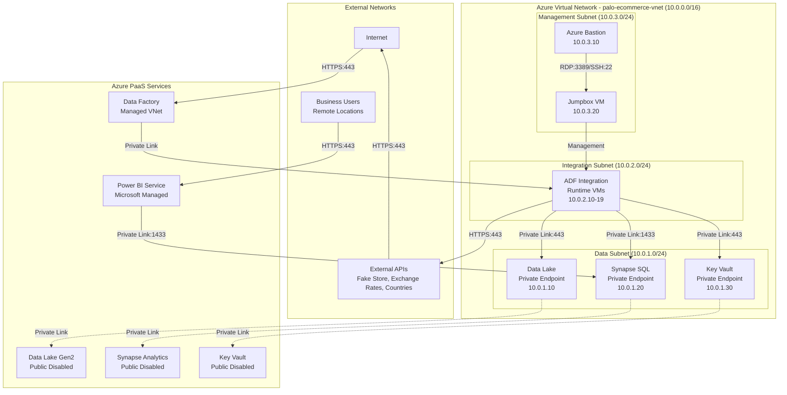

# Network Security Architecture

## Overview

This document details the network security architecture for the PALO IT e-Commerce data platform, including network topology, isolation strategies, firewall rules, private endpoints, and connectivity patterns. The architecture implements a defense-in-depth approach with multiple security layers.

**Security Principles**:
- **Network Isolation**: Private endpoints for all data services (no public internet exposure)
- **Zero Trust Network**: Verify every connection, even within Azure
- **Least Privilege Access**: Firewall rules allow only necessary traffic
- **Defense in Depth**: Multiple security boundaries (NSGs, firewalls, private endpoints)

---

## Network Topology

### High-Level Network Architecture



---

## Virtual Network Configuration

### VNet Specification

**Resource**: `palo-ecommerce-vnet`

```yaml
virtual_network:
  name: "palo-ecommerce-vnet"
  location: "East US"
  address_space: ["10.0.0.0/16"]
  
  dns_servers:
    - "168.63.129.16"  # Azure-provided DNS
    - "10.0.0.2"       # Custom DNS (if needed)
  
  ddos_protection_plan:
    enabled: false  # Optional: $2,944/month
  
  subnets:
    - name: "data-subnet"
      address_prefix: "10.0.1.0/24"
      service_endpoints:
        - "Microsoft.Storage"
        - "Microsoft.Sql"
        - "Microsoft.KeyVault"
      delegation: null
      private_endpoint_network_policies_enabled: true
      private_link_service_network_policies_enabled: true
    
    - name: "integration-subnet"
      address_prefix: "10.0.2.0/24"
      service_endpoints:
        - "Microsoft.Storage"
        - "Microsoft.Sql"
      delegation:
        name: "Microsoft.DataFactory/factories"
        service_delegation:
          name: "Microsoft.DataFactory/factories"
          actions: ["Microsoft.Network/virtualNetworks/subnets/join/action"]
      private_endpoint_network_policies_enabled: true
    
    - name: "management-subnet"
      address_prefix: "10.0.3.0/24"
      service_endpoints: []
      delegation: null
      private_endpoint_network_policies_enabled: true
    
    - name: "AzureBastionSubnet"  # Reserved name for Azure Bastion
      address_prefix: "10.0.4.0/27"
      service_endpoints: []
      delegation: null
```

**Subnet Design Rationale**:
- **Data Subnet**: Hosts private endpoints for data services (isolates data layer)
- **Integration Subnet**: Hosts ADF integration runtime (isolates processing layer)
- **Management Subnet**: Hosts jumpbox and admin tools (isolates management plane)
- **Bastion Subnet**: Reserved for Azure Bastion secure remote access

---

## Network Security Groups (NSGs)

### Data Subnet NSG

**Resource**: `data-subnet-nsg`

```yaml
network_security_group:
  name: "data-subnet-nsg"
  location: "East US"
  
  security_rules:
    # Inbound Rules
    - name: "Allow_HTTPS_from_Integration_Subnet"
      priority: 100
      direction: "Inbound"
      access: "Allow"
      protocol: "Tcp"
      source_port_range: "*"
      destination_port_range: "443"
      source_address_prefix: "10.0.2.0/24"  # Integration subnet
      destination_address_prefix: "10.0.1.0/24"  # Data subnet
      description: "Allow HTTPS from ADF integration runtime to data services"
    
    - name: "Allow_SQL_from_Integration_Subnet"
      priority: 110
      direction: "Inbound"
      access: "Allow"
      protocol: "Tcp"
      source_port_range: "*"
      destination_port_range: "1433"
      source_address_prefix: "10.0.2.0/24"
      destination_address_prefix: "10.0.1.0/24"
      description: "Allow SQL connections from ADF to Synapse private endpoint"
    
    - name: "Allow_SQL_from_PowerBI"
      priority: 120
      direction: "Inbound"
      access: "Allow"
      protocol: "Tcp"
      source_port_range: "*"
      destination_port_range: "1433"
      source_address_prefix: "PowerBI"  # Service Tag
      destination_address_prefix: "10.0.1.20"  # Synapse PE
      description: "Allow Power BI Service to query Synapse"
    
    - name: "Allow_Management_from_Jumpbox"
      priority: 130
      direction: "Inbound"
      access: "Allow"
      protocol: "Tcp"
      source_port_range: "*"
      destination_port_ranges: ["443", "1433"]
      source_address_prefix: "10.0.3.20/32"  # Jumpbox IP
      destination_address_prefix: "10.0.1.0/24"
      description: "Allow admin access from jumpbox"
    
    - name: "Deny_All_Inbound"
      priority: 4096
      direction: "Inbound"
      access: "Deny"
      protocol: "*"
      source_port_range: "*"
      destination_port_range: "*"
      source_address_prefix: "*"
      destination_address_prefix: "*"
      description: "Explicit deny all other inbound traffic"
    
    # Outbound Rules
    - name: "Allow_HTTPS_Outbound"
      priority: 100
      direction: "Outbound"
      access: "Allow"
      protocol: "Tcp"
      source_port_range: "*"
      destination_port_range: "443"
      source_address_prefix: "10.0.1.0/24"
      destination_address_prefix: "*"
      description: "Allow outbound HTTPS"
    
    - name: "Allow_Azure_Services_Outbound"
      priority: 110
      direction: "Outbound"
      access: "Allow"
      protocol: "*"
      source_port_range: "*"
      destination_port_range: "*"
      source_address_prefix: "10.0.1.0/24"
      destination_address_prefix: "AzureCloud"  # Service Tag
      description: "Allow communication with Azure services"
    
    - name: "Deny_All_Outbound"
      priority: 4096
      direction: "Outbound"
      access: "Deny"
      protocol: "*"
      source_port_range: "*"
      destination_port_range: "*"
      source_address_prefix: "*"
      destination_address_prefix: "*"
      description: "Explicit deny all other outbound traffic"
```

---

### Integration Subnet NSG

**Resource**: `integration-subnet-nsg`

```yaml
network_security_group:
  name: "integration-subnet-nsg"
  location: "East US"
  
  security_rules:
    # Inbound Rules
    - name: "Allow_ADF_Control_Plane"
      priority: 100
      direction: "Inbound"
      access: "Allow"
      protocol: "Tcp"
      source_port_range: "*"
      destination_port_range: "443"
      source_address_prefix: "DataFactoryManagement"  # Service Tag
      destination_address_prefix: "10.0.2.0/24"
      description: "Allow ADF service to manage integration runtime"
    
    - name: "Allow_Management_from_Jumpbox"
      priority: 110
      direction: "Inbound"
      access: "Allow"
      protocol: "Tcp"
      source_port_range: "*"
      destination_port_ranges: ["443", "3389", "22"]
      source_address_prefix: "10.0.3.20/32"  # Jumpbox
      destination_address_prefix: "10.0.2.0/24"
      description: "Allow admin access from jumpbox"
    
    - name: "Deny_All_Inbound"
      priority: 4096
      direction: "Inbound"
      access: "Deny"
      protocol: "*"
      source_port_range: "*"
      destination_port_range: "*"
      source_address_prefix: "*"
      destination_address_prefix: "*"
    
    # Outbound Rules
    - name: "Allow_HTTPS_to_Internet"
      priority: 100
      direction: "Outbound"
      access: "Allow"
      protocol: "Tcp"
      source_port_range: "*"
      destination_port_range: "443"
      source_address_prefix: "10.0.2.0/24"
      destination_address_prefix: "Internet"
      description: "Allow API calls to external data sources"
    
    - name: "Allow_to_Data_Subnet"
      priority: 110
      direction: "Outbound"
      access: "Allow"
      protocol: "Tcp"
      source_port_range: "*"
      destination_port_ranges: ["443", "1433"]
      source_address_prefix: "10.0.2.0/24"
      destination_address_prefix: "10.0.1.0/24"
      description: "Allow ADF to access data services"
    
    - name: "Allow_Azure_Services_Outbound"
      priority: 120
      direction: "Outbound"
      access: "Allow"
      protocol: "*"
      source_port_range: "*"
      destination_port_range: "*"
      source_address_prefix: "10.0.2.0/24"
      destination_address_prefix: "AzureCloud"
      description: "Allow communication with Azure services"
    
    - name: "Deny_All_Outbound"
      priority: 4096
      direction: "Outbound"
      access: "Deny"
      protocol: "*"
      source_port_range: "*"
      destination_port_range: "*"
      source_address_prefix: "*"
      destination_address_prefix: "*"
```

---

### Management Subnet NSG

**Resource**: `management-subnet-nsg`

```yaml
network_security_group:
  name: "management-subnet-nsg"
  location: "East US"
  
  security_rules:
    # Inbound Rules
    - name: "Allow_RDP_from_Bastion"
      priority: 100
      direction: "Inbound"
      access: "Allow"
      protocol: "Tcp"
      source_port_range: "*"
      destination_port_range: "3389"
      source_address_prefix: "10.0.4.0/27"  # Bastion subnet
      destination_address_prefix: "10.0.3.0/24"
      description: "Allow RDP from Azure Bastion"
    
    - name: "Allow_SSH_from_Bastion"
      priority: 110
      direction: "Inbound"
      access: "Allow"
      protocol: "Tcp"
      source_port_range: "*"
      destination_port_range: "22"
      source_address_prefix: "10.0.4.0/27"
      destination_address_prefix: "10.0.3.0/24"
      description: "Allow SSH from Azure Bastion"
    
    - name: "Deny_All_Inbound"
      priority: 4096
      direction: "Inbound"
      access: "Deny"
      protocol: "*"
      source_port_range: "*"
      destination_port_range: "*"
      source_address_prefix: "*"
      destination_address_prefix: "*"
    
    # Outbound Rules
    - name: "Allow_to_Data_Subnet"
      priority: 100
      direction: "Outbound"
      access: "Allow"
      protocol: "Tcp"
      source_port_range: "*"
      destination_port_ranges: ["443", "1433"]
      source_address_prefix: "10.0.3.0/24"
      destination_address_prefix: "10.0.1.0/24"
      description: "Allow management access to data services"
    
    - name: "Allow_to_Integration_Subnet"
      priority: 110
      direction: "Outbound"
      access: "Allow"
      protocol: "Tcp"
      source_port_range: "*"
      destination_port_ranges: ["443", "3389", "22"]
      source_address_prefix: "10.0.3.0/24"
      destination_address_prefix: "10.0.2.0/24"
      description: "Allow management of ADF IR VMs"
    
    - name: "Allow_Azure_Services_Outbound"
      priority: 120
      direction: "Outbound"
      access: "Allow"
      protocol: "*"
      source_port_range: "*"
      destination_port_range: "*"
      source_address_prefix: "10.0.3.0/24"
      destination_address_prefix: "AzureCloud"
    
    - name: "Deny_All_Outbound"
      priority: 4096
      direction: "Outbound"
      access: "Deny"
      protocol: "*"
      source_port_range: "*"
      destination_port_range: "*"
      source_address_prefix: "*"
      destination_address_prefix: "*"
```

---

## Private Endpoints

### Azure Data Lake Gen2 Private Endpoint

**Resource**: `datalake-private-endpoint`

```yaml
private_endpoint:
  name: "datalake-pe"
  location: "East US"
  subnet_id: "/subscriptions/{sub}/resourceGroups/palo-ecommerce-rg/providers/Microsoft.Network/virtualNetworks/palo-ecommerce-vnet/subnets/data-subnet"
  
  private_service_connection:
    name: "datalake-psc"
    private_connection_resource_id: "/subscriptions/{sub}/resourceGroups/palo-ecommerce-rg/providers/Microsoft.Storage/storageAccounts/paloecommercedatalake"
    group_ids: ["dfs"]  # Data Lake Gen2 endpoint
    is_manual_connection: false
  
  private_dns_zone_group:
    name: "datalake-dns-group"
    private_dns_zone_ids:
      - "/subscriptions/{sub}/resourceGroups/palo-ecommerce-rg/providers/Microsoft.Network/privateDnsZones/privatelink.dfs.core.windows.net"
  
  custom_network_interface_name: "datalake-pe-nic"
  ip_configuration:
    - name: "datalake-pe-ip"
      private_ip_address: "10.0.1.10"
      private_ip_allocation_method: "Static"
```

**DNS Configuration**:
```yaml
private_dns_zone:
  name: "privatelink.dfs.core.windows.net"
  location: "global"
  
  virtual_network_links:
    - name: "datalake-dns-link"
      virtual_network_id: "/subscriptions/{sub}/resourceGroups/palo-ecommerce-rg/providers/Microsoft.Network/virtualNetworks/palo-ecommerce-vnet"
      registration_enabled: false
  
  dns_records:
    - name: "paloecommercedatalake"
      type: "A"
      ttl: 3600
      records: ["10.0.1.10"]
```

**Storage Account Networking**:
```yaml
storage_account_network_rules:
  name: "paloecommercedatalake"
  
  network_rules:
    default_action: "Deny"
    bypass: "AzureServices"  # Allow Azure services like ADF
    ip_rules: []  # No public IP access
    virtual_network_rules: []  # All access via private endpoint
  
  public_network_access: "Disabled"
```

---

### Azure Synapse Analytics Private Endpoint

**Resource**: `synapse-private-endpoint`

```yaml
private_endpoint:
  name: "synapse-sql-pe"
  location: "East US"
  subnet_id: "/subscriptions/{sub}/resourceGroups/palo-ecommerce-rg/providers/Microsoft.Network/virtualNetworks/palo-ecommerce-vnet/subnets/data-subnet"
  
  private_service_connection:
    name: "synapse-sql-psc"
    private_connection_resource_id: "/subscriptions/{sub}/resourceGroups/palo-ecommerce-rg/providers/Microsoft.Synapse/workspaces/palo-ecommerce-synapse"
    group_ids: ["Sql"]  # SQL endpoint (not SqlOnDemand)
    is_manual_connection: false
  
  private_dns_zone_group:
    name: "synapse-dns-group"
    private_dns_zone_ids:
      - "/subscriptions/{sub}/resourceGroups/palo-ecommerce-rg/providers/Microsoft.Network/privateDnsZones/privatelink.sql.azuresynapse.net"
  
  custom_network_interface_name: "synapse-sql-pe-nic"
  ip_configuration:
    - name: "synapse-sql-pe-ip"
      private_ip_address: "10.0.1.20"
      private_ip_allocation_method: "Static"
```

**DNS Configuration**:
```yaml
private_dns_zone:
  name: "privatelink.sql.azuresynapse.net"
  location: "global"
  
  virtual_network_links:
    - name: "synapse-dns-link"
      virtual_network_id: "/subscriptions/{sub}/resourceGroups/palo-ecommerce-rg/providers/Microsoft.Network/virtualNetworks/palo-ecommerce-vnet"
      registration_enabled: false
  
  dns_records:
    - name: "palo-ecommerce-synapse"
      type: "A"
      ttl: 3600
      records: ["10.0.1.20"]
```

**Synapse Workspace Networking**:
```yaml
synapse_workspace_network:
  name: "palo-ecommerce-synapse"
  
  managed_virtual_network: "default"
  public_network_access: "Disabled"
  
  firewall_rules:
    - name: "AllowPowerBI"
      start_ip_address: "0.0.0.0"
      end_ip_address: "0.0.0.0"  # Represents Power BI service tag
    
    - name: "DenyAllOtherTraffic"
      start_ip_address: "0.0.0.0"
      end_ip_address: "0.0.0.0"
      action: "Deny"
```

---

### Azure Key Vault Private Endpoint

**Resource**: `keyvault-private-endpoint`

```yaml
private_endpoint:
  name: "keyvault-pe"
  location: "East US"
  subnet_id: "/subscriptions/{sub}/resourceGroups/palo-ecommerce-rg/providers/Microsoft.Network/virtualNetworks/palo-ecommerce-vnet/subnets/data-subnet"
  
  private_service_connection:
    name: "keyvault-psc"
    private_connection_resource_id: "/subscriptions/{sub}/resourceGroups/palo-ecommerce-rg/providers/Microsoft.KeyVault/vaults/palo-ecommerce-kv"
    group_ids: ["vault"]
    is_manual_connection: false
  
  private_dns_zone_group:
    name: "keyvault-dns-group"
    private_dns_zone_ids:
      - "/subscriptions/{sub}/resourceGroups/palo-ecommerce-rg/providers/Microsoft.Network/privateDnsZones/privatelink.vaultcore.azure.net"
  
  custom_network_interface_name: "keyvault-pe-nic"
  ip_configuration:
    - name: "keyvault-pe-ip"
      private_ip_address: "10.0.1.30"
      private_ip_allocation_method: "Static"
```

**DNS Configuration**:
```yaml
private_dns_zone:
  name: "privatelink.vaultcore.azure.net"
  location: "global"
  
  virtual_network_links:
    - name: "keyvault-dns-link"
      virtual_network_id: "/subscriptions/{sub}/resourceGroups/palo-ecommerce-rg/providers/Microsoft.Network/virtualNetworks/palo-ecommerce-vnet"
      registration_enabled: false
  
  dns_records:
    - name: "palo-ecommerce-kv"
      type: "A"
      ttl: 3600
      records: ["10.0.1.30"]
```

**Key Vault Networking**:
```yaml
key_vault_network:
  name: "palo-ecommerce-kv"
  
  network_acls:
    bypass: "AzureServices"
    default_action: "Deny"
    ip_rules: []
    virtual_network_rules: []
  
  public_network_access: "Disabled"
```

---

## Azure Bastion Configuration

### Bastion Host Specification

**Resource**: `palo-ecommerce-bastion`

```yaml
bastion_host:
  name: "palo-ecommerce-bastion"
  location: "East US"
  sku: "Standard"
  
  ip_configuration:
    name: "bastion-ip-config"
    subnet_id: "/subscriptions/{sub}/resourceGroups/palo-ecommerce-rg/providers/Microsoft.Network/virtualNetworks/palo-ecommerce-vnet/subnets/AzureBastionSubnet"
    public_ip_address_id: "/subscriptions/{sub}/resourceGroups/palo-ecommerce-rg/providers/Microsoft.Network/publicIPAddresses/bastion-public-ip"
  
  enable_tunneling: true  # Allow SSH/RDP tunneling
  enable_ip_connect: false
  enable_shareable_link: false
  scale_units: 2  # Concurrent sessions

public_ip_address:
  name: "bastion-public-ip"
  location: "East US"
  sku: "Standard"
  allocation_method: "Static"
  ip_version: "IPv4"
```

**Usage**:
```bash
# Connect to jumpbox via Bastion
az network bastion rdp \
  --name palo-ecommerce-bastion \
  --resource-group palo-ecommerce-rg \
  --target-resource-id /subscriptions/{sub}/resourceGroups/palo-ecommerce-rg/providers/Microsoft.Compute/virtualMachines/jumpbox-vm
```

**Cost**: ~$140/month (Standard SKU, 2 scale units)

---

## Data Flow Network Paths

### Path 1: API Ingestion (External → Bronze)

```
External API (HTTPS:443)
    ↓
Internet Gateway
    ↓
Azure Data Factory (Public Endpoint)
    ↓
ADF Managed VNet (Private Link)
    ↓
Integration Subnet (10.0.2.0/24)
    ↓ NSG Rule: Allow_to_Data_Subnet
Data Subnet (10.0.1.0/24)
    ↓ Private Endpoint (10.0.1.10)
Data Lake Gen2 - Bronze Container
```

**Security Controls**:
- TLS 1.2 encryption for API calls
- NSG allows only 443 from Integration Subnet to Data Subnet
- Private endpoint eliminates public Data Lake access
- ADF managed identity authentication (no stored credentials)

---

### Path 2: Transformation (Bronze/Silver → Gold)

```
Data Lake Gen2 - Silver Container
    ↑ Private Endpoint (10.0.1.10)
Data Subnet (10.0.1.0/24)
    ↑ NSG Rule: Allow_SQL_from_Integration_Subnet
Integration Subnet (10.0.2.0/24)
    ↑ dbt execution (via ADF or dbt Cloud)
Synapse Analytics Private Endpoint (10.0.1.20)
    ↓
Synapse SQL Pool - Gold Database
```

**Security Controls**:
- dbt uses service principal with db_datareader/db_datawriter roles
- NSG allows only SQL port 1433 between subnets
- Synapse TDE encrypts data at rest (AES-256)
- Private endpoint prevents public Synapse access

---

### Path 3: Consumption (Gold → Power BI)

```
Synapse SQL Pool - Gold Database
    ↑ Private Endpoint (10.0.1.20)
Data Subnet (10.0.1.0/24)
    ↑ NSG Rule: Allow_SQL_from_PowerBI
Power BI Service (Microsoft-Managed)
    ↓ TLS 1.2
Business User Browser (HTTPS:443)
```

**Security Controls**:
- Power BI uses service principal with db_datareader role
- NSG allows Power BI Service Tag to access Synapse private endpoint
- Row-level security (RLS) in Power BI restricts data access
- User authentication via Microsoft Entra ID with MFA

---

### Path 4: Management Access

```
Administrator Workstation (Remote)
    ↓ HTTPS:443
Azure Portal
    ↓ Azure Bastion (Public IP)
Bastion Subnet (10.0.4.0/27)
    ↓ RDP:3389 or SSH:22
Management Subnet (10.0.3.0/24)
    ↓ Jumpbox VM (10.0.3.20)
    ↓ NSG Rule: Allow_Management_from_Jumpbox
Data Subnet (10.0.1.0/24) or Integration Subnet (10.0.2.0/24)
```

**Security Controls**:
- No direct RDP/SSH from internet (only via Bastion)
- Bastion provides browser-based RDP/SSH (no client software)
- Jumpbox has conditional access policies (MFA, compliant device)
- All management actions logged to Azure Monitor

---

## Firewall & Route Tables

### Azure Firewall (Optional - Future Phase)

**Use Case**: Centralized egress filtering for all outbound internet traffic

**Configuration** (if implemented):
```yaml
azure_firewall:
  name: "palo-ecommerce-fw"
  sku: "Standard"
  firewall_policy_id: "/subscriptions/{sub}/resourceGroups/palo-ecommerce-rg/providers/Microsoft.Network/firewallPolicies/palo-ecommerce-fw-policy"
  
  ip_configuration:
    name: "fw-ip-config"
    subnet_id: "/subscriptions/{sub}/resourceGroups/palo-ecommerce-rg/providers/Microsoft.Network/virtualNetworks/palo-ecommerce-vnet/subnets/AzureFirewallSubnet"
    public_ip_address_id: "/subscriptions/{sub}/resourceGroups/palo-ecommerce-rg/providers/Microsoft.Network/publicIPAddresses/fw-public-ip"

firewall_policy:
  name: "palo-ecommerce-fw-policy"
  
  application_rules:
    - name: "AllowExternalAPIs"
      priority: 100
      action: "Allow"
      rules:
        - name: "FakeStoreAPI"
          protocols: ["https"]
          destination_fqdns: ["fakestoreapi.com"]
          source_addresses: ["10.0.2.0/24"]
        
        - name: "ExchangeRatesAPI"
          protocols: ["https"]
          destination_fqdns: ["api.exchangeratesapi.io"]
          source_addresses: ["10.0.2.0/24"]
        
        - name: "RESTCountriesAPI"
          protocols: ["https"]
          destination_fqdns: ["restcountries.com"]
          source_addresses: ["10.0.2.0/24"]
  
  network_rules:
    - name: "AllowAzureServices"
      priority: 200
      action: "Allow"
      rules:
        - name: "AllowAzureCloud"
          protocols: ["Any"]
          destination_ports: ["*"]
          destination_addresses: ["AzureCloud"]
          source_addresses: ["10.0.0.0/16"]
```

**Route Table** (force traffic through firewall):
```yaml
route_table:
  name: "integration-subnet-rt"
  location: "East US"
  
  routes:
    - name: "DefaultRoute"
      address_prefix: "0.0.0.0/0"
      next_hop_type: "VirtualAppliance"
      next_hop_ip_address: "10.0.5.4"  # Azure Firewall internal IP
    
    - name: "AzureServicesRoute"
      address_prefix: "AzureCloud"
      next_hop_type: "Internet"  # Direct route to Azure backbone

subnet_association:
  subnet_id: "/subscriptions/{sub}/resourceGroups/palo-ecommerce-rg/providers/Microsoft.Network/virtualNetworks/palo-ecommerce-vnet/subnets/integration-subnet"
  route_table_id: "/subscriptions/{sub}/resourceGroups/palo-ecommerce-rg/providers/Microsoft.Network/routeTables/integration-subnet-rt"
```

**Cost**: ~$1,250/month (Standard SKU + data processing)

**Decision**: Defer Azure Firewall to Phase 4 (use NSGs for initial deployment to reduce cost and complexity)

---

## DNS Configuration

### Private DNS Zones

**Purpose**: Resolve private endpoint FQDNs to internal VNet IPs

**Zones Created**:
1. `privatelink.dfs.core.windows.net` (Data Lake Gen2)
2. `privatelink.sql.azuresynapse.net` (Synapse SQL)
3. `privatelink.vaultcore.azure.net` (Key Vault)

**DNS Resolution Flow**:
```
Client Query: paloecommercedatalake.dfs.core.windows.net
    ↓
Azure DNS (168.63.129.16)
    ↓
Private DNS Zone: privatelink.dfs.core.windows.net
    ↓
A Record: paloecommercedatalake → 10.0.1.10
    ↓
Client connects to 10.0.1.10 (Private Endpoint)
```

**Configuration**:
```yaml
private_dns_zones:
  - name: "privatelink.dfs.core.windows.net"
    virtual_network_links:
      - palo-ecommerce-vnet
  
  - name: "privatelink.sql.azuresynapse.net"
    virtual_network_links:
      - palo-ecommerce-vnet
  
  - name: "privatelink.vaultcore.azure.net"
    virtual_network_links:
      - palo-ecommerce-vnet
```

---

## Service Tags

**Azure Service Tags Used**:

| Service Tag | Purpose | NSG Rules |
|-------------|---------|-----------|
| `PowerBI` | Allow Power BI Service to query Synapse | Allow_SQL_from_PowerBI |
| `DataFactoryManagement` | Allow ADF control plane to manage IR | Allow_ADF_Control_Plane |
| `AzureCloud` | Allow communication with Azure services | Allow_Azure_Services_Outbound |
| `Internet` | Outbound internet access for API calls | Allow_HTTPS_to_Internet |

**Benefits**:
- Automatically updated IP ranges (no manual maintenance)
- Covers all Azure service IP addresses globally
- Simplifies firewall rule management

---

## Network Security Monitoring

### Flow Logs Configuration

**NSG Flow Logs**:
```yaml
nsg_flow_log:
  name: "data-subnet-nsg-flow-log"
  nsg_id: "/subscriptions/{sub}/resourceGroups/palo-ecommerce-rg/providers/Microsoft.Network/networkSecurityGroups/data-subnet-nsg"
  
  storage_account_id: "/subscriptions/{sub}/resourceGroups/palo-ecommerce-rg/providers/Microsoft.Storage/storageAccounts/paloflowlogs"
  
  enabled: true
  version: 2
  retention_policy:
    enabled: true
    days: 90
  
  traffic_analytics:
    enabled: true
    workspace_id: "/subscriptions/{sub}/resourceGroups/palo-ecommerce-rg/providers/Microsoft.OperationalInsights/workspaces/palo-ecommerce-logs"
    interval_in_minutes: 10
```

**Traffic Analytics Insights**:
- Top talkers (which IPs generate most traffic)
- Blocked connection attempts (potential threats)
- Protocol distribution (TCP, UDP, ICMP)
- Geo-location of external connections

---

### Network Watcher

**Capabilities**:
- **Connection Monitor**: Verify connectivity between components (e.g., ADF IR → Data Lake PE)
- **IP Flow Verify**: Test if NSG rules allow/block specific traffic
- **Next Hop**: Troubleshoot routing issues
- **Packet Capture**: Deep inspection of suspicious traffic

**Example: Connection Monitor**:
```yaml
connection_monitor:
  name: "adf-to-datalake-monitor"
  source:
    resource_id: "/subscriptions/{sub}/resourceGroups/palo-ecommerce-rg/providers/Microsoft.Compute/virtualMachines/adf-ir-vm-01"
  destination:
    address: "10.0.1.10"
    port: 443
  test_frequency_sec: 60
  threshold:
    latency_ms: 100
    packet_loss_pct: 5
```

---

## Compliance & Audit

### Network Security Audit Checklist

- [ ] All PaaS services have public network access disabled
- [ ] Private endpoints created for Data Lake, Synapse, Key Vault
- [ ] NSG rules follow least privilege (deny by default, allow specific)
- [ ] Service Tags used instead of hard-coded IP ranges
- [ ] NSG flow logs enabled with 90-day retention
- [ ] Azure Bastion deployed (no direct RDP/SSH exposure)
- [ ] Private DNS zones linked to VNet for endpoint resolution
- [ ] TLS 1.2 enforced on all HTTPS endpoints
- [ ] Conditional Access policies require MFA for admin access
- [ ] Network security alerts configured in Azure Monitor

---

## Disaster Recovery & High Availability

### Network Resilience

**High Availability**:
- Azure SLA: 99.99% for VNet, NSGs, Private Endpoints
- Azure Bastion: Zone-redundant (deployed across availability zones)
- Private DNS Zones: Geo-replicated automatically by Azure

**Disaster Recovery**:
- VNet configuration backed up via Terraform state (stored in Azure Storage with geo-redundancy)
- NSG rules version-controlled in GitHub
- Private DNS zones replicated to secondary region (future: multi-region deployment)

**RTO/RPO**:
- Network infrastructure RTO: <30 minutes (redeploy via Terraform)
- Network infrastructure RPO: 0 (configuration in version control, no data loss)

---

## Cost Summary

| Component | Monthly Cost | Notes |
|-----------|--------------|-------|
| Virtual Network | $0 | No charge for VNet |
| Network Security Groups | $0 | No charge for NSGs |
| NSG Flow Logs | ~$10 | Storage + Traffic Analytics |
| Private Endpoints | $7.30 × 3 = $21.90 | $7.30 per endpoint |
| Azure Bastion (Standard) | ~$140 | 2 scale units |
| Private DNS Zones | $0.50 × 3 = $1.50 | $0.50 per zone |
| Azure Firewall (Optional) | ~$1,250 | Deferred to Phase 4 |
| **Total (without Firewall)** | **~$173/month** | |

---

## Related Documents

- [Architecture Overview](../../docs/architecture/overview.md)
- [Security & Governance](../../docs/architecture/security-governance.md)
- [Component Specifications](./component-specifications.md)
- [Operations Guide](./operations.md)
