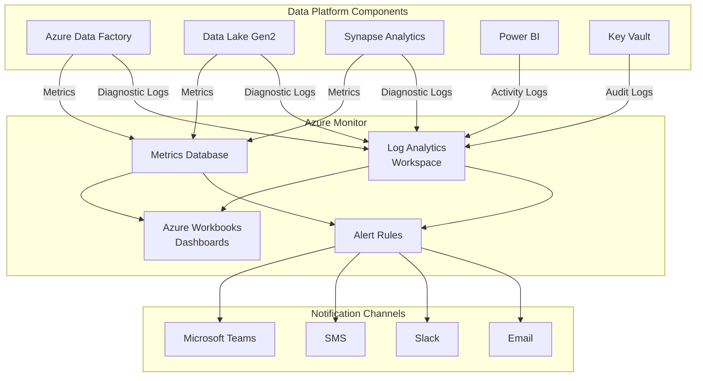
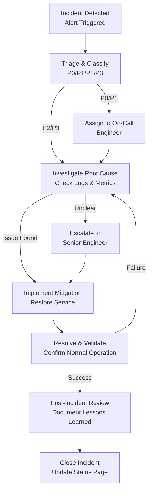
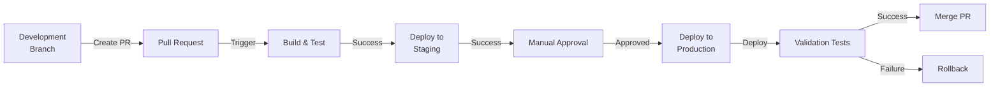

# Operations Guide

## Overview

This document provides comprehensive operational procedures for the PALO IT e-Commerce data platform, including monitoring strategies, incident response, backup and recovery, CI/CD pipeline design, cost optimization, and performance tuning recommendations.

**Operational Philosophy**:
- **Proactive Monitoring**: Detect issues before business impact
- **Automated Response**: Self-healing where possible, rapid escalation when not
- **Continuous Improvement**: Learn from incidents, refine processes
- **Cost Consciousness**: Optimize spend without compromising reliability

---

## Monitoring & Logging Strategy

### Monitoring Architecture



---

### Key Metrics & KPIs

#### Pipeline Health Metrics

| Metric | Measurement | Target | Alert Threshold | Severity |
|--------|-------------|--------|-----------------|----------|
| **Pipeline Success Rate** | Successful runs / Total runs | 99%+ | <95% | Critical |
| **Pipeline Duration** | Time from start to completion | <2 hours | >2.5 hours | High |
| **Data Freshness** | Time since last successful refresh | <24 hours | >26 hours | Critical |
| **Activity Retry Rate** | Activities with retries / Total activities | <5% | >10% | Medium |
| **Copy Activity Throughput** | MB/second during data movement | >10 MB/s | <5 MB/s | Low |

**Azure Monitor Query**:
```kusto
// Pipeline success rate (last 7 days)
AzureDiagnostics
| where ResourceProvider == "MICROSOFT.DATAFACTORY"
| where Category == "PipelineRuns"
| where TimeGenerated > ago(7d)
| summarize 
    TotalRuns = count(),
    SuccessfulRuns = countif(Status == "Succeeded"),
    FailedRuns = countif(Status == "Failed")
| extend SuccessRate = SuccessfulRuns * 100.0 / TotalRuns
| project SuccessRate, TotalRuns, SuccessfulRuns, FailedRuns
```

---

#### Data Quality Metrics

| Metric | Measurement | Target | Alert Threshold | Severity |
|--------|-------------|--------|-----------------|----------|
| **Data Completeness** | Non-null values / Total values | 100% (required fields) | <95% | Critical |
| **Test Pass Rate** | Passing dbt tests / Total tests | 100% | <100% | Critical |
| **Referential Integrity** | Valid FK references / Total FKs | 100% | <100% | Critical |
| **Duplicate Records** | Duplicate PKs / Total records | 0% | >0% | High |
| **Schema Drift Events** | Unexpected schema changes | 0 per week | >0 | High |

**dbt Test Monitoring**:
```yaml
# Azure Data Factory activity to capture dbt test results
activity:
  name: "Monitor_dbt_Tests"
  type: "CustomActivity"
  command: "dbt test --store-failures"
  
  on_success:
    - log_to_azure_monitor:
        message: "All dbt tests passed"
        severity: "Information"
  
  on_failure:
    - log_to_azure_monitor:
        message: "dbt tests failed"
        severity: "Critical"
    - send_alert:
        action_group: "data-quality-team"
```

---

#### Query Performance Metrics

| Metric | Measurement | Target | Alert Threshold | Severity |
|--------|-------------|--------|-----------------|----------|
| **Dashboard Load Time** | Time to render dashboard | <5 seconds (P95) | >10 seconds | High |
| **Query Duration** | Time to execute query | <10 seconds (P95) | >30 seconds | Medium |
| **Query Failures** | Failed queries / Total queries | <1% | >5% | High |
| **Synapse DWU Usage** | % of DWU capacity used | 60-80% | >90% | Medium |
| **Power BI Refresh Duration** | Time to refresh semantic model | <40 minutes | >60 minutes | High |

**Synapse Performance Query**:
```sql
-- Top 10 longest running queries (last 24 hours)
SELECT TOP 10
    query_id,
    command,
    total_elapsed_time / 1000 AS duration_seconds,
    row_count,
    [status],
    start_time,
    end_time
FROM sys.dm_pdw_exec_requests
WHERE start_time >= DATEADD(hour, -24, GETDATE())
ORDER BY total_elapsed_time DESC;
```

---

#### Cost & Resource Utilization Metrics

| Metric | Measurement | Target | Alert Threshold | Severity |
|--------|-------------|--------|-----------------|----------|
| **Monthly Cost** | Total Azure spend | $8K-$10K | >$11K (110% budget) | High |
| **Data Lake Storage Growth** | GB stored vs. last month | <20% MoM growth | >50% MoM | Medium |
| **Synapse Compute Hours** | DWU-hours consumed | 432 hours (60% of 720) | >650 hours (90%) | Medium |
| **Power BI Dataset Size** | GB stored in Premium capacity | <10 GB per dataset | >20 GB | Low |
| **API Request Rate** | Requests per day to external APIs | <1,000 | >2,000 | Medium |

**Cost Tracking Query**:
```kusto
// Daily cost breakdown by service
AzureCosts
| where Date >= ago(30d)
| summarize TotalCost = sum(Cost) by ServiceName, Date
| render timechart
```

---

### Monitoring Dashboards

#### Operational Dashboard (Azure Workbook)

**Dashboard Name**: `Data Platform Operations Dashboard`

**Sections**:

1. **Executive Summary**
   - Pipeline health indicator (Green/Yellow/Red)
   - Data freshness timestamp
   - Last 24 hours: Successful runs, Failed runs, Warnings
   - Current month cost vs. budget

2. **Pipeline Execution**
   - Pipeline run timeline (Gantt chart)
   - Activity duration heatmap
   - Top 5 slowest activities
   - Retry rate trends

3. **Data Quality**
   - dbt test pass/fail summary
   - Failed tests detail table
   - Data completeness by table
   - Schema drift events log

4. **Query Performance**
   - Dashboard load time trends (P50, P95, P99)
   - Query duration distribution
   - Top 10 longest queries
   - Synapse DWU utilization

5. **Alerts & Incidents**
   - Active alerts count
   - Alert history timeline
   - Mean time to resolution (MTTR)
   - Incident trends

**Refresh Frequency**: Real-time (5-minute intervals)

**Access**: Data engineering team, platform admins, on-call engineers

---

#### Business Stakeholder Dashboard

**Dashboard Name**: `Data Platform Health - Business View`

**Sections**:

1. **Data Availability**
   - Last successful refresh: ✅ Today 3:55 AM
   - Next scheduled refresh: Tomorrow 2:00 AM
   - Data quality score: 98.5%

2. **Platform Performance**
   - Average dashboard load time: 3.2 seconds
   - Report refresh success rate: 99.8%
   - User satisfaction score: 4.5/5

3. **Key Metrics**
   - Orders processed: 36,245 (last 12 months)
   - Revenue tracked: $2.4M USD
   - Active users: 87 of 100 provisioned

**Refresh Frequency**: Daily (6:00 AM)

**Access**: Business executives, finance team, steering committee

---

## Alert Configuration

### Alert Rules & Action Groups

#### Critical Alerts

**Alert 1: Pipeline Failure**
```yaml
alert_rule:
  name: "Critical - Pipeline Failure"
  resource: "Azure Data Factory"
  condition:
    query: |
      AzureDiagnostics
      | where ResourceProvider == "MICROSOFT.DATAFACTORY"
      | where Category == "PipelineRuns"
      | where Status == "Failed"
    threshold: 1
    operator: "GreaterThan"
    time_aggregation: "Total"
    frequency: "5 minutes"
    window_size: "5 minutes"
  
  severity: "Critical"
  enabled: true
  auto_mitigate: false
  
  action_groups:
    - name: "data-engineering-team"
      email: ["data-engineering@palo-it.com"]
      sms: ["+1-555-0100"]
      slack: ["#data-pipeline-alerts"]
    
    - name: "on-call-engineer"
      email: ["oncall@palo-it.com"]
      voice_call: ["+1-555-0100"]
```

**Alert 2: Data Quality Test Failure**
```yaml
alert_rule:
  name: "Critical - Data Quality Test Failure"
  resource: "Azure Data Factory"
  condition:
    query: |
      AzureDiagnostics
      | where Category == "ActivityRuns"
      | where ActivityName contains "dbt_test"
      | where Status == "Failed"
    threshold: 1
    operator: "GreaterThan"
  
  severity: "Critical"
  frequency: "5 minutes"
  
  action_groups:
    - "data-quality-team"
    - "data-engineering-team"
```

**Alert 3: Data Freshness SLA Breach**
```yaml
alert_rule:
  name: "Critical - Data Not Refreshed"
  resource: "Azure Synapse Analytics"
  condition:
    query: |
      let LastRefreshTime = 
        AzureDiagnostics
        | where ResourceProvider == "MICROSOFT.DATAFACTORY"
        | where Category == "PipelineRuns"
        | where PipelineName == "daily_data_refresh"
        | where Status == "Succeeded"
        | summarize max(TimeGenerated);
      let HoursSinceRefresh = 
        now() - toscalar(LastRefreshTime)
        | project HoursSinceRefresh = totalhours(HoursSinceRefresh);
      HoursSinceRefresh
      | where HoursSinceRefresh > 26
    threshold: 1
    operator: "GreaterThan"
  
  severity: "Critical"
  frequency: "15 minutes"
  
  action_groups:
    - "data-engineering-team"
    - "platform-admins"
```

---

#### High Priority Alerts

**Alert 4: High Query Failure Rate**
```yaml
alert_rule:
  name: "High - Query Failure Rate"
  resource: "Azure Synapse Analytics"
  condition:
    query: |
      AzureDiagnostics
      | where Category == "ExecRequests"
      | summarize 
          Total = count(),
          Failed = countif(Status == "Failed")
      | extend FailureRate = Failed * 100.0 / Total
      | where FailureRate > 5
    threshold: 1
  
  severity: "High"
  frequency: "15 minutes"
  
  action_groups:
    - "data-engineering-team"
```

**Alert 5: Cost Budget Threshold**
```yaml
alert_rule:
  name: "High - Cost Exceeds 90% of Budget"
  resource: "Subscription"
  condition:
    type: "Budget"
    budget_name: "DataPlatformMonthlyBudget"
    budget_amount: 10000  # USD
    threshold_percentage: 90
  
  severity: "High"
  frequency: "Daily"
  
  action_groups:
    - "finance-team"
    - "platform-admins"
```

---

#### Medium Priority Alerts

**Alert 6: Long Running Pipeline**
```yaml
alert_rule:
  name: "Medium - Pipeline Duration Exceeds SLA"
  resource: "Azure Data Factory"
  condition:
    query: |
      AzureDiagnostics
      | where Category == "PipelineRuns"
      | where PipelineName == "daily_data_refresh"
      | extend Duration = datetime_diff('minute', EndTime, StartTime)
      | where Duration > 120  # 2 hours
    threshold: 1
  
  severity: "Medium"
  frequency: "10 minutes"
  
  action_groups:
    - "data-engineering-team"
```

---

### Alert Notification Templates

**Email Template (Pipeline Failure)**:
```
Subject: [CRITICAL] Data Platform - Pipeline Failure

Alert Details:
- Alert: Pipeline Failure
- Severity: Critical
- Time: {{ AlertFiredTime }}
- Resource: {{ ResourceName }}
- Pipeline: {{ PipelineName }}
- Status: {{ Status }}
- Error Message: {{ ErrorMessage }}

Impact:
- Data freshness may be delayed
- Business dashboards may show stale data
- Estimated time to resolution: 1-2 hours

Action Required:
1. Check pipeline logs in Azure Data Factory
2. Review error details and retry logic
3. Escalate to platform admin if unresolved in 30 minutes

View Logs: {{ LogsURL }}
Runbook: https://wiki.palo-it.com/data-platform/runbooks/pipeline-failure

On-Call Engineer: {{ OnCallEngineer }}
```

**Slack Template**:
```json
{
  "text": "🚨 *CRITICAL ALERT*: Pipeline Failure",
  "blocks": [
    {
      "type": "header",
      "text": {
        "type": "plain_text",
        "text": "🚨 Pipeline Failure - daily_data_refresh"
      }
    },
    {
      "type": "section",
      "fields": [
        {"type": "mrkdwn", "text": "*Severity:*\nCritical"},
        {"type": "mrkdwn", "text": "*Time:*\n{{ AlertFiredTime }}"},
        {"type": "mrkdwn", "text": "*Status:*\nFailed"},
        {"type": "mrkdwn", "text": "*Duration:*\n{{ Duration }}"}
      ]
    },
    {
      "type": "section",
      "text": {
        "type": "mrkdwn",
        "text": "*Error:* {{ ErrorMessage }}"
      }
    },
    {
      "type": "actions",
      "elements": [
        {
          "type": "button",
          "text": {"type": "plain_text", "text": "View Logs"},
          "url": "{{ LogsURL }}"
        },
        {
          "type": "button",
          "text": {"type": "plain_text", "text": "Runbook"},
          "url": "https://wiki.palo-it.com/runbooks/pipeline-failure"
        }
      ]
    }
  ]
}
```

---

## Incident Response

### Incident Classification

| Severity | Definition | Example | Response Time | Escalation |
|----------|------------|---------|---------------|------------|
| **P0 - Critical** | Data platform unavailable, business-critical dashboards down | Synapse SQL pool offline, complete pipeline failure | 15 minutes | Immediate to CTO |
| **P1 - High** | Degraded performance, partial outages | Query performance >30s, single dashboard unavailable | 1 hour | After 2 hours to VP Engineering |
| **P2 - Medium** | Non-critical issues, workarounds available | Slow dashboard, non-essential report delayed | 4 hours | After 8 hours to Engineering Manager |
| **P3 - Low** | Cosmetic issues, feature requests | Dashboard formatting, minor UI issues | Next business day | No escalation |

---

### Incident Response Workflow



---

### Incident Runbooks

#### Runbook 1: Pipeline Failure

**Symptom**: Azure Data Factory pipeline `daily_data_refresh` fails

**Triage Questions**:
1. Which activity failed? (Check ADF pipeline run details)
2. Is this a transient error (network timeout) or persistent (code bug)?
3. Did schema change in source API?
4. Are Azure services healthy? (Check Azure status page)

**Investigation Steps**:
```bash
# 1. Check pipeline run details
az datafactory pipeline-run show \
  --factory-name palo-ecommerce-adf \
  --run-id {run-id} \
  --resource-group palo-ecommerce-rg

# 2. Query activity logs
az monitor activity-log list \
  --resource-group palo-ecommerce-rg \
  --resource-id /subscriptions/{sub}/resourceGroups/palo-ecommerce-rg/providers/Microsoft.DataFactory/factories/palo-ecommerce-adf \
  --start-time $(date -u -d '1 hour ago' '+%Y-%m-%dT%H:%M:%SZ') \
  --query "[?level=='Error']"

# 3. Check Synapse SQL pool status
az synapse sql pool show \
  --name gold_pool \
  --workspace-name palo-ecommerce-synapse \
  --resource-group palo-ecommerce-rg \
  --query "status"
```

**Common Causes & Resolutions**:

| Cause | Resolution | Prevention |
|-------|------------|------------|
| API rate limit exceeded | Wait 15 minutes, retry manually | Implement throttling in pipeline |
| Synapse SQL pool paused | Resume SQL pool via portal or CLI | Disable auto-pause during pipeline window |
| Schema drift (new API field) | Update Bronze layer schema in dbt | Implement schema validation tests |
| Network timeout | Increase timeout setting to 300s | Monitor API response times |
| Insufficient permissions | Grant missing permissions to managed identity | Review RBAC quarterly |

**Manual Retry**:
```bash
# Trigger pipeline manually
az datafactory pipeline create-run \
  --factory-name palo-ecommerce-adf \
  --name daily_data_refresh \
  --resource-group palo-ecommerce-rg
```

---

#### Runbook 2: Data Quality Test Failure

**Symptom**: dbt tests fail during pipeline execution

**Triage Questions**:
1. Which test failed? (not_null, unique, relationships, custom?)
2. Which table/column is affected?
3. How many rows violate the test?
4. Is this a new test or regression?

**Investigation Steps**:
```sql
-- Query dbt test failure details (stored in Synapse)
SELECT
    test_name,
    table_name,
    column_name,
    test_type,
    failures,
    failure_rate,
    error_message,
    created_at
FROM gold.dbt_test_results
WHERE test_status = 'fail'
  AND created_at >= DATEADD(hour, -24, GETDATE())
ORDER BY created_at DESC;

-- Inspect failing rows (example: null customer_key in fact_sales)
SELECT TOP 100 *
FROM gold.fact_sales
WHERE customer_key IS NULL;
```

**Common Causes & Resolutions**:

| Test Type | Cause | Resolution |
|-----------|-------|------------|
| `not_null` | Source data missing required field | Investigate upstream data quality; backfill missing values |
| `unique` | Duplicate records in source | Implement deduplication logic in Silver layer |
| `relationships` | Foreign key reference missing | Add missing dimension record; validate FK joins |
| `accepted_range` | Outlier values (e.g., price = $999,999) | Investigate data entry error; apply cleansing rules |
| `custom` | Business rule violation | Review business logic with stakeholders; update rule if needed |

**Mitigation Options**:
1. **Temporary**: Disable failing test, proceed with pipeline, investigate later (P2/P3 only)
2. **Fix & Rerun**: Correct data issue, rerun pipeline from Silver layer
3. **Rollback**: Revert to previous day's data, investigate issue offline

---

#### Runbook 3: Query Performance Degradation

**Symptom**: Power BI dashboards load slowly (>10 seconds) or Synapse queries timeout

**Triage Questions**:
1. Is performance issue isolated to one dashboard or all dashboards?
2. What time of day did issue start? (Peak usage?)
3. Has data volume increased recently?
4. Were recent schema changes deployed?

**Investigation Steps**:
```sql
-- Check Synapse DWU utilization
SELECT
    start_time,
    end_time,
    request_id,
    command,
    total_elapsed_time / 1000 AS duration_sec,
    resource_class,
    [status]
FROM sys.dm_pdw_exec_requests
WHERE start_time >= DATEADD(hour, -1, GETDATE())
  AND total_elapsed_time > 30000  -- >30 seconds
ORDER BY total_elapsed_time DESC;

-- Check for missing statistics
SELECT
    t.name AS table_name,
    c.name AS column_name,
    s.stats_id
FROM sys.tables t
JOIN sys.columns c ON t.object_id = c.object_id
LEFT JOIN sys.stats s ON t.object_id = s.object_id AND c.column_id = s.stats_column_id
WHERE s.stats_id IS NULL
  AND t.schema_id = SCHEMA_ID('gold');
```

**Performance Tuning Actions**:

| Issue | Action | Impact |
|-------|--------|--------|
| High DWU utilization (>90%) | Scale up Synapse from DW100c to DW200c | 2x query concurrency, ~10 min downtime |
| Missing column statistics | Run `CREATE STATISTICS` on fact table keys | 50-90% query performance improvement |
| Large table scans | Add/rebuild columnstore indexes | 10-50x query speedup |
| Power BI aggregations missing | Implement aggregations in semantic model | <3 second dashboard load |
| Inefficient query patterns | Rewrite queries to use partition elimination | 5-10x query speedup |

**Immediate Mitigation**:
```bash
# Scale up Synapse SQL pool
az synapse sql pool update \
  --name gold_pool \
  --workspace-name palo-ecommerce-synapse \
  --resource-group palo-ecommerce-rg \
  --performance-level DW200c

# Rebuild statistics (execute in Synapse)
EXEC sp_updatestats;
```

---

## Backup & Recovery

### Backup Strategy

#### Data Lake Gen2 Backups

**Configuration**:
```yaml
backup_policy:
  bronze_layer:
    soft_delete: true
    soft_delete_retention_days: 30
    versioning: true
    snapshot_frequency: "Weekly"
    snapshot_retention: 52 weeks  # 1 year
    geo_redundancy: false  # LRS sufficient
  
  silver_layer:
    soft_delete: true
    soft_delete_retention_days: 30
    versioning: true
    snapshot_frequency: "Weekly"
    snapshot_retention: 12 weeks
    geo_redundancy: false
```

**Backup Schedule**:
- **Daily Snapshots**: Automatic via Azure Blob versioning
- **Weekly Full Backup**: Sundays at 1:00 AM (before pipeline run)
- **Monthly Archive**: First Sunday of month, retain for 1 year

**Backup Validation**:
```bash
# List available snapshots
az storage blob snapshot --account-name paloecommercedatalake \
  --container-name bronze \
  --name "products_raw/ingestion_date=2024-01-15/products_20240115.parquet" \
  --auth-mode login

# Restore from snapshot
az storage blob copy start \
  --source-account-name paloecommercedatalake \
  --source-container bronze \
  --source-blob "products_raw/ingestion_date=2024-01-15/products_20240115.parquet" \
  --source-snapshot "{snapshot-id}" \
  --destination-account-name paloecommercedatalake \
  --destination-container bronze-restore \
  --destination-blob "products_raw/ingestion_date=2024-01-15/products_20240115.parquet"
```

---

#### Synapse Analytics Backups

**Automated Backups**:
- **Restore Points**: Automatic every 8 hours
- **Retention**: 7 days (default), extendable to 42 days
- **User-Defined Restore Points**: Created before major schema changes

**Backup Configuration**:
```bash
# Create user-defined restore point before deployment
az synapse sql pool restore-point create \
  --name gold_pool \
  --workspace-name palo-ecommerce-synapse \
  --resource-group palo-ecommerce-rg \
  --restore-point-label "pre-deployment-2024-01-15"

# List available restore points
az synapse sql pool restore-point list \
  --name gold_pool \
  --workspace-name palo-ecommerce-synapse \
  --resource-group palo-ecommerce-rg
```

**Recovery Time Objective (RTO)**:
- Bronze/Silver restore: 1-2 hours (depends on data volume)
- Synapse restore: 30-60 minutes
- Full platform rebuild: 4 hours (from Terraform + backups)

**Recovery Point Objective (RPO)**:
- Bronze layer: <24 hours (daily pipeline)
- Synapse: <8 hours (automatic restore points)

---

### Disaster Recovery Procedures

#### Scenario 1: Synapse SQL Pool Corruption

**Impact**: Gold layer data corrupted, dashboards show incorrect data

**Recovery Steps**:
1. **Identify Last Good Restore Point**: Check pipeline success logs
2. **Stop Ongoing Pipelines**: Prevent further data corruption
3. **Restore Synapse to Last Good Point**:
   ```bash
   az synapse sql pool restore \
     --name gold_pool \
     --workspace-name palo-ecommerce-synapse \
     --resource-group palo-ecommerce-rg \
     --restore-point "{restore-point-id}" \
     --dest-name gold_pool_restored
   ```
4. **Validate Restored Data**: Run dbt tests against restored pool
5. **Switch Power BI Connection**: Update semantic model to point to restored pool
6. **Post-Mortem**: Investigate root cause of corruption

**Estimated Recovery Time**: 1-2 hours

---

#### Scenario 2: Complete Data Lake Data Loss

**Impact**: Bronze and Silver layers lost, requires full historical rebuild

**Recovery Steps**:
1. **Restore from Weekly Snapshot** (if available):
   ```bash
   # Bulk restore using AzCopy
   azcopy copy \
     "https://paloecommercedatalake.blob.core.windows.net/bronze?{snapshot-id}" \
     "https://paloecommercedatalake.blob.core.windows.net/bronze-restore" \
     --recursive
   ```
2. **Backfill from Source APIs** (if snapshot unavailable):
   - Re-extract historical data from APIs (12 months)
   - Re-synthesize transactions using same random seed
   - Re-run Bronze → Silver → Gold pipeline
3. **Validate Data Integrity**: Compare restored data against pre-loss reports
4. **Resume Normal Operations**: Enable daily pipelines

**Estimated Recovery Time**: 6-12 hours (depends on API rate limits)

---

#### Scenario 3: Regional Azure Outage

**Impact**: East US region unavailable, all services inaccessible

**Recovery Steps** (Future: Multi-Region Deployment):
1. **Failover to Secondary Region** (West US):
   - Promote read-replica Synapse pool to primary
   - Redirect ADF pipelines to West US Data Lake
   - Update Power BI semantic model connection strings
2. **Validate Failover**: Run smoke tests on secondary region
3. **Monitor Azure Status**: Wait for primary region recovery
4. **Failback to Primary**: Reverse failover once East US restored

**Current State**: Single-region deployment (Phase 1-3)  
**Future State**: Active-passive DR in Phase 4 (RTO: 2 hours, RPO: 1 hour)

---

## CI/CD Pipeline Design

### Deployment Pipeline Architecture



---

### Infrastructure CI/CD (Terraform)

**Pipeline**: GitHub Actions

**Workflow**: `.github/workflows/terraform-deploy.yml`
```yaml
name: Terraform Deploy

on:
  push:
    branches: [main]
    paths: ['infra/**']
  pull_request:
    branches: [main]
    paths: ['infra/**']

jobs:
  terraform-plan:
    runs-on: ubuntu-latest
    steps:
      - uses: actions/checkout@v3
      
      - name: Setup Terraform
        uses: hashicorp/setup-terraform@v2
        with:
          terraform_version: 1.6.0
      
      - name: Terraform Init
        run: terraform init
        working-directory: ./infra
        env:
          ARM_CLIENT_ID: ${{ secrets.AZURE_CLIENT_ID }}
          ARM_CLIENT_SECRET: ${{ secrets.AZURE_CLIENT_SECRET }}
          ARM_SUBSCRIPTION_ID: ${{ secrets.AZURE_SUBSCRIPTION_ID }}
          ARM_TENANT_ID: ${{ secrets.AZURE_TENANT_ID }}
      
      - name: Terraform Plan
        run: terraform plan -out=tfplan
        working-directory: ./infra
      
      - name: Upload Plan
        uses: actions/upload-artifact@v3
        with:
          name: tfplan
          path: ./infra/tfplan
  
  terraform-apply:
    needs: terraform-plan
    runs-on: ubuntu-latest
    if: github.ref == 'refs/heads/main' && github.event_name == 'push'
    environment: production
    steps:
      - uses: actions/checkout@v3
      
      - name: Download Plan
        uses: actions/download-artifact@v3
        with:
          name: tfplan
          path: ./infra
      
      - name: Terraform Apply
        run: terraform apply -auto-approve tfplan
        working-directory: ./infra
      
      - name: Notify Slack
        if: success()
        uses: slackapi/slack-github-action@v1
        with:
          payload: |
            {
              "text": "✅ Terraform deployment successful",
              "blocks": [
                {
                  "type": "section",
                  "text": {
                    "type": "mrkdwn",
                    "text": "*Terraform Deployment*\nStatus: ✅ Success\nBranch: ${{ github.ref }}\nCommit: ${{ github.sha }}"
                  }
                }
              ]
            }
```

**Deployment Stages**:
1. **Dev Environment**: Auto-deploy on push to `dev` branch
2. **Staging Environment**: Auto-deploy on push to `staging` branch
3. **Production Environment**: Manual approval required after staging validation

---

### dbt CI/CD (Data Transformations)

**Pipeline**: dbt Cloud Jobs or GitHub Actions

**Workflow**: `.github/workflows/dbt-deploy.yml`
```yaml
name: dbt Deploy

on:
  push:
    branches: [main]
    paths: ['dbt/**']
  pull_request:
    branches: [main]
    paths: ['dbt/**']

jobs:
  dbt-test:
    runs-on: ubuntu-latest
    steps:
      - uses: actions/checkout@v3
      
      - name: Setup Python
        uses: actions/setup-python@v4
        with:
          python-version: '3.10'
      
      - name: Install dbt
        run: pip install dbt-synapse==1.7.0
      
      - name: dbt Deps
        run: dbt deps
        working-directory: ./dbt
      
      - name: dbt Compile
        run: dbt compile --profiles-dir ./profiles
        working-directory: ./dbt
      
      - name: dbt Run (Dev)
        run: dbt run --target dev --profiles-dir ./profiles
        working-directory: ./dbt
        env:
          DBT_SP_CLIENT_ID: ${{ secrets.DBT_SP_CLIENT_ID }}
          DBT_SP_CLIENT_SECRET: ${{ secrets.DBT_SP_CLIENT_SECRET }}
          DBT_TENANT_ID: ${{ secrets.DBT_TENANT_ID }}
      
      - name: dbt Test (Dev)
        run: dbt test --target dev --profiles-dir ./profiles
        working-directory: ./dbt
      
      - name: Generate dbt Docs
        run: dbt docs generate --profiles-dir ./profiles
        working-directory: ./dbt
      
      - name: Upload Docs
        uses: actions/upload-artifact@v3
        with:
          name: dbt-docs
          path: ./dbt/target
  
  dbt-deploy-prod:
    needs: dbt-test
    runs-on: ubuntu-latest
    if: github.ref == 'refs/heads/main' && github.event_name == 'push'
    environment: production
    steps:
      - uses: actions/checkout@v3
      
      - name: Trigger dbt Cloud Job
        run: |
          curl -X POST \
            "https://cloud.getdbt.com/api/v2/accounts/${{ secrets.DBT_ACCOUNT_ID }}/jobs/${{ secrets.DBT_JOB_ID }}/run/" \
            -H "Authorization: Token ${{ secrets.DBT_API_KEY }}" \
            -H "Content-Type: application/json" \
            -d '{"cause": "Triggered by GitHub Actions"}'
```

**Deployment Stages**:
1. **PR Review**: Run dbt compile + tests on pull request
2. **Dev Deployment**: Auto-deploy to `gold_dev` schema on merge to `dev` branch
3. **Prod Deployment**: Manual trigger of dbt Cloud job for `gold` schema

---

### Azure Data Factory CI/CD

**Pipeline**: Azure DevOps or GitHub Actions

**Workflow**: ADF Git Integration (native)
1. **Development**: Make changes in ADF UI (DEV workspace)
2. **Commit**: Save changes to `adf_publish` branch in GitHub
3. **PR Review**: Create pull request to `main` branch
4. **Approval**: Data engineering lead reviews and approves
5. **Publish**: ARM template generated and deployed to PROD workspace

**ARM Template Deployment**:
```bash
# Deploy ADF ARM template
az deployment group create \
  --resource-group palo-ecommerce-rg \
  --template-file ./adf/ARMTemplateForFactory.json \
  --parameters ./adf/ARMTemplateParametersForFactory.json \
  --parameters factoryName=palo-ecommerce-adf-prod \
  --mode Incremental
```

---

## Cost Optimization

### Cost Monitoring & Budgets

**Monthly Budget**: $10,000 USD

**Budget Alerts**:
- 50% spent ($5,000): Email to platform admin
- 80% spent ($8,000): Email to finance team + platform admin
- 90% spent ($9,000): Email + SMS to CTO + platform admin
- 100% spent ($10,000): Email + SMS to executive team (escalation)

**Azure Budget Configuration**:
```bash
az consumption budget create \
  --budget-name "DataPlatformMonthlyBudget" \
  --amount 10000 \
  --category "Cost" \
  --time-period start-date="2024-01-01" end-date="2025-12-31" \
  --time-grain "Monthly" \
  --resource-group palo-ecommerce-rg \
  --notifications \
    threshold=50 \
    operator="GreaterThan" \
    contact-emails="admin@palo-it.com" \
  --notifications \
    threshold=80 \
    operator="GreaterThan" \
    contact-emails="finance@palo-it.com,admin@palo-it.com" \
  --notifications \
    threshold=90 \
    operator="GreaterThan" \
    contact-emails="cto@palo-it.com,admin@palo-it.com" \
    contact-roles="Owner,Contributor"
```

---

### Cost Optimization Strategies

#### 1. Synapse Auto-Pause

**Configuration**:
```bash
az synapse sql pool update \
  --name gold_pool \
  --workspace-name palo-ecommerce-synapse \
  --resource-group palo-ecommerce-rg \
  --auto-pause-delay 60  # Pause after 60 minutes of inactivity
```

**Savings**: ~40% reduction ($600/month)

**Pause Schedule** (via Azure Automation):
```yaml
# Pause Synapse pool during off-hours (weekends)
pause_schedule:
  friday_evening:
    time: "18:00"
    action: "pause"
  monday_morning:
    time: "06:00"
    action: "resume"

# Estimated savings: 48 hours/week × 4 weeks = 192 hours/month saved
```

---

#### 2. Data Lake Lifecycle Management

**Policy**: Move Bronze data to Cool/Archive tiers after 90/365 days

**Cost Savings**:
- Hot tier: $0.018/GB/month
- Cool tier: $0.010/GB/month (44% savings)
- Archive tier: $0.00099/GB/month (95% savings)

**Example**: 400 GB Bronze data
- Year 1 (Hot): 400 GB × $0.018 = $7.20/month
- Year 2 (Cool): 400 GB × $0.010 = $4.00/month (**$3.20/month savings**)
- Year 3+ (Archive): 400 GB × $0.00099 = $0.40/month (**$6.80/month savings**)

---

#### 3. Right-Size Synapse DWU

**Current**: DW100c (1,000 DWU) = $1,500/month  
**Evaluation**: Monitor DWU utilization weekly

**Decision Matrix**:
| Avg DWU Usage | Action | New SKU | New Cost | Savings |
|---------------|--------|---------|----------|---------|
| <40% | Scale down | DW50c | $750/month | $750/month |
| 40-60% | No change | DW100c | $1,500/month | - |
| 60-80% | Monitor | DW100c | $1,500/month | - |
| >80% | Scale up | DW200c | $3,000/month | ($1,500/month) |

---

#### 4. Power BI Incremental Refresh

**Configuration**: Refresh only last 13 months instead of full dataset

**Refresh Time Reduction**:
- Full refresh: 40 minutes
- Incremental refresh: 10 minutes (75% reduction)

**Cost Savings**:
- Synapse compute time reduced: 30 minutes/day × $2.04/hour = $1.02/day saved
- Monthly savings: ~$30/month

---

#### 5. Reserved Capacity Pricing

**Option**: Purchase 1-year Azure Reserved Instances for predictable workloads

**Potential Savings**:
- Synapse Reserved Capacity: 37% discount
- Power BI Reserved Capacity: 20% discount (annual prepayment)

**Example**:
- Synapse DW100c: $1,500/month × 12 = $18,000/year
- Reserved (1-year): $18,000 × 0.63 = $11,340/year (**$6,660 savings**)

**Decision**: Evaluate after 3 months of stable usage patterns

---

## Performance Tuning

### Synapse SQL Pool Optimization

#### 1. Distribution Strategy Review

**Current Distribution**:
- `fact_sales`: HASH(customer_key)
- `dim_product`: REPLICATE
- `dim_customer`: ROUND_ROBIN

**Optimization Recommendation**:
```sql
-- Redistribute fact_sales by date for time-series queries
CREATE TABLE gold.fact_sales_optimized
WITH (
    DISTRIBUTION = HASH(order_date_key),  -- Change from customer_key
    CLUSTERED COLUMNSTORE INDEX,
    PARTITION (order_date_key RANGE RIGHT FOR VALUES (
        20240101, 20240201, 20240301, ..., 20241201
    ))
)
AS SELECT * FROM gold.fact_sales;

-- Swap tables
RENAME OBJECT gold.fact_sales TO fact_sales_old;
RENAME OBJECT gold.fact_sales_optimized TO fact_sales;
DROP TABLE gold.fact_sales_old;
```

**Expected Improvement**: 30-50% faster for date-range queries

---

#### 2. Columnstore Index Maintenance

**Check Index Health**:
```sql
SELECT
    object_name(object_id) AS table_name,
    SUM(deleted_rows) AS total_deleted_rows,
    SUM(deleted_rows) * 100.0 / NULLIF(SUM(total_rows), 0) AS fragmentation_pct
FROM sys.dm_pdw_nodes_db_column_store_row_group_physical_stats
WHERE object_id = OBJECT_ID('gold.fact_sales')
GROUP BY object_id;
```

**Rebuild Index** (if fragmentation >20%):
```sql
ALTER INDEX ALL ON gold.fact_sales REBUILD;
```

**Schedule**: Weekly maintenance window (Sundays 1:00 AM)

---

#### 3. Statistics Update

**Automated Statistics**:
```sql
-- Enable auto-create and auto-update statistics
ALTER DATABASE gold_db SET AUTO_CREATE_STATISTICS ON;
ALTER DATABASE gold_db SET AUTO_UPDATE_STATISTICS ON;
ALTER DATABASE gold_db SET AUTO_UPDATE_STATISTICS_ASYNC ON;
```

**Manual Statistics Refresh** (for critical columns):
```sql
-- Update statistics on fact table foreign keys
UPDATE STATISTICS gold.fact_sales (product_key) WITH FULLSCAN;
UPDATE STATISTICS gold.fact_sales (customer_key) WITH FULLSCAN;
UPDATE STATISTICS gold.fact_sales (order_date_key) WITH FULLSCAN;
```

**Schedule**: Daily after pipeline completion (4:00 AM)

---

### Power BI Performance Tuning

#### 1. Aggregations

**Create Aggregations Table**:
```dax
// Aggregated fact table (monthly grain)
fact_sales_agg_monthly = 
SUMMARIZE(
    fact_sales,
    dim_date[year],
    dim_date[month],
    dim_product[category],
    dim_location[region],
    "total_revenue", SUM(fact_sales[total_amount_usd]),
    "total_orders", DISTINCTCOUNT(fact_sales[order_id]),
    "total_quantity", SUM(fact_sales[quantity])
)
```

**Configure Aggregation Mapping**: 
- Detail table: `fact_sales`
- Aggregation table: `fact_sales_agg_monthly`
- Relationship: GroupBy columns

**Expected Improvement**: 80-90% faster for executive dashboards (using monthly aggregates)

---

#### 2. Incremental Refresh Policy

**Configuration**:
```json
{
  "incrementalRefresh": {
    "mode": "hybrid",
    "archiveDataStartDate": "2022-01-01",
    "refreshDataWindowDays": 395,  # 13 months
    "detectDataChanges": true,
    "onlyCreateNewPartitions": false
  }
}
```

**Benefits**:
- Refresh time: 40 min → 10 min (75% reduction)
- Historical data cached (no re-query of Synapse)
- Automatic partition management

---

#### 3. DirectQuery vs. Import Mode

**Recommendation**:
- **Import Mode**: Dimension tables (small, infrequent changes)
- **DirectQuery**: Fact tables (large, frequent updates)
- **Composite Model**: Best of both worlds

**Composite Model Configuration**:
```dax
// Set storage mode for each table
dim_product[storage_mode] = "Import"
dim_customer[storage_mode] = "Import"
dim_location[storage_mode] = "Import"
dim_date[storage_mode] = "Import"
fact_sales[storage_mode] = "DirectQuery"
```

**Benefits**:
- Fast dimension filtering (Import cached)
- Real-time fact data (DirectQuery)
- Reduced semantic model size

---

## Related Documents

- [Architecture Overview](../../docs/architecture/overview.md)
- [Data Flows](../../docs/architecture/data-flows.md)
- [Security & Governance](../../docs/architecture/security-governance.md)
- [Component Specifications](./component-specifications.md)
- [Network Security](./network-security.md)
