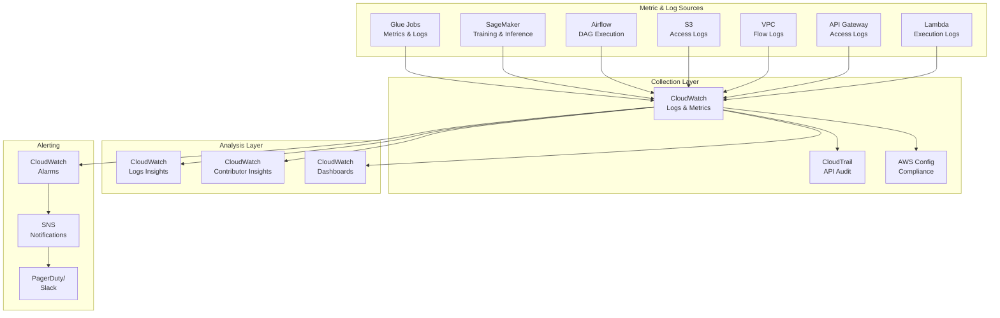
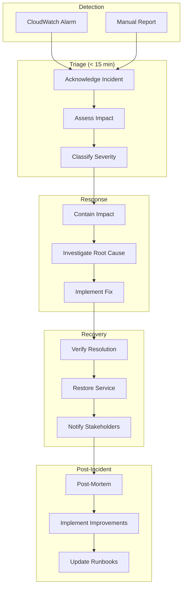
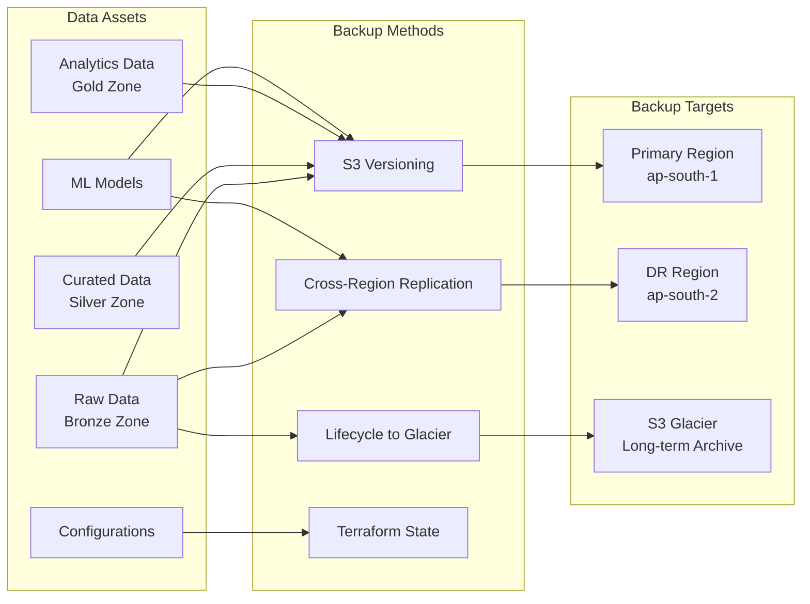
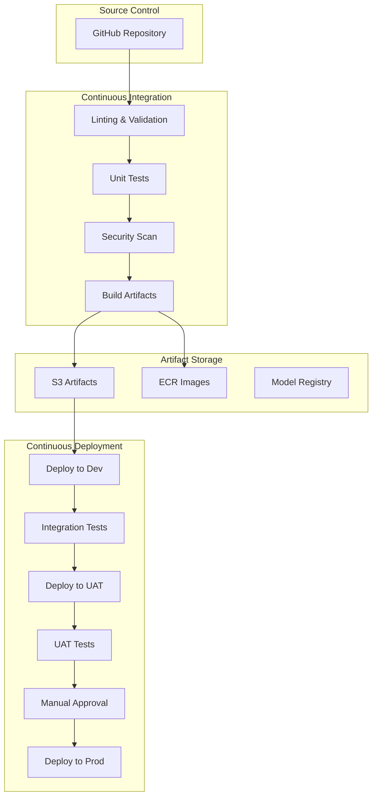
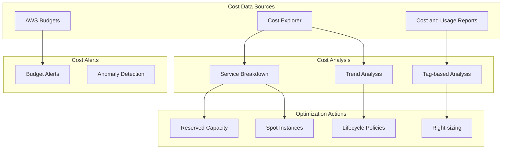

# Operations Guide

**Document Owner:** Platform Operations Team  
**Last Updated:** December 2024  
**Status:** Active  
**Related Documents:** [Component Specifications](./component-specifications.md) | [Network Security](./network-security.md) | [Architecture Overview](../../../docs/architecture/overview.md)

---

## 1. Overview

This document provides operational guidance for the Nuvama Data Platform, covering monitoring, alerting, disaster recovery, CI/CD, cost optimization, and performance tuning. It serves as the primary reference for platform operations and incident management.

---

## 2. Monitoring and Logging Strategy

### 2.1 Monitoring Architecture



### 2.2 Log Groups Configuration

| Service | Log Group | Retention | Purpose |
|---------|-----------|-----------|---------|
| Glue ETL | `/aws/glue/jobs/{job-name}` | 90 days | Job execution logs |
| Glue Crawler | `/aws/glue/crawlers/{crawler-name}` | 30 days | Crawler execution |
| SageMaker Training | `/aws/sagemaker/TrainingJobs` | 90 days | Model training logs |
| SageMaker Processing | `/aws/sagemaker/ProcessingJobs` | 90 days | Data processing logs |
| Lambda | `/aws/lambda/{function-name}` | 30 days | Function execution |
| API Gateway | `/aws/api-gateway/{api-id}/{stage}` | 30 days | API access logs |
| MWAA | `/aws/mwaa/{environment-name}` | 90 days | Airflow logs |
| VPC Flow Logs | `/aws/vpc/data-platform-{env}` | 90 days | Network traffic |

### 2.3 Key Metrics to Monitor

#### Data Pipeline Metrics

| Metric | Namespace | Dimension | Alert Threshold |
|--------|-----------|-----------|-----------------|
| Job Success Rate | Glue | JobName | <99% over 24h |
| Job Duration | Glue | JobName | >200% of average |
| Data Processed | Glue | JobName | <50% of expected |
| DPU Hours | Glue | JobName | >150% of budget |
| Job Queue Time | Glue | JobName | >10 minutes |

#### ML Platform Metrics

| Metric | Namespace | Dimension | Alert Threshold |
|--------|-----------|-----------|-----------------|
| Training Job Status | SageMaker | TrainingJobName | Failed |
| Model Accuracy | Custom | ModelName | <baseline - 5% |
| Prediction Latency | SageMaker | EndpointName | >p95 threshold |
| Data Drift Score | Custom | ModelName | >threshold |
| Feature Drift | Custom | FeatureName | >threshold |

#### Infrastructure Metrics

| Metric | Namespace | Dimension | Alert Threshold |
|--------|-----------|-----------|-----------------|
| S3 Bucket Size | S3 | BucketName | >budget threshold |
| NAT Gateway Bytes | NATGateway | NatGatewayId | >5 GB/5min |
| VPC Endpoint Errors | VPC | EndpointId | >0 |
| API Gateway 5xx | ApiGateway | ApiId, Stage | >1% of requests |
| Lambda Errors | Lambda | FunctionName | >1% of invocations |

### 2.4 CloudWatch Dashboard Configuration

```hcl
resource "aws_cloudwatch_dashboard" "data_platform" {
  dashboard_name = "data-platform-${var.environment}"
  
  dashboard_body = jsonencode({
    widgets = [
      {
        type   = "metric"
        x      = 0
        y      = 0
        width  = 12
        height = 6
        properties = {
          title  = "Glue Job Success Rate"
          region = var.region
          metrics = [
            ["AWS/Glue", "glue.driver.aggregate.numCompletedTasks", "JobName", "*"],
            [".", "glue.driver.aggregate.numFailedTasks", ".", "."]
          ]
          view    = "timeSeries"
          stacked = false
          period  = 300
        }
      },
      {
        type   = "metric"
        x      = 12
        y      = 0
        width  = 12
        height = 6
        properties = {
          title  = "SageMaker Training Jobs"
          region = var.region
          metrics = [
            ["AWS/SageMaker", "TrainingJobsRunning"],
            [".", "TrainingJobsFailed"],
            [".", "TrainingJobsSucceeded"]
          ]
          view    = "timeSeries"
          stacked = false
          period  = 300
        }
      },
      {
        type   = "metric"
        x      = 0
        y      = 6
        width  = 8
        height = 6
        properties = {
          title  = "S3 Data Lake Usage"
          region = var.region
          metrics = [
            ["AWS/S3", "BucketSizeBytes", "BucketName", aws_s3_bucket.data_lake.id, "StorageType", "StandardStorage"]
          ]
          view   = "singleValue"
          period = 86400
        }
      },
      {
        type   = "metric"
        x      = 8
        y      = 6
        width  = 8
        height = 6
        properties = {
          title  = "API Gateway Requests"
          region = var.region
          metrics = [
            ["AWS/ApiGateway", "Count", "ApiId", aws_api_gateway_rest_api.scores.id],
            [".", "5XXError", ".", "."],
            [".", "4XXError", ".", "."]
          ]
          view    = "timeSeries"
          stacked = false
          period  = 300
        }
      }
    ]
  })
}
```

### 2.5 Log Insights Queries

#### Failed Glue Jobs

```sql
fields @timestamp, @message, @logStream
| filter @message like /ERROR|FAILED|Exception/
| sort @timestamp desc
| limit 100
```

#### SageMaker Training Errors

```sql
fields @timestamp, @message
| filter @message like /Error|Exception|Failed/
| parse @message "* ERROR *" as prefix, error_msg
| sort @timestamp desc
| limit 50
```

#### API Gateway Latency Analysis

```sql
fields @timestamp, status, responseLatency, requestId
| filter responseLatency > 1000
| stats avg(responseLatency) as avg_latency, 
        max(responseLatency) as max_latency,
        count(*) as request_count
  by bin(5m)
| sort @timestamp desc
```

---

## 3. Alert Configuration and Incident Response

### 3.1 Alert Severity Levels

| Level | Response Time | Examples | Notification |
|-------|---------------|----------|--------------|
| **P1 - Critical** | 15 minutes | Production pipeline failure, data breach | PagerDuty + Phone |
| **P2 - High** | 1 hour | Model accuracy degradation, integration failure | Slack + Email |
| **P3 - Medium** | 4 hours | Job delays, performance degradation | Slack |
| **P4 - Low** | 24 hours | Warning thresholds, cost anomalies | Email |

### 3.2 Alert Configuration

```hcl
# SNS Topic for Alerts
resource "aws_sns_topic" "alerts" {
  name = "data-platform-alerts-${var.environment}"
  
  kms_master_key_id = aws_kms_key.data_platform.id
}

# P1 Alert - Pipeline Failure
resource "aws_cloudwatch_metric_alarm" "pipeline_failure" {
  alarm_name          = "p1-pipeline-failure-${var.environment}"
  comparison_operator = "GreaterThanThreshold"
  evaluation_periods  = 1
  metric_name         = "glue.driver.aggregate.numFailedTasks"
  namespace           = "AWS/Glue"
  period              = 300
  statistic           = "Sum"
  threshold           = 0
  alarm_description   = "P1: Glue job has failed tasks"
  alarm_actions       = [aws_sns_topic.alerts.arn]
  ok_actions          = [aws_sns_topic.alerts.arn]
  
  dimensions = {
    JobName = "lead-scoring-pipeline"
  }
  
  tags = {
    Severity = "P1"
    Runbook  = "https://wiki.internal/runbooks/pipeline-failure"
  }
}

# P2 Alert - Model Drift
resource "aws_cloudwatch_metric_alarm" "model_drift" {
  alarm_name          = "p2-model-drift-${var.environment}"
  comparison_operator = "GreaterThanThreshold"
  evaluation_periods  = 3
  metric_name         = "DataDriftScore"
  namespace           = "DataPlatform/ML"
  period              = 3600
  statistic           = "Average"
  threshold           = 0.15
  alarm_description   = "P2: Model data drift detected"
  alarm_actions       = [aws_sns_topic.alerts.arn]
  
  tags = {
    Severity = "P2"
    Runbook  = "https://wiki.internal/runbooks/model-drift"
  }
}

# P3 Alert - Job Duration
resource "aws_cloudwatch_metric_alarm" "job_duration" {
  alarm_name          = "p3-job-duration-${var.environment}"
  comparison_operator = "GreaterThanThreshold"
  evaluation_periods  = 2
  metric_name         = "glue.driver.aggregate.elapsedTime"
  namespace           = "AWS/Glue"
  period              = 300
  statistic           = "Average"
  threshold           = 7200000  # 2 hours in milliseconds
  alarm_description   = "P3: Glue job running longer than expected"
  alarm_actions       = [aws_sns_topic.alerts.arn]
  
  tags = {
    Severity = "P3"
    Runbook  = "https://wiki.internal/runbooks/slow-jobs"
  }
}
```

### 3.3 Incident Response Process



### 3.4 Runbook Template

```markdown
# Runbook: [Incident Type]

## Overview
Brief description of the incident type and typical symptoms.

## Severity
P1/P2/P3/P4

## Symptoms
- Symptom 1
- Symptom 2

## Impact
- User impact
- Business impact

## Diagnosis Steps
1. Step 1: Check [X]
2. Step 2: Verify [Y]
3. Step 3: Analyze [Z]

## Resolution Steps
1. Step 1: Do [A]
2. Step 2: Verify [B]
3. Step 3: Confirm [C]

## Escalation
- Primary: [Team/Person]
- Secondary: [Team/Person]
- Executive: [Name]

## Related Documentation
- Link 1
- Link 2
```

---

## 4. Disaster Recovery and Backup Approach

### 4.1 Recovery Objectives

| Tier | RPO | RTO | Examples |
|------|-----|-----|----------|
| **Tier 1** | 1 hour | 1 hour | Lead scoring pipeline, CRM integration |
| **Tier 2** | 4 hours | 4 hours | Feature engineering, dashboards |
| **Tier 3** | 24 hours | 8 hours | Historical data, model archives |
| **Tier 4** | 7 days | 24 hours | Development environments |

### 4.2 Backup Strategy



### 4.3 S3 Backup Configuration

```hcl
# S3 Versioning
resource "aws_s3_bucket_versioning" "data_lake" {
  bucket = aws_s3_bucket.data_lake.id
  versioning_configuration {
    status = "Enabled"
  }
}

# Cross-Region Replication
resource "aws_s3_bucket_replication_configuration" "data_lake" {
  bucket = aws_s3_bucket.data_lake.id
  role   = aws_iam_role.replication.arn
  
  rule {
    id     = "replicate-critical-data"
    status = "Enabled"
    
    filter {
      prefix = "models/"
    }
    
    destination {
      bucket        = aws_s3_bucket.dr_bucket.arn
      storage_class = "STANDARD_IA"
      
      encryption_configuration {
        replica_kms_key_id = aws_kms_key.dr.arn
      }
    }
    
    delete_marker_replication {
      status = "Disabled"
    }
  }
  
  rule {
    id     = "replicate-analytics"
    status = "Enabled"
    
    filter {
      prefix = "analytics/lead_scores/"
    }
    
    destination {
      bucket        = aws_s3_bucket.dr_bucket.arn
      storage_class = "STANDARD_IA"
    }
  }
}

# Lifecycle for Long-term Archive
# Define retention periods as local values for clarity
locals {
  retention_days_7_years = 7 * 365  # 2555 days - regulatory compliance
}

resource "aws_s3_bucket_lifecycle_configuration" "data_lake" {
  bucket = aws_s3_bucket.data_lake.id
  
  rule {
    id     = "archive-raw-data"
    status = "Enabled"
    
    filter {
      prefix = "raw/"
    }
    
    transition {
      days          = 90
      storage_class = "STANDARD_IA"
    }
    
    transition {
      days          = 365
      storage_class = "GLACIER"
    }
    
    expiration {
      days = local.retention_days_7_years  # 7 years for regulatory compliance
    }
  }
  
  rule {
    id     = "archive-audit-logs"
    status = "Enabled"
    
    filter {
      prefix = "audit/"
    }
    
    transition {
      days          = 90
      storage_class = "GLACIER"
    }
    
    expiration {
      days = local.retention_days_7_years  # 7 years for regulatory compliance
    }
  }
}
```

### 4.4 Disaster Recovery Procedures

#### DR Activation Checklist

```markdown
## DR Activation Checklist

### Pre-Activation
- [ ] Confirm primary region failure
- [ ] Notify stakeholders of DR activation
- [ ] Document activation start time

### DNS and Routing
- [ ] Update Route 53 health checks
- [ ] Failover DNS to DR region
- [ ] Verify endpoint accessibility

### Data Verification
- [ ] Verify S3 replication status
- [ ] Check data freshness (RPO compliance)
- [ ] Validate critical datasets

### Service Activation
- [ ] Start MWAA environment in DR
- [ ] Activate SageMaker endpoints
- [ ] Deploy Lambda functions
- [ ] Configure API Gateway

### Validation
- [ ] Run smoke tests on all pipelines
- [ ] Verify CRM integration connectivity
- [ ] Test dashboard accessibility
- [ ] Confirm alerting is active

### Post-Activation
- [ ] Document RTO achievement
- [ ] Notify stakeholders of DR active status
- [ ] Schedule failback planning
```

---

## 5. CI/CD Pipeline Design

### 5.1 Pipeline Architecture



### 5.2 Infrastructure Pipeline (Terraform)

```hcl
# CodePipeline for Infrastructure
resource "aws_codepipeline" "infrastructure" {
  name     = "data-platform-infra-${var.environment}"
  role_arn = aws_iam_role.codepipeline.arn
  
  artifact_store {
    location = aws_s3_bucket.artifacts.bucket
    type     = "S3"
    
    encryption_key {
      id   = aws_kms_key.artifacts.arn
      type = "KMS"
    }
  }
  
  stage {
    name = "Source"
    
    action {
      name             = "Source"
      category         = "Source"
      owner            = "AWS"
      provider         = "CodeStarSourceConnection"
      version          = "1"
      output_artifacts = ["source_output"]
      
      configuration = {
        ConnectionArn    = aws_codestarconnections_connection.github.arn
        FullRepositoryId = var.repository_id
        BranchName       = var.branch_name
      }
    }
  }
  
  stage {
    name = "Validate"
    
    action {
      name             = "TerraformValidate"
      category         = "Build"
      owner            = "AWS"
      provider         = "CodeBuild"
      input_artifacts  = ["source_output"]
      output_artifacts = ["validate_output"]
      version          = "1"
      
      configuration = {
        ProjectName = aws_codebuild_project.terraform_validate.name
      }
    }
  }
  
  stage {
    name = "Plan"
    
    action {
      name             = "TerraformPlan"
      category         = "Build"
      owner            = "AWS"
      provider         = "CodeBuild"
      input_artifacts  = ["validate_output"]
      output_artifacts = ["plan_output"]
      version          = "1"
      
      configuration = {
        ProjectName = aws_codebuild_project.terraform_plan.name
      }
    }
  }
  
  stage {
    name = "Approve"
    
    action {
      name     = "ManualApproval"
      category = "Approval"
      owner    = "AWS"
      provider = "Manual"
      version  = "1"
      
      configuration = {
        CustomData         = "Review Terraform plan before applying"
        NotificationArn    = aws_sns_topic.approvals.arn
      }
    }
  }
  
  stage {
    name = "Apply"
    
    action {
      name            = "TerraformApply"
      category        = "Build"
      owner           = "AWS"
      provider        = "CodeBuild"
      input_artifacts = ["plan_output"]
      version         = "1"
      
      configuration = {
        ProjectName = aws_codebuild_project.terraform_apply.name
      }
    }
  }
}
```

### 5.3 Data Pipeline CI/CD

```yaml
# buildspec.yml for Glue Job Deployment
version: 0.2

phases:
  install:
    runtime-versions:
      python: 3.11
    commands:
      - pip install -r requirements-dev.txt
      
  pre_build:
    commands:
      - echo "Running linting..."
      - flake8 src/
      - echo "Running unit tests..."
      - pytest tests/unit/ -v --cov=src --cov-report=xml
      
  build:
    commands:
      - echo "Packaging Glue jobs..."
      - python scripts/package_glue_jobs.py
      - echo "Uploading to S3..."
      - aws s3 sync dist/ s3://${SCRIPTS_BUCKET}/glue-jobs/
      
  post_build:
    commands:
      - echo "Updating Glue job definitions..."
      - python scripts/update_glue_jobs.py --env ${ENVIRONMENT}

artifacts:
  files:
    - dist/**/*
    - reports/**/*
```

### 5.4 ML Pipeline CI/CD

```yaml
# SageMaker Pipeline Definition
name: lead-scoring-pipeline
stages:
  - name: data-preparation
    type: processing
    script: src/processing/prepare_data.py
    instance_type: ml.m5.xlarge
    
  - name: feature-engineering
    type: processing
    script: src/processing/feature_engineering.py
    instance_type: ml.m5.xlarge
    depends_on: [data-preparation]
    
  - name: model-training
    type: training
    estimator:
      framework: xgboost
      instance_type: ml.m5.xlarge
      hyperparameters:
        max_depth: 5
        eta: 0.2
    depends_on: [feature-engineering]
    
  - name: model-evaluation
    type: processing
    script: src/evaluation/evaluate_model.py
    instance_type: ml.m5.large
    depends_on: [model-training]
    
  - name: model-registration
    type: register
    model_package_group: lead-scoring-models
    approval_status: PendingManualApproval
    depends_on: [model-evaluation]
```

---

## 6. Cost Optimization Strategies

### 6.1 Cost Monitoring



### 6.2 Cost Tagging Strategy

| Tag | Purpose | Values |
|-----|---------|--------|
| `Environment` | Environment identification | dev, uat, prod |
| `Project` | Project allocation | data-platform |
| `CostCenter` | Finance allocation | data-analytics |
| `Team` | Team ownership | data-engineering, ml-engineering |
| `Application` | Application/Pipeline | lead-scoring, feature-engineering |

### 6.3 Optimization Recommendations

#### Compute Optimization

| Service | Strategy | Savings Potential |
|---------|----------|-------------------|
| **Glue** | Right-size worker count | 20-40% |
| **SageMaker Training** | Use Spot instances | 60-70% |
| **SageMaker Processing** | Optimal instance selection | 20-30% |
| **EMR** | Spot for task nodes, Reserved for core | 50-60% |
| **Lambda** | Right-size memory, optimize cold starts | 10-30% |

#### Storage Optimization

| Strategy | Implementation | Savings |
|----------|----------------|---------|
| **Lifecycle Policies** | Auto-transition to IA/Glacier | 40-70% |
| **Intelligent Tiering** | For unpredictable access | 20-30% |
| **Compression** | Parquet with Snappy | 60-80% |
| **Partitioning** | Reduce scanned data | 50-90% |
| **Delete Temporary Data** | Clean temp/ prefix | Variable |

### 6.4 Budget Configuration

```hcl
# AWS Budget for Data Platform
resource "aws_budgets_budget" "data_platform" {
  name              = "data-platform-monthly-${var.environment}"
  budget_type       = "COST"
  limit_amount      = var.monthly_budget
  limit_unit        = "USD"
  time_period_start = "2024-01-01_00:00"
  time_unit         = "MONTHLY"
  
  cost_filter {
    name = "TagKeyValue"
    values = [
      "user:Project$data-platform",
      "user:Environment$${var.environment}"
    ]
  }
  
  notification {
    comparison_operator        = "GREATER_THAN"
    threshold                  = 80
    threshold_type             = "PERCENTAGE"
    notification_type          = "FORECASTED"
    subscriber_email_addresses = var.budget_alert_emails
  }
  
  notification {
    comparison_operator        = "GREATER_THAN"
    threshold                  = 100
    threshold_type             = "PERCENTAGE"
    notification_type          = "ACTUAL"
    subscriber_email_addresses = var.budget_alert_emails
    subscriber_sns_topic_arns  = [aws_sns_topic.alerts.arn]
  }
}
```

### 6.5 Cost Review Cadence

| Review Type | Frequency | Participants | Focus |
|-------------|-----------|--------------|-------|
| Daily Cost Check | Daily | Platform Team | Anomaly detection |
| Weekly Cost Review | Weekly | Platform Lead | Optimization opportunities |
| Monthly Cost Report | Monthly | Leadership | Budget vs. actual |
| Quarterly Optimization | Quarterly | All stakeholders | Major optimization initiatives |

---

## 7. Performance Tuning Recommendations

### 7.1 Data Pipeline Performance

#### Glue Job Optimization

| Aspect | Recommendation | Impact |
|--------|----------------|--------|
| **Worker Type** | Use G.2X for memory-heavy jobs | 2x memory per DPU |
| **Worker Count** | Scale based on data volume | Linear scaling |
| **Partitioning** | Partition by date columns | Reduce data scanned |
| **Caching** | Enable Spark caching for joins | Faster iterations |
| **Broadcast Joins** | For small dimension tables | Eliminate shuffles |
| **Job Bookmarks** | Enable for incremental loads | Process only new data |

```python
# Optimized Glue Job Configuration
glueContext = GlueContext(SparkContext.getOrCreate())
spark = glueContext.spark_session

# Enable adaptive query execution
spark.conf.set("spark.sql.adaptive.enabled", "true")
spark.conf.set("spark.sql.adaptive.coalescePartitions.enabled", "true")

# Optimize broadcast join threshold
spark.conf.set("spark.sql.autoBroadcastJoinThreshold", "100MB")

# Use columnar processing
spark.conf.set("spark.sql.parquet.enableVectorizedReader", "true")
```

#### Athena Query Optimization

| Technique | Implementation | Benefit |
|-----------|----------------|---------|
| **Partitioning** | `WHERE dt = '2024-01-01'` | Reduce scan |
| **Column Selection** | Select only needed columns | Reduce I/O |
| **CTAS** | Create table for repeated queries | Cache results |
| **Workgroup Limits** | Set scan limits per workgroup | Cost control |
| **Result Reuse** | Enable query result caching | Faster results |

### 7.2 ML Pipeline Performance

#### SageMaker Training Optimization

| Aspect | Recommendation | Impact |
|--------|----------------|--------|
| **Instance Selection** | Match to workload (CPU vs GPU) | Right cost/performance |
| **Distributed Training** | Use for large datasets | Linear speedup |
| **Spot Instances** | Enable managed spot | 70% cost reduction |
| **Data Loading** | Use Pipe mode for large data | Faster start |
| **Checkpointing** | Enable for long jobs | Resume on interruption |

#### Batch Transform Optimization

```python
# Optimized Batch Transform Configuration
transformer = model.transformer(
    instance_count=2,
    instance_type='ml.m5.xlarge',
    strategy='MultiRecord',  # Process multiple records per request
    max_concurrent_transforms=4,  # Parallel invocations
    max_payload=6,  # MB per request
    output_path=f's3://{bucket}/outputs/'
)
```

### 7.3 Performance Benchmarks

| Pipeline | Target | Current | Status |
|----------|--------|---------|--------|
| Lead Ingestion | <30 min | 25 min | ✅ |
| Feature Engineering | <60 min | 45 min | ✅ |
| Batch Scoring (100K leads) | <20 min | 18 min | ✅ |
| Dashboard Refresh | <5 min | 4 min | ✅ |
| API Response (p95) | <500ms | 350ms | ✅ |

### 7.4 Performance Monitoring Queries

```sql
-- Glue Job Duration Trend
SELECT 
    date_trunc('day', startedOn) as day,
    jobName,
    avg(executionTime) as avg_duration_seconds,
    max(executionTime) as max_duration_seconds
FROM glue_job_runs
WHERE startedOn > current_date - interval '30' day
GROUP BY 1, 2
ORDER BY 1 DESC, 3 DESC;

-- Athena Query Performance
SELECT 
    date_trunc('day', eventTime) as day,
    avg(queryStatistics.engineExecutionTimeInMillis) as avg_execution_ms,
    sum(queryStatistics.dataScannedInBytes) / 1024 / 1024 / 1024 as total_data_scanned_gb
FROM athena_query_logs
WHERE eventTime > current_date - interval '7' day
GROUP BY 1
ORDER BY 1 DESC;
```

---

## 8. Operational Checklists

### 8.1 Daily Operations

```markdown
## Daily Operations Checklist

### Pipeline Health
- [ ] Verify all scheduled pipelines completed successfully
- [ ] Check data freshness in Gold zone
- [ ] Review failed job alerts
- [ ] Verify CRM integration delivery

### Model Health
- [ ] Check model prediction volume
- [ ] Review drift monitoring metrics
- [ ] Verify feature store freshness

### Infrastructure
- [ ] Review CloudWatch dashboard
- [ ] Check for security alerts
- [ ] Verify backup completion
- [ ] Review cost anomalies
```

### 8.2 Weekly Operations

```markdown
## Weekly Operations Checklist

### Performance Review
- [ ] Analyze job duration trends
- [ ] Review query performance
- [ ] Identify optimization opportunities

### Capacity Planning
- [ ] Review storage growth
- [ ] Check compute utilization
- [ ] Plan for upcoming data volumes

### Security Review
- [ ] Review access logs
- [ ] Check for unauthorized access attempts
- [ ] Verify key rotation status

### Documentation
- [ ] Update runbooks if needed
- [ ] Document any incidents
- [ ] Review and close alerts
```

### 8.3 Monthly Operations

```markdown
## Monthly Operations Checklist

### Cost Review
- [ ] Analyze cost by service
- [ ] Review optimization recommendations
- [ ] Implement cost savings measures
- [ ] Update budget forecasts

### Compliance
- [ ] Review audit logs
- [ ] Verify data retention compliance
- [ ] Check access control policies
- [ ] Generate compliance reports

### Architecture Review
- [ ] Review system health metrics
- [ ] Identify technical debt
- [ ] Plan infrastructure updates
- [ ] Update architecture documentation
```

---

## 9. References

- [Component Specifications](./component-specifications.md)
- [Network Security](./network-security.md)
- [Architecture Overview](../../../docs/architecture/overview.md)
- [Security & Governance](../../../docs/architecture/security-governance.md)
- [Data Platform Strategy](../../../docs/architecture/data-platform-strategy.md)
